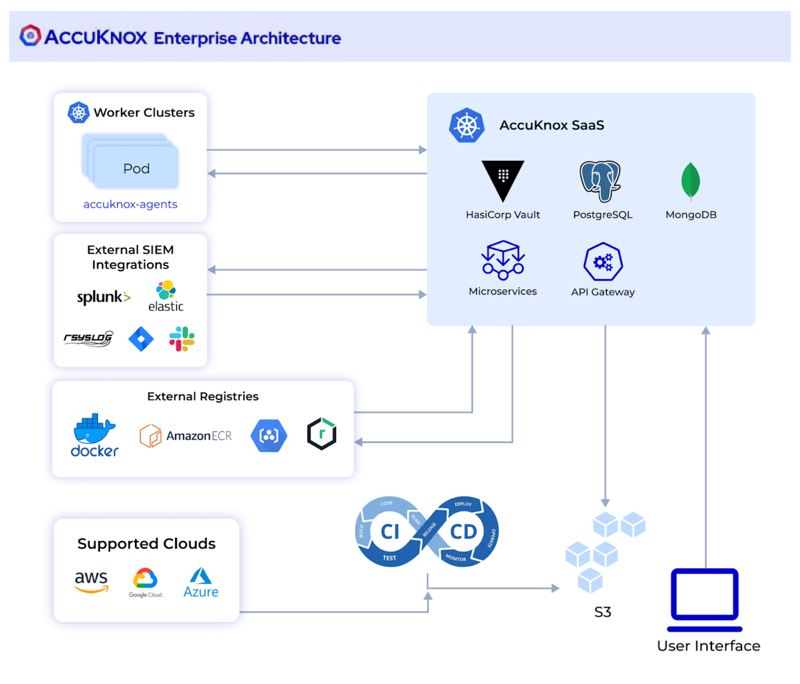

# Cloud Native Application Observability and Protection

AccuKnox automates observability and zero trust security for cloud native applications, as well as VM and bare metal. We provide easy-to-use open-source tools for visibility and protection of your application, data and network, integrated into a Policy-as-Code GitOps workflow.

## Modern Kubernetes and other cloud applications include:

- Dozens of open source libraries, all of which come with inherent supply chain risks; Example a recent study found that more than half the docker images had some vulnerability.
- It is not entirely common but sometimes unpatched vulnerabilities, or misconfigurations slip through in production
- Zero-day attacks that create chaos as workloads can be compromised until a patch has been applied..

In such a scenario, applications can be compromised and once they are, they can initiate a wide range of malicious activity even if not running as a root.

Accuknox provides runtime security for your Kubernetes workloads to prevent malicious activity as determined by MITRE and other indicators of compromise and stops your workload from behaving maliciously at runtime. This gives you the necessary guardrails to restrict application behavior within a set of predefined policies while you apply a patch. Unlike traditional solutions that recommend a full quarantine of the workloads, accuknox's runtime solution can provide you active runtime protection allowing you to only restrict the malicious behavior as opposed to the entire workload.

|  |   |
|:---|:---|
| :muscle: **Static Security** 
:small_blue_diamond: Scan for assets inside cloud :chains:  :small_blue_diamond: Finds vulnerabilities and miscofigurations in the cloud :clamp:  :small_blue_diamond: Provide continous compliance against standard frameworks :left_luggage:  :small_blue_diamond: Set custom baselines | :ring: **Runtime Security** 
:small_blue_diamond: Monitor your application behavior :traffic_light: :small_blue_diamond: Discovered and Hardening policies :traffic_light: :small_blue_diamond: Network microsegmentation, File integrity monitoring, Workload hardening :control_knobs:|
| :snowflake: **Siem Integration** 
:small_blue_diamond: Intgeration with splunk and rsyslogs :spider_web: :small_blue_diamond: Get alerts on slack:magic_wand: :small_blue_diamond: Ticketing integration with JIRA, Freshservice, Cloudwise :inbox_tray:|

## Architecture Overview

