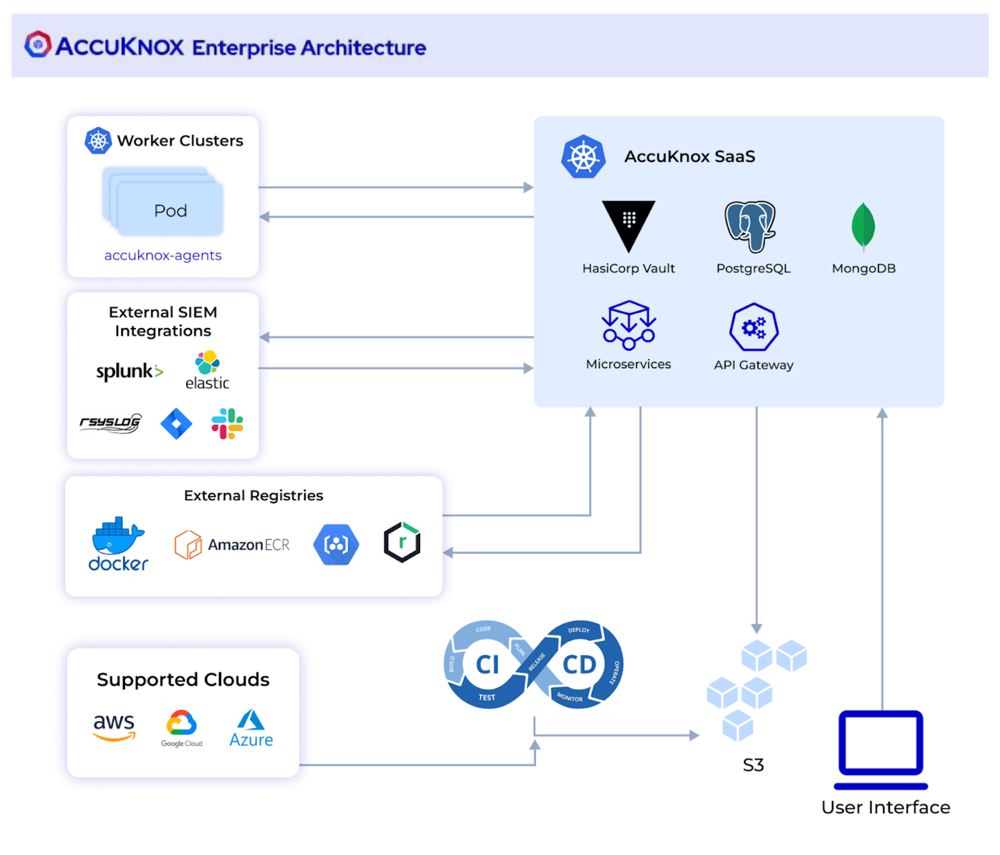

# Cloud Native Application Protection Platform

AccuKnox’s Cloud Native Application Protection platform is a single tool that provides both Static as well as dynamic Security. AccuKnox Enterprise Architecture consists of various Microservices like the vault for secret management, Mongo DB for database-related connections and it uses API gateway. AccuKnox CSPM tool scans the infrastructure and stores the scan data in the S3 bucket either created by AccuKnox or the S3 bucket created by the customer. AccuKnox can also be integrated with the CI/CD pipelines and SIEM tools like Jira, Slack, Splunk, and Rsyslog as well.

|  |   |
|:---|:---
| :muscle: **Static Security** 
:small_blue_diamond: Scan for assets inside cloud :chains:  :small_blue_diamond: Finds vulnerabilities and miscofigurations in the cloud :clamp:  :small_blue_diamond: Compliance against standard frameworks :left_luggage:  :small_blue_diamond: Set custom baselines | :ring: **Runtime Security** 
:small_blue_diamond: Monitor your application behavior :traffic_light: :small_blue_diamond: Discovered and Hardening policies :traffic_light: :small_blue_diamond: Network microsegmentation :traffic_light: :small_blue_diamond: File integrity monitoring :traffic_light: :small_blue_diamond: Workload hardening :control_knobs:|
| :snowflake: **Siem Integration** 
:small_blue_diamond: Intgeration with splunk and rsyslogs :spider_web: :small_blue_diamond: Get alerts on slack :magic_wand: :small_blue_diamond: Ticketing integrations :inbox_tray:|

## Architecture Overview

