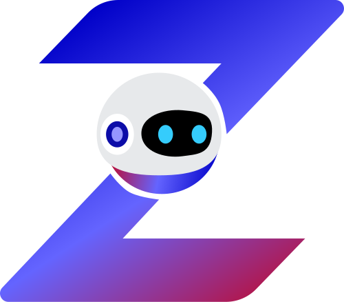
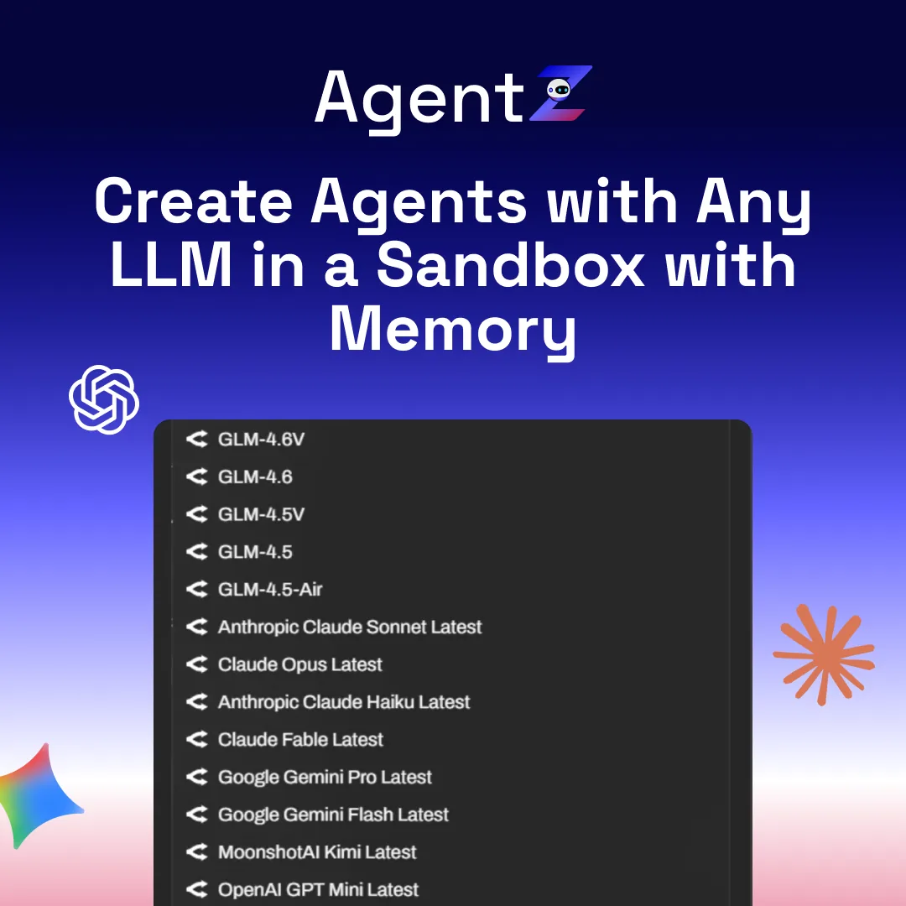
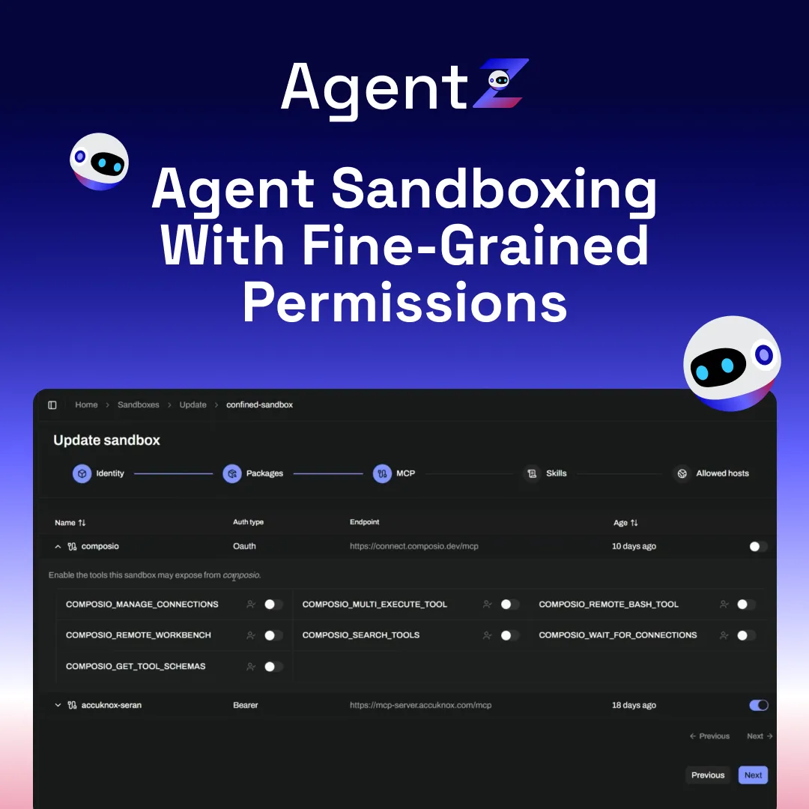
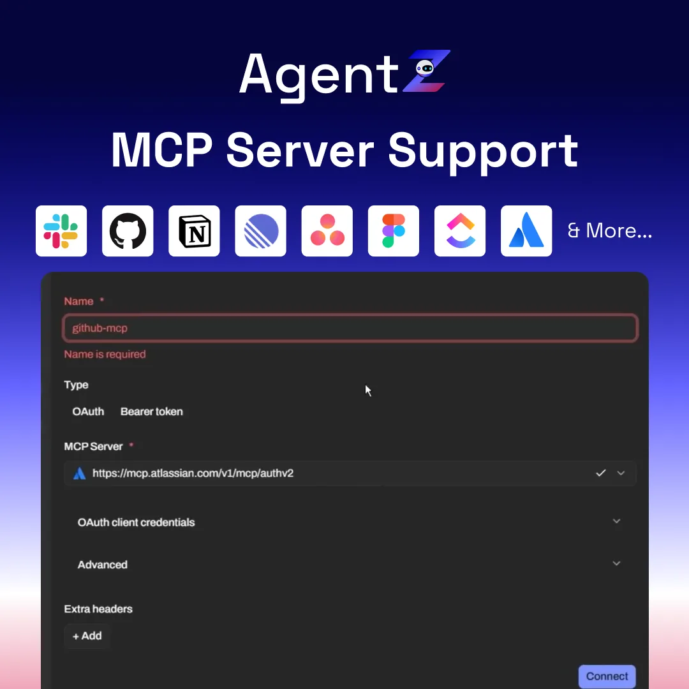
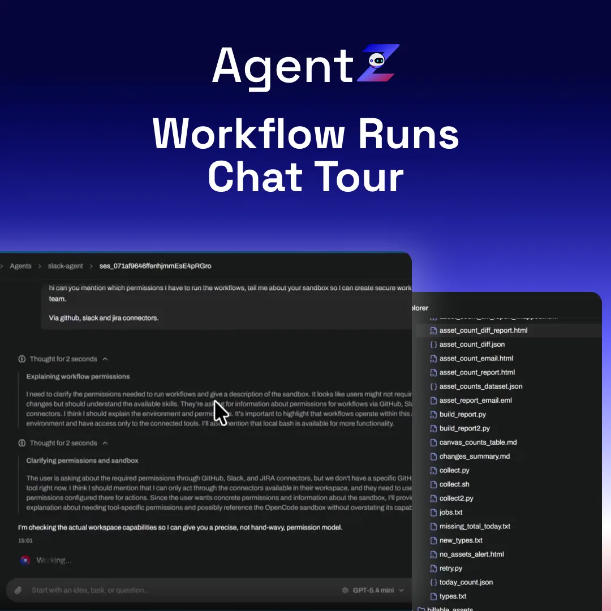
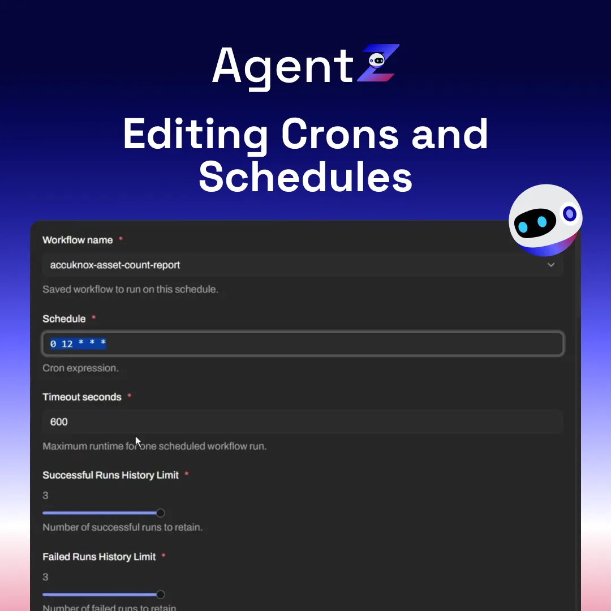
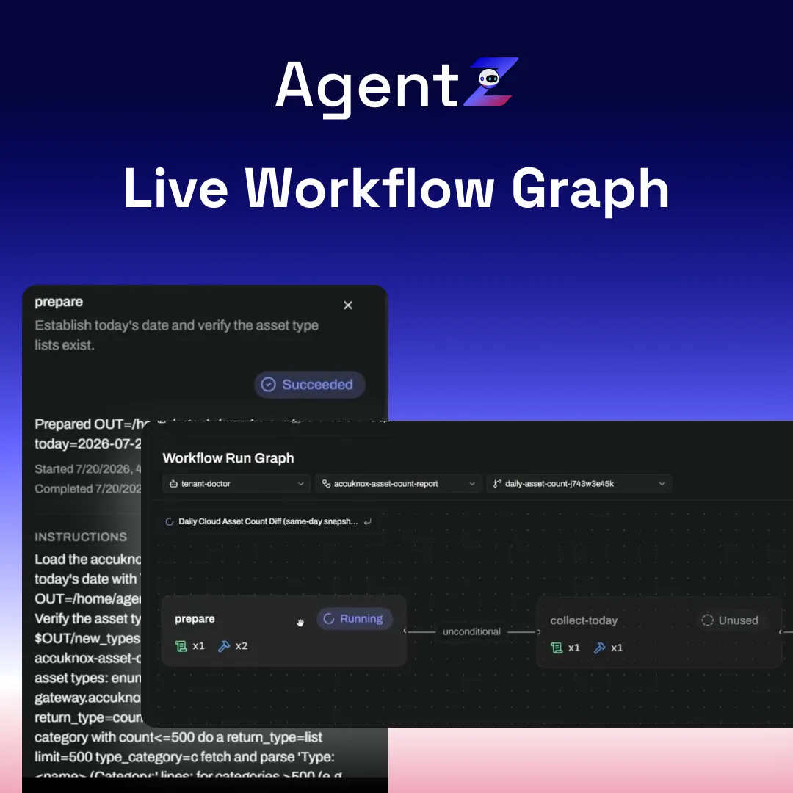
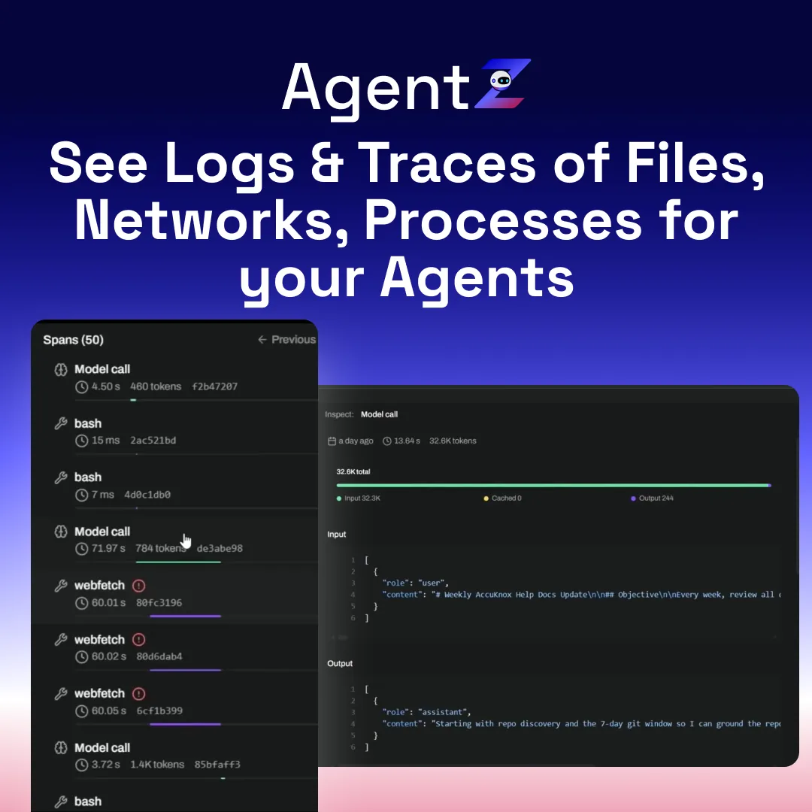
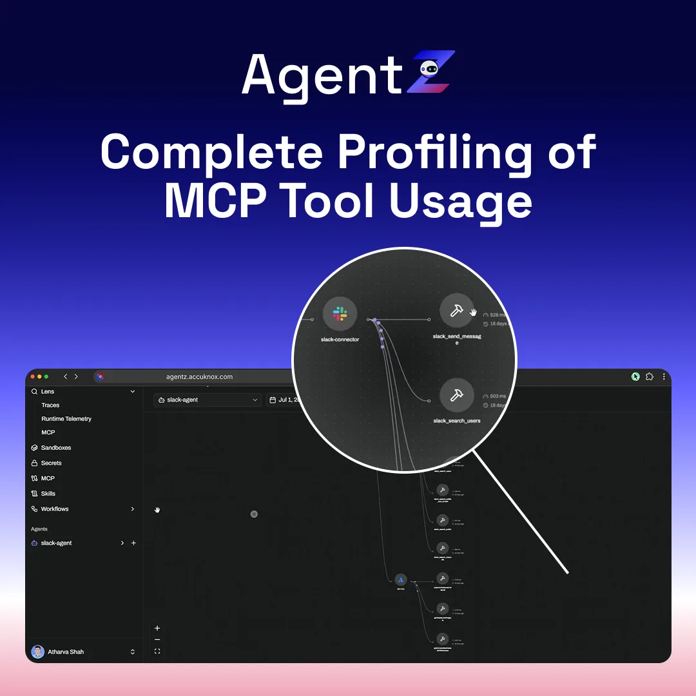

# AgentZ

  

    
    AgentZ
    Say it "agent zee"
  

  
A zero trust runtime for AI agents.

  
Every agent runs in a default deny sandbox, holds no secret, and writes every action to a trace you can replay. Open source, and free to start.

  

    <a class="az-btn az-btn--solid" href="https://agentzharness.ai/" target="_blank" rel="noopener">Start free</a>
    <a class="az-btn az-btn--ghost" href="https://github.com/accuknox/agentZ" target="_blank" rel="noopener">
      <svg viewBox="0 0 24 24" aria-hidden="true"><path d="M12 .3a12 12 0 0 0-3.8 23.4c.6.1.8-.3.8-.7v-2.6c-3.3.7-4-1.6-4-1.6-.6-1.4-1.4-1.8-1.4-1.8-1.1-.8.1-.8.1-.8 1.2.1 1.9 1.2 1.9 1.2 1 1.8 2.8 1.3 3.5 1a2.7 2.7 0 0 1 .8-1.6c-2.7-.3-5.5-1.3-5.5-6 0-1.2.5-2.3 1.2-3.1-.1-.3-.5-1.5.1-3.2 0 0 1-.3 3.3 1.2a11.5 11.5 0 0 1 6 0C17.3 4.2 18.3 4.5 18.3 4.5c.6 1.7.2 2.9.1 3.2a4.5 4.5 0 0 1 1.2 3.1c0 4.7-2.8 5.7-5.5 6 .4.4.8 1.1.8 2.3v3.3c0 .4.2.8.8.7A12 12 0 0 0 12 .3Z"/></svg>
      Star the repo
    </a>
    <a class="az-btn az-btn--ghost" href="https://www.youtube.com/watch?v=mAzLWcr59g0" target="_blank" rel="noopener">
      <svg viewBox="0 0 24 24" aria-hidden="true"><path d="M8 5v14l11-7z"/></svg>
      Watch the demo
    </a>
    <a class="az-btn az-btn--ghost" href="https://docs.agentzharness.ai/" target="_blank" rel="noopener">AgentZ docs</a>
    <a class="az-btn az-btn--ghost" href="https://accuknox.com/platform/agentz/" target="_blank" rel="noopener">Product page</a>
  

AgentZ is the AccuKnox platform for production AI agents. Describe a job in a sentence, and AgentZ writes the skill and wires the steps. The agent then runs from chat, an API, the CLI, or a cron.

**Zero trust** means the agent gets no access until a policy grants it. **Default deny** means every network call and tool call is blocked until you allow it. The policy runs at the kernel, next to the agent, so nothing leaves the sandbox without a record.

Full product documentation lives at [docs.agentzharness.ai](https://docs.agentzharness.ai/).

## Four steps

  

    01
    
Build

    
Describe the job. AgentZ writes the skill and wires the steps.

  

  

    02
    
Run

    
Chat, API, or CLI. Any framework, and no redeploy.

  

  

    03
    
Automate

    
Trigger on a cron, an event, or an API call. Skills chain.

  

  

    04
    
Govern

    
The kernel checks every call. The trace records the result.

  

## One control plane

  

    
Skills

    
Reusable, versioned building blocks.

  

  

    
Workflows

    
Chain steps, schedule them, hand off work.

  

  

    
Context

    
Shared memory, files, and knowledge.

  

  

    
Teams

    
Roles, ownership, and a shared scope.

  

  

    
Guardrails

    
No standing access to any tool or credential.

  

  

    
Audit

    
Every step recorded, span by span, and replayable.

  

## The zero trust part

  

    
Sandboxed on run one

    
Isolation is not a setting you turn on later.

  

  

    
No secret in the agent

    
Credentials are scoped and injected at run time. An injection cannot leak what the agent never sees.

  

  

    
Egress control at the kernel

    
Allow or block by domain, port, and protocol.

  

  

    
Permission per action

    
Read and scan pass. Mutate, push, and delete are denied by default.

  

  

    
Roles gate tool calls

    
Fine grained RBAC covers each agent action.

  

  

    
On-premises and air-gapped

    
Logs and audit evidence stay on your infrastructure.

  

## Nine screens

  

  

  

  

  

  

  

  

  

## Your stack, your model

Credentials, scopes, and policy live on AgentZ instead of on the agent. Run a frontier API or a self-hosted open weight model on your own key, and switch models without rewiring anything.

  
OpenAI

  
Anthropic

  
Gemini

  
AWS

  
Azure

  
Open weight

Connectors ship for Slack, Gmail, Microsoft 365, Google Workspace, Jira, Confluence, Notion, GitHub, GitLab, and Bitbucket. Any MCP server works after you authorize it once.

