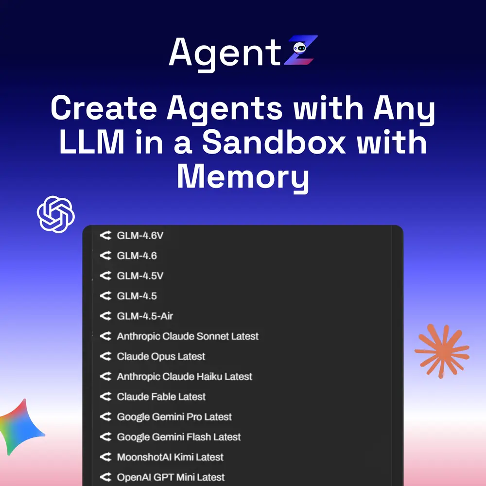
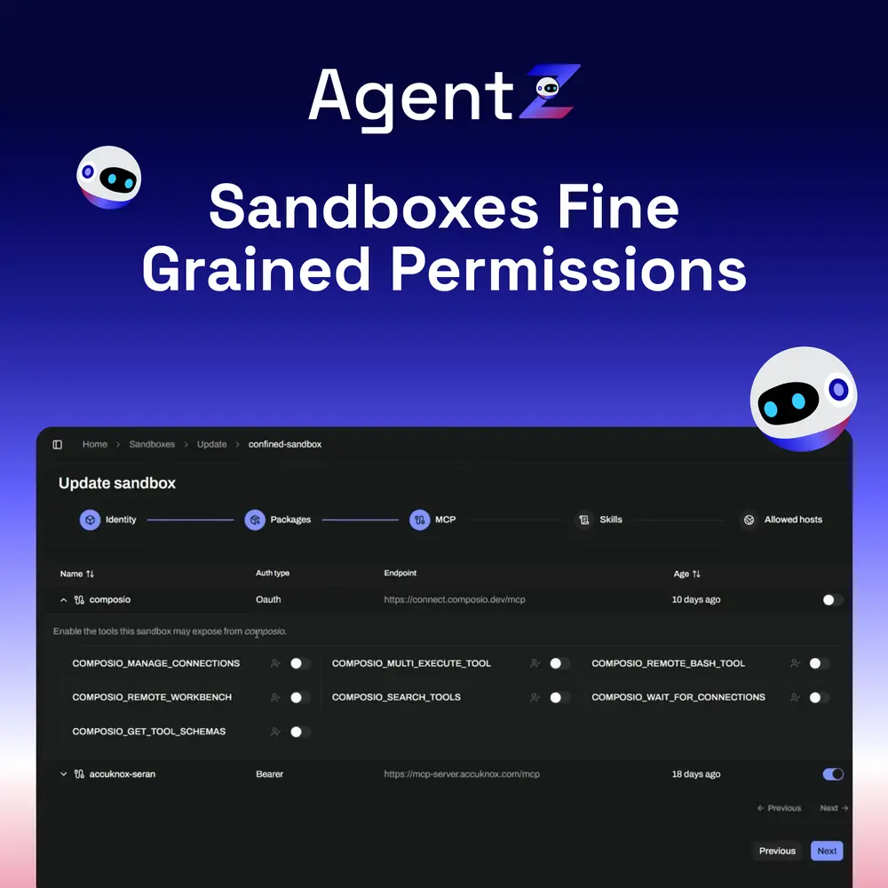
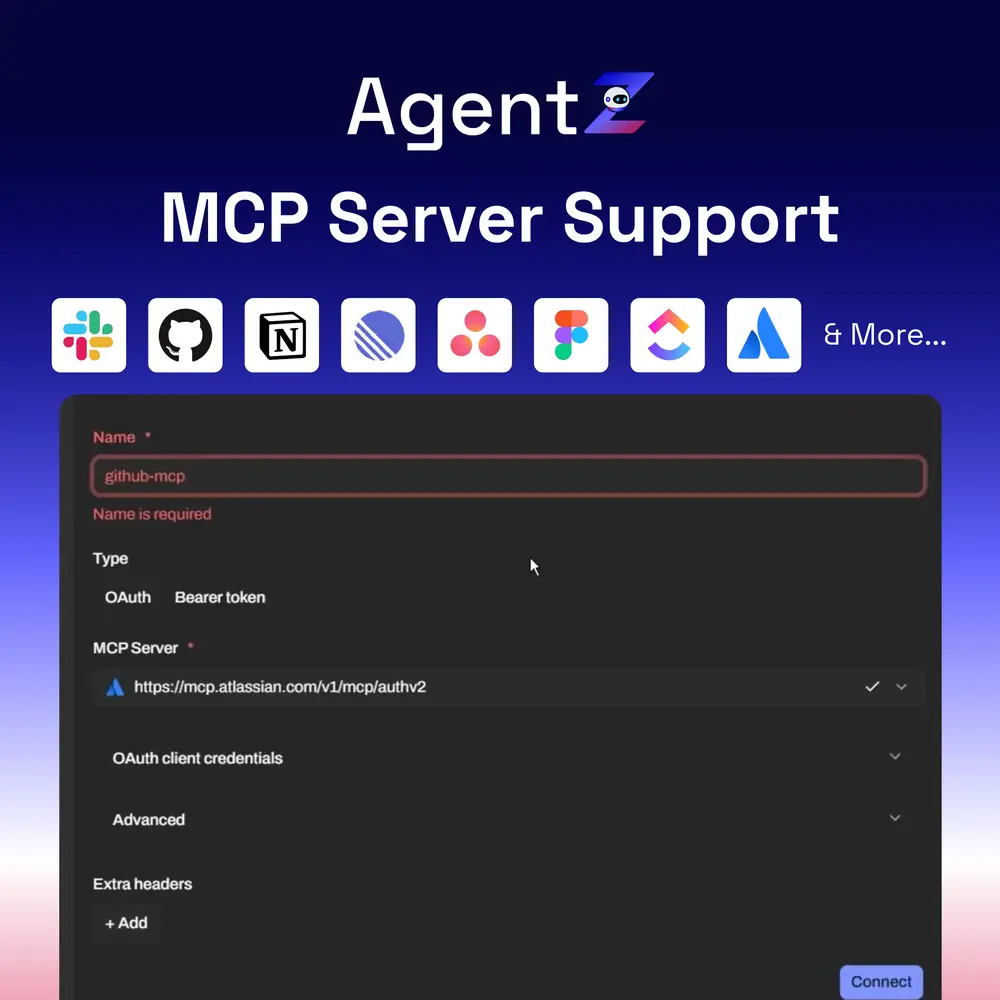
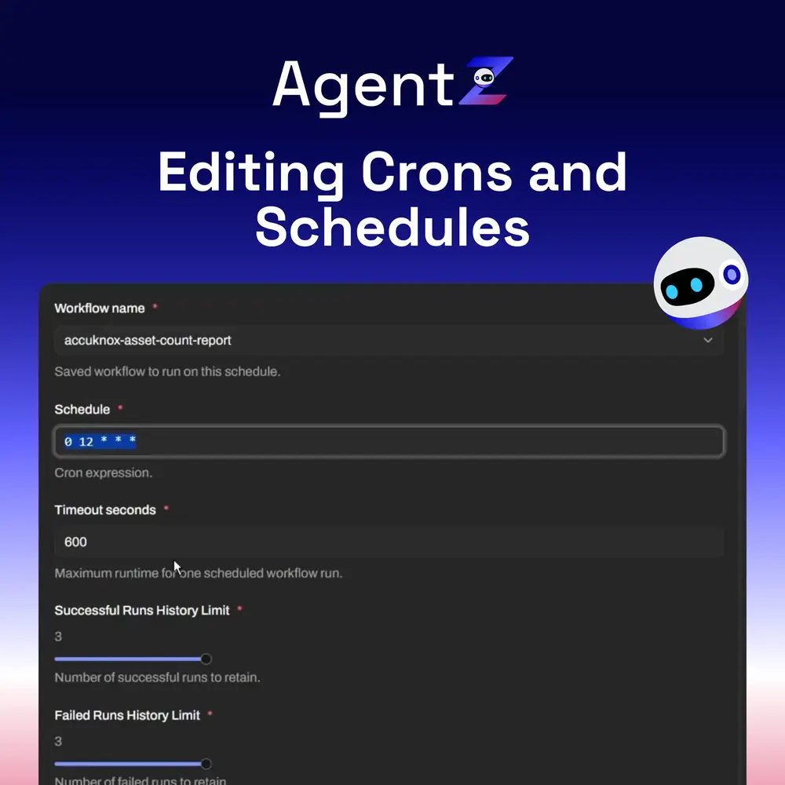
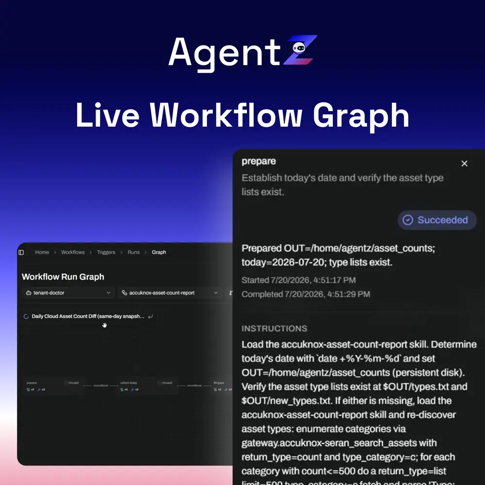
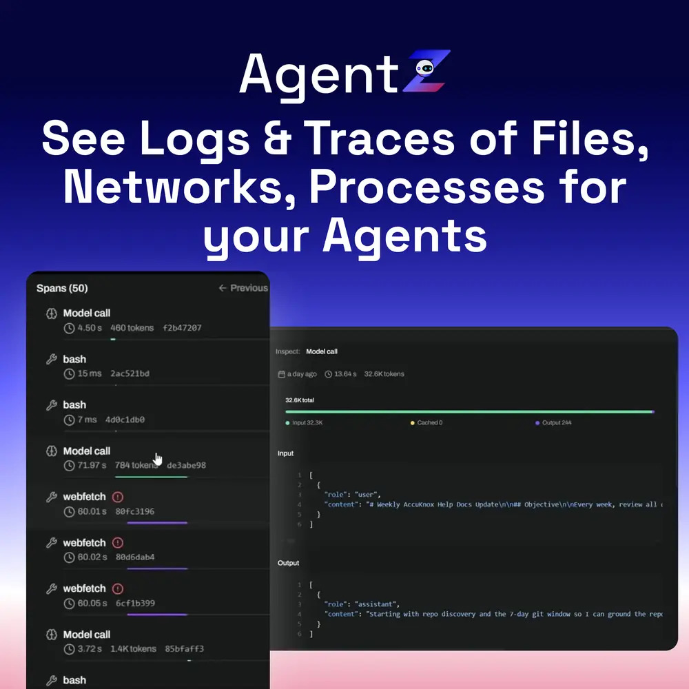

  
  <h1 class="az-hero__name">AgentZ</h1>
  Say it "agent zee"

A zero trust runtime for AI agents.

Every agent runs in a default deny sandbox. It never holds a secret. Every model call and every tool call lands in a trace you can replay. AgentZ is open source, and free to start.

  <a class="az-btn az-btn--solid" href="https://agentzharness.ai/" target="_blank" rel="noopener">Start free</a>
  <a class="az-btn az-btn--ghost" href="https://github.com/accuknox/agentZ" target="_blank" rel="noopener">
    <svg viewBox="0 0 24 24" aria-hidden="true"><path d="M12 .3a12 12 0 0 0-3.8 23.4c.6.1.8-.3.8-.7v-2.6c-3.3.7-4-1.6-4-1.6-.6-1.4-1.4-1.8-1.4-1.8-1.1-.8.1-.8.1-.8 1.2.1 1.9 1.2 1.9 1.2 1 1.8 2.8 1.3 3.5 1a2.7 2.7 0 0 1 .8-1.6c-2.7-.3-5.5-1.3-5.5-6 0-1.2.5-2.3 1.2-3.1-.1-.3-.5-1.5.1-3.2 0 0 1-.3 3.3 1.2a11.5 11.5 0 0 1 6 0C17.3 4.2 18.3 4.5 18.3 4.5c.6 1.7.2 2.9.1 3.2a4.5 4.5 0 0 1 1.2 3.1c0 4.7-2.8 5.7-5.5 6 .4.4.8 1.1.8 2.3v3.3c0 .4.2.8.8.7A12 12 0 0 0 12 .3Z"/></svg>
    Star the repo
  </a>
  <a class="az-btn az-btn--ghost" href="https://www.youtube.com/watch?v=mAzLWcr59g0" target="_blank" rel="noopener">
    <svg viewBox="0 0 24 24" aria-hidden="true"><path d="M8 5v14l11-7z"/></svg>
    Watch the demo
  </a>
  <a class="az-btn az-btn--ghost" href="https://docs.agentzharness.ai/" target="_blank" rel="noopener">Read the AgentZ docs</a>
  <a class="az-btn az-btn--ghost" href="https://accuknox.com/platform/agentz/" target="_blank" rel="noopener">Product page</a>

## What AgentZ is

AgentZ is the AccuKnox platform for production AI agents. You describe a job in one sentence, and AgentZ writes the skill and wires the steps. The agent then runs from chat, an API call, the CLI, or a cron schedule.

The security model is the reason it exists. **Zero trust** means the agent gets no access until a policy grants it. **Default deny** means every network call, file read, and tool call is blocked until you allow it. The policy runs at the kernel, local to the agent, so nothing leaves the sandbox without a record.

AgentZ keeps its own documentation at [docs.agentzharness.ai](https://docs.agentzharness.ai/). This page is the short version for AccuKnox customers.

## Build, run, automate, govern

  

    01
    
Build

    
Describe the job in a sentence. AgentZ writes the skill and wires every step for you.

  

  

    02
    
Run

    
Start the agent from chat, an API, or the CLI. Any framework works, and no redeploy is needed.

  

  

    03
    
Automate

    
Trigger on a cron, an event, or an API call. Skills chain in sequence or in parallel.

  

  

    04
    
Govern

    
Policy resolves at the edge, the kernel checks it, and the trace records the result.

  

## One control plane for every agent, model, and team

  

    
Skills

    
Reusable, versioned building blocks that the whole team can call.

  

  

    
Workflows

    
Chain steps, set a schedule, and hand work from one agent to the next.

  

  

    
Context

    
Shared memory, files, and knowledge that stay with the agent between runs.

  

  

    
Teams

    
Roles, ownership, and a shared scope, so an agent belongs to a team and not to one laptop.

  

  

    
Guardrails

    
Secure by default, with no standing access to any tool or any credential.

  

  

    
Audit

    
Every step is recorded span by span, and you can replay the whole run.

  

## How the zero trust part works

  

    
Default deny sandbox

    
Isolation is not a setting you turn on later. The first run is already sandboxed.

  

  

    
No secret in the agent

    
AgentZ injects a scoped credential at run time. A prompt injection cannot leak what the agent never receives.

  

  

    
Egress control at the kernel

    
You allow or block traffic by domain, port, and protocol. Every allow and every block lands in the trace.

  

  

    
Permission per action

    
Read and scan pass. Mutate, push, and delete are denied by default, so a lookup cannot become a teardown.

  

  

    
Roles that gate tool calls

    
Fine grained RBAC covers each agent action. An admin provisions access on behalf of the team.

  

  

    
On-premises and air-gapped

    
Logs, traces, and audit evidence stay on your own infrastructure. AgentZ makes no outbound call.

  

## Screens from the platform

Click any screenshot to open it full size.

  

    
    
Any model, in a sandbox with memory

  

  

    
    
Fine grained sandbox permissions

  

  

    
    
MCP server support out of the box

  

  

    
    
Crons and schedules, edited in place

  

  

    
    
A live workflow graph

  

  

    
    
Logs and traces, span by span

  

## Works with the stack you already run

Run an agent on a frontier API or on a self-hosted open weight model, with your own key. Credentials, scopes, and tenant policy live on AgentZ instead of on the agent. When a stronger model ships, you switch without rewiring anything.

  
OpenAI

  
Anthropic

  
Google Gemini

  
AWS

  
Microsoft Azure

  
Open weight models

Tool and data connections go through the same policy edge. AgentZ ships connectors for Slack, Gmail, Microsoft 365, Google Workspace, Jira, Confluence, Notion, GitHub, GitLab, and Bitbucket. Any MCP server works after you authorize it once.

## Free and Enterprise

Free is the evaluation tier. You can build and run a real agent before you talk to anyone.

| | Free | Enterprise |
|---|---|---|
| **Price** | $0 per month | Priced on what you run |
| **Users** | 2 users | Sized to your organization |
| **Workspaces** | 1 | Unlimited |
| **Sign-in** | GitHub, Google, Microsoft | Adds SAML and OIDC |
| **Model** | Your own subscription or key | Adds your own private model |
| **Compute** | One small agent, 1 vCPU and 1 GB RAM | Sized to your workload |
| **Prompt guardrails** | Platform defaults | Custom guardrails for your domain |
| **Hosting** | SaaS | SaaS, on-premises, or self-deployed |
| **Data residency** | Shared and multi-tenant | Sandboxed inside your network |
| **Support** | Docs and community | A named contact |
| **Best for** | A fast rollout in a smaller team | A regulated or security-sensitive organization |

## Where to go next

  <a class="az-card az-card--link" href="https://agentzharness.ai/" target="_blank" rel="noopener">
    
Start free

    
Sign in with GitHub, Google, or Microsoft, and run your first agent.

  </a>
  <a class="az-card az-card--link" href="https://docs.agentzharness.ai/" target="_blank" rel="noopener">
    
AgentZ documentation

    
Installation, skills, workflows, policy, and the API reference.

  </a>
  <a class="az-card az-card--link" href="https://github.com/accuknox/agentZ" target="_blank" rel="noopener">
    
Source on GitHub

    
Read the code, file an issue, and star the repository.

  </a>
  <a class="az-card az-card--link" href="https://www.youtube.com/watch?v=mAzLWcr59g0" target="_blank" rel="noopener">
    
Watch the demo

    
See a full run, from one prompt to a finished task.

  </a>
  <a class="az-card az-card--link" href="https://accuknox.com/platform/agentz/" target="_blank" rel="noopener">
    
Product page

    
Pricing, the capability comparison, and the answers to common questions.

  </a>
  <a class="az-card az-card--link" href="https://www.accuknox.com/contact-us" target="_blank" rel="noopener">
    
Talk to AccuKnox

    
Book a walkthrough for your team and your stack.

  </a>

