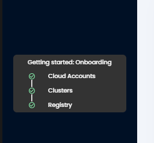

# **Release Notes v1.7**

**What's New?**

+ Virtual Machine onboarding for security hardening
+ Better filtering capabilities in container image registry onboarding
+ Support for container registries : DockerHub Organization account, JFrog, Quay
+ Improved DevSecOps support: Token generation/access control
+ Improved UI navigation using search, quick access onboarding options
+ Email Integration
+ Improvements to cloud misconfiguration detection to reduce the noise.
+ Hierarchical View of Assets (Beta version)
+ Enhancement in the filters for viewing the application behavior.

**Virtual Machine Onboarding:**
This release has introduced the option to onboard Virtual Machines to our SaaS portal. To use this option users need to navigate to Settings→Manage clusters→ onboard now→ give any name and Select Next→ In the next screen you need to select the VM for getting the instructions to onboard Virtual machines

**CI/CD token:**
AccuKnox has recently published two Github MarketPlace actions These MarketPlace Actions would require Tokens as one of the prerequisites. So users who are interested with this DevSecops model will need to generate these tokens. Users need to navigate to Settings→Tokens

**UI/UX Enhancements in Left Navigation bar:**
In this new left navigation bar we have a search option to search the list of options that AccuKnox SaaS provides. We also have introduced an option to hide the left navigation bar by clicking the < icon.

**Onboarding Assist:**

We have introduced a new onboarding assist in our left Navigation bar which can help to show whether cloud, Clusters, and Container registries are onboarded in the particular tenant or not.

**Change in Logout option:**

AccuKnox's new UI/UX enhancements have changed the logout option in the profile section. Now to log out of the portal users need to click on the Profile name and select logout

**Asset Hierarchical View(Beta Version):**

This feature is released as a beta version as it will be available based on the customer's request. This gives the hierarchical view of the cloud assets with diff. view based on the previous scan and current scan. To see this users need to toggle the asset hierarchical view in the Inventory→ Assets page.

**What to expect in the Next release?**
- CIS support for Kubernetes
- IaC scan
- Pod Security Admission
- Kubernetes Identity and Entitlement Management(KIEM) (Beta version)
- Asset Hierarchical view(full version)

## **Previous Release notes**
+ [v1.6 Release Notes](./../getting-started/1-6-release.md)
+ [v1.5 Release Notes](./../getting-started/1-5-release.md)

