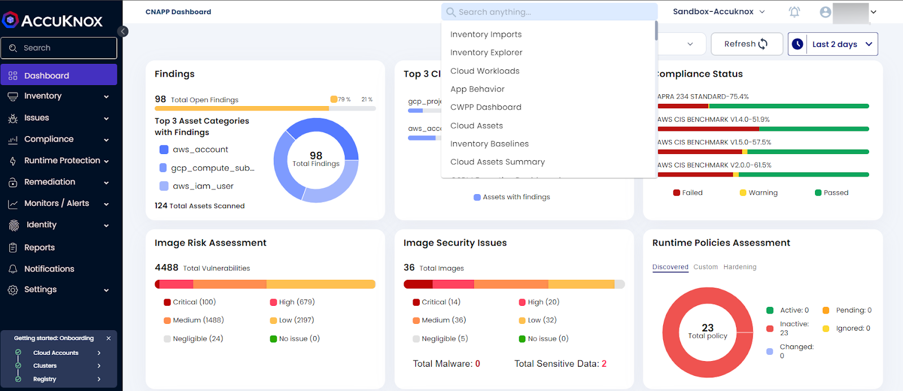

# **Release Notes v2.0**

**What's New?**

+ CIS Benchmark support for k8s cluster against various misconfigurations and vulnerabilities.
+ Detecting vulnerabilities in Terraform, Helm charts, and YAML files in GitHub, GitLab, and Bitbucket.
+ Providing detailed views of namespace, cluster, and VM application behavior.
+ Enforcing and visualizing Pod Security Standards with flexible configuration and dry run.
+ Manage RBAC permissions with graph visualization and search.
+ AI chatbot for interactive queries about AccuKnox and onboarded cloud accounts.
+ Supports login with Google accounts for Gmail-invited users.
+ Identifies stable policies with a 'stable' tag to simplify zero trust implementation.

**Enhancements**

+ New detailed view for vulnerabilities and misconfigurations across cloud accounts and Kubernetes clusters.
+ Revamped onboarding and inventory pages; supports onboarding up to 100 clusters with access keys.
+ Enhanced CWPP dashboard with insights into various compliance frameworks.
+ Scans container images based on Last pull or Regex pattern.
+ Easier multi-upload of custom policy YAML files.
+ Improved header design with global search and redesigned signup/login pages.

**Fixes**

+ Improved asset coverage for AWS, Azure, and GCP, with minor bug fixes.

**Note: Since the AccuKnox team had done a major upgrade the existing clusters/VMs that are onboarded to the AccuKnox Demo environment need to be upgraded.**

- For Clusters:
`helm upgrade --install accuknox-agents oci://registry-1.docker.io/accuknox/accuknox-agents  --version "v0.6.5" -n accuknox-agents`

- For VMS:
Users need to deboard control plane nodes using `knoxctl deboard cp-node` and re onboard the control plane  following instructions from the Manage clusters page.

For further queries and details please contact the AccuKnox support team.
We hope you like the enhanced security and improved features of AccuKnox v2.0!

### **Detailed Outline:**

**1. Agentless Risk Assessment for Kubernetes Clusters**

Kubernetes clusters related misconfiguration can be viewed with the help of AccuKnox jobs. These can scan and report issues related to Various benchmarks like CIS, NIST, SOC2. Our jobs can also scan for misconfigurations in the kubernetes clusters.

-   **CIS Benchmarks(K8s):**
    AccuKnox CNAPP already supported CIS Benchmarks for Cloud accounts. Now AccuKnox CNAPP supports these CIS Benchmarks for k8s clusters against various misconfigurations. AccuKnox provides the CIS benchmarks related findings with the help of its agentless risk assessment job.

-   **Cluster Misconfigurations:**
    Misconfiguration and vulnerability related to the k8s cluster are scanned using AccuKnox k8s jobs which provides the comprehensive results in the SaaS.

**2. IaC Scanning**

To see the vulnerabilities related to the Configuration files like Terraform, Helm charts, YAML files that are present in your GitHub, Gitlab and Bitbucket repositories.

**3. Application behavior monitoring made easier**

-   **App Behavior - Namespace and Cluster Level View:** Enhanced app behavior monitoring with detailed views at the namespace and cluster levels

-   **App Behavior of VM Workloads:** Now users can see the application behavior for their onboarded VMs as well. This gives the process and network connections that are made by the application running in the VMs

**4. PSA and Reporting**

-   **Pod Security Admission (PSA):** The Pod Security Admission features now permit enforcing Pod Security Standards at the namespace level with flexible configuration and application. It provides apparent visualization for security postures in the Namespace Security Posture view and audit results in the Monitors/Alerts view. We also have a dry run feature which can be used to check the PSA policies without having to apply in the cluster.

**5. Kubernetes Identity And Entitlement  Management(KIEM)(BETA)**

AccuKnox KIEM's solution uses RBAC to manage access to Kubernetes resources more easily with graph visualization and full-text search. Users can filter on restrictions like roles, rules, verbs, and service accounts on the KIEM's overview page, which presents all permissions. We also include pre-defined key queries to investigate important entities and their relationships. You can now view connections, find excessively permissive permissions, and search across all RBAC entities. Users can check this feature by Navigating to Identity->KIEM. This will be Beta feature now as there is still improvements being made by the team.

**6. AskAda-(AI LLM Chatbot)(BETA)**

Ask Ada is the AI/LLM Chatbot of Accuknox. This gives users with interactive features of answering queries related to AccuKnox platform, along with queries related to the user's onboarded cloud accounts, clusters related information. This is also a Beta feature which is under constant improvement.

**7. Google SSO-Based Login**

Users who are already invited to the AccuKnox tenant with their gmail ids can login with their google accounts with the help of this Single sign on based method.

**8. Zero Trust Journey made simpler**

Users can achieve their zero trust journey easier with the help of new feature called the stable tag in the policies. Now the users will be notified with the 'stable' tag against each and every discovered policies which are not getting any updates based on the application behavior. So users can easily apply those policies to achieve their zero trust journey.

**9. Findings**

The latest release comes with a new view of Vulnerabilities and Misconfigurations that are detected across your cloud accounts, Container images, Repositories and Kubernetes clusters/VMs with Findings Section. This new view has comprehensive filters to point towards more granularity. Issues-> Findings

**10. Cluster and VM Management**

-   **Cluster/VM Onboarding Page Revamp:** Redesigned onboarding page for a smoother cluster and VM setup experience.

-   **Inventory Clusters Page Revamp:** Updated clusters page in the inventory section, displaying active and inactive statuses.

-   **Onboarding multiple cluster made easy with Access keys:** Users can onboard multiple clusters into the AccuKnox SaaS platform by using the Access keys based method. Using this, users can onboard up to 100 clusters with a single token.

-   **Active Compliance Policy Coverage in CWPP Dashboard:** Enhanced CWPP dashboard with active compliance policy coverage insights related to various compliance frameworks like CIS, NIST, PCI-DSS and MITRE TTP Attack Framework.

**11. Container image scanning based on Last pull/ Regex pattern**

AccuKnox Registry scan feature now supports various options for the container image scanning. Users can select the Regular expression pattern or last pulled date to include or exclude images for container image scanning.

**12. Policy Management**

-   **Upload Custom policies made easier with new feature:** Users can easily upload their custom policy yamls into the AccuKnox SaaS platform this saves time as users can now multi-upload policy files in a single go.

**13. Global Search and Login page revamp**

-   **Global Search Bar and Header Redesign:** Enhanced header design with a global search bar for improved navigation.

-   **New Authentication Design:** Redesigned signup and login pages for a better user experience.

**What to expect in the Next release?**

- Automatic Ticket creation for critical vulnerabilities
- Rules Engine
- KIEM Enhancements
- container image scan enhancements
- Ask-Ada improvements
- Compliance Reporting enhancements

## **Previous Release notes**
+ [v1.7 Release Notes](./../getting-started/1-7-release.md)
+ [v1.6 Release Notes](./../getting-started/1-6-release.md)
+ [v1.5 Release Notes](./../getting-started/1-5-release.md)

