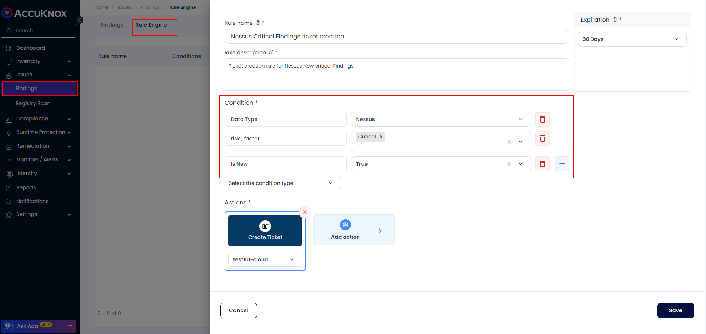
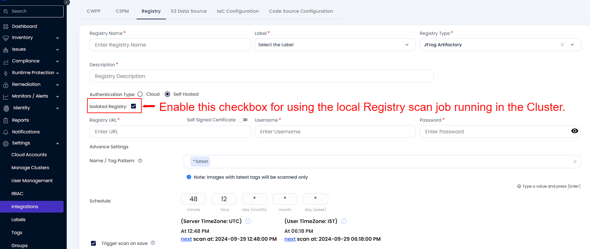
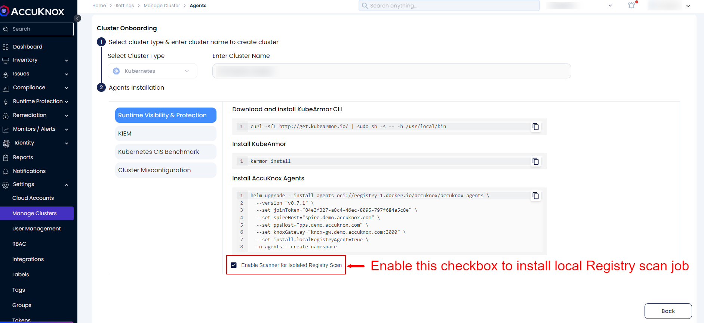
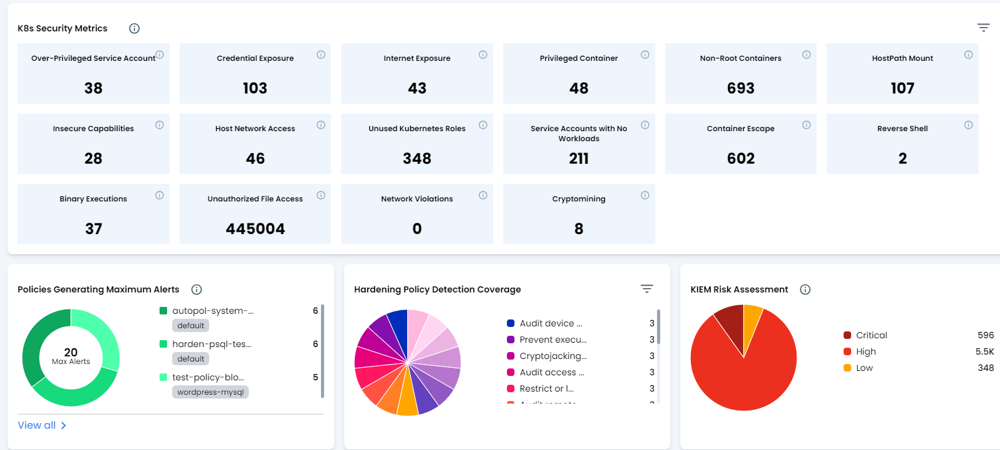
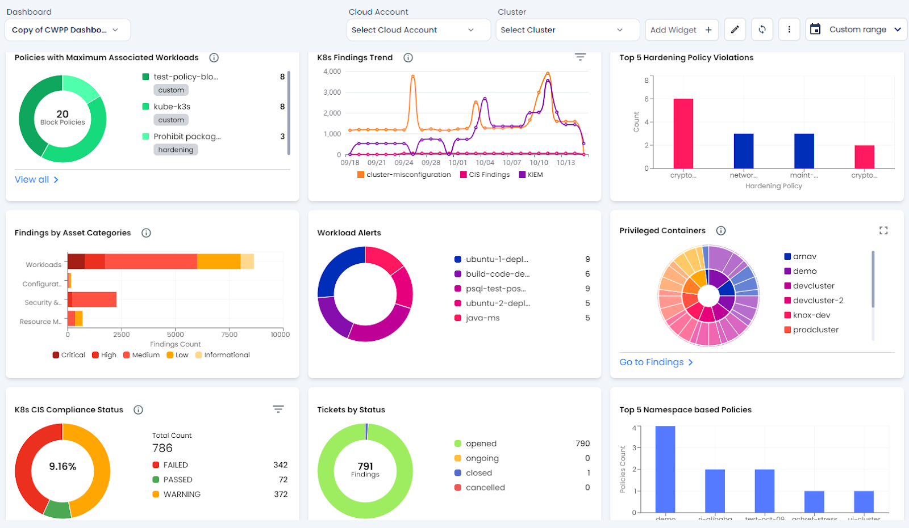
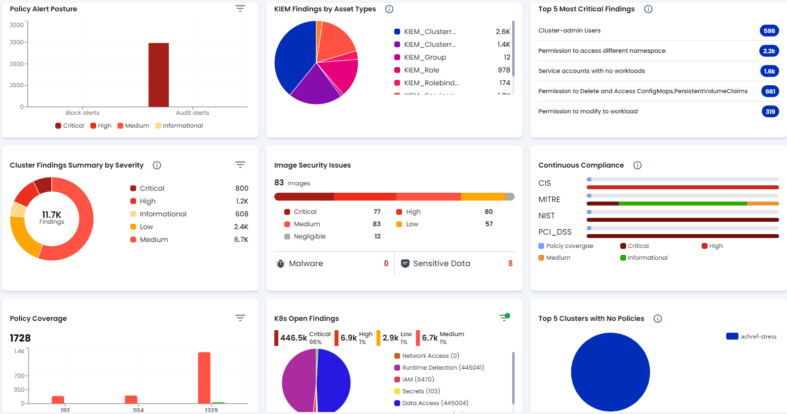

# Release Notes v2.1 & v2.2

## What's New

- **Creating tickets for Vulnerabilities becomes easier now**
    - Users can Create tickets automatically for the vulnerabilities discovered after each scan by making use of our New feature Rules Engine. Using this feature users can create rules for creating tickets based on their condition.

    - Users can Navigate to Issues-> Findings page and Navigate to Rules Engine section to Create a Rule or Directly create rule from Findings page filter as well.



- **Scanning Locally deployed Container registries/ Private container Registries**
    - With AccuKnox latest release users have the opportunity to share the locally deployed Container Registry with the help of AccuKnox Local registry jobs.

    - Users will require a Local Kubernetes cluster that has to be on-boarded into the AccuKnox portal which will have the Local registry scan job to scan the locally deployed registry.





- **Kubernetes Risk posture Dashboard widgets**
    - AccuKnox latest Release has the way of showcasing the Kubernetes Risk posture in the form of interactive Dashboard widgets. It has various new widgets that help the users to drill through the Security risks associated with Kubernetes clusters and VMs.



- Now users will be able to see the trends in the security findings over a period of time with this new widget view.





## Bug Fixes/Enhancements

- Static code analysis Findings enhancement in Description and Solutions fields

- Host Endpoint Findings Reference sections support has been added.

- Enhancements in Registry scan page for viewing the Registries scan status with DSL filter support

- Minor enhancements in the performance of AccuKnox Agents.

- Enhancements in the Registry scan page with search and filtering support

- Enhancements in the Cloud Account scanning performance

## Upcoming Features

 In the next upcoming release of AccuKnox users can expect the following features

- Customized Reporting for ASPM and Cluster Findings

- CSPM Report related fixes

- ARM architecture support for AccuKnox-Agents

Since We have made some enhancements in the Runtime workload protection Users will need to upgrade their agents in the cluster using the following command

**For Clusters:**

```sh
helm upgrade --install accuknox-agents oci://[registry-1.docker.io/accuknox/accuknox-agents](http://registry-1.docker.io/accuknox/accuknox-agents)  --version "v0.7.7" -n accuknox-agents
```

**For VMS:**

Users need to deboard control plane nodes using (knoxctl deboard) and re onboard the control plane  following instructions from the Manage clusters page.
