# AccuKnox CNAPP v2.4 Release Notes

We are excited to announce the release of AccuKnox Enterprise CNAPP v2.4, which is packed with powerful new features, enhancements, and security improvements. This update brings improved compliance monitoring, streamlined asset management, advanced vulnerability tracking, and enhanced integration capabilities to help you effortlessly strengthen your security posture.

Here's what's new in v2.4:

---

## New Features & Enhancements

### 1. Improved Clusters View

- Kubernetes Clusters now includes a detailed and list view of clusters.

- Offers insights into nodes, namespaces, workloads, and findings.

- Users can quickly analyze and manage their cluster security status.

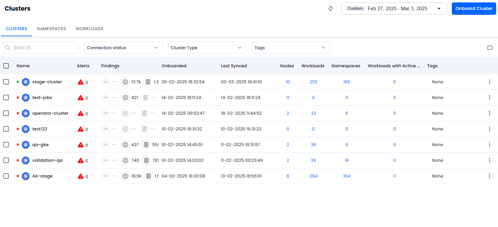

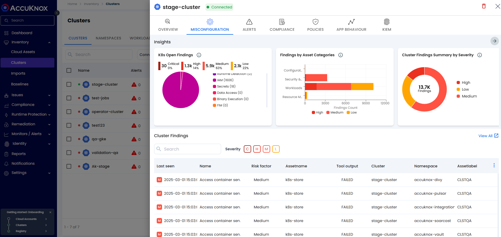

### 2. Cloud and Cluster Compliance Monitoring

- Compliance findings for cloud and Kubernetes clusters can now be viewed on the same page.

- Navigate to Compliance → Summary to get a consolidated compliance view.

- Simplifies regulatory adherence and compliance tracking.

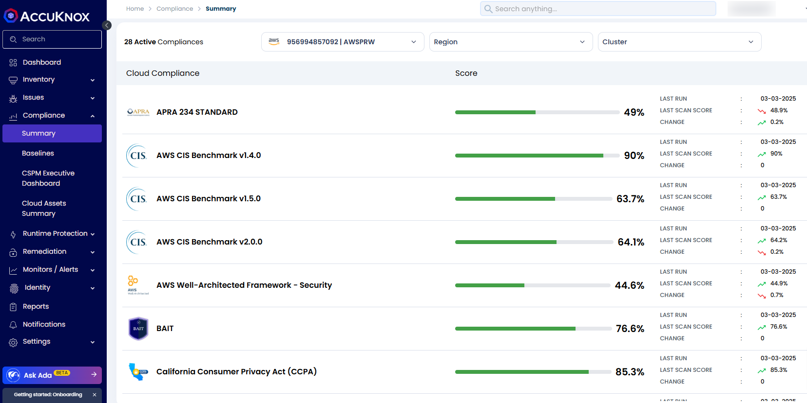

### 3. Simplified Assets Inventory

- All assets across cloud, code, containers, and Kubernetes clusters are now easier to view and manage.

- The revamped Assets page allows for improved grouping and categorization.

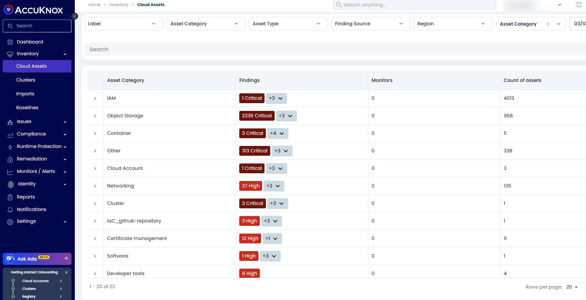

### 4. STIG Compliance for Virtual Machines

- Added STIG Benchmark Compliance support for Ubuntu and RHEL virtual machines.

- Users can scan their virtual machines against these benchmarks to check compliance levels and strengthen security posture.

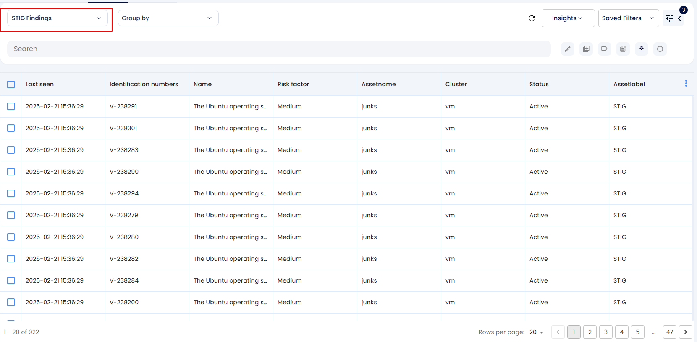

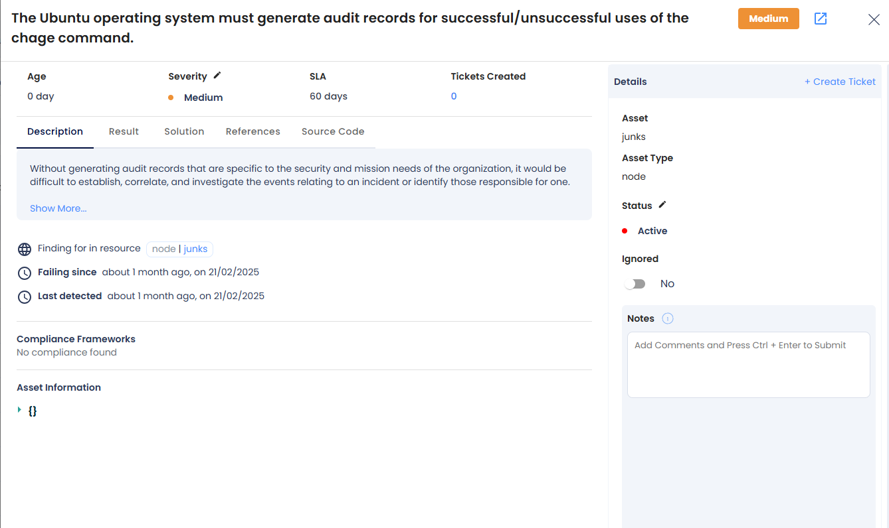

### 5. Application Security Posture Management (ASPM) Widgets

- New widgets added for SAST, DAST, and IaC to provide a high-level overview of security issues.

- Covers code, APIs, and configuration vulnerabilities.

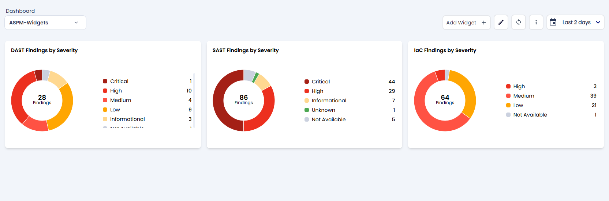

### 6. Certificate Management

- Users can now upload and manage certificates for various use cases, including:

- Registry onboarding

- Integration management

- Certificate expiration tracking

- A centralized location to handle all uploaded certificates is provisioned.

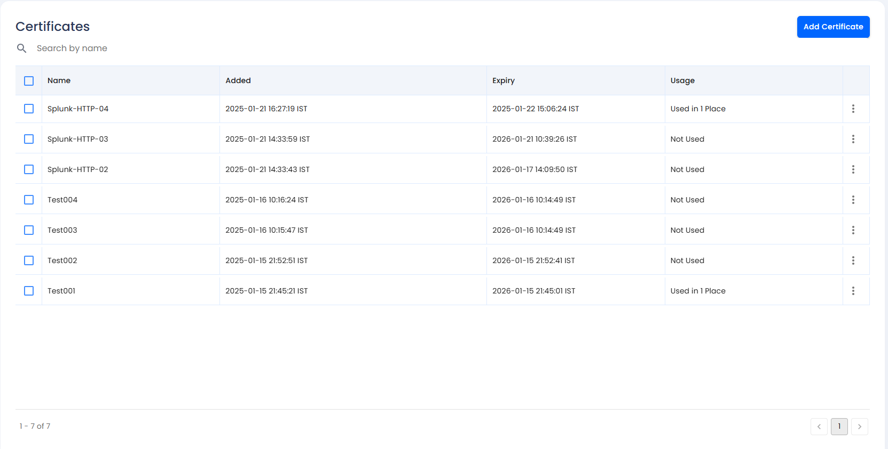

### 7. Opengrep/Semgrep Integration

- Expanded SAST capabilities with Opengrep/Semgrep integration.

- View findings directly in the AccuKnox platform.

- Categorize vulnerabilities based on severity and impacted assets.

- AI-powered assistive remediation suggestions included.

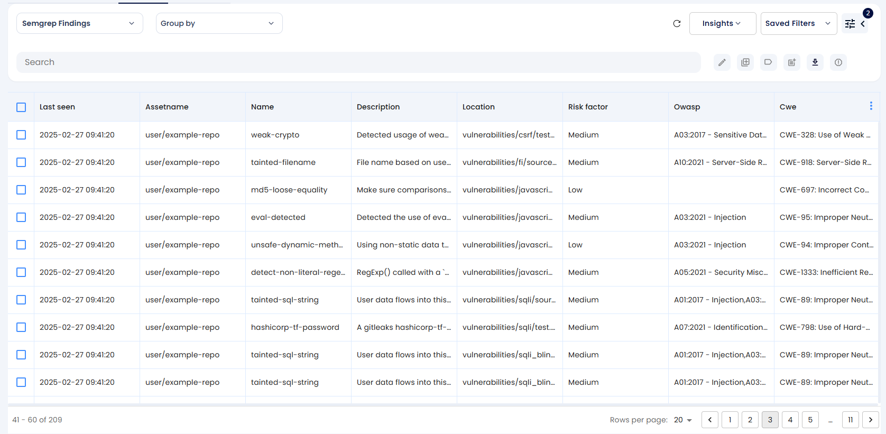

### 8. Findings Summary

The Findings page now includes a comprehensive summary view of vulnerabilities across various phases of the security lifecycle. This enhancement provides users with a centralized overview, enabling quicker assessment and more efficient remediation of security issues.

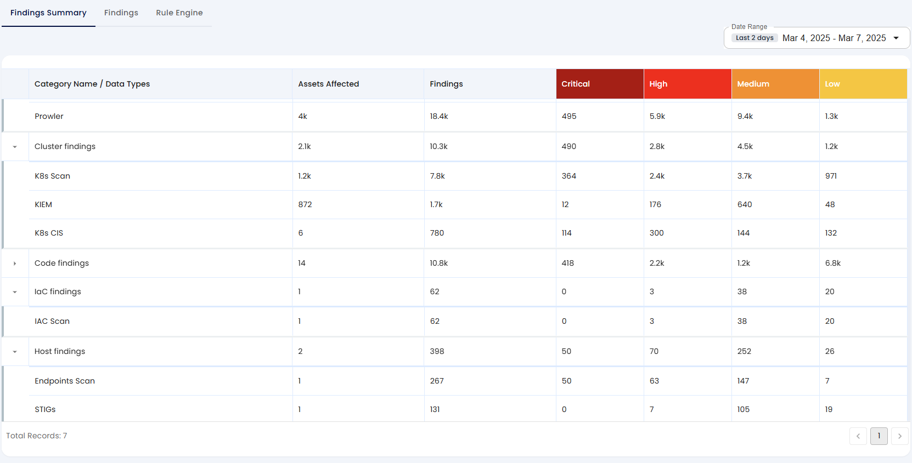

### 9. Secret Scanning

AccuKnox now supports secret scanning for code repositories, helping users detect and address exposed secrets. This feature enhances security by identifying sensitive information leaks and providing actionable insights for remediation.

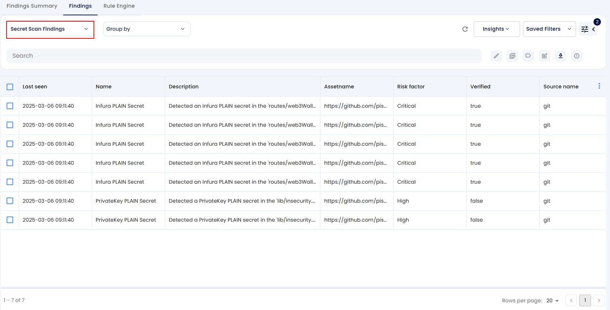

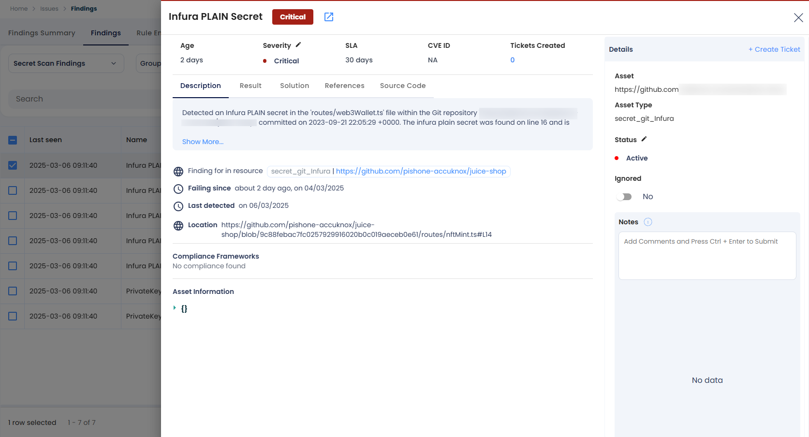

### 10. Enhanced Findings View & Reporting

- Improved findings visibility with grouping options:

- Asset Name, Asset Type, Vulnerability Type, Compliance Status, etc.

- Predefined insights to help users navigate findings efficiently.

- Users can create custom combinations of insights for better analysis.

- Enhanced dashboard and reporting options for deeper security visibility

- Sensitive asset scanning in S3 buckets, code repos, etc..

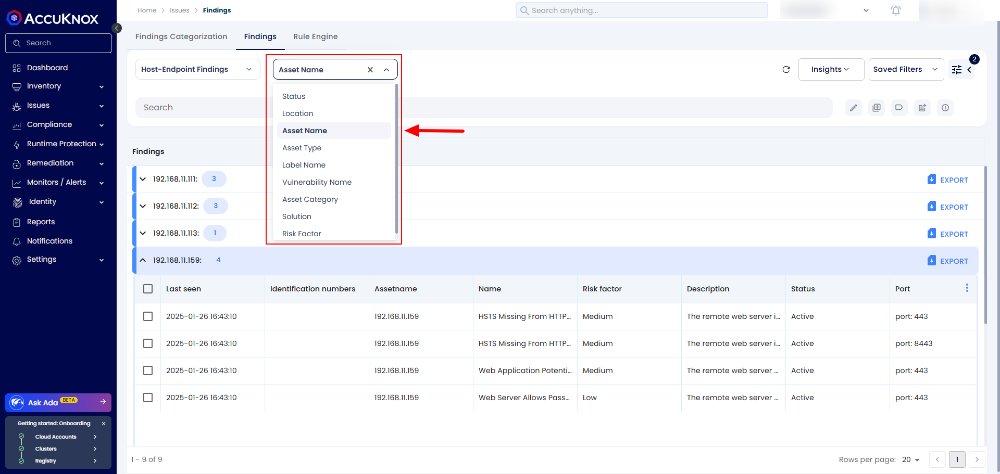

### 11. Simplified DevSecOps Integration

- The latest version significantly simplifies the DevSecOps integration journey.

- The platform now provides direct links to various plugins and marketplace actions, enabling seamless integration with CI/CD pipelines.

- Users can easily integrate security checks into their development workflows, enhancing automation and security coverage.

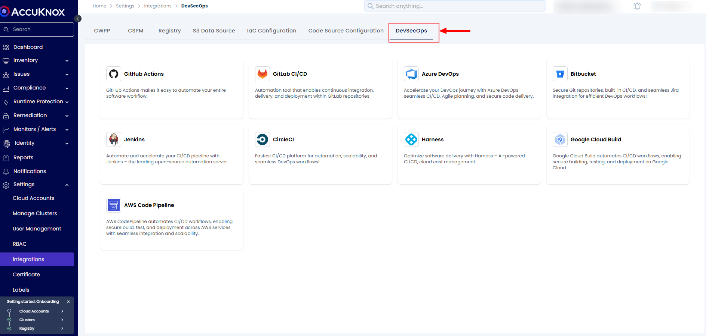
