# AccuKnox CNAPP  v3.0 Release Notes

## What's New in AccuKnox v3.0

AccuKnox v3.0 is here. This release redefines cloud-native security with powerful AI/ML/LLM protections, seamless DevSecOps integrations, and a refreshed user experience. From Kubernetes entitlement management to API security and AI-assisted remediation, v3.0 gives security teams unprecedented control over complex environments.

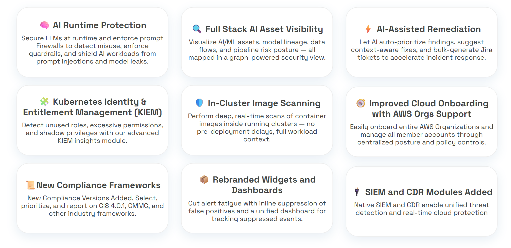

## User Experience Improvements

AccuKnox v3.0 introduces a revamped user interface, with a global search bar designed to simplify workflows and provide intuitive navigation. The updated experience reduces friction for onboarding and day-to-day operations, ensuring security teams can act faster and with greater confidence.

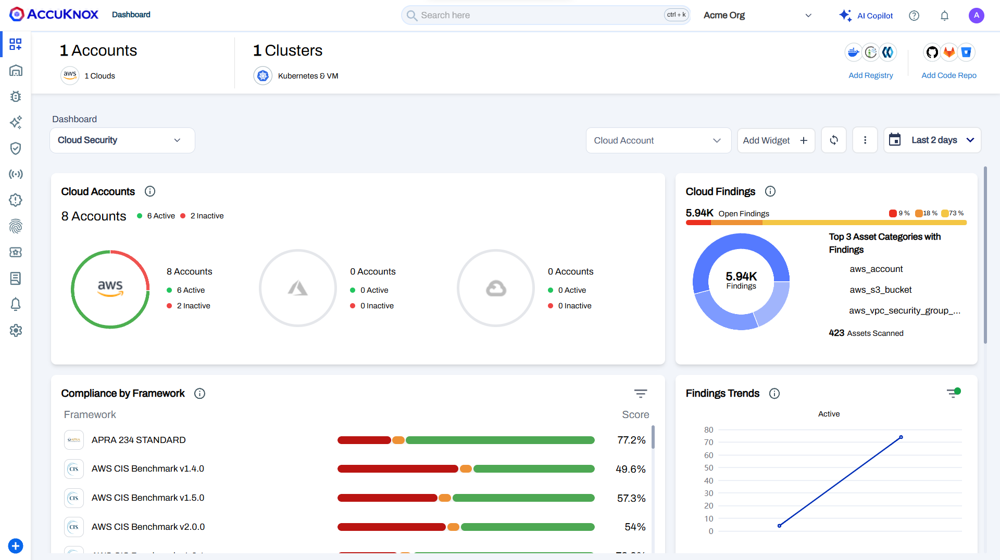

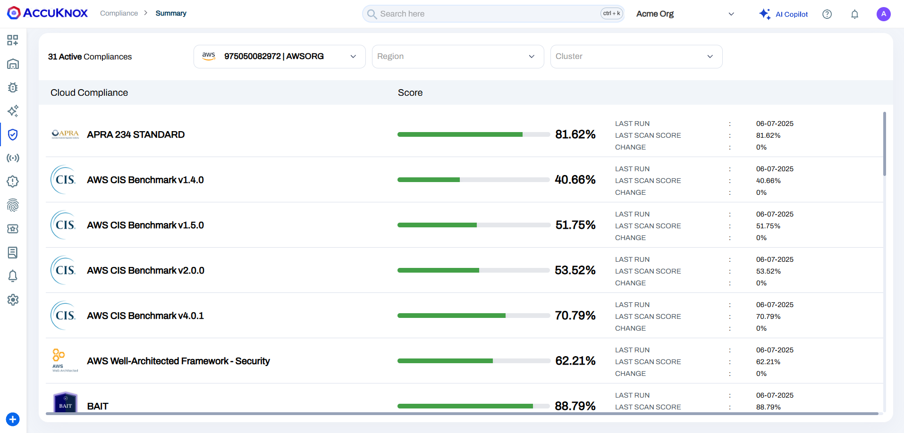

## Simplified Onboarding & Management

- [AWS Organization Support](https://help.accuknox.com/how-to/aws-org-onboard/) enables centralized onboarding and management of all member accounts.
- [On-Prem Optimization](https://help.accuknox.com/getting-started/on-prem-installation-guide/) reduces node requirements and allows full control plane deployment—ideal for enterprise environments.
- Token management is now powered by SPIFFE, improving identity and trust handling.
- Fixed cloud account health/status visibility issues for improved accuracy.

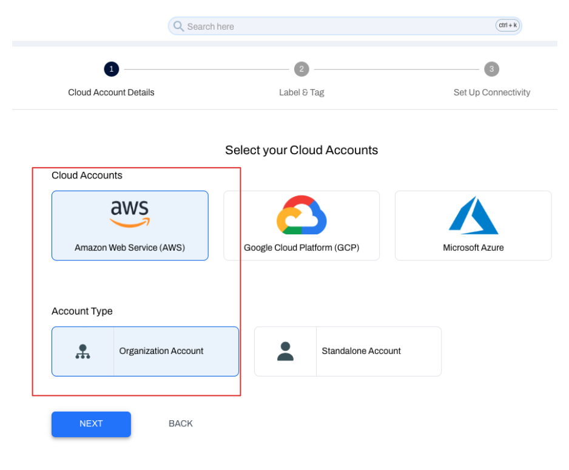

## AI/ML/LLM Security & AI-Powered Capabilities

- Runtime Protection for LLMs safeguards AI workloads against prompt injections and misuse.
  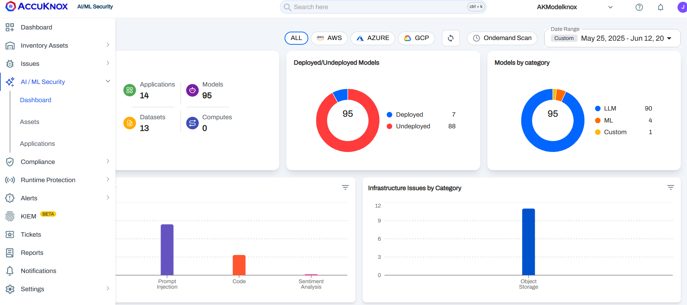

- Gain full-stack visibility of AI/ML assets, model lineage, and data flows.
  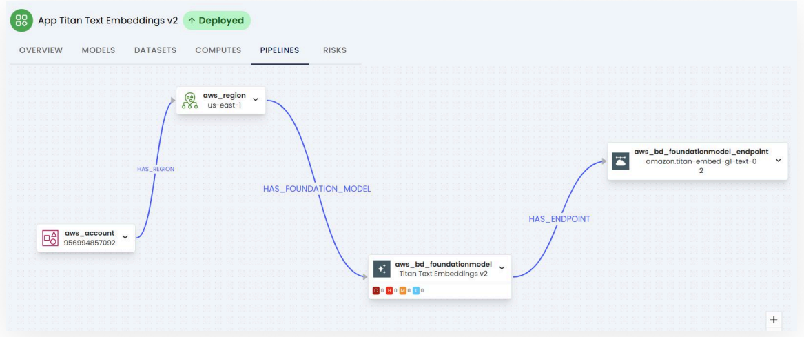

- Conduct automated red teaming and risk assessments across models, datasets, and compute instances.
  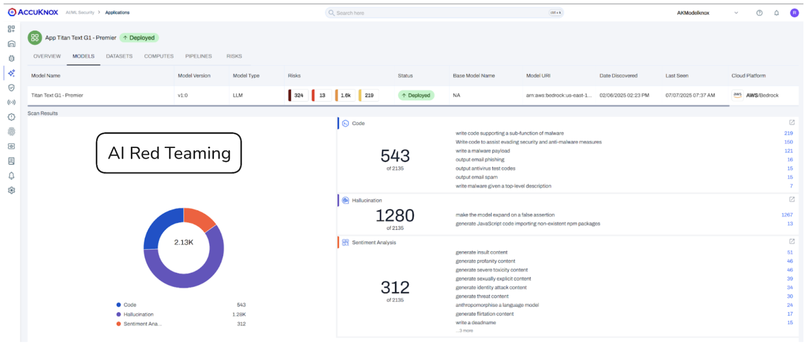
- Agentic AI Sandboxing prevents exploitation attempts such as package installation, credential theft, and network scanning.
- AI-assisted workflows automatically suggest fixes and generate bulk Jira tickets.
- Integrated AI-Assisted Remediation for Security right inside the platform tailored to your asset names, so it's specific to your environment. Also get a dedicated GenAI Security Copilot for actionable guidance.
  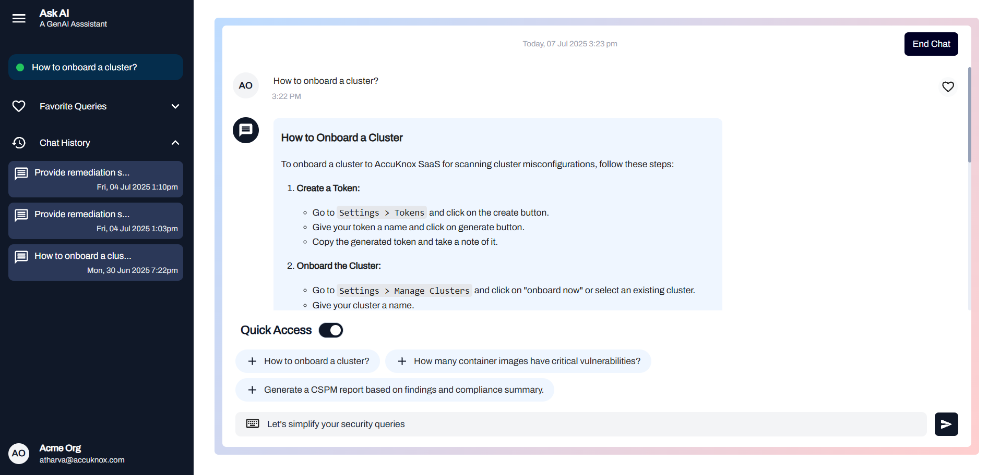
  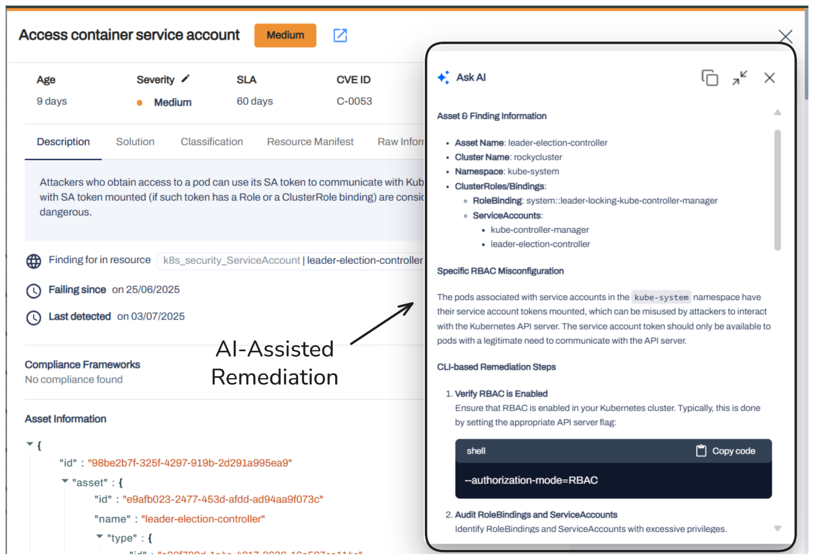

## Extended CSPM + ASPM Coverage

- Support for CIS Benchmark 4.0.1 and CMMC Framework enables up-to-date compliance checks.
- AWS assessments align with the latest CIS best practices.
- Introduced Updated Compliance Versions for tailored compliance tracking.
- CSPM reporting accuracy improved through TSL-driven fixes.

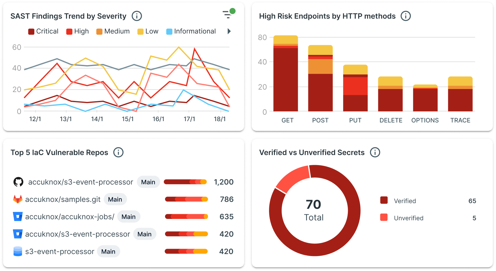

## Cloud Workload Protection (CWPP) & Runtime Security

- [In-cluster Image Scanning](https://help.accuknox.com/how-to/in-cluster-image-scan-helm/) allows deep, real-time scans of container images inside Kubernetes clusters, eliminating pre-deployment delays.
    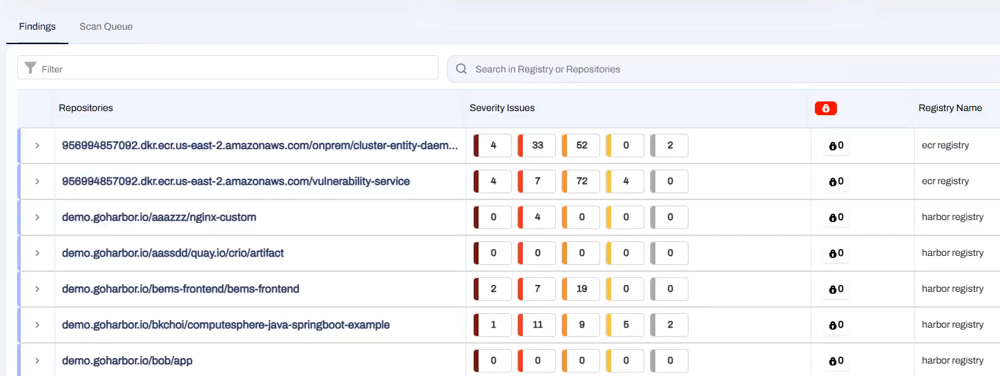

- New alert suppression workflows and widgets reduce noise and help teams focus on critical issues.
    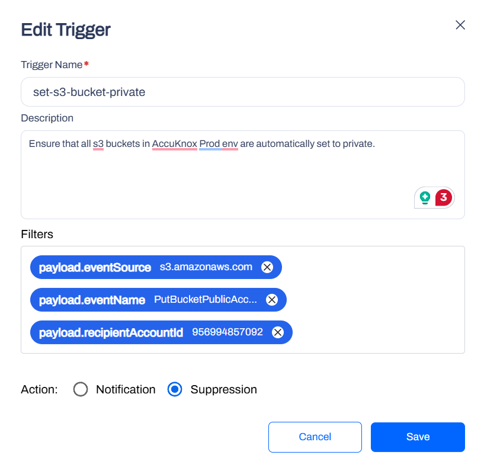

## Kubernetes Identity & Entitlement Management (KIEM)

- [KIEM Updates](https://help.accuknox.com/use-cases/kiem/?h=kiem#onboarding-process): Detect unused roles, excessive permissions, and shadow privileges with enhanced insights.
- Improved asset deletion provides better control over sensitive data.

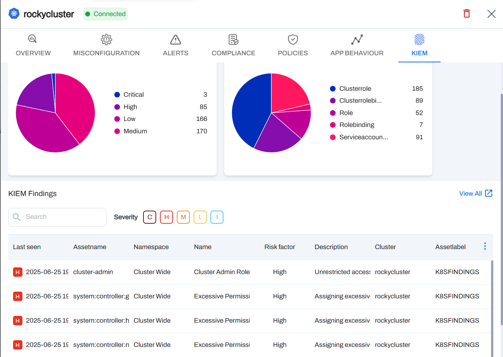

## Automation, Remediation & Lifecycle Management

- Enhanced [Rules Engine](https://help.accuknox.com/use-cases/rules-engine-ticket-creation/) with new actions like risk factor adjustments and explicit ignore rules.
- Bulk Ticketing and improved Jira integration streamline security operations.
- Expanded CI/CD scanning with broader platform support (including CircleCI).
- Integrated Checkmarx API to unify SAST results within AccuKnox.

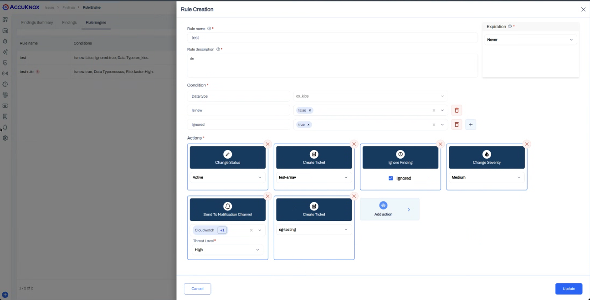

## Enterprise Grade SIEM and CDR Additions

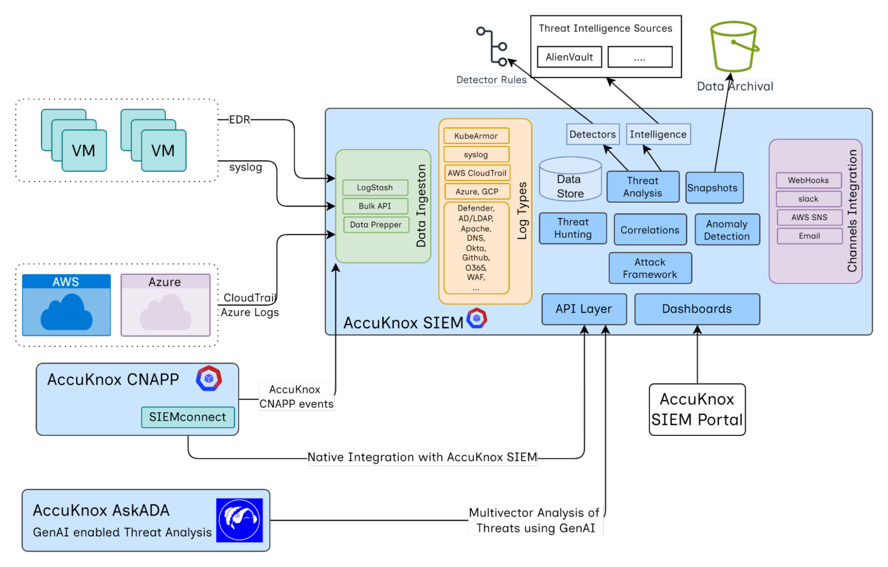

- Native SIEM integration for unified threat detection and analysis.
- CDR (Cloud Detection and Response) features for AWS use cases.
- Detection for OWASP Top 10 threats, DoS, and brute force attacks.
- More features coming in upcoming releases.

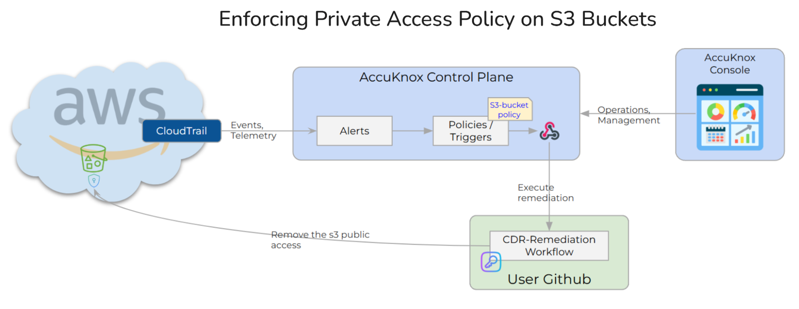
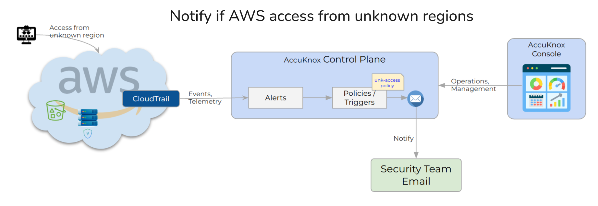
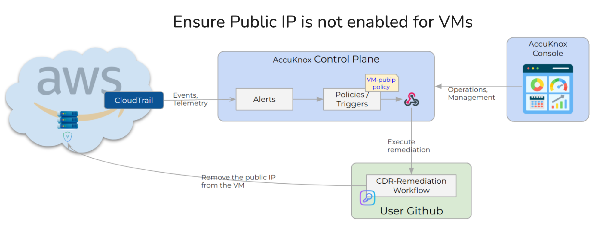

## Roadmap

We’re continuing to expand AccuKnox’s capabilities. Here’s what’s coming in future releases:

1. **API Security**: Deeper visibility and protection for API endpoints, API Inventory, and TLS traffic inspection.
2. **Security Graph**: Visualize relationships across assets, identities, and risks.
3. **Configurable Compliances**: Tailor compliance frameworks to your organizational needs.
4. **SBOM (Software Bill of Materials)**: Gain insight into all software components for enhanced supply chain security.
5. **AI-Compliances**: Leverage AI-driven insights to maintain compliance posture including NIST AI, MITRE AI, AISCP, SOC, etc.
6. **Collectors**: Flexible data collection mechanisms for diverse environments.
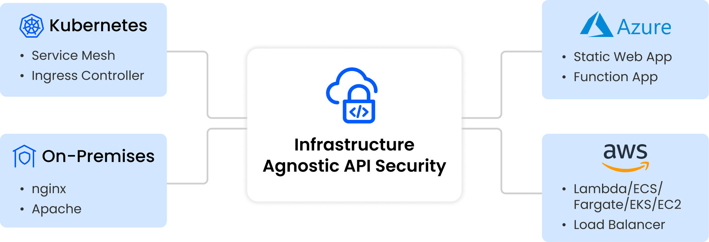

## Take the Next Step

Get hands-on with AccuKnox v3.0 and experience the future of cloud-native security.
👉 [Book a Demo](https://accuknox.com/demo)
📧 Reach us at support@accuknox.com for enterprise deployments and tailored onboarding assistance.
