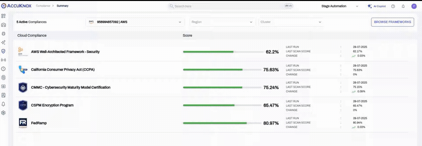

# Release Notes: CNAPP v3.1

**Release Date:** August 20, 2025

This release introduces significant new capabilities to expand your security visibility, including container image scanning on VMs and configurable compliance frameworks. It also delivers key updates to existing features and a wide range of bug fixes to improve platform stability and user experience.

## 🚀 New Features

### Container Image Scanning on Virtual Machines

You can now discover and scan container images that reside on your virtual machines. This extends vulnerability scanning beyond container registries and running clusters, providing a more comprehensive security view of all container images in your environment, regardless of their location.

[See docs](https://help.accuknox.com/knoxctl/image-scan/)

### Configurable Compliance Frameworks

To help you focus on the standards that matter most to your organization, we've introduced the ability to enable or disable entire compliance frameworks. By deactivating irrelevant standards, you can declutter your dashboards and reports, ensuring that your teams can focus on the specific compliance requirements applicable to your business.

### Application Security Posture Management (ASPM) Reports

This release introduces the first phase of ASPM reporting. You can now generate on-demand reports that provide deep insights into the security posture of your applications. This helps you more effectively identify, prioritize, and remediate risks throughout the application lifecycle.

[See how to schedule or on-demand generate ASPM Reports](https://help.accuknox.com/use-cases/aspm-reports/)

### Remediation Guidance for GCP & Azure

The platform now includes detailed, actionable remediation steps for compliance findings within Google Cloud Platform (GCP) and Microsoft Azure environments. This guidance helps your security and DevOps teams resolve misconfigurations faster and more effectively, reducing the mean time to remediation (MTTR).

## ✨ Updates to Existing Features

### Enhanced Alert & Findings Views

We've improved the flexibility of the Alerts page by allowing you to customize table columns based on the primary data within the alert payload. Additionally, the saved filter experience has been enhanced across the platform for a more intuitive and consistent workflow.

### Improved SonarQube Integration

The integration with SonarQube now more accurately reflects the lifecycle of a finding. When an issue is marked as 'Fixed' in SonarQube, its status will be correctly updated and reflected within the CNAPP platform, ensuring data is always synchronized.

## 🛠️ Bug Fixes and Improvements

### Cloud & Cluster Management

- Fixed an issue where a cloud account with valid permissions was incorrectly displayed with an 'Inactive' status.
- Addressed a bug that caused deleted Kubernetes clusters to reappear in the UI after being removed, ensuring the cluster list is always accurate.
- Resolved an issue where the total node count was not being correctly reported for CWPP, ensuring accurate workload inventory.

### Dashboards and Reporting

- Corrected a UI bug that caused the 'Top 10 Cloud Findings' widget on the main dashboard to fail.

### User Experience

- Optimized platform navigation to prevent the header and sidebar from unnecessarily reloading, resulting in a significantly smoother and faster user experience.
- Maintenance banner will be displayed even without logging in. (During maintenance, you'll see the banner in the Login page)
- The refresh button on the Alerts page now correctly fetches the latest data, and pagination works as expected after performing a search.
- We have resolved several issues related to creating and editing saved filters on the Alerts page, ensuring that filter conditions are saved correctly and behave as expected.

