# AccuKnox CNAPP - Release v3.2 Notes

**Release Date:** 25th September, 2025

This release strengthens **automated compliance, vulnerability visibility, RBAC workflows, and API security**, while improving **scale, stability, and enterprise integration**.

## Highlights

1. **Automated ASPM & CSPM Reports** → Scheduled, versioned compliance reporting for SOC 2, ISO 27001, etc.
2. **Unified Helm Chart** → Simplifies deployment of agents & risk jobs into a single configuration.
3. **CDR & SIEM Drawer View** → Faster triage with consolidated event details in one pane.
4. **Manage Engine Service Desk Pro Support** → Full priority sync, auto-cleanup, and better UI for ITSM workflows.
5. **VM Vulnerability Scanning** → Multi-cloud visibility (AWS, GCP, Azure) with enriched metadata (OS, account type, account name).
6. **API Security -- Phase 1** → API inventory, schema/specs review, scans, and findings for better attack surface mapping.
7. **Collectors** → Built-in scanning modules (Host Endpoint, ASPM, AI Security) without external plugins/workflows.
8. **VM Hardening Policies** → Out-of-the-box policies for stronger runtime security.
9. **SPIRE-based Onboarding for Jobs** → Replaces expiring access tokens with streamlined, persistent auth.

## Features & Enhancements

### 1. Scheduled ASPM & CSPM Reports

Manual reporting workflows often delayed compliance checks and required manual effort from engineering teams.

You can now configure ASPM and CSPM reports to automatically run on a fixed cadence (daily, weekly, or monthly), with fine-grained control over included clusters, namespaces, and tenants.

Reports can be versioned, status-tracked, and delivered directly to stakeholders, enabling consistent compliance evidence collection for **SOC 2, ISO 27001, and other frameworks**.

[Read the Docs](https://help.accuknox.com/use-cases/aspm-reports/)

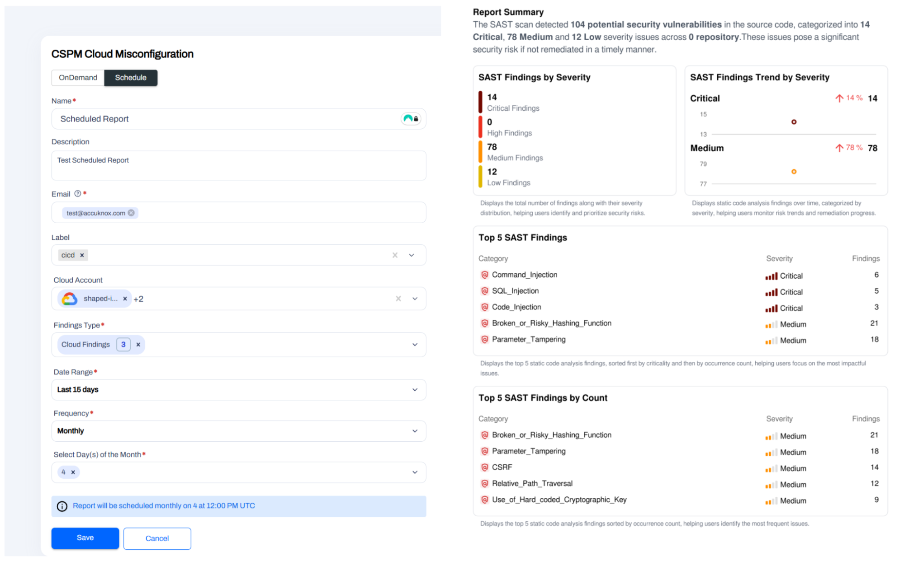

### 2. Consolidated Helm Charts for Agents & Risk Assessment Jobs

Previously, users had to deploy multiple Helm charts for KubeArmor, agents, and risk assessment jobs, each with separate values and upgrade paths — increasing operational overhead.

This release consolidates everything into a **single Helm chart** with unified configuration, including resource requirements for VMs, multi-cluster onboarding info, and port requirements.

👉 Get commands by toggling the options that suit your needs from this [Cluster Onboarding Configuration Page](https://app.accuknox.com/settings/manage-cluster/onboard).

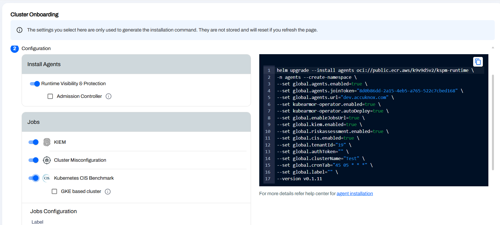

### 3. Detailed Drawer View for CDR & SIEM

Security analysts had to pivot across multiple screens to investigate a single event.

The new **detailed drawer** consolidates event payloads, rule matches, source metadata, and response actions in a single pane — without navigating away.

This drastically reduces **MTTR (Mean Time to Respond)** by enabling triage and rule tuning from within the same context.

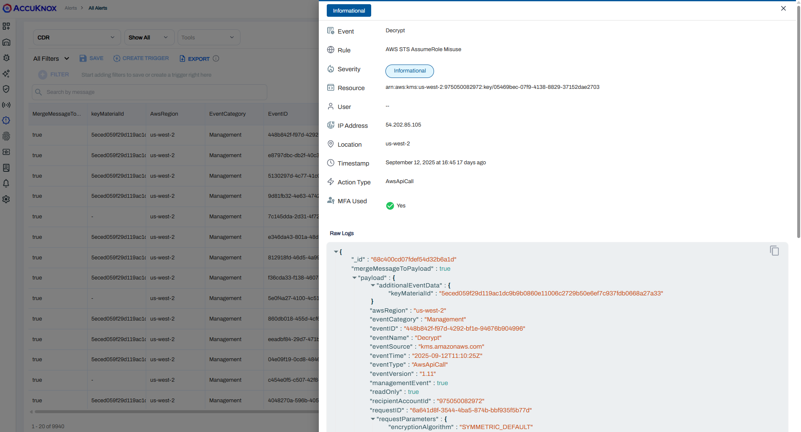

### 4. Manage Engine Service Desk Pro Support

Older integrations occasionally missed priority updates and left stale profiles after deletion.

The new implementation:
- Fully supports **priority synchronization**
- Cleans up deleted configs automatically
- Enhances UI usability with sortable, filterable lists

This ensures **smooth ITSM integration** and eliminates manual cleanup work for service desk admins.

📖 [Read The Docs](https://help.accuknox.com/integrations/servicedesk-plus/)

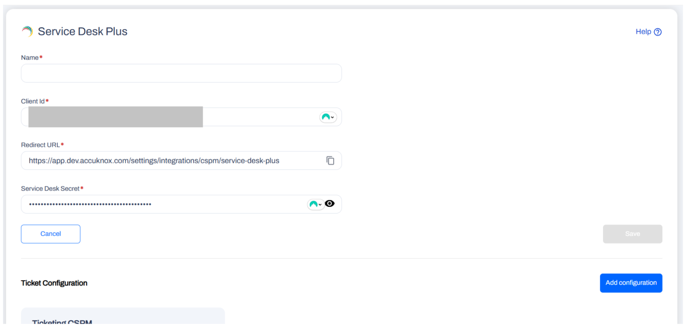
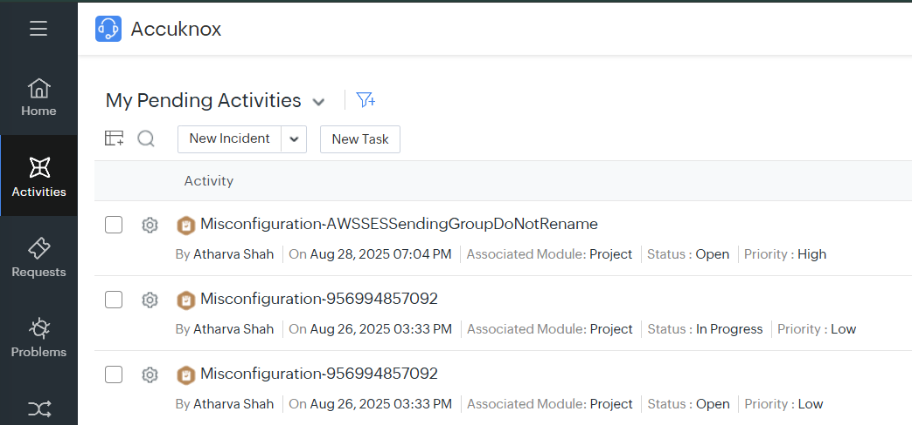

### 5. VM Vulnerability Scanning (AWS, GCP, Azure)

- Previously, VM Malware and Vulnerability findings lacked crucial context, forcing teams to manually reconcile results with inventory data.
- This release enriches both VM Malware Findings and VM Vulnerability Findings with three new metadata fields:
  - **OS Distribution**
  - **Cloud Account Type (AWS, GCP, Azure)**
  - **Cloud Account Name**
- These attributes are now populated directly from VM metadata and cloud account mappings, ensuring **accurate attribution of findings**.
- Downstream widgets and dashboards automatically consume these fields, enabling filtered views by **cloud provider or OS type**.
- Makes it easier to assign remediation to the right business unit and significantly improves compliance and executive reporting.

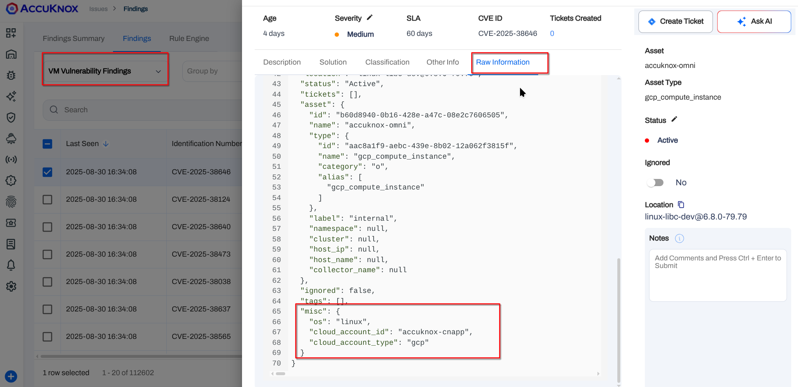
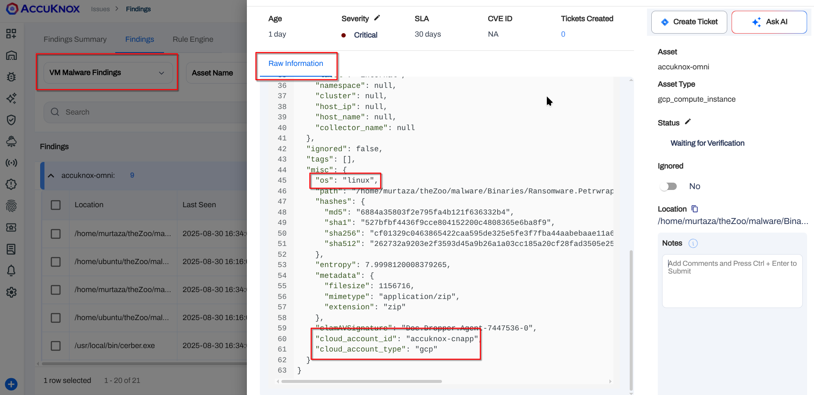

### 6. API Security -- Phase 1

- Laid the **API Observability foundation** with a first iteration of API Inventory.
- Added dedicated **Endpoints** and **Collections** pages for clear categorization.
- New **API Specifications page** lets teams review schemas/contracts for each discovered API.
- **Scans page** enables static and dynamic analysis to catch exposure issues early.
- Enhancements include:
  - **Generic Count API** for consistent reporting
  - API Findings surfaced directly on the Findings page for easy triage

Together, these capabilities deliver the **first stage of API Security coverage**:
- Automatic discovery of internal/external APIs
- Inventory organization
- Security signal centralization

This gives teams an actionable map of their **API attack surface** and sets the stage for **runtime protection** in upcoming phases.

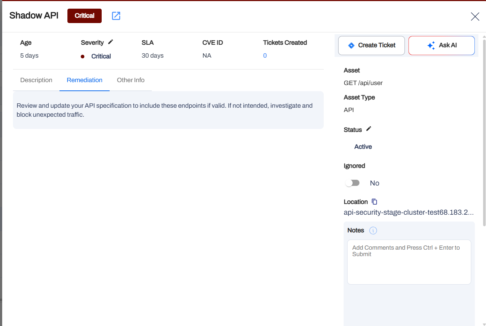
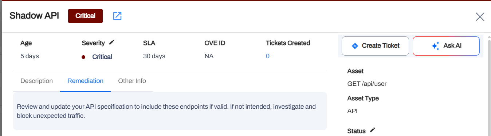
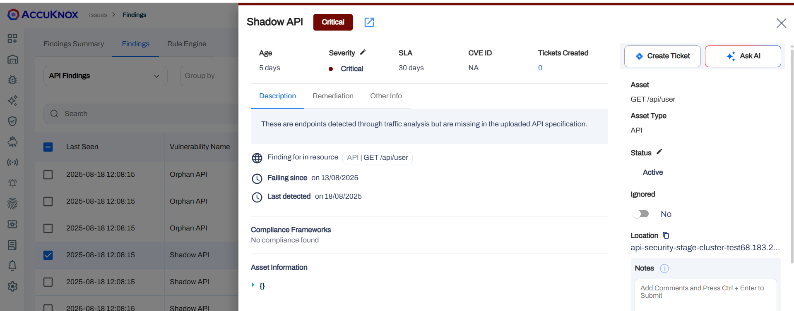

### 7. Collectors

- Built-in collectors for **Host Endpoint Scanning, ASPM, and AI-Security Modules**.
- Accessible via **Settings > Collectors**.
- Eliminates the need for custom scripts, plugins, or workflows across GitLab, GitHub, Nessus, etc.
- Configure and run scans from a **single interface** — whether using AccuKnox-deployed or self-deployed tools.

✅ Streamlines setup, reduces errors, and saves time by enabling **seamless configuration and deployment** directly within the platform.

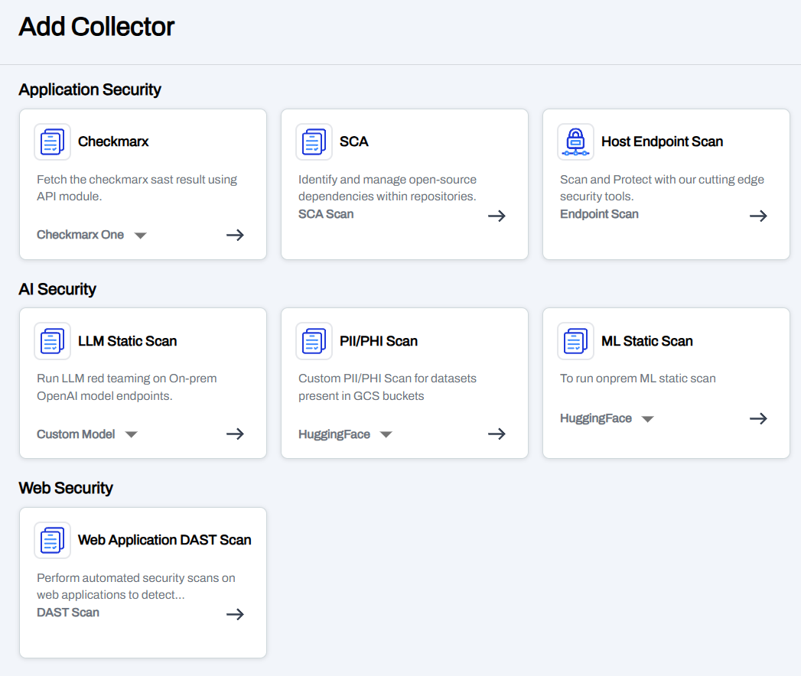
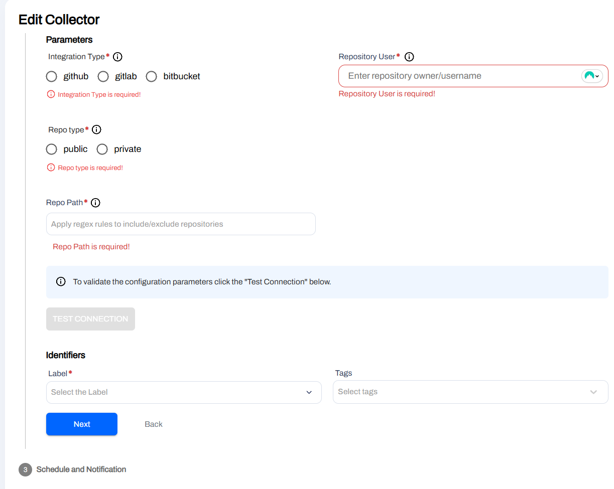
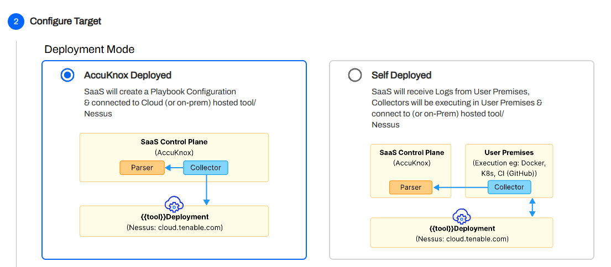

### 8. Hardening Policies for VMs

When onboarding VMs, **recommended hardening policies** can now be applied to secure them and scan for known issues.

Access these out-of-the-box policies under **Runtime Protection > Policies** and enforce them on your VMs for **faster, stronger security**.

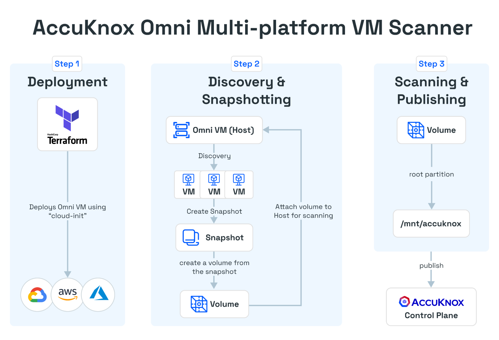
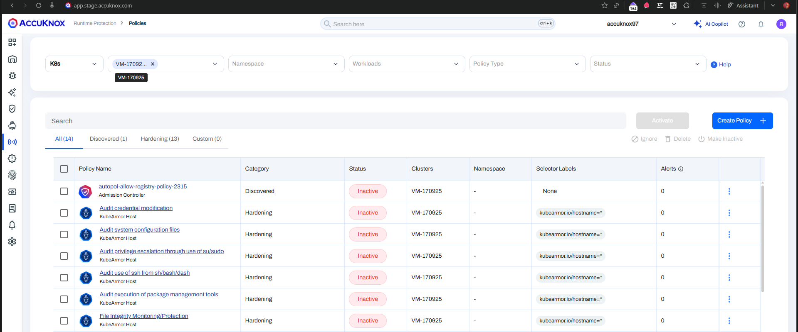

### 9. SPIRE-Based Onboarding for Jobs

AccuKnox Jobs now support **SPIRE-based authorization** as a replacement for access-token based deployments.

- Once a cluster is onboarded in the UI, users can deploy jobs using the **join token** instead of an access token.
- This streamlines deployment and leverages existing **SPIRE-based cluster authorization**.
- No need to chase expiring tokens — SPIRE makes access **set-and-forget** with simplified access preservation.
