# AccuKnox v3.5 Release Notes

**Release Date: May 2026**

v3.5 expands AccuKnox across the supply chain, the Rule Engine, AI workloads, and cloud governance. Headline additions are the Pipeline Auditor collector for GitHub Actions, parent-child smart ticketing, auto-tagging of internet-facing cloud assets, an AI-driven widget builder on Dashboard V3, and the unified xBOM framework spanning SBOM, CBOM, and AIBOM.

## At a Glance

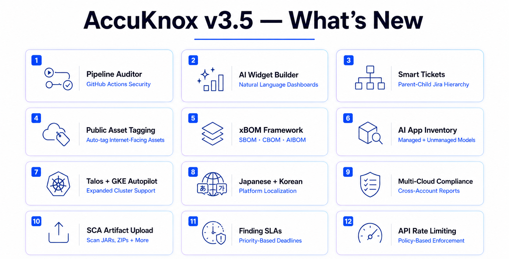

**Application & Supply Chain Security**

- [Pipeline Auditor Scan for GitHub Actions](#pipeline-auditor-scan-for-github-actions)
- [SCA Artifact Upload Collector](#sca-artifact-upload-collector)
- [xBOM: SBOM, CBOM, AIBOM](#xbom-software-cryptographic-and-ai-bill-of-materials)
- [SBOM Enhancements](#sbom-enhancements)

**Cloud Security & Compliance**

- [Auto-Tagging of Public Cloud Assets](#auto-tagging-of-public-cloud-assets)
- [Multi-Account Compliance Reports](#cspm-multi-account-compliance-reports)

**AI Security**

- [Prompt Firewall Browser Plugin](#prompt-firewall-browser-plugin-chrome-and-firefox)
- [Red Teaming Custom Models via Collector](#red-teaming-custom-models-via-collector)
- [AI App Inventory: Managed and Unmanaged](#ai-app-inventory-managed-and-unmanaged-assets)
- [AI Widget Builder on Dashboard V3](#ai-widget-builder-on-dashboard-v3)

**Runtime & Kubernetes (CWPP)**

- [Talos Linux Support](#cwpp-talos-linux-support)
- [GKE Autopilot Support](#cwpp-gke-autopilot-support)
- [Container Image Findings Grouped by Cluster](#container-image-findings-grouped-by-cluster)
- [Bulk Updates for Auto-Discovered Policies](#bulk-updates-for-auto-discovered-policies)
- [KIEM Finding Detail](#kiem-findings)

**Rule Engine & Findings Workflow**

- [Smart Tickets with Parent-Child Hierarchy](#rule-engine-smart-tickets-with-parent-child-hierarchy)
- [Not Seen In Condition](#rule-engine-not-seen-in-condition)
- [Custom Finding Statuses](#custom-finding-statuses)
- [Finding SLAs](#finding-slas)
- [Tags Page Revamp](#tags-page-revamp)

**API Security**

- [Policy-Based Rate Limiting](#api-security-policy-based-rate-limiting)

**Platform**

- [Ad-hoc Trigger for Every Collector](#ad-hoc-trigger-for-every-collector)
- [Japanese and Korean Localization](#localization-japanese-and-korean)

---

## What's New in v3.5

### Pipeline Auditor Scan for GitHub Actions

A new collector audits the entire GitHub Actions pipeline of an organization. It surfaces gaps that neither GitHub nor standard SAST tooling reports, including unpinned third-party actions, persisted credentials, overly permissive `GITHUB_TOKEN` scopes, missing branch protection, and supply chain risks introduced by mutable refs.

Add it from **Settings → Collectors → Pipeline Auditor Scan**, supply the organization ID and a fine-grained personal access token scoped to that organization with the permissions documented in the [PipelineAudit project](https://github.com/AccuKnox/PipelineAudit). Findings post into the standard Findings flow with `pipeaudit` as the source tool, grouped by repository and rule ID so a single workflow with many unpinned actions reads as a clean drill-down.

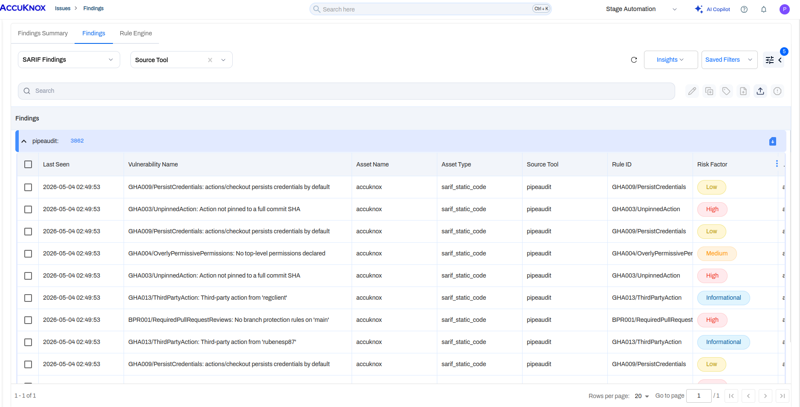

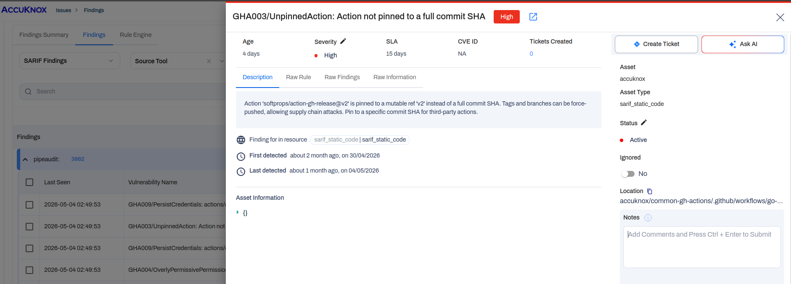

!!! note
    GitHub is production-ready in v3.5. GitLab and Azure DevOps adapters exist but remain in active development; production rollout is scheduled for v3.6.

### SCA Artifact Upload Collector

Software Composition Analysis now accepts pre-built artifacts as a direct upload. Drop `jar`, `ear`, `war`, `exe`, `dll`, `zip`, `tar`, `tar.gz`, or `tgz` files (up to 1 GB per file and 5 GB per scan) and AccuKnox runs the full SCA pipeline against them, no repository connection required.

This unblocks teams that build artifacts in air-gapped or third-party CI environments and want findings inside AccuKnox without exposing source. Supports both ad-hoc uploads and recurring scheduled scans, so an artifact uploaded once keeps re-scanning against an updated CVE database without re-upload.

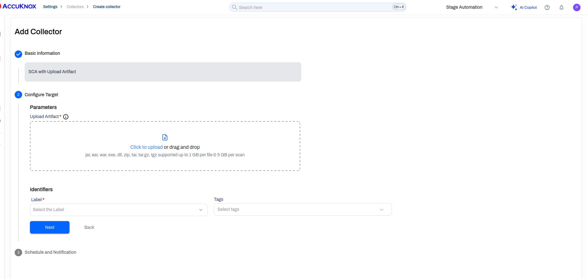

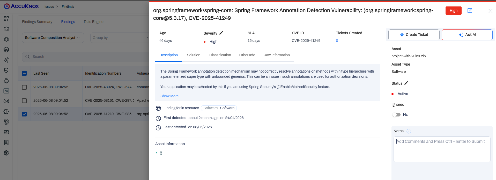

### Ad-hoc Trigger for Every Collector

Every collector row now carries a **Trigger Scan** action alongside the existing on-demand and scheduled modes. Use it for one-off runs that should not disturb the configured schedule.

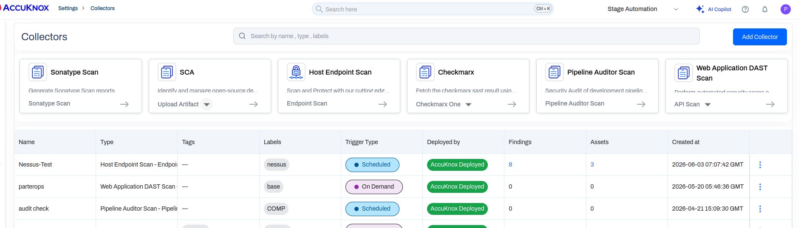

### Prompt Firewall Browser Plugin: Chrome and Firefox

The AccuKnox Prompt Firewall is now available as a browser extension for Chrome (and Chromium-based browsers — Brave, Edge) and Firefox. The plugin sits between your browser and ChatGPT, intercepting every prompt and response before it travels to or from the model. If a prompt trips an active policy, a red banner appears inline. Prompts that clear all policies pass through silently with a green confirmation.

This gives organizations direct control over how employees interact with public AI assistants, without requiring any application-level SDK integration or proxy changes. Install it, paste your integration token from **AI Security > Integrations**, and policies you have already configured in AccuKnox apply immediately.

A blocked prompt surfaces a red banner inline in ChatGPT, and an allowed prompt shows a brief green clearance — both without leaving the browser tab.

Every intercepted prompt and response is logged under **AI Security > Request Log** with timestamp, direction (PROMPT or RESPONSE), verdict (ALLOW or BLOCK), content preview, and latency. The log is searchable, filterable by verdict or direction, and exportable as JSON.

**Installation guides:**

- [Chrome, Brave, and Edge →](/integrations/openai-browser-integration/)
- [Firefox →](/integrations/openai-firefox-browser-integration/)

!!! note "Firefox installation"
    Firefox loads the extension as a temporary add-on via `about:debugging`. It will unload when the browser restarts. Contact AccuKnox support if you need a permanent deployment option for Firefox.

### Red Teaming Custom Models via Collector

AccuKnox supports cloud-based onboarding to scan and red team every model deployed across an AWS Bedrock account. The Collector method is a lighter alternative for targeting a specific model on Bedrock without onboarding the entire cloud account or organization.

- **Targeted scope:** Red team a single Bedrock model instead of every model in the account.
- **No account onboarding needed:** Works directly against the model's inference endpoint using a Bedrock API key.
- **Fast setup:** A single Custom Model collector covers the connection, prompts, and schedule.
- **Flexible:** The same flow works for any LLM exposed over an HTTP endpoint, not just Bedrock.

[Set up red teaming for a custom model →](/how-to/aiml-bedrock-collector/)

### AI App Inventory: Managed and Unmanaged Assets

AI/ML inventory now splits cleanly between **Managed** assets (models hosted by your cloud providers such as Bedrock foundation models) and **Unmanaged** assets (Python and Node packages, local dependencies, and models pulled into arbitrary VMs).

The Managed tab surfaces FT scan status, model ARN, version, and tags, giving a single pane for Bedrock and similar managed deployments.

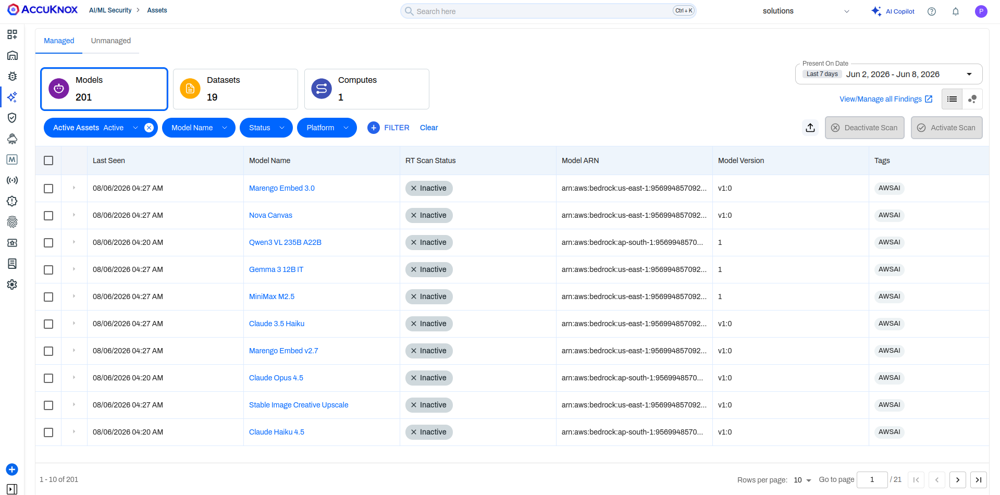

The Unmanaged tab maps packages flowing into AI workloads with language, category (SDK, MCP, Agent), version, license, and PURL identifiers. Click any asset to see its raw JSON, repository URL, and dependency chain.

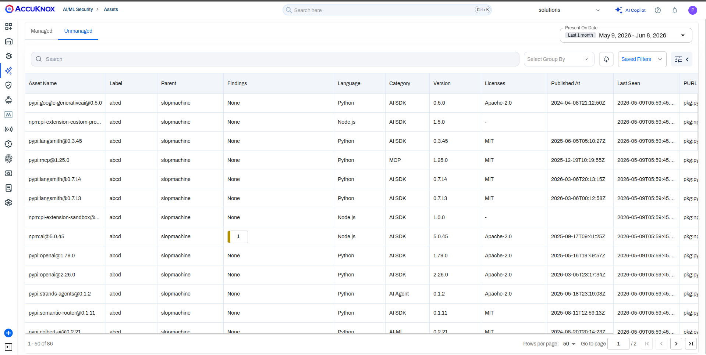

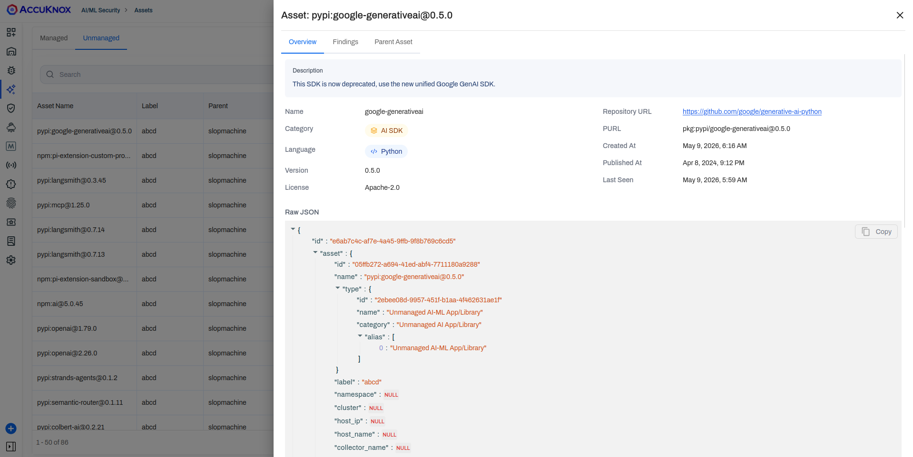

### Auto-Tagging of Public Cloud Assets

CSPM auto-tags any AWS or Azure asset that either accepts inbound traffic from the public internet or has egress to a public network. The tag, `Public`, is applied by the discovery engine and flows downstream into Findings, Assets, and the Rule Engine.

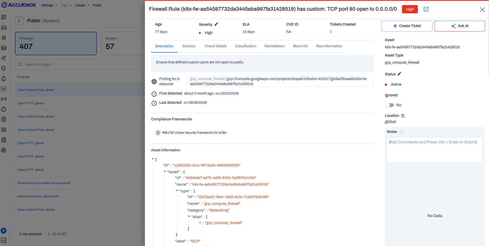

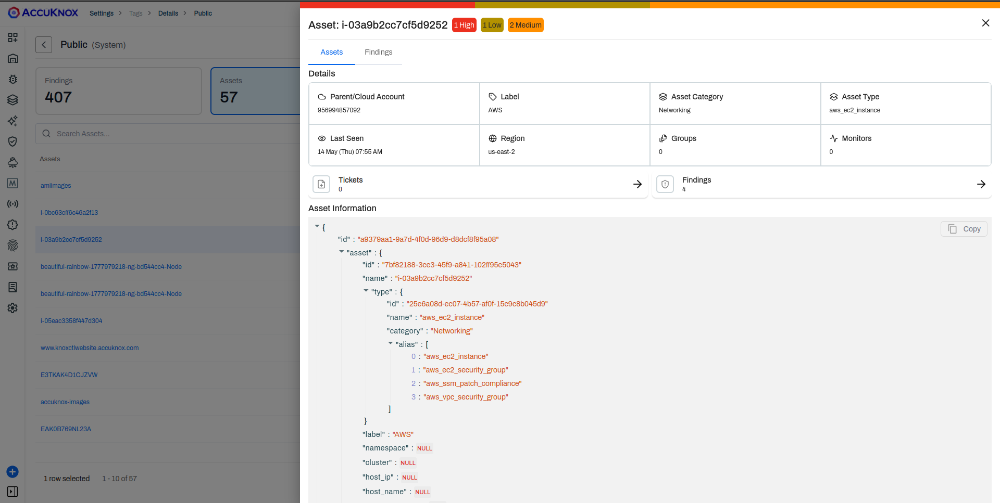

A common automation built on this is a Rule Engine entry that fires whenever a finding lands on an asset tagged `Public` and routes it to Slack or creates a higher-priority ticket.

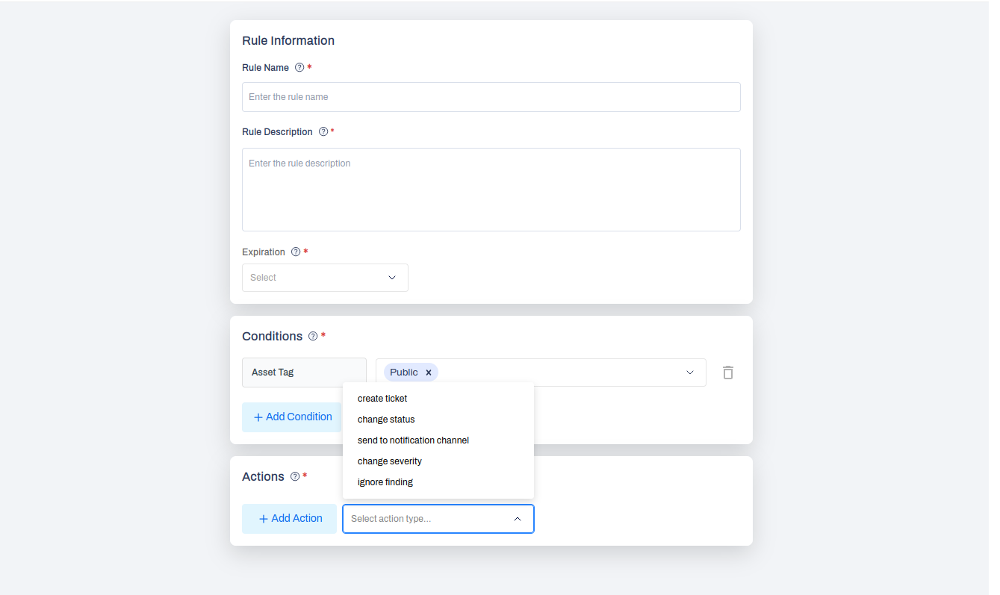

GCP and Oracle Cloud coverage for this tagging logic ships in v3.6.

### Rule Engine: Smart Tickets with Parent-Child Hierarchy

When the Rule Engine creates a ticket through the Jira integration, you can now group findings under a shared parent keyed off any field, most often **Asset Name**. The parent becomes an Epic or Story in Jira and each finding becomes a sub-task. Status, severity, and finding count on the parent update dynamically as children are remediated.

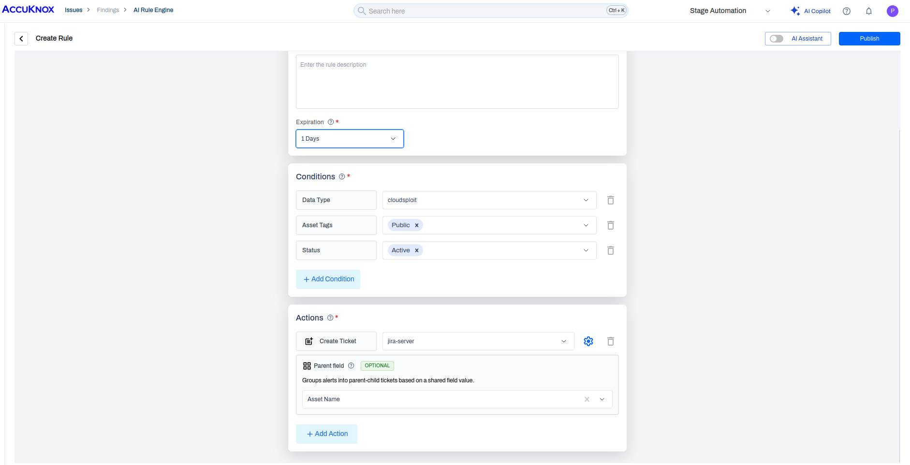

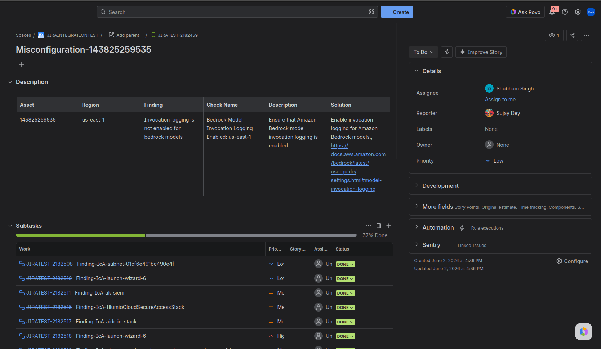

This replaces the older flow where every finding produced an independent ticket, which made bulk remediation hard to coordinate.

### Rule Engine: Not Seen In Condition

A new `Not Seen In` condition closes the loop on stale findings. When an asset is removed from a cloud account but AccuKnox keeps the historical finding open (because the asset is no longer scanned), the condition fires after a configurable window such as 15 days. Paired with **Change Status**, you can sweep phantom findings into `Accepted Risk` or a custom `Decommissioned` status automatically.

The condition list is also broader and dynamically scoped to the selected data type. For cloud findings, the dropdown now includes Origin Risk Factor, Exploit Available, Compliance Name, Asset Tags, Last Fixed, Is New, and Tool Output, among others.

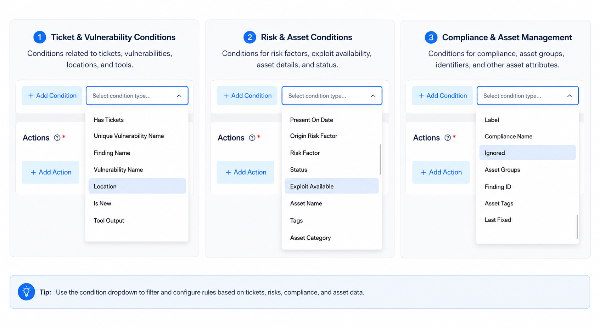

### Custom Finding Statuses

Administrators can define custom statuses beyond the built-in Active, Potential, and Fixed set. Custom statuses are configured at the back end and scoped to the AccuKnox UI, so they do not bleed into Jira or ServiceNow ticket fields. Useful for organization-specific workflows such as `Awaiting Vendor Patch` or `Compensating Control Applied`.

### Finding SLAs

Finding detail views now show an SLA timer next to severity. Targets are configurable per environment (Critical, High, Medium, Low) and serve as a remediation guideline that surfaces consistently across the finding list and the detail panel.

### AI Widget Builder on Dashboard V3

Dashboard V3 ships a conversational widget builder. Open **Add Widget**, switch to **AI Widget Builder**, and describe what you want in plain English. The model translates the request into an AccuKnox query through the MCP layer, returns a preview, and lets you flip between bar, donut, and table representations before adding the widget.

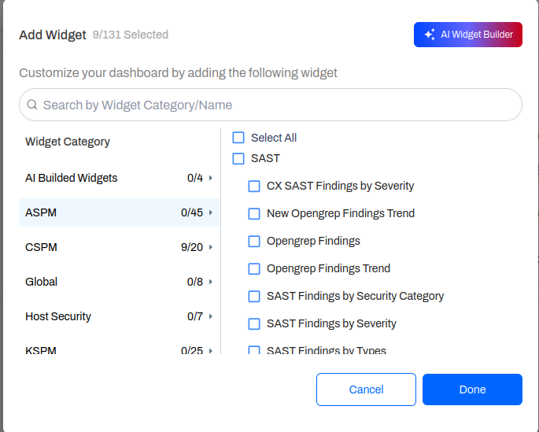

A query such as *"AI security findings ranked by High severity across cloud providers"* produces a bar chart broken down by AWS account, Azure subscription, and GCP project.

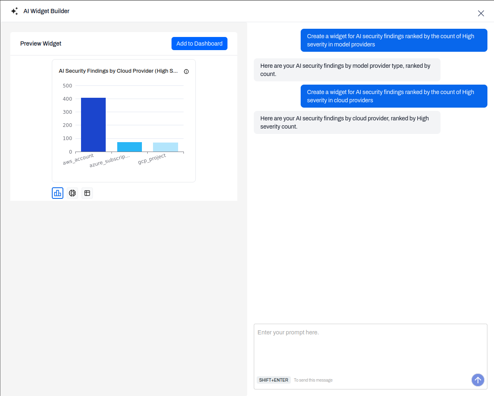

Switching the same widget to donut form is one click; the underlying query stays live so data refreshes automatically once added.

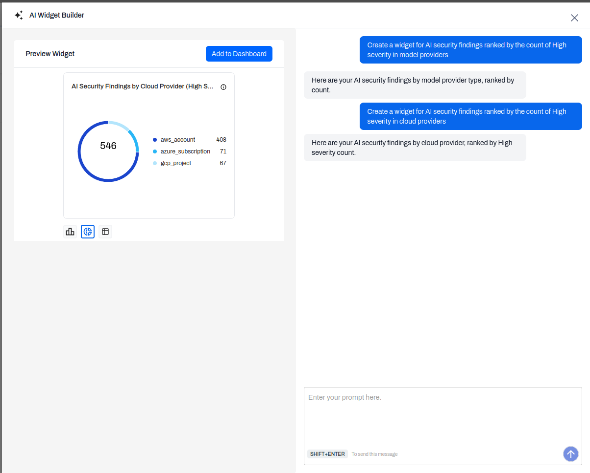

### Container Image Findings Grouped by Cluster

In-VM and in-cluster image scans now write a `Cluster Name` field into every container image finding. The Findings page groups results by this field for clean drill-down, and the same field is available as a filter alongside Namespace, Node Name, Registry, and Runtime Verified.

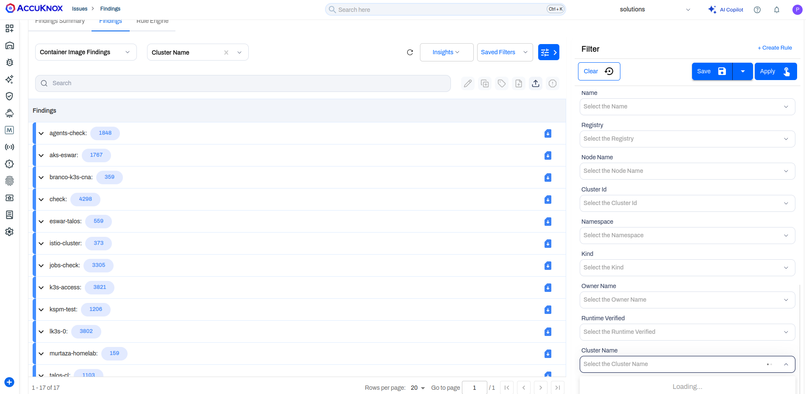

A new **In-Cluster Configuration** sub-tab under **Settings → Integrations → Registry** lists every cluster configured for image scanning, with status, last scan status, and timestamp. Removing a row offboards the cluster.

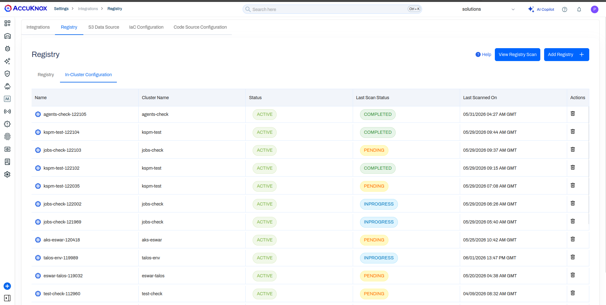

### Bulk Updates for Auto-Discovered Policies

When a workload change causes the discovery engine to suggest the same edit across hundreds of policies, multi-select policies and **Accept All Changes** or **Reject All Changes** in one action. Previously every policy had to be opened, reviewed, and approved one at a time.

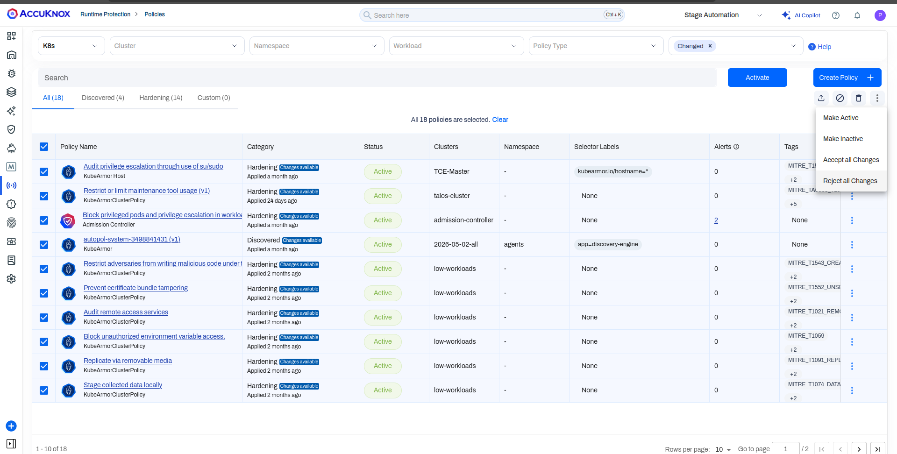

### CWPP: Talos Linux Support

KubeArmor and the AccuKnox CWPP stack now run on Talos Linux clusters with full coverage, CIS Kubernetes benchmarks, in-cluster image scanning, KIEM, runtime security posture management, and KubeArmor jobs. Talos joins the existing list of supported providers including AKS, EKS, and GKE Autopilot.

### CWPP: GKE Autopilot Support

AccuKnox CWPP supports deployment on GKE Autopilot clusters via the GKE partner workload allowlist. KubeArmor maintains a per-release allowlist that enables privileged workloads (such as those requiring `SYS_ADMIN` or `hostPath` mounts) to run within Autopilot's security constraints.

- Apply the `AllowlistSynchronizer` manifest to pull the KubeArmor allowlist from the GKE partner repository.
- Install KubeArmor via Helm with `environment.name=autopilot`.
- Onboard the cluster to the AccuKnox Platform with a standard join token.
- Enforce **Block** or **Audit** mode policies post-onboarding; violations surface in the Alerts section.
- Monitor egress, ingress, and graphical behaviour views per workload from the platform.

[Set up CWPP on GKE Autopilot →](/getting-started/gke-autopilot/)

### KIEM Findings

KIEM (Kubernetes Identity and Entitlement Management) findings now show full RBAC context in the detail panel, including the raw rule that triggered the violation, the affected ServiceAccount or role binding, and the compliance frameworks the rule maps to.

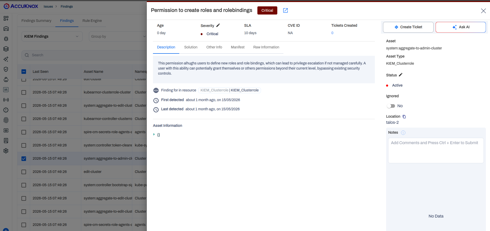

### CSPM: Multi-Account Compliance Reports

CSPM Cloud Compliance reports now accept either a single cloud account scanned against multiple compliance frameworks (one AWS account against HIPAA, AWS CIS v1.4, and APRA 234 in one run) or a single framework scanned across multiple cloud accounts. The mode toggles with a single radio in the report config.

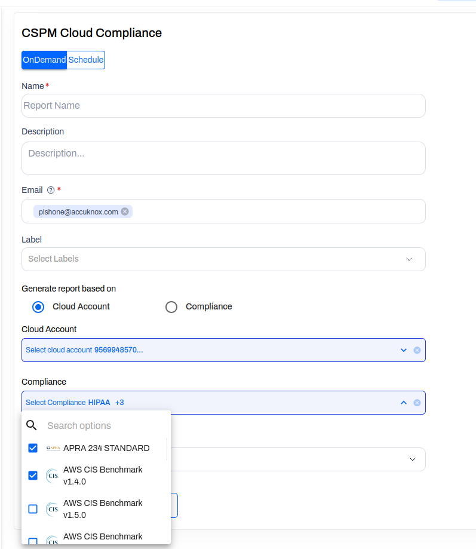

This removes the previous flow of running one report per account-framework pair and stitching outputs together by hand.

### Tags Page Revamp

Each tag now opens into a panel that shows associated **Findings** and **Assets** side by side, with the same tag count surfacing in both contexts. A **Source** column distinguishes tags created inside AccuKnox from tags imported from a cloud provider (for example, native GCP labels), so it is clear at a glance whether a tag is governed by AccuKnox automations or by upstream cloud governance.

### API Security: Policy-Based Rate Limiting

Rate limiting can now be defined as policy with conditions scoped to endpoints, geofences, or user context. Violations surface in the Alerts section. The UI policy builder is still in progress; for v3.5, policies are applied by editing YAML directly in the API Security cluster. Reach out to your AccuKnox contact for the policy template.

### Localization: Japanese and Korean

The platform ships with Japanese and Korean translations across most workflows. Switch language under **Profile** and the change applies immediately to navigation, collectors, cloud accounts, settings, and finding metadata rendered from static UI strings.

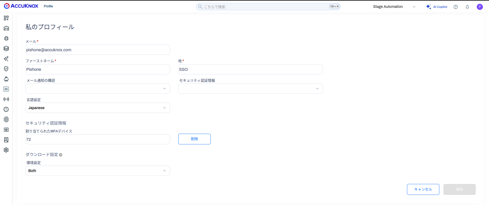

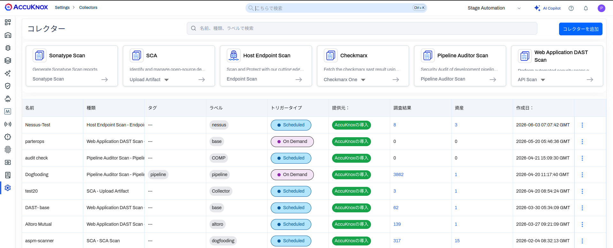

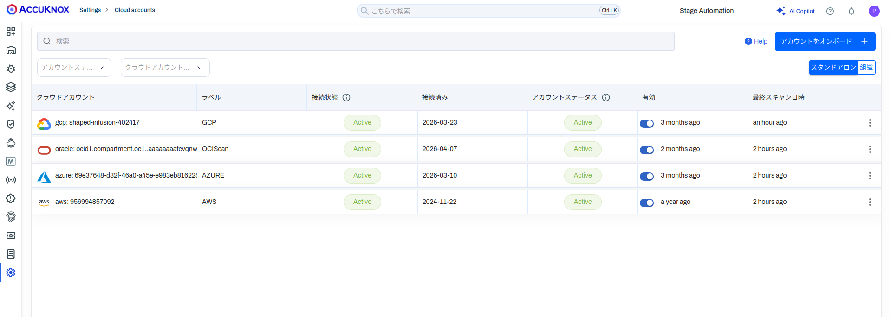

!!! note
    Localization in v3.5 covers static UI text. Dynamic content returned by upstream APIs (finding descriptions, CVE summaries) is displayed as received.

### xBOM: Software, Cryptographic, and AI Bill of Materials

v3.5 introduces **xBOM**, a unified framework for generating and managing Bills of Materials across three supply chain layers:

| BOM Type | Covers |
|----------|--------|
| **SBOM** | Software packages and dependencies |
| **CBOM** | Cryptographic algorithms and libraries |
| **AIBOM** | AI/ML models and their provenance |

xBOM supports compliance with **EO 14028** and the **EU AI Act** and is accessible via three generation methods:

- **knoxctl**, which scans filesystems, container images, and AI/ML models interactively from a local UI and pushes results directly to your AccuKnox tenant.
- **Container Image Scan Action**, which integrates AccuKnox's GitHub Action into your CI/CD pipeline to automatically generate SBOMs on every push or pull request.
- **xBOM Scan Action**, which generates SBOM, CBOM, and AIBOM from source code, container images, or AI/ML model sources within GitHub Actions workflows.

Generated BOMs are automatically scanned for known CVEs, license issues, and outdated components. Results surface in **SBOM > Projects** with vulnerability details, remediation tracking, and export support.

[Set up xBOM →](/getting-started/xbom-setup/)

### SBOM Enhancements

- Dependency graph refresh with cleaner cross-package linking.
- SBOM Compare ships with a diff filter so you can isolate added, removed, or upgraded components between two scans.
- CERT-In API integration for regulated SBOM reporting workflows.
- New SBOM metadata fields, updated findings drawer, and ad-hoc scan support for SBOM collectors.

<!--
## Pending Stakeholder Input

The following items shipped or partially shipped in v3.5 but are not yet documented because the engineering owner needs to confirm scope, screenshots, or user-facing flow. Each entry lists the owner to ping before publishing.

### Runtime & Kubernetes (CWPP)

- **CRI Detection for KubeArmor** — Owner: Sujay / CWPP team. Need confirmation of which CRI runtimes are detected, how detection surfaces in the UI, and any onboarding implications.
- **KubeArmor PTS Rule Support** — Owner: Sujay / CWPP team. Need rule schema, example use cases, and the UI surface where PTS rules are authored or imported.
- **KubeArmor Network Enforcement** — Owner: Sujay / CWPP team. Need enforcement scope (ingress, egress, L3, L4, L7), example policy YAML, and screenshots of violations.

### Cloud Security

- **Dynamic ECR Image Scanning** — Owner: Pavin. Configuration is back-end only with no UI today; need the trigger mechanism, the onboarding step, and confirmation of which regions and account types are in scope.
- **Harbor Proxy Support** — Owner: TBD. Status uncertain in transcript; need confirmation that it shipped and the registry onboarding flow if so.
- **REGEX in Registry Scan Pattern** — Owner: TBD. Released to dev but flagged as unstable in the v3.5 review. Need a sign-off on whether to publish, and tested example patterns if yes.

### SBOM and Supply Chain

- **CERT-In Integration Details** — Owner: Nikhil. The bullet above mentions CERT-In support; need the report flow, supported scan types, and a screenshot of the CERT-In export.
- **Mustache Framework Phase 2** — Owner: TBD. Need the user-facing change (additional placeholders, template surfaces, integration coverage).

### Findings and Tickets

- **Ticketing Lifecycle Reopen** — Owner: TBD. The original behaviour of creating new tickets for re-detected findings was identified as a bug. The fix (reopen the existing ticket rather than spawn a new one) is targeted for v3.6.
- **Cancel/Done Ticket State Fix** — Owner: TBD. Need confirmation whether the fix is user-facing enough to call out or should remain in a maintenance changelog.

### Dashboards and Widgets

- **13 New Widgets (Findings SLA Status, Findings Resolution Trend, Assets by Category, Total Assets by Cloud Provider, Average Issue Age, Cloud Findings by Category, Findings by Status, Findings by Severity, Findings Trend, Top 10 Findings, New Findings Trend, Assets Trend, New Assets Trend)** — Owner: SERAN (Demo) / Automation (Stage). Currently in progress and not release-ready. Need a screenshot per widget once data is wired up in a tenant.

### API and Integrations

- **API Security eBPF Collector** — Owner: TBD. Marked in progress; need the collector configuration, supported clusters, and visibility surface.
- **Security Hub Parser Update (Yoma Fleet)** — Owner: TBD. The transcript flagged this as a small parser change; need the new field set ingested and whether it appears in the finding detail.
- **TCE RMQ Changes** — Owner: TBD. Back-end architectural change; need confirmation of any user-visible impact (performance, alert delivery latency, etc) worth surfacing.

### Identity and SaaS

- **SSPM (SaaS Security Posture Management)** — Owner: Ayush. Collector is exposed in the Add Collector flow but no PRD or validation context yet. Need product scope, supported SaaS apps, and screenshots.
- **Nessus Web Host Endpoint Findings** — Owner: Ayush. Web-finding data type added on the Nessus integration; need a tenant with live data, finding detail screenshots, and parser coverage notes.

-->

AccuKnox v3.5 sharpens coverage where security teams spend the most time, pipelines, cloud assets, ticketing hygiene, and AI workloads, while opening the platform to Japanese and Korean speakers.
