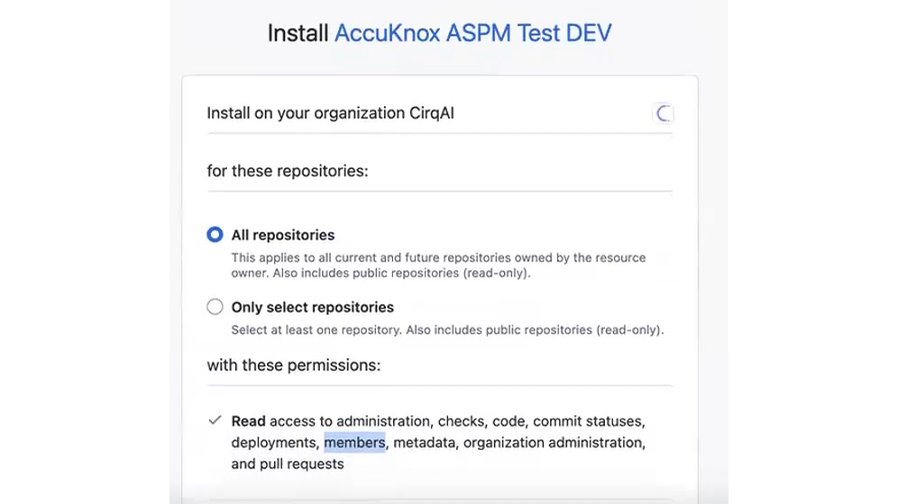
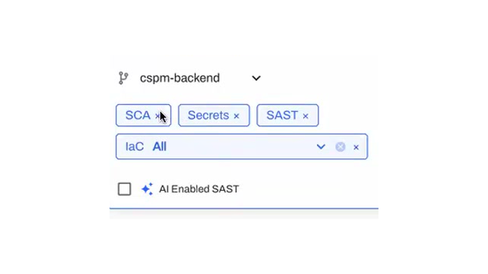
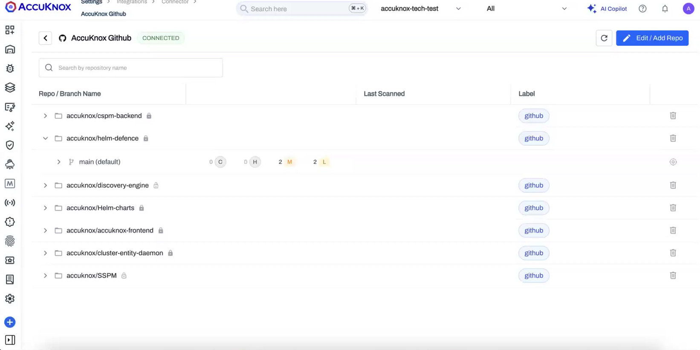
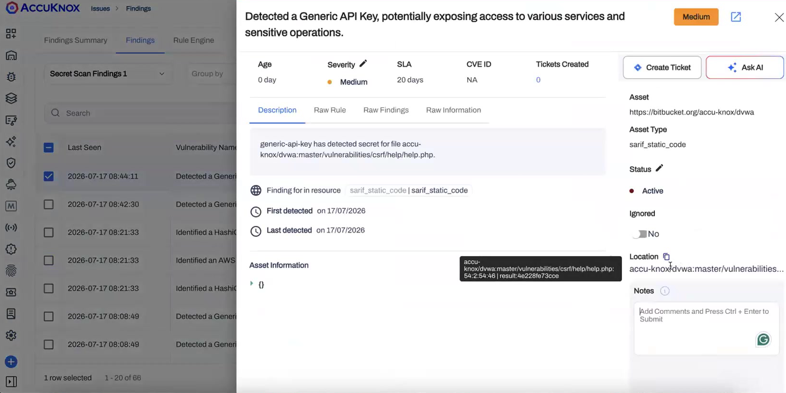
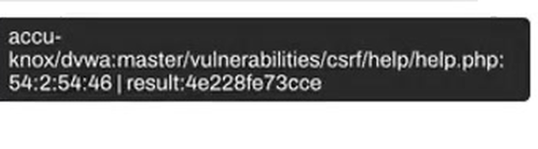
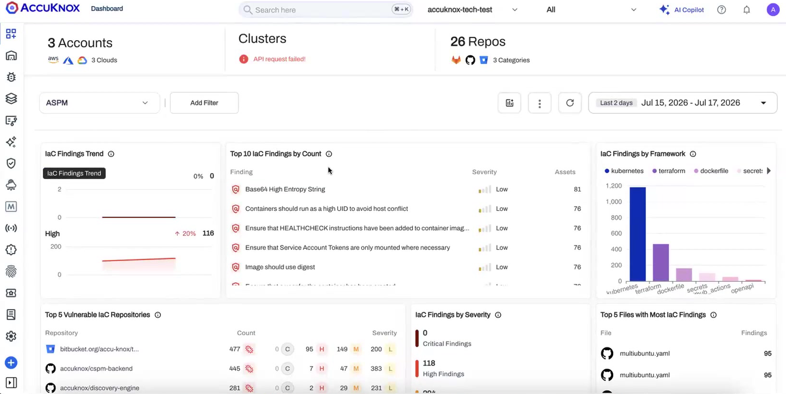
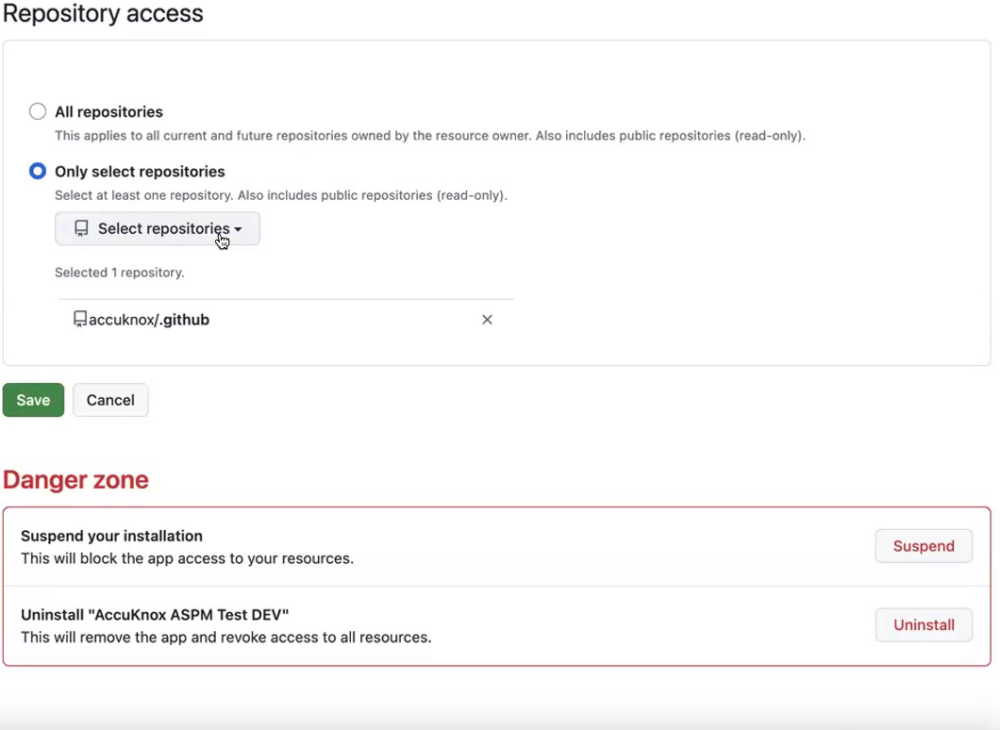

# AccuKnox v3.6 Release Notes

**Release Date: July 2026 (Preview)**

v3.6 changes how application security scanning is set up. Until now, running SAST, Secrets, IaC, or SCA on your code meant wiring a scan step into each CI/CD pipeline. In v3.6 you connect your source code manager once, using a native app for GitHub, GitLab, or Bitbucket, and then choose which repositories, which branches, and which scan types to run, all from inside AccuKnox. The scans run on the AccuKnox platform. Nothing runs in your pipeline and nothing is installed in your repositories beyond the app.

!!! info "Preview"
    This page covers features shown in the v3.6 sprint demo. Some ship in phases and some are in active development. Availability and phase are noted per feature. Reach out to your AccuKnox contact for the current rollout status in your tenant.

## At a Glance

**Source Code Security (ASPM)**

- [Connect Your Source Code Manager Once](#connect-your-source-code-manager-once)
- [Configure Scans per Repository and Branch](#configure-scans-per-repository-and-branch)
- [Automatic Repository Sync](#automatic-repository-sync)
- [Scheduled and On-Demand Scans](#scheduled-and-on-demand-scans)
- [Secrets Detection with Precise Deep-Links](#secrets-detection-with-precise-deep-links)
- [ASPM Dashboard for Application Findings](#aspm-dashboard-for-application-findings)
- [Choose Your Scan Token](#choose-your-scan-token)

**Roadmap**

- [Coming Next](#coming-next)

---

## What's New in v3.6

### Connect Your Source Code Manager Once

Application security scanning is now driven by a source code connection instead of a pipeline edit. Install the AccuKnox app on your GitHub, GitLab, or Bitbucket organization, grant read access, and every enabled repository becomes scannable from the platform.

The permission grant is read-only. During install you choose whether the app can see **all repositories** or **only selected repositories**, and the app requests read access to the metadata it needs to fetch and scan code.

Once connected, the connection appears under **Settings → Integrations → Code Source Configuration**, where you can manage every source you have linked and see its status at a glance.

Everything after this point happens on the AccuKnox platform. There is no scan step to maintain in your CI/CD, and no runner to install in your repositories. If you already run scans through a pipeline, you can keep that option; the results land on the same dashboard either way.

[Set up Source Code Security →](/how-to/code-source-onboarding/)

!!! note "Supported sources"
    GitHub, GitLab, and Bitbucket use the same connect-and-scan flow. When you remove a connection from AccuKnox, the app still exists on your source code manager, so uninstall it there as well if you want to fully revoke access.

### Configure Scans per Repository and Branch

After a source is connected, a short setup wizard walks you through **Connect → Repo & Branches → Scan**. For each repository and branch you pick exactly which scan types to run.

Phase 1 supports four scan types:

| Scan type | What it checks |
|---|---|
| **SCA** | Open-source dependencies and their known vulnerabilities |
| **Secrets** | Hardcoded credentials, tokens, and keys in the codebase |
| **SAST** | Insecure code patterns in your source |
| **IaC** | Misconfigurations in infrastructure-as-code, by framework |

Select **AI Enabled SAST** to add AI-assisted analysis on top of the standard static scan.

Scan choices are made per branch, so you can, for example, run the full set on `main` and a lighter set on feature branches.

### Automatic Repository Sync

New repositories can flow into AccuKnox without you re-configuring the connection.

- If the app has access to **all repositories**, a daily sync picks up any repository created in the last 24 hours and makes it available for scanning.
- If the app is scoped to **selected repositories only**, new repositories are not pulled in automatically, since you have limited what the app can see. Add them by editing the connection.
- For real-time updates, a webhook can notify AccuKnox the moment a repository or branch changes, so new work becomes scannable immediately instead of on the next sync.

The same behavior applies across GitHub, GitLab, and Bitbucket.

### Scheduled and On-Demand Scans

Every configured repository runs on a **daily scheduled scan**. You can also trigger an **on-demand scan** whenever you need fresh results, scoped to a specific repository and branch rather than everything at once.

Expand a repository to see its branches, the current severity breakdown, and a per-branch scan action.

### Secrets Detection with Precise Deep-Links

Secret findings now point to the exact place the secret was found: the repository, the branch, the file path, and the precise line and column range.

The location resolves down to the character range within the file, not just the file name, which makes it fast to open the finding at the right line in your source code manager.

This is a direct improvement over the older secret-scan links, where findings could only point you to a file or a commit and left you to search for the actual line.

### ASPM Dashboard for Application Findings

Application security findings roll up into the ASPM view on the dashboard. Set the dashboard filter to **ASPM** to see IaC findings trends, top findings by count, findings by framework, the most vulnerable repositories, findings by severity, and the files with the most findings.

### Choose Your Scan Token

For AI-enabled scanning you decide whose token is used. Under your **tenant profile** you can run scans with the **AccuKnox-managed token** or supply **your own token**. Use your own when you want the scan to run under your organization's account and quota.

---

## Coming Next

The v3.6 source code flow is the foundation for several capabilities already in progress:

- **Quality Gates.** Pass or fail a change against your security thresholds. Quality gates apply wherever the work happens, whether it is triggered from the app or from CI/CD. **PR decoration** and **IDE integration** are planned alongside them.
- **Repository labels and groups.** Organize and filter repositories by label and group. Backend support exists; the configuration surface is planned for a later phase.
- **Asset inventory for repositories.** Connected repositories will surface in the revamped asset inventory next to the rest of your assets.
- **More scan types.** SBOM, CBOM, and container image scanning join the source code flow after the initial four scan types.

!!! note "Consolidation"
    The separate IaC integration entry is being folded into the unified Source Code experience so that source code analysis reads as one journey. Existing IaC configurations continue to work during the transition.

<!--
## Pending Stakeholder Input

The following need confirmation before this page is published externally. Each item lists what to verify.

- **Production app name.** Install and uninstall screenshots currently show "AccuKnox ASPM Test DEV" from the dev environment. Replace with the production app name before publishing.
    
- **GA date.** Page is marked "July 2026 (Preview)". Confirm the actual v3.6 general-availability date.
- **GitLab / Bitbucket parity.** Confirm that GitLab and Bitbucket ship at the same time as GitHub for the app-based flow, or add a phase note if not.
- **Quality Gates availability.** A PR for quality gates is raised and merges after the ASPM change. Confirm whether it lands in v3.6 GA or a point release before promoting it out of "Coming Next".
- **Token configuration location.** Confirm the exact path for choosing the scan token (tenant profile / tenant section) and add a screenshot.
- **Webhook setup.** Real-time sync needs a webhook server on the AccuKnox side. Confirm whether this is customer-configurable or handled by AccuKnox, and document the setup step in the how-to if customer-facing.
- **How-to page.** `how-to/code-source-onboarding.md` is drafted from the demo. Review it for accuracy against the shipped flow before publishing.
-->

AccuKnox v3.6 turns application security scanning into a connect-once experience: link your source code manager, choose what to scan, and let the platform do the rest.
