# AccuKnox v3.7 Release Notes

v3.7 removes setup work. Connect GCP, your source code, and your clusters with fewer steps and no pipeline changes. Groups limit what each team sees. One place now shows cloud identities and every kind of BOM. An AI Gateway and your own guardrails now sit in front of your LLM apps.

## What's New

Pick an area to see what changed in it.

=== "Cloud"

    - [Onboard GCP with Role Impersonation](#onboard-gcp-with-role-impersonation). AccuKnox creates the service account and a Terraform script grants its permissions.
    - [CIEM at Cloud Account Onboarding](#ciem-at-cloud-account-onboarding). Turn on identity and entitlement analysis for a new account in one toggle.
    - [Cloud Account Names Instead of IDs](#cloud-account-names-instead-of-ids). Filter, group, and read findings by account name.

=== "Kubernetes and Containers"

    - [Scan Running Images for SBOMs](#scan-running-images-for-sboms). Build an SBOM for every image running in a cluster, from any registry.
    - [Simpler Cluster Onboarding](#simpler-cluster-onboarding). Kubernetes onboarding no longer asks for an authentication token.
    - [Registry Scan Patterns with Regex](#registry-scan-patterns-with-regex). Choose exactly which image tags a registry scan pulls.
    - [Windows Nodes and Node Targeting](#windows-nodes-and-node-targeting). Scan Windows images, pick the nodes to scan, and keep scanning when one node fails.

=== "Findings and Workflow"

    - [Asset Rule Engine](#asset-rule-engine). Raise a ticket or a notification when an asset matches a rule.
    - [Impact Count and Trigger History in the Rule Engine](#impact-count-and-trigger-history-in-the-rule-engine). See how many findings a rule hits before you publish it.
    - [Status History in Finding Exports](#status-history-in-finding-exports). The exported CSV carries every status change.
    - [Job and Parser Status in Event Trail](#job-and-parser-status-in-event-trail). Watch scan jobs and parsers, and see failures.

=== "Access"

    - [Groups](#groups). Limit the cloud accounts, repositories, and assets each user can see.

=== "xBOM"

    - [xBOM Projects, Overview, and Compare](#xbom-projects-overview-and-compare). Classify projects, upload any BOM, and compare two BOMs side by side.

=== "AI Security"

    - [AI Gateway](#ai-gateway). Route an application's LLM traffic through AccuKnox and watch queries, violations, and latency.
    - [Custom Prompt Firewall Policies](#custom-prompt-firewall-policies). Write your own guardrail in plain language.
    - [AI Tool Allow-List in the Browser](#ai-tool-allow-list-in-the-browser). Block every AI tool you did not approve.

=== "AppSec"

    - [Connect Your Source Code Manager Once](#connect-your-source-code-manager-once). Scan GitHub, GitLab, or Bitbucket code with no pipeline setup.
    - [Configure Scans per Repository and Branch](#configure-scans-per-repository-and-branch). Pick SCA, Secrets, SAST, or IaC for each branch.
    - [Secrets Detection with Precise Deep-Links](#secrets-detection-with-precise-deep-links). Open a secret at the exact line.

---

## Cloud Security

### Onboard GCP with Role Impersonation

Connect a GCP account with a service account that AccuKnox creates for you. A Terraform script from AccuKnox grants the permissions and attaches the default policies. You do not assign roles by hand.

1. Open **Settings → Cloud Accounts** and select **Onboard Account**.
2. Choose **GCP**, then choose **Role Impersonation via Terraform Script** as the connection method.
3. Download the Terraform script and run it with Terraform.
4. Enter the client email that the process produces and click **Verify & Connect**.

This works for a standalone project. For a whole organization, see [Onboard a GCP Organization](/how-to/gcp-org-onboard/).

!!! note "Good to know"
    - You need Terraform installed on the machine that runs the script.
    - The script holds the roles. Edit them only if you know Terraform.
    - This method supports CSPM. CIEM and AI Security are not available with it.

### CIEM at Cloud Account Onboarding

Cloud Infrastructure Entitlement Management (CIEM) now has a switch in the onboarding flow. Turn it on when you add a **new standalone account**. AccuKnox adds the extra IAM permissions to the Terraform script for you. The rest of onboarding does not change.

It works on AWS, Azure, GCP, and Oracle. After the first scan, the users, roles, and groups of the account appear under **Identities → CIEM**.

For each identity you can see:

- The groups it belongs to and the policies attached to it.
- The full policy document, with actions, effects, and resources.
- Risk classes, such as overly broad access, taken from the policy permissions.
- When the identity was created and when its key was last used.
- An access graph that draws the chain from an identity through its groups to its policies.

Identity findings join the Findings page, so you can filter and group them by asset name.

!!! note "Prerequisites"
    - The toggle appears only for new standalone accounts. Existing accounts and organization accounts do not have it yet. Organization support is planned for the next release.
    - On AWS, enable CloudTrail first. The last-use data comes from it.

[Read the CIEM overview →](/getting-started/ciem-overview/) · [Onboard an account for CIEM →](/getting-started/ciem-onboarding/)

### Cloud Account Names Instead of IDs

Filters, hierarchy views, and findings now use the account name that your cloud provider shows. They no longer show a raw ID such as an Azure subscription UUID.

- **Filter by name** on the Findings, Assets, and Compliance pages. The name is read from AWS, Azure, or Oracle.
- **Rename in the cloud console** and AccuKnox picks up the new name.
- **Group by cloud account name** on the Findings page.
- **Select an account in the hierarchy view** to limit assets and findings to that account.

## Kubernetes and Containers

### Scan Running Images for SBOMs

Registry scans only see the registries you connect. **Scan Running Images** reads what the cluster actually runs, whichever registry the image came from. AccuKnox builds an SBOM for each image and shows it in the SBOM dashboard. The project is named after the cluster, and the images sit inside it.

1. Open the cluster onboarding page and name the cluster.
2. Select **Scan Running Images**.
3. Copy the install command and run it in your cluster. The command adapts to Linux, Mac, Windows CMD, or PowerShell.

The SBOM comes in CycloneDX or SPDX, as JSON. Each finding now carries the cluster, node, namespace, kind, and owner of the workload. Filter by namespace or by the in-cluster flag, and group by asset name.

This answers a hard question: "Which of my clusters and namespaces run the image with this vulnerability?"

!!! note "Prerequisite"
    Kubernetes clusters only. Virtual machines are not covered.

### Simpler Cluster Onboarding

The authentication token field is gone from Kubernetes onboarding. It stays hidden when runtime visibility is on, because AccuKnox adds the token to the Helm chart for you. The page also drops fields that no longer apply.

Need a token for a standalone or cron-based scan? Use the toggle to show it. VM onboarding still asks for a token.

### Registry Scan Patterns with Regex

A registry can hold thousands of image tags. Wildcard patterns cover most cases. Regex patterns now cover the rest, so a scan pulls only the tags you want.

- Scan only the tags from v15 to v20.
- Include v3 and v7 and skip v5, in one pattern.
- Skip 1,500 old versions and scan the latest 500.

Regex entries appear next to wildcard entries in the pattern list, and the info icon shows example patterns. Before you scan, type one tag into the test box. AccuKnox tells you whether the pattern includes or excludes it.

!!! note "Good to know"
    The test checks one tag at a time. AccuKnox does not show how many images a pattern matches before the scan, because that count needs a background job.

[Filter registry images with scan patterns →](/how-to/registry-scan-patterns/)

### Windows Nodes and Node Targeting

Three changes help clusters that mix node types or restrict access to some nodes.

- **Windows and Linux in one cluster.** AccuKnox finds the containers on a Windows node and scans their images. The results go to the platform.
- **Choose which nodes to scan.** Set a Kubernetes toleration in the Helm chart. The scanner then runs only on nodes that match, for example your worker nodes and not the control plane. Earlier releases scanned every node.
- **One failed node does not stop the rest.** AccuKnox marks a failed discovery as failed. It still scans the other nodes.

!!! note "Failed discovery"
    AccuKnox does not yet notify you when a node fails discovery. Check the scan status for the cluster.

## Findings and Workflow

### Asset Rule Engine

The Rule Engine can now act on assets, not only on findings. Create the rule under **Findings → Rule Engine → Create Rule**. The rule runs each time AccuKnox parses an asset file. You do not schedule it or start it by hand.

Pick a condition, such as a new asset, an end-of-life asset, or a severity count above a limit. Then pick an action:

- **Create ticket** in any connected ticketing integration.
- **Send to notification channel**.

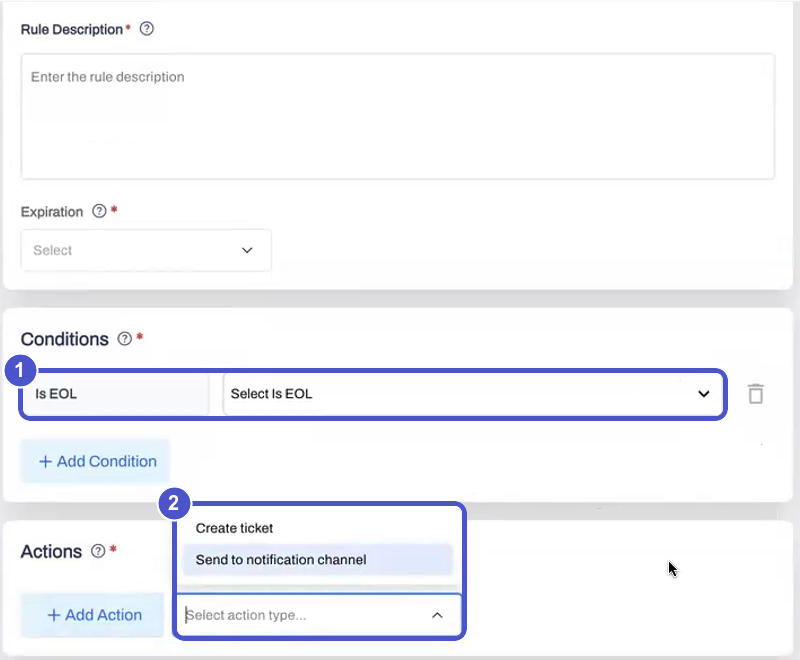{ width="720" }

A rule never files the same ticket twice. If a ticket already exists for an asset, later triggers send a notification only. Asset tickets also have their own template under **Settings**, so you can set the fields your team needs.

!!! note "Prerequisite"
    Connect a ticketing or notification integration first.

### Impact Count and Trigger History in the Rule Engine

Two additions help you trust a rule.

- **Impact count.** Before you publish a rule, AccuKnox shows how many current findings match its conditions. The count updates as you edit them. New scans change the real number, so treat it as an estimate.
- **Trigger history.** Filter a trigger count by time, for example the last 12 hours or 7 days. Click through from the count to the alerts that fired.

### Status History in Finding Exports

When you export findings to CSV, each row now includes the status history of the finding. You see the date and the reason for every change. Before, you had to open Event Trail and trace the finding back by hand.

The same history shows on the detail page of each finding. For the full record of who changed what, use [Event Trail](/getting-started/audit-trail-logs/).

### Job and Parser Status in Event Trail

Event Trail now shows the progress of scan jobs and the status of artifact parsers. Playbook runs appear there too. Failed scan jobs and parser failures raise a notification, so you find out when a scan did not finish.

## Access Control

### Groups

A group is a set of cloud accounts, code repositories, and other ASPM assets. Put a user in a group and that user sees only those assets. A group can mix accounts from different clouds and environments, and repositories next to them.

Roles and groups do different jobs:

- **Roles** (RBAC) decide what a user can do, such as view or edit.
- **Groups** decide what a user can see.

To set it up:

1. Open **Settings → Groups** and select **Create Group**.
2. Add cloud accounts, repositories, or other assets.
3. Add users. You can assign a group when you invite a user from the **Users** page. You can also open the group and use **Edit Group → Users → Add User**.

## xBOM

### xBOM Projects, Overview, and Compare

The BOM pages are redesigned around the kind of BOM you hold. xBOM means any BOM, such as an SBOM or a CBOM. The [xBOM setup guide](/getting-started/xbom-setup/) explains how to generate each one.

**Create a project.** Choose a classifier, such as application or device. AccuKnox then suggests the BOM types you probably want to upload. The suggestion is a hint, and you can upload any type.

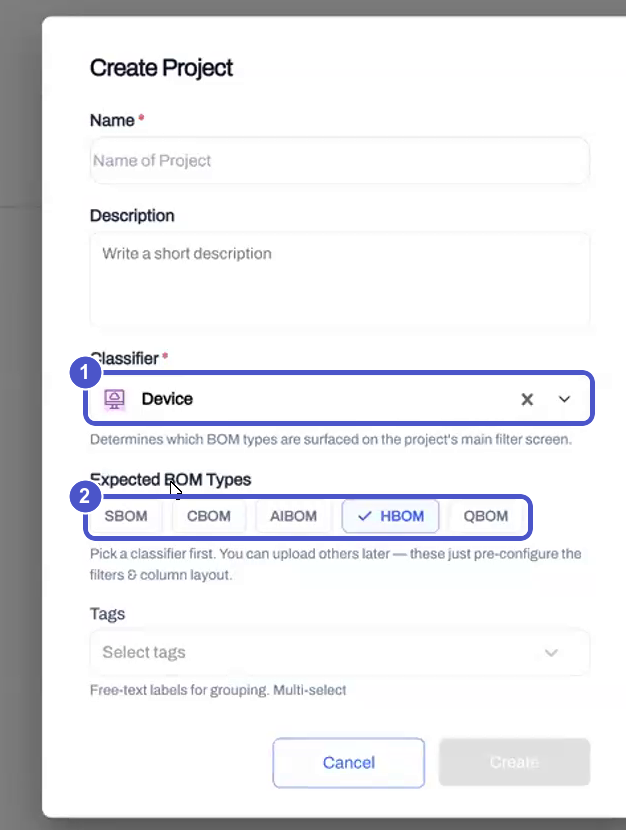{ width="640" }

The project list also shows who created each project. Filter by creator when several people share a tenant.

**Upload a BOM.** AccuKnox reads the file and shows the BOM type before you confirm. It checks the type again after parsing. The file shows as pending for a moment while vulnerability data is added.

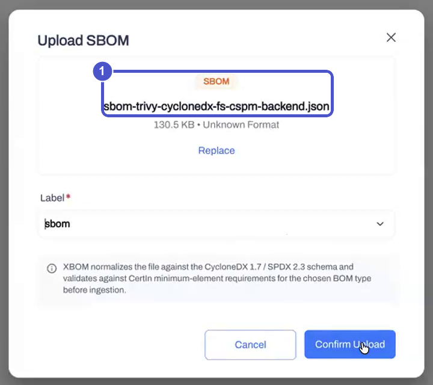{ width="600" }

**Read the overview.** Each BOM gets an overview. It shows the format, the version, license risk, the component count, and findings by severity. Tabs hold the **Components**, **Vulnerabilities**, **Licenses**, and **Raw JSON** views. Export a BOM as CycloneDX or SPDX from the same page.

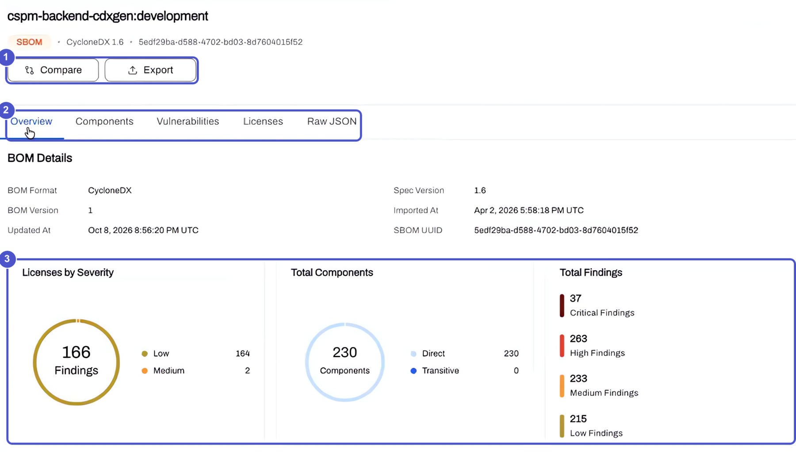

Components lists everything in the BOM. Vulnerabilities lists only the components that have a finding.

**Compare two BOMs.** Select two BOMs of the same type and click **Compare**. AccuKnox lists the components that were added, removed, changed, or unchanged. Compare a local build with production before you push. Or track a project from release to release.

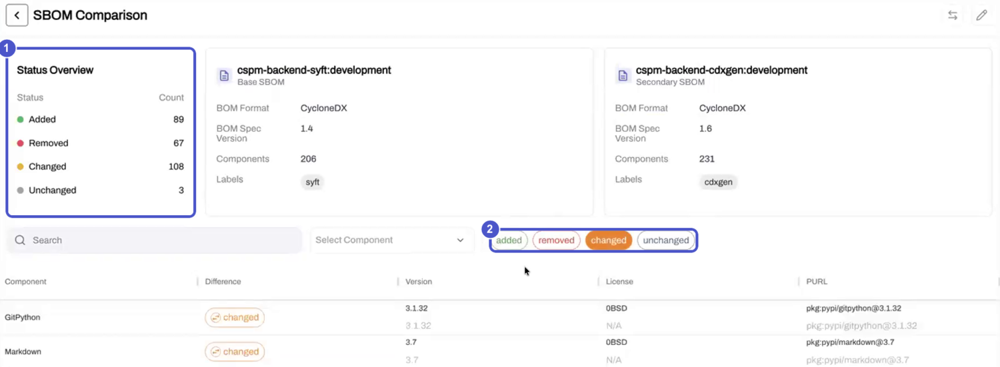

!!! note "Good to know"
    You cannot compare an SBOM with a CBOM. To raise a ticket, open the finding from the **Findings** page, which has the full filter and action set.

## AI Security

### AI Gateway

The AI Gateway sits between your application and the LLM. It sees every prompt and response, so you can monitor them and apply Prompt Firewall policies.

To onboard an application:

1. Open **Settings → AI Gateway** and select **Onboard Application**.
2. Enter a name, choose the provider, then choose the model. The model list follows the provider.
3. Enter the provider API key and select tags.
4. Turn on **Prompt Firewall** if you want policies applied, then click **Test Connection**.
5. Save. AccuKnox shows ready-to-copy commands for curl, Python, and Node.js.

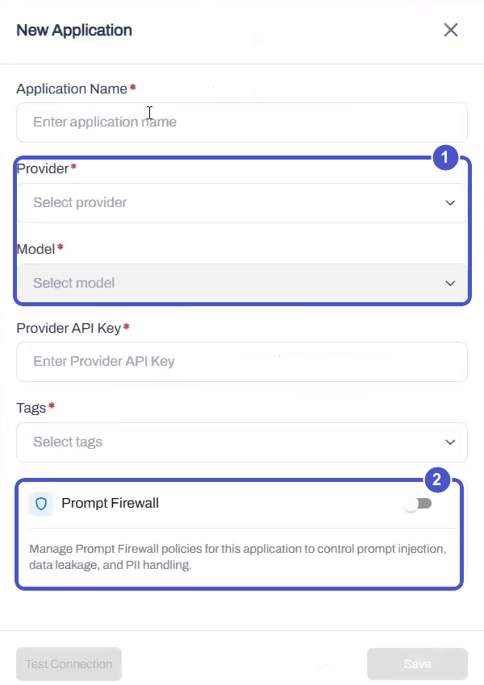{ width="420" }

The application list shows queries, violations, blocked and monitored counts, spend, and tokens for each application. **Manage** next to an enabled Prompt Firewall opens its policies with the application already selected.

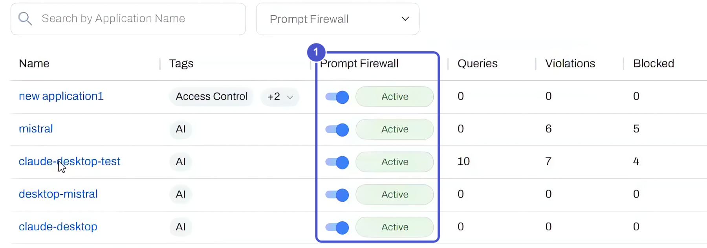

Open an application to see its queries against violations over time, its latency trend, and a breakdown by model. A link takes you to the AI Security issues for that application.

!!! note "Good to know"
    You can edit the model, the API key, and the Prompt Firewall setting later. You cannot edit the name, provider, or tags.

### Custom Prompt Firewall Policies

The built-in scanners catch prompt injection, gibberish, and similar patterns. A custom policy covers what they do not, such as rules that are specific to your business. You write the rule in plain language.

A custom policy has three parts:

- **Policy description.** What the policy blocks.
- **Violating examples.** Sample prompts that break the rule.
- **Safe examples.** Sample prompts that are fine.

The two example lists are optional, but they make the guardrail more accurate. The policy applies to prompts and to responses. The example below blocks requests for financial advice. It also blocks them when the user wraps the request in a made-up story.

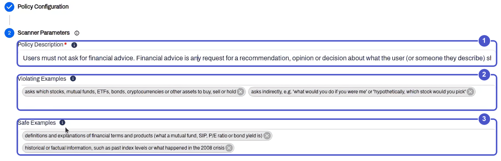

[Prompt Firewall setup →](/how-to/prompt-firewall/)

### AI Tool Allow-List in the Browser

The Prompt Firewall browser extension can now stop people from opening AI tools you did not approve. It blocks the page before anyone types a prompt.

1. Add a Prompt Firewall policy of the AI tools type.
2. Select the tools to allow from the list, such as the assistant your company uses. You can also add custom URLs.
3. Save. Every AI tool that is not on the list is blocked.

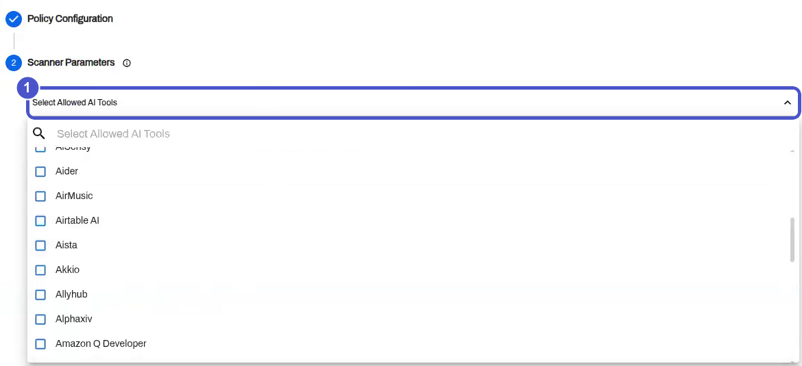{ width="640" }

A blocked user sees a notice that the site is blocked by the organization's AI usage policy.

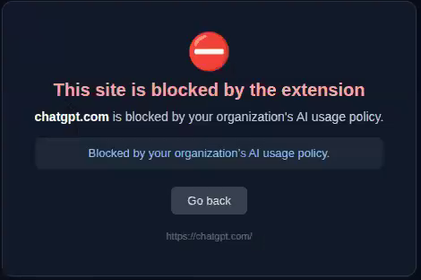{ width="560" }

The block can be narrow. You can block one address, such as a single AI product on a domain, without blocking the whole domain. Each block appears on the Issues page with the user name and email.

[Install the browser plugin →](/integrations/chrome-browser-integration/)

## Source Code Security

v3.7 changes how application security scanning is set up. Until now, running SAST, Secrets, IaC, or SCA on your code meant wiring a scan step into each CI/CD pipeline. In v3.7 you connect your source code manager once, with a native app for GitHub, GitLab, or Bitbucket. You then choose the repositories, branches, and scan types inside AccuKnox. The scans run on the AccuKnox platform.

### Connect Your Source Code Manager Once

Application security scanning is now driven by a source code connection instead of a pipeline edit. Install the AccuKnox app on your GitHub, GitLab, or Bitbucket organization, grant read access, and every enabled repository becomes scannable from the platform.

The permission grant is read-only. During install you choose whether the app can see **all repositories** or **only selected repositories**, and the app requests read access to the metadata it needs to fetch and scan code.

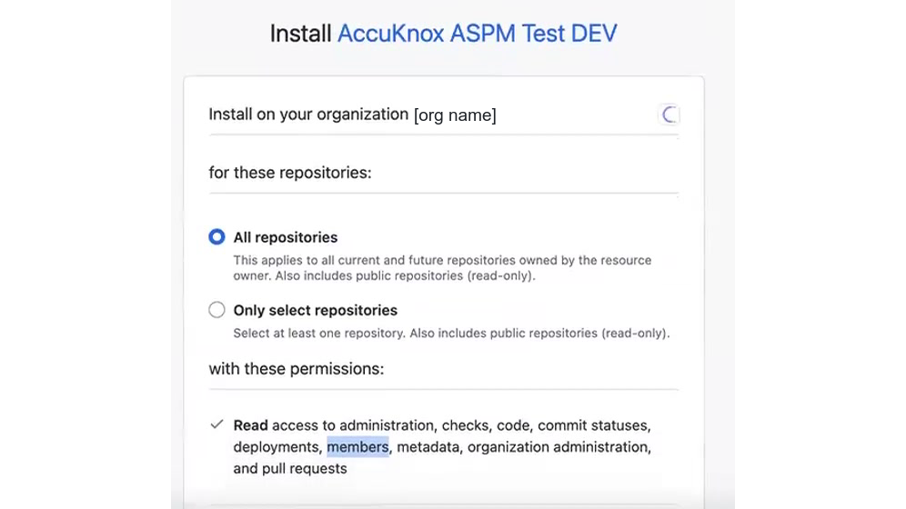{ width="560" }

Once connected, the connection appears under **Settings → Integrations → Code Source Configuration**, where you can manage every source you have linked and see its status at a glance.

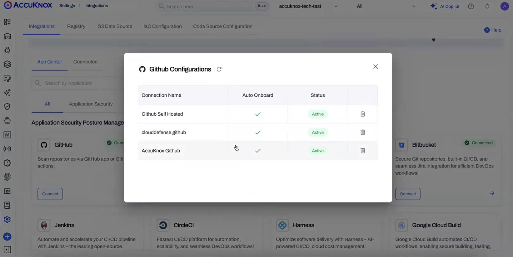

Everything after this point happens on the AccuKnox platform. There is no scan step to maintain in your CI/CD, and no runner to install in your repositories. If you already run scans through a pipeline, you can keep that option. The results land on the same dashboard either way.

[Set up Source Code Security →](/how-to/code-source-onboarding/)

!!! note "Supported sources"
    GitHub, GitLab, and Bitbucket use the same connect-and-scan flow. When you remove a connection from AccuKnox, the app still exists on your source code manager, so uninstall it there as well if you want to fully revoke access.

### Configure Scans per Repository and Branch

After a source is connected, a short setup wizard walks you through **Connect → Repo & Branches → Scan**. For each repository and branch you pick exactly which scan types to run.

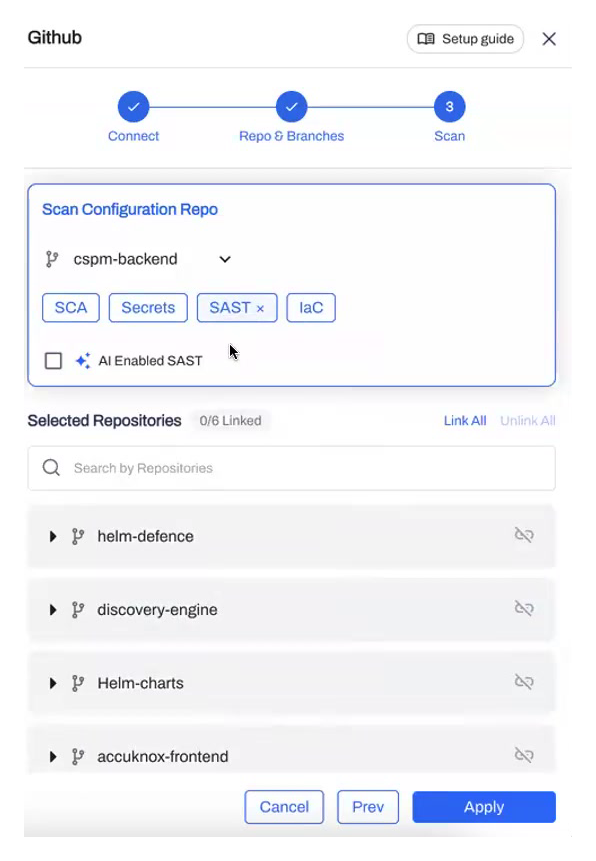{ width="420" }

Phase 1 supports four scan types:

| Scan type | What it checks |
|---|---|
| **SCA** | Open-source dependencies and their known vulnerabilities |
| **Secrets** | Hardcoded credentials, tokens, and keys in the codebase |
| **SAST** | Insecure code patterns in your source |
| **IaC** | Misconfigurations in infrastructure-as-code, by framework |

Select **AI Enabled SAST** to add AI-assisted analysis on top of the standard static scan.

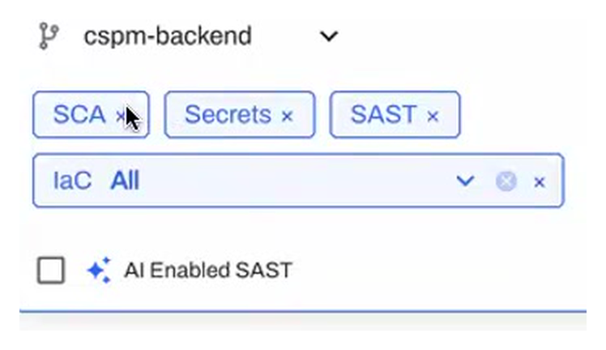{ width="520" }

Scan choices are made per branch, so you can, for example, run the full set on `main` and a lighter set on feature branches.

### Automatic Repository Sync

New repositories can flow into AccuKnox without you re-configuring the connection.

- If the app has access to **all repositories**, a daily sync picks up any repository created in the last 24 hours and makes it available for scanning.
- If the app is scoped to **selected repositories only**, new repositories are not pulled in automatically, since you have limited what the app can see. Add them by editing the connection.
- For real-time updates, a webhook can notify AccuKnox the moment a repository or branch changes, so new work becomes scannable immediately instead of on the next sync.

The same behavior applies across GitHub, GitLab, and Bitbucket.

### Scheduled and On-Demand Scans

Every configured repository runs on a **daily scheduled scan**. You can also trigger an **on-demand scan** whenever you need fresh results, scoped to a specific repository and branch rather than everything at once.

Expand a repository to see its branches, the current severity breakdown, and a per-branch scan action.

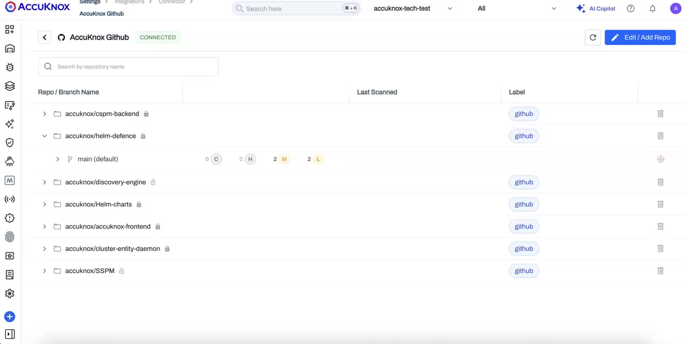

### Secrets Detection with Precise Deep-Links

Secret findings now point to the exact place the secret was found: the repository, the branch, the file path, and the precise line and column range.

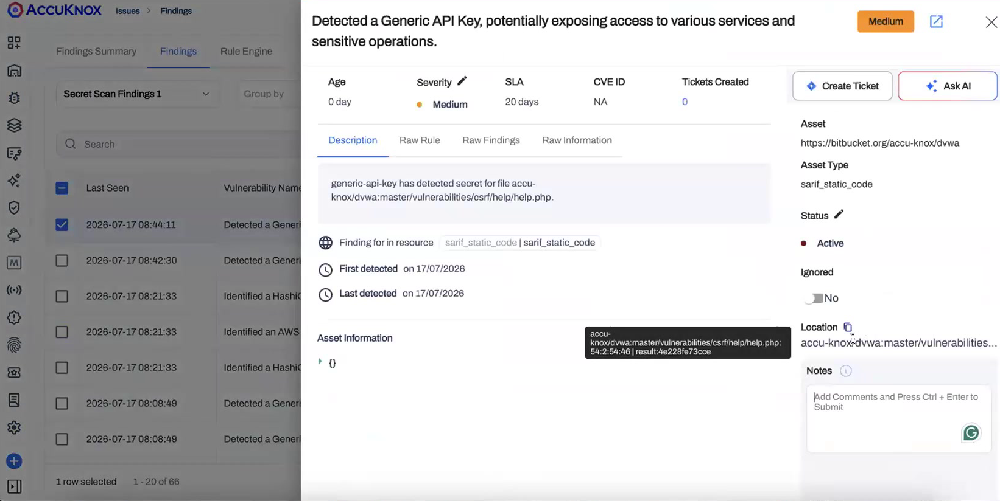

The location resolves down to the character range within the file, not just the file name, which makes it fast to open the finding at the right line in your source code manager.

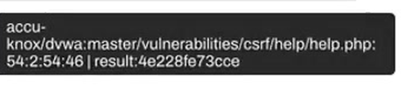

This is a direct improvement over the older secret-scan links, where findings could only point you to a file or a commit and left you to search for the actual line.

### ASPM Dashboard for Application Findings

Application security findings roll up into the ASPM view on the dashboard. Set the dashboard filter to **ASPM** to see IaC findings trends, top findings by count, findings by framework, the most vulnerable repositories, findings by severity, and the files with the most findings.

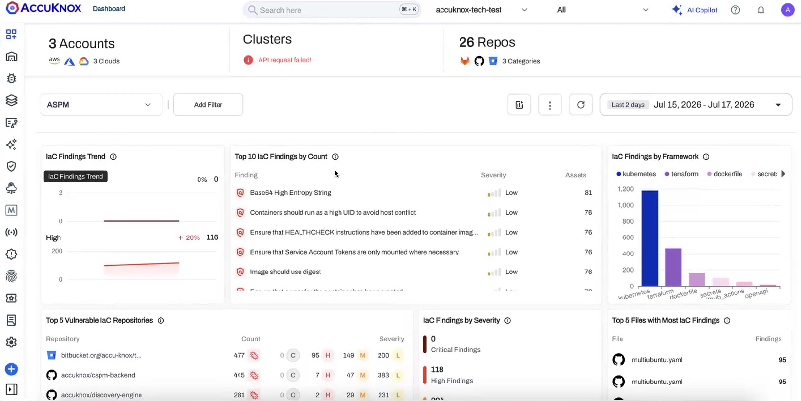

### Choose Your Scan Token

For AI-enabled scanning you decide whose token is used. Under your **tenant profile** you can run scans with the **AccuKnox-managed token** or supply **your own token**. Use your own when you want the scan to run under your organization's account and quota.

---

## Coming Next

The v3.7 source code flow is the foundation for several capabilities already in progress:

- **Quality Gates.** Pass or fail a change against your security thresholds. Quality gates apply wherever the work happens, whether it is triggered from the app or from CI/CD. **PR decoration** and **IDE integration** are planned alongside them.
- **Repository labels and groups.** Organize and filter repositories by label and group. Backend support exists. The configuration surface is planned for a later phase.
- **Asset inventory for repositories.** Connected repositories will surface in the revamped asset inventory next to the rest of your assets.
- **More scan types.** SBOM, CBOM, and container image scanning join the source code flow after the initial four scan types.

!!! note "Consolidation"
    The separate IaC integration entry is being folded into the unified Source Code experience so that source code analysis reads as one path. Existing IaC configurations continue to work during the transition.

<!--
## Pending Stakeholder Input

Confirm each item before this page is published. Source for most items: the Oct 5 walkthrough, the Oct 9 sprint demo, and the V3.7 Release Highlights tracker in Confluence.

Cloud
- **GCP impersonation.** Confirm the exact connection-method label for a standalone project, and whether to say that no service account key is needed. Add a screenshot of the client email step.
- **CIEM at onboarding.** Enabling CIEM and AI Security together at onboarding was a known bug on Oct 5, with a hotpatch pending. It is left out. Add it only after the hotpatch is confirmed on demo. Add screenshots of the toggle and of Identities, CIEM.
- **Account names.** A screenshot needs account names that are safe to show. The recording lists real account IDs.

Kubernetes and containers
- **Scan Running Images and cluster onboarding.** Add screenshots of the checkbox and the token toggle. On Oct 5 the "just scan running images" option may misbehave in this release.
- **Registry regex.** Add example patterns after the team confirms the regex syntax the scanner accepts.
- **Windows and node targeting.** Confirm where the toleration is set (Helm chart values) and the supported cluster types. The Oct 9 demo ran on a hybrid cluster and the tracker names a hybrid AKS cluster.

Findings and workflow
- **Status history export.** Deployment to demo was not confirmed on Oct 5. Add a screenshot of the CSV column.
- **Asset Rule Engine.** The tracker flags blocking issues. Confirm the final list of conditions before publication.
- **Job and parser status.** Add a screenshot of the Event Trail view.

Access
- **Groups.** The read and write toggle exists in the UI but does not change access yet, so it is not described. How a group overrides a custom RBAC role is also left out. Add screenshots of the group form and the user invite flow.

xBOM
- **Scope.** Oct 5 says QBOM, AIBOM, CBOM, and HBOM generate through KnoxCTL only. The Oct 9 notes say AIBOM and HBOM are not yet supported in the classifier mapping. Confirm which types ship.
- **Dashboard.** The new xBOM dashboard (active findings by severity, riskiest project, license mix) was demoed on Oct 9 and is not described here. Add it once it ships and has a screenshot.
- **Version history.** Findings lifecycle for repeated uploads is handled, but the version history is not in the UI yet.
- **Open bugs from Oct 9.** CBOM file-type detection on upload, the CBOM compare filter, and the hidden dependency graph.

AI Security
- **AI Gateway.** Tags are mandatory today and may become optional. Add a screenshot of the integration commands. The virtual key must be masked first.
- **Custom policies.** The policy was reverted and re-pushed on demo on Oct 9. Confirm it ships in v3.7.
- **AI tool allow-list.** A customizable block message is planned and is not described.

Left out on purpose
- Findings page V3, because it is not merged.
- Customer names from the demo recordings.
- The CI quality gate demo, which is an internal workflow.
- Bring Your Own Model for the AI Gateway, which is on the roadmap and not in v3.7.

Source code security
- **Production app name.** Install and uninstall screenshots show "AccuKnox ASPM Test DEV" from the dev environment. Replace with the production app name.
    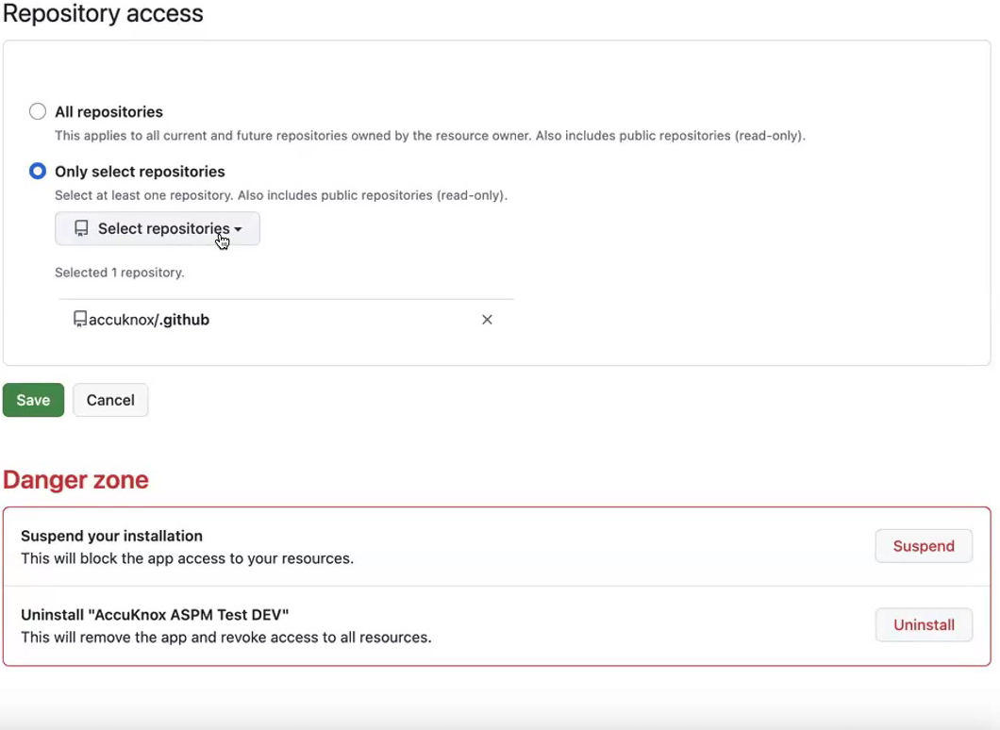
- **GitLab and Bitbucket.** Confirm they ship with GitHub, or add a phase note.
- **Quality Gates.** Confirm whether they land in v3.7 or a point release before you move them out of "Coming Next".
- **Token configuration.** Confirm the exact path for choosing the scan token and add a screenshot.
- **Webhook setup.** Confirm whether the customer configures it or AccuKnox does.
- **How-to page.** Review `how-to/code-source-onboarding.md` against the shipped flow.
-->

AccuKnox v3.7 cuts setup work across the platform. Connect your cloud, clusters, and code with fewer steps, then decide who sees what and which AI tools your teams can use.
