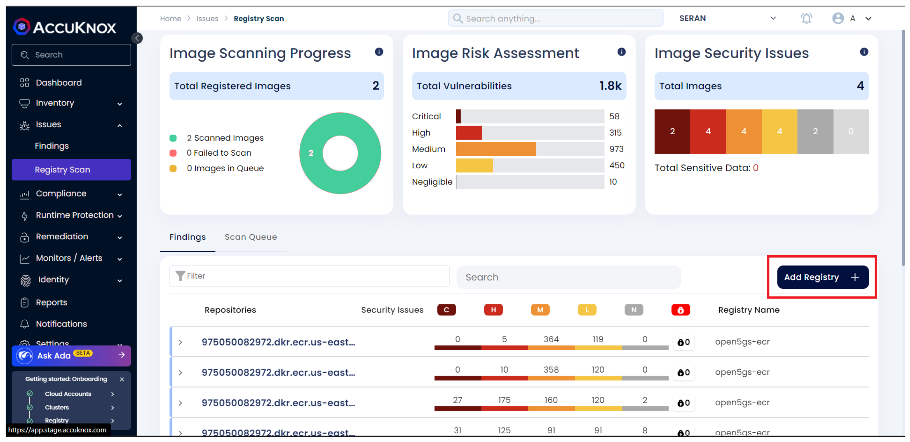
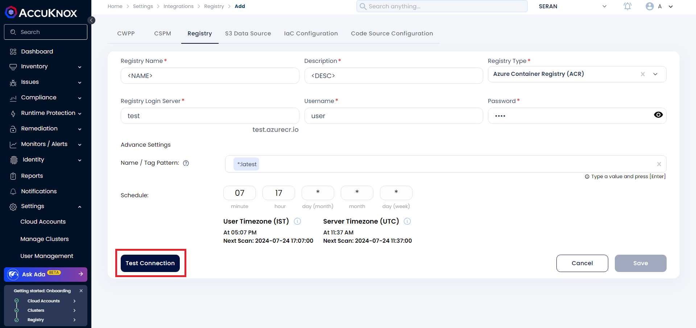

---
hide:
  - toc
---

## ACR Onboarding

Accuknox CSPM security tool scans images that are present in the onboarded [Azure Container Registry](https://learn.microsoft.com/en-us/azure/container-registry/) and has the capability to find the risks and vulnerabilities associated with these images. The risks are identified and shown in the scan results.
Users will be getting a comprehensive view of these risks and vulnerabilities in the dashboard along with their remediation.

### **Steps to generate credentials for onboarding ACR**

**Step 1:** Open the Azure Management Console and sign in with your Azure account credentials. Search for the **Container Registry** service in the search bar.

**Step 2:** Click on the name of the registry to be onboarded. In the navigation menu for the container registry, click on **Access Keys** under the Settings section.

**Step 3:** Click on the **Admin User** checkbox to activate Admin access. 

Copy the generated **Login Server**, **Username** and **Password** for onboarding on AccuKnox SaaS.

### **Steps to onboard the registry on AccuKnox SaaS**

**Step 1:** Login to the AccuKnox SaaS and Navigate to Issues → Registry Scan. Click on **Add Registry**

**Step 2:** Enter any Registry Name and Description. Select Registry Type as ACR and paste the Login Server, Username and Password that was copied.

Click on **Test Connection** and then click on the enabled **Save** button

**Step 3:** A popup appears that the registry is added on successful onboarding. Navigate to Issues → Registry Scan to view the scan results. The status of the scan can be checked from the **Scan Queue** tab

- - - 
[SCHEDULE DEMO](https://www.accuknox.com/contact-us){ .md-button .md-button--primary }