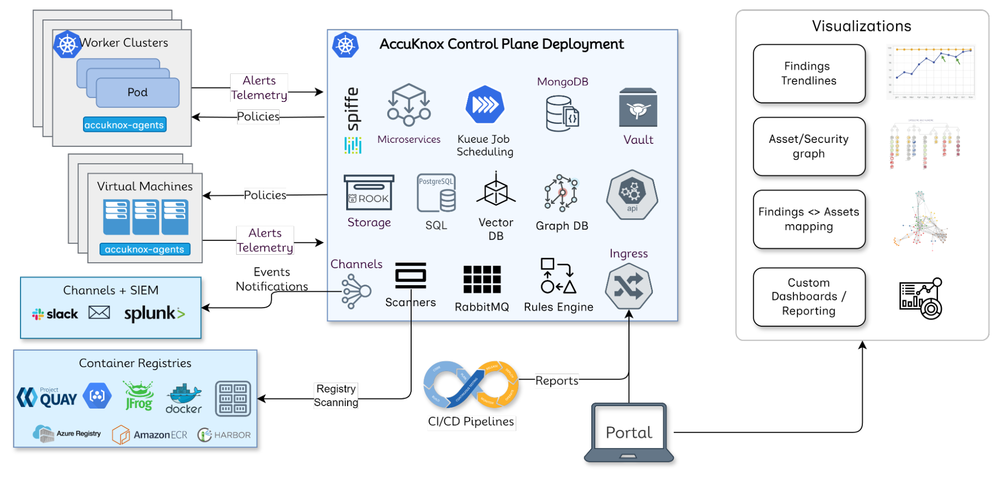

# AccuKnox Architecture Overview

## Control Plane Architecture

**Key Components**

1. Playbook job scheduling: Microservices (Divy), Kueue scheduler, Celery tasks
2. Parser jobs for asset + findings database
3. Alerts and telemetry handling via RabbitMQ
4. SPIFFE-based secure cluster onboarding
5. Storage layer: RDS, MongoDB, Neo4j
6. External integrations & triggers handling

## Cloud Architecture

- SaaS and On-Prem support identical services (except AskADA AI Copilot – SaaS only)
- Tenant-level feature control
- Models:
  1. SaaS: AWS-managed (Aurora, S3)
  2. On-Prem: Full in-cluster setup (for air-gapped environments)
  3. Externalized: Uses customer DB/storage

## Externalized Storage Architecture

- Supports deployments with customer-managed storage
- Enables hybrid cloud use cases
- Flexible DB integration (e.g., existing RDS, MongoDB, etc.)

## On-Premises Deployment Architecture

- K8s-native deployment
- No reliance on AWS managed services
- Designed for high-security & compliance environments

[Deployment Details →](./images/deep-arch/https://help.accuknox.com/getting-started/deployment-models/)

## Scaling Considerations

### Key Choke Points

1. **Playbook Jobs**: One AWS account = 272 jobs across regions
      - Kueue ensures tenant-aware resource allocation
2. **Parser Jobs**: Celery tasks parse reports & update DB
3. **Telemetry Overload**: Managed via thresholds & redirection to SIEM

### Noisy Neighbor Mitigation

- Celery replicated per tenant (currently manual)
- Kueue isolates playbook jobs per tenant
- RMQ overload handled by telemetry offload

## Log & Data Storage

- **RDS**: CSPM, KSPM, ASPM (per-tenant tables)
- **MongoDB**: Telemetry logs (per-tenant collections)
- **Neo4j**: GraphDB for metadata (KIEM), expanding to assets/findings in v3.0

## Customer Data Flow

1. Playbook execution (on-prem or SaaS)
2. Report generated (assets/findings JSON)
3. Sent to control plane via Artifact API (token-based)
4. Saved in S3 + Celery task triggered
5. Celery pulls from S3 and parses
6. DB + Graph updated
7. UI fetches via Divy APIs

## Rules Engine Architecture

- Parser emits events → Rules Engine evaluates
- Tenant-specific rule specs evaluated
- Actions (e.g., notifications, tickets) sent as Celery tasks
- Fully asynchronous, scalable via queues

## Integrations Architecture

- **CLI-based**: TruffleHog, Sonarqube, Trivy, Zap, Kubebench
- **API-based**: Checkmarx, Nessus
- **SIEM**: One-way push (e.g., Splunk, Sentinel)
- **Ticketing**: Bidirectional (e.g., Jira, ServiceNow)

**Integration Timelines**

- CLI-based: 1 sprint
- API-based: 2–3 weeks
- SIEM: 1 sprint
- Ticketing: 3–5 sprints

[Explore Integrations →](/integrations/)