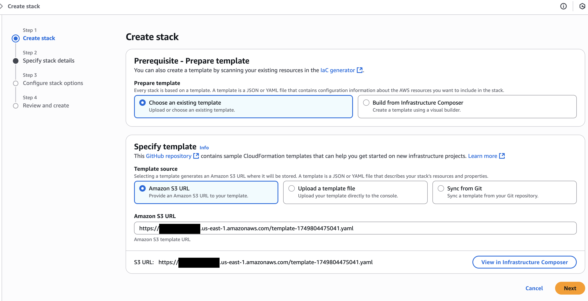
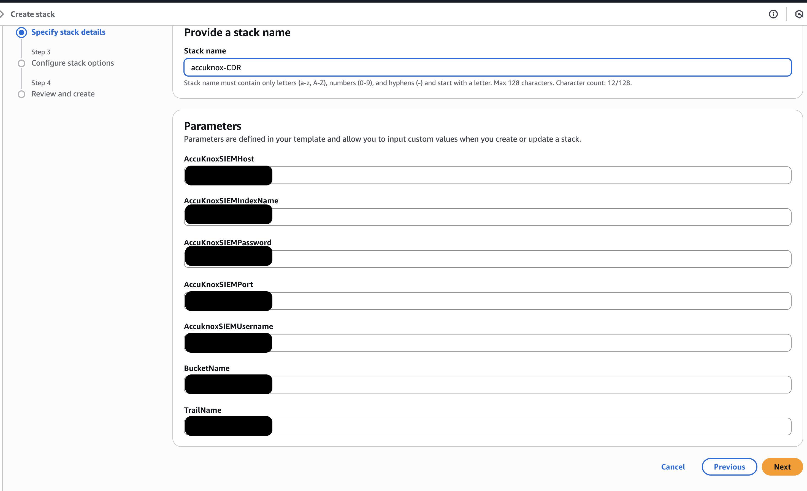
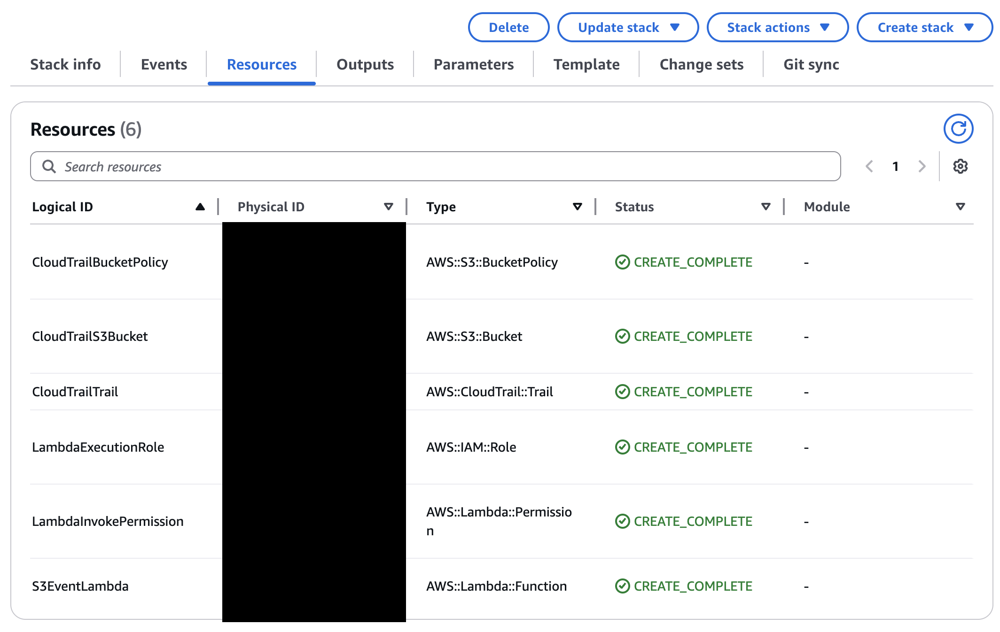

# **AccuKnox CDR for AWS**

## **Introduction**
Accuknox CDR for AWS is deployed using CloudFormation scripts, the script deploys the following resources:

| Resource    | Purpose |
| :-------- | :------- |
| S3 bucket | Stores Cloudtrail logs |
| CloudTrail Trail | Provides a record of user activity and API calls within an AWS account |
| Lambda function | Pushes CloudTrail logs to AccuKnox |

If you already have an S3 bucket containing cloudTrail Trail logs we will provide you with a CloudFormation script to use the already existent bucket.

The CloudFormation script will be provided to you by AccuKnox team in the onboarding phase.

## **Prerequisites**
Before deploying the CloudFormation scripts the following parameters are required:

|Parameter|Purpose|Provided by AccuKnox|
|---|---|:---:|
|BucketName| The name of the S3 bucket to be created by the script| :material-close: |
|TrailName| The name of CloudTrail Trail| :material-close: |
|AccuknoxSIEMUsername|AccuKnox SIEM ingestion user| :material-check: |
|AccuKnoxSIEMPassword|AccuKnox SIEM ingestion password| :material-check: |
|AccuKnoxSIEMHost|AccuKnox SIEM instance| :material-check: |
|AccuKnoxSIEMPort|AccuKnox SIEM instance port| :material-check: |
|AccuKnoxSIEMIndexName|AccuKnox SIEM index name| :material-check: |
|AccuKnoxSIEMExporterImage|Accuknox SIEM exporter Image| :material-close:  Infered during the setup phase|

The ECR repository for `AccuKnoxSIEMExporterImage` needs to be created in AWS. The image will be pushed in the next step.
## **Setup**

To setup the integration please follow the steps below

### **Step 1: Lambda docker container**

Before running the CloudFormation script you need to push `AccuKnox SIEM exporter Image` to your private ECR registry in the same region you are deploying the CloudFormation in.
This image is required by the lambda function.

We assume that you are logged in to your ECR instance.

Please set the values of `AWS_ACCOUNT_ID` and `AWS_REGION` before running the script

```bash
TAG="v1.0.4"
AWS_ACCOUNT_ID="<aws_account_id>"
AWS_REGION="<aws_region>"
AccuKnoxSIEMExporterImage="$AWS_ACCOUNT_ID.dkr.ecr.$AWS_REGION.amazonaws.com/default/accuknox-siem-cloudtrail:$TAG"

docker pull "public.ecr.aws/k9v9d5v2/accuknox-siem-cloudtrail:$TAG"
docker tag "public.ecr.aws/k9v9d5v2/accuknox-siem-cloudtrail:$TAG" "$AccuKnoxSIEMExporterImage"
docker push "$AccuKnoxSIEMExporterImage"

echo "AccuKnoxSIEMExporterImage=$AccuKnoxSIEMExporterImage"
```

!!! note "Important"
    The value of `AccuKnoxSIEMExporterImage` is printed at the end of the script, please save it as it is needed in the next step

### **Step 2: CloudFormation Script**

In this step we assume that you have an AWS console access and have already stored the CloudFormation script share by AccuKnox in an S3 bucket.

1. Create a stack using the script that you have uploaded in the S3 bucket


2. Configure the stack name and parameters then deploy


3. Check that the stack is successfully deployed


## **Next Steps**

Now the integration is completed and you should start seeing alerts in AccuKnox SaaS as they araise.
