# **Azure Account onboarding**
In this section we can find the steps to onboard an Azure cloud account to the AccuKnox SaaS platform

## **Rapid Onboarding (via Azure)**

For Azure Onboarding it is required to register an App and giving Security read access to that App from the Azure portal.

**Step 1:** Go to your Azure Portal and search for *App registrations* and open it

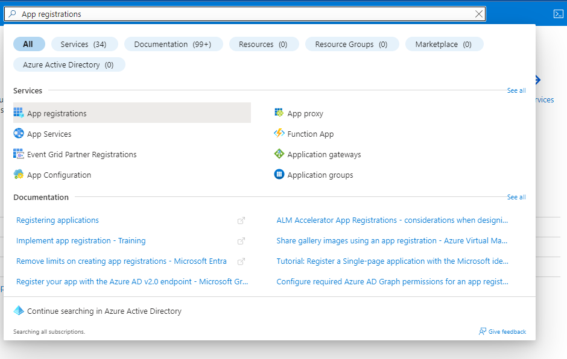

**Step 2:** Here click on *New registration*

**Step 3:** Give your application a name, remember this name as it will be used again later, For the rest keep the default settings

**Step 4:** Now your application is created,  save *Application ID* and *Directory ID* as they will be needed to for onboarding on Accuknox Saas and then click on ‘Add a certificate or secret’

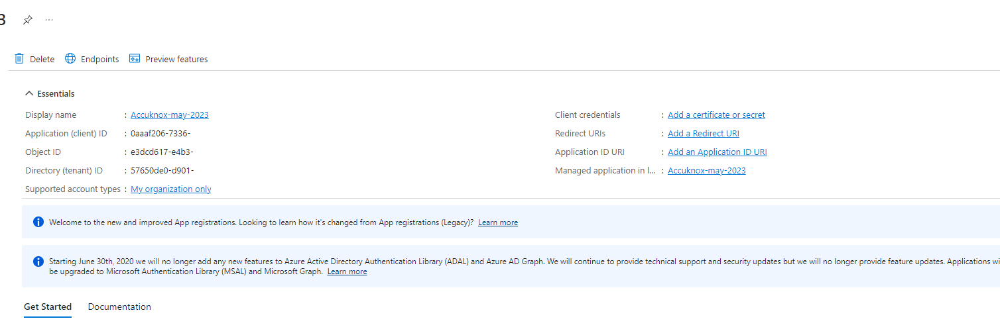

**Step 5:** Click on new client secret and enter the name and expiration date to get *secret id* and *secret value*, save this secret value as this will also be needed for onboarding.

**Step 6:** Next, go to *API permissions* tab and click on 'Add  permission'

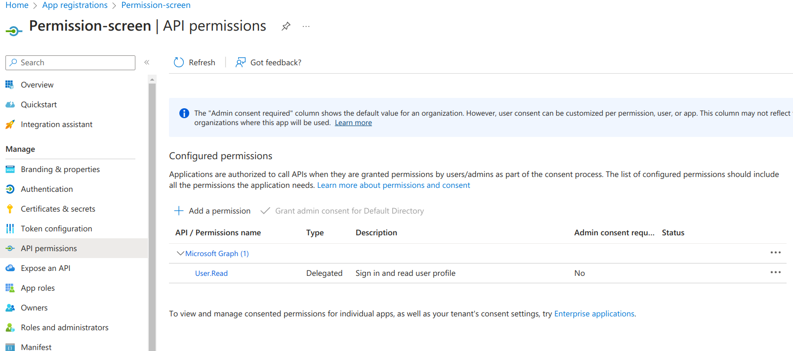

**Step 7:** On the screen that appears, click on 'Microsoft Graph'

**Step 8:** Next, select Application Permissions and then search for Directory.Read.All and click on Add permissions

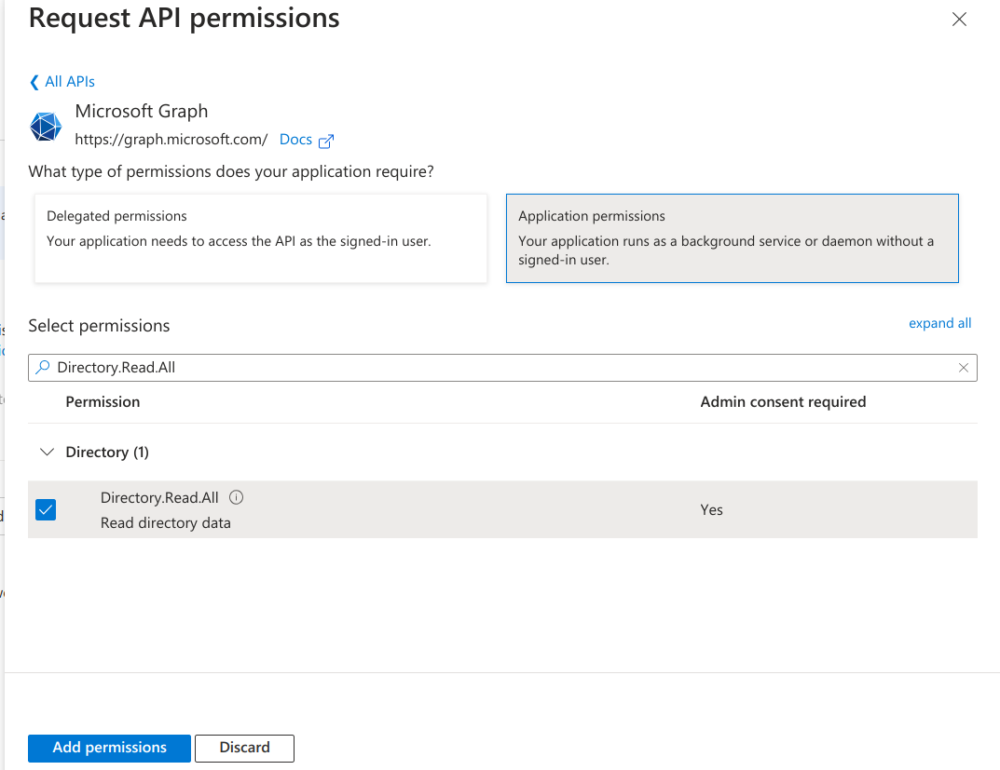

**Step 9:** Select ‘Grant Admin Consent’ for Default Directory and click on ‘Yes’

**Step 10:** Now we need to give Security read permissions to this registered Application , to do that go to subscriptions

**Step 11:** First save the subscription ID and click on the subscription name , here it is “Microsoft Azure Sponsorship“

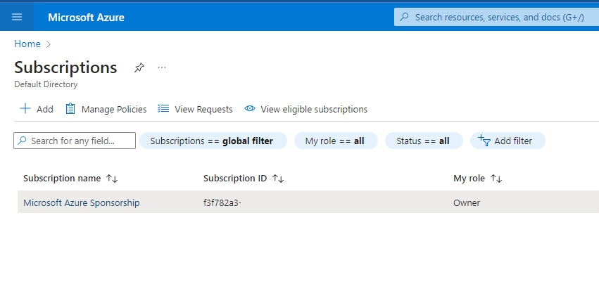

**Step 12:** Navigate to Access control(IAM) and go to Roles , here select Add and Add role assignment

**Step 13:** Search for “Security Reader” Job function Role, select it and press *next*

**Step 14:** In the member section click on Select *members* it will open a dropdown menu on the right hand side

**Step 15:** Here search for the Application that you registered in the beginning , select the application and click on *review and assign*.

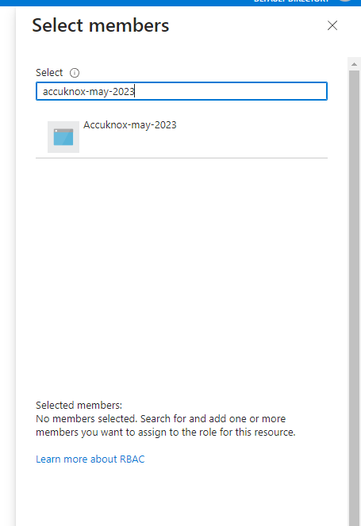

**Step 16:** Similarly, we have to add another role. This time, search for *Log Analytics Reader*. Select it and click *next*

**Step 17:** Now, click on *Select members*, select the application that was created similar to the previous role. Finally, click on *Review and Assign*.

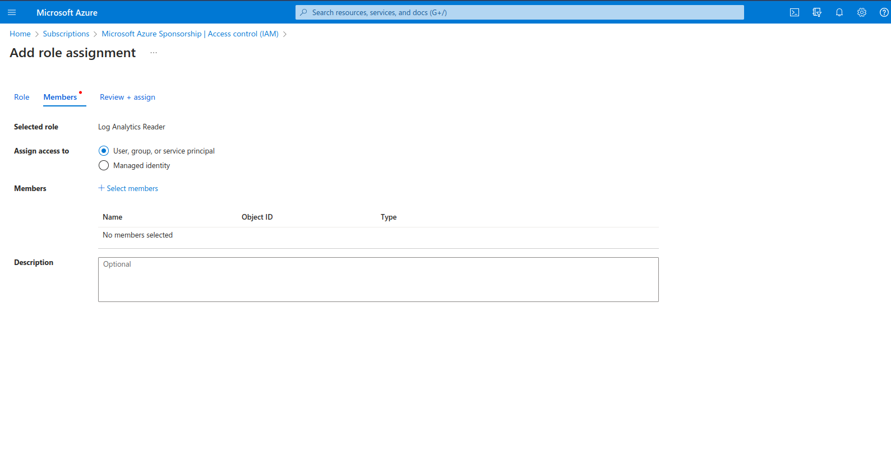

## **From AccuKnox SaaS UI**

Configuring your Azure cloud account is complete, now we need to onboard the cloud account onto Accuknox Saas Platform.

**Step 1:** Go to settings→ Cloud Account and click on Add Account

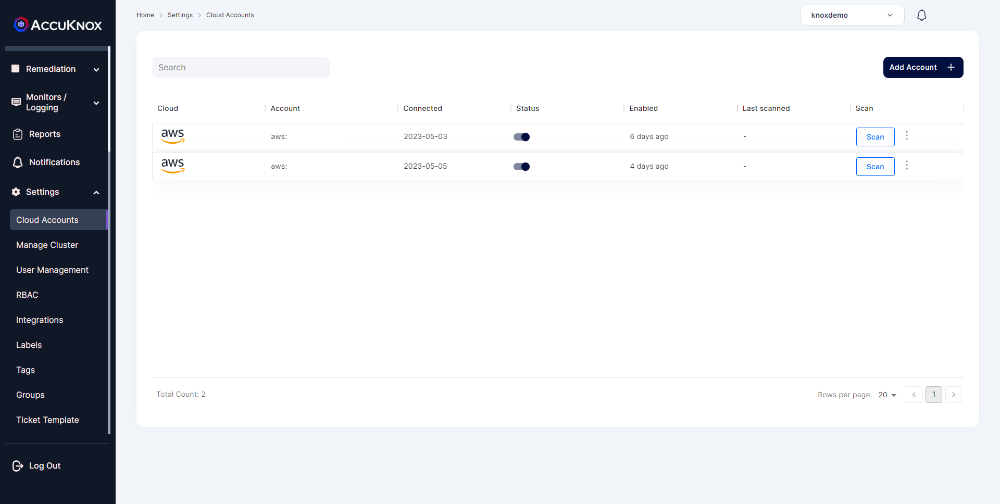

**Step 2:** Select Microsoft Azure as Cloud Account Type

**Step 3:** Select or create label and Tags that will be associated with this Cloud Account

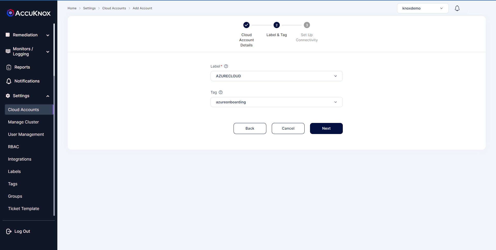

**Step 4:** Enter the details that we saved earlier during the steps for app registration and subscription id from subscriptions in azure portal and click on connect

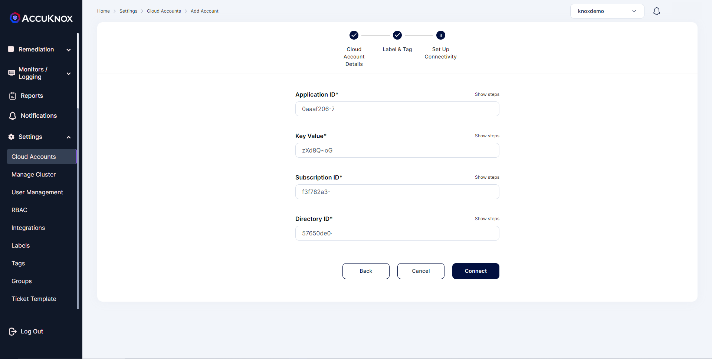

**Step 5:** After successfully connecting your cloud account will show up in the list

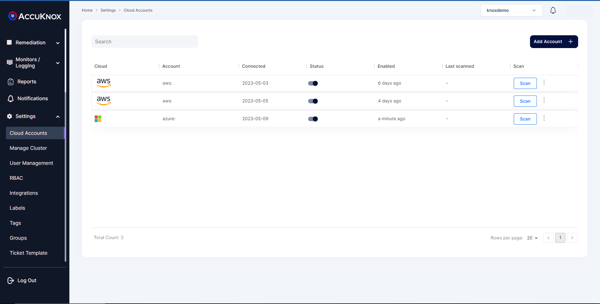

- - -
[SCHEDULE DEMO](https://www.accuknox.com/contact-us){ .md-button .md-button--primary }