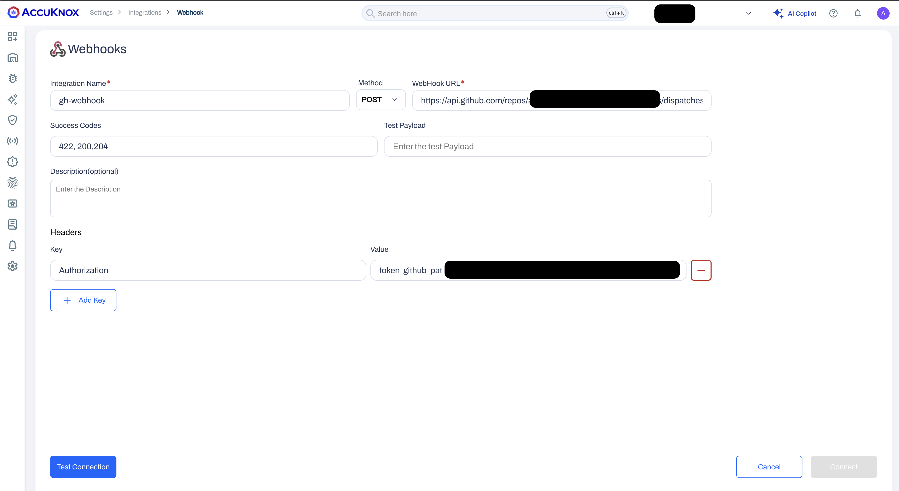

# AccuKnox CDR Alert Remediation Setup

!!! note "Onboarding Steps"
    For Onboarding steps for AWS, Azure and GCP please refer to the following links:

    - [AWS CDR Setup](/getting-started/aws-cdr)
    - [Azure CDR Setup](/getting-started/azure-cdr)
    - [GCP CDR Setup](/getting-started/gcp-cdr)


To remediate alerts the user need to provision the following:

## **Step 1: Cloud Access**

Cloud access for the target cloud accounts needs to be provisioned as defined by the table below

|Cloud|Required access|Type|
|:--:|:--|--|
| AWS | AdministratorAccess |IAM access keys|
| GCP | Owner | Service Account keys|
| Azure | Subscription Owner | Service Principal secrets|

## **Step 2: Github Repository**

### Github action setup

You need to provision a github repository that will serve as the CDR workflow runner.

The cloud access keys configured in the previous step needs to be made available as github secrets. Storing cloud access credentials as variables in the workflow is not a secure practice.

The github repositry needes to have the following github action implemented

```

name: AWS Remediation
on:
  repository_dispatch:
    types: [accuknox-webhook]

jobs:
  remediate:
    runs-on: ubuntu-latest
    container:
      image: public.ecr.aws/k9v9d5v2/cdr/accknox-cdr-remediation:latest
      env:
        CLIENT_PAYLOAD: ${{ toJSON(github.event.client_payload) }}

    steps:
      - name: Accuknox CDR action
        uses: accuknox/cdr-remediation@v0.0.4
        with:
          AWS_ACCESS_KEY_ID: ${{ secrets.AWS_ACCESS_ID }}
          AWS_SECRET_ACCESS_KEY: ${{ secrets.AWS_SECRET_KEY }}
          GOOGLE_CREDENTIALS: ${{ secrets.GCP_SA_KEY }}
          AZURE_CLIENT_ID: ${{ secrets.AZURE_CLIENT_ID }}
          AZURE_CLIENT_SECRET: ${{ secrets.AZURE_CLIENT_SECRET }}
          AZURE_TENANT_ID: ${{ secrets.AZURE_TENANT_ID }}

```

The above example assumes that we are protecting AWS, GCP and Aure environments using the same repository


### Github Fine Grained Access Token

A github fine grained access token is required with the following permissions:

- Contents (R/W)
- Metadata (R)

## **Step 3: Accuknox Integration**

AccuKnox will be triggering the github action configured above via webhook calls to the github apis.
For that we need to build the webhook url.

The webhook url can be built as follow: `https://api.github.com/repos/<github_org_name>/<github_repository_name>/dispatches`.
where:

- **github_org_name**: The users' github organization
- **github_repository_name**: The github repositry configured in the second step

Once you have built the webhook url, please connect to your AccuKnox portal follow the below steps:

- Under `Settings` select `Integration`
- In the `CWPP` menu scroll down to the `Notification` section and select `Webhook`

The webhook will expect the following inputs:

- **Integration Name**: User defined name for the integration
- **Method**: Should be set to POST
- **Webhook URL**: The webhook url built at the start if this step
- **Success Codes**: Should be set to `200,204,422`
- **Test Payload**: (optional) Can be left empty
- **Description**: (optional) User defined description for the integration
- **Headers**: An authorization header is required to authenticate against github api's. The authorization header follows this format:
    - `Authorization: token <github_token>`
    - `Accept: application/vnd.github+json`

where **github_token** is the github fine-grained access token created on step 2.



Now we can test and save our integration

## **Next Steps**

Your AccuKnox Point of Contact will guide via the next steps.