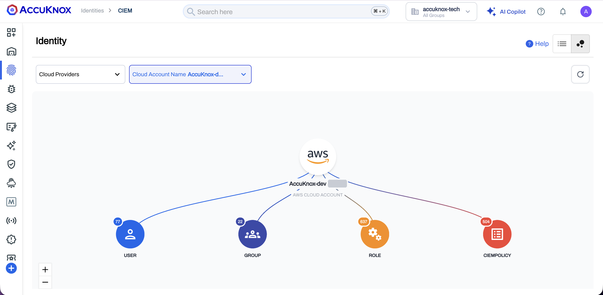
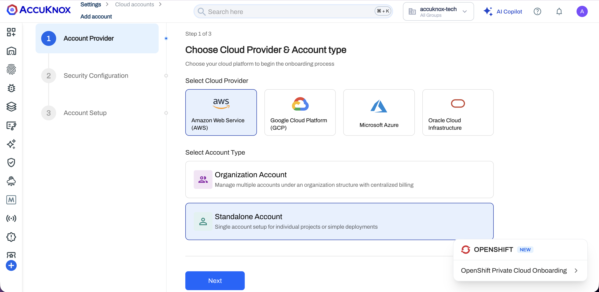
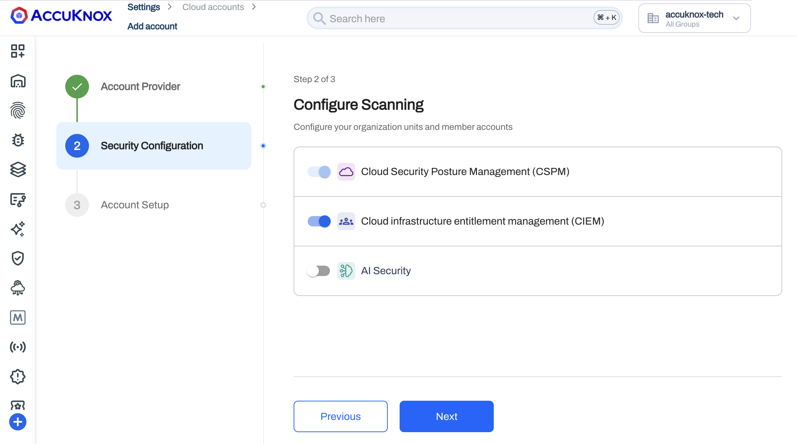
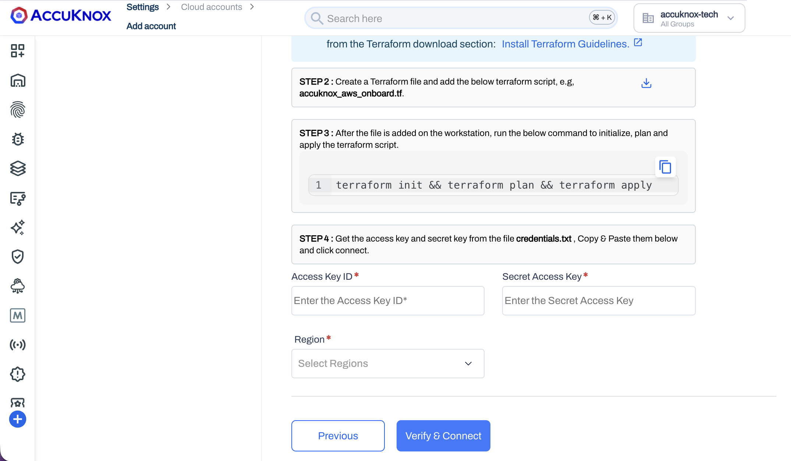
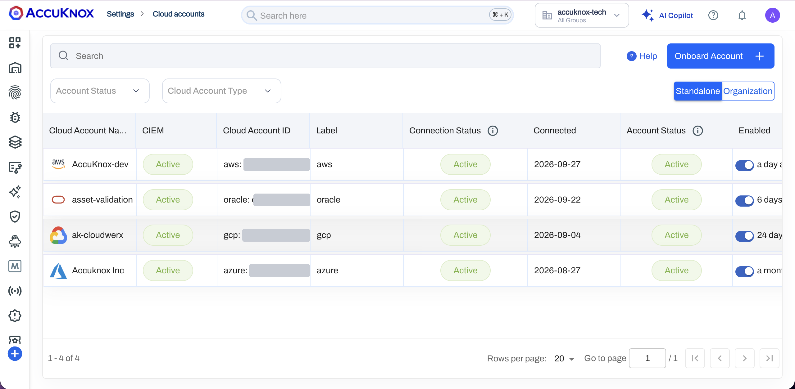
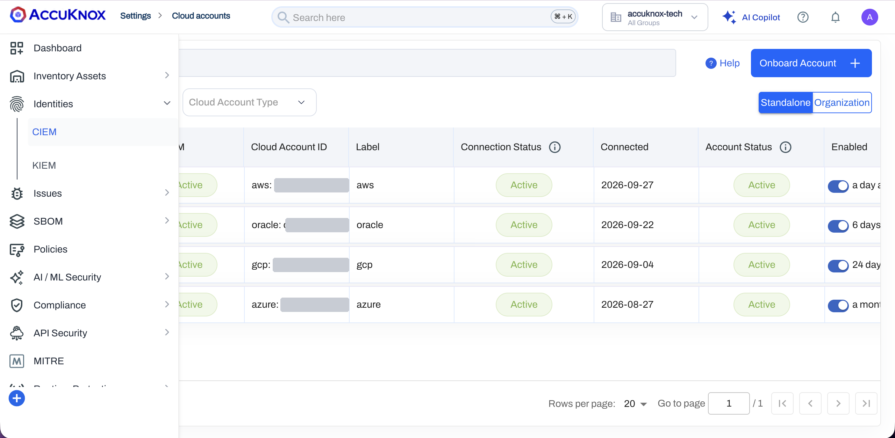
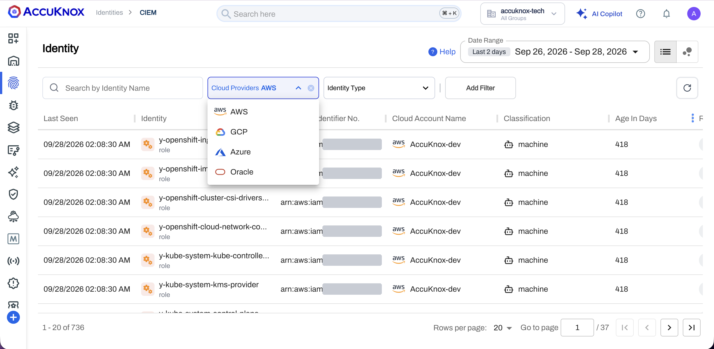

# Onboard a Cloud Account for CIEM

!!! info "Coming soon"
    CIEM releases soon in a newer version of AccuKnox. The screens on this page come from the current build and can change before the release.

Turn on CIEM when you onboard a cloud account, then open **Identities > CIEM** to see the account's users, groups and roles. For what CIEM shows, see the [CIEM overview](ciem-overview.md).



## Before You Begin

| Item | Requirement |
|---|---|
| Account type | A standalone AWS, GCP, Azure or OCI account. CIEM does not support organization accounts yet |
| Cloud-side setup | The prerequisites for your cloud in [AWS](../how-to/aws-onboarding.md), [GCP](../how-to/gcp-onboarding.md), [Azure](../how-to/azure-onboarding.md) or [Oracle](../how-to/oracle-onboarding.md) onboarding |
| Terraform | Terraform on your workstation, for the AWS script step |
| AccuKnox console | [confirm the AccuKnox user role that can onboard a cloud account] |

## Enable CIEM When You Onboard the Account

1. **Start the onboarding.** Go to **Settings > Cloud Accounts** and select **Onboard Account**.

2. **Choose the provider and the account type.** In **Step 1 of 3**, select your cloud provider. Select **Standalone Account**, then select **Next**.

    

3. **Keep CIEM turned on.** In **Step 2 of 3, Configure Scanning**, the **Cloud infrastructure entitlement management (CIEM)** toggle is on by default. Select **Next**.

    

    !!! tip "Onboard without CIEM"
        Turn the CIEM toggle off in this step to onboard the account without CIEM.

4. **Connect the account.** In **Step 3 of 3, Account Setup**, follow the setup for your cloud. On AWS, the setup runs a Terraform script.

    1. Install Terraform from the link **Install Terraform Guidelines**.
    2. Download the Terraform script. Save the script as a file, for example `accuknox_aws_onboard.tf`.
    3. In the folder that holds the file, initialize, plan and apply the script.

        ```bash
        terraform init && terraform plan && terraform apply
        ```

    4. Open the file `credentials.txt` that Terraform creates. Paste the access key into **Access Key ID** and the secret key into **Secret Access Key**.
    5. Select the **Region**, then select **Verify & Connect**.

    

    For GCP, Azure and OCI, follow the **Account Setup** in the console and the onboarding guide for your cloud. [confirm the Account Setup steps for GCP, Azure and OCI with CIEM turned on]

## Confirm That CIEM Is Active

1. Go to **Settings > Cloud Accounts**. The **CIEM** column shows **Active** for the new account.

    

2. In the left navigation, go to **Identities > CIEM**.

    

3. Select your cloud in the **Cloud Providers** filter. The list shows the identities of the new account. [confirm how long the first collection takes]

    

To read the list, the identity panel and the graphs, see the [CIEM overview](ciem-overview.md).
