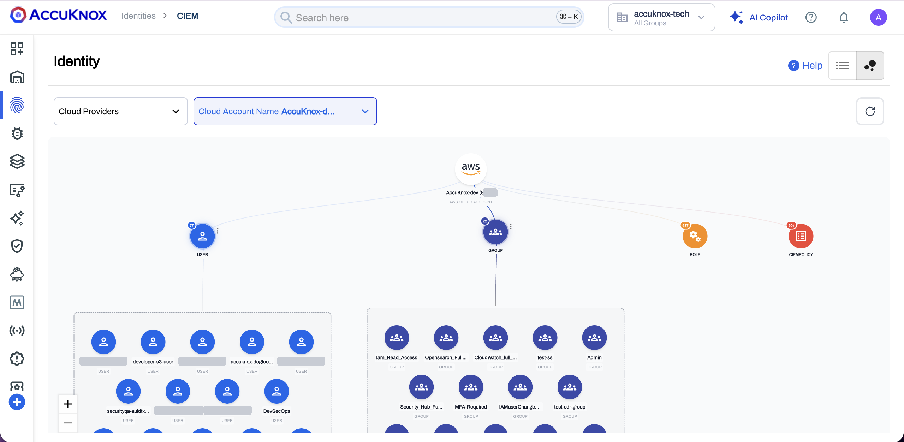
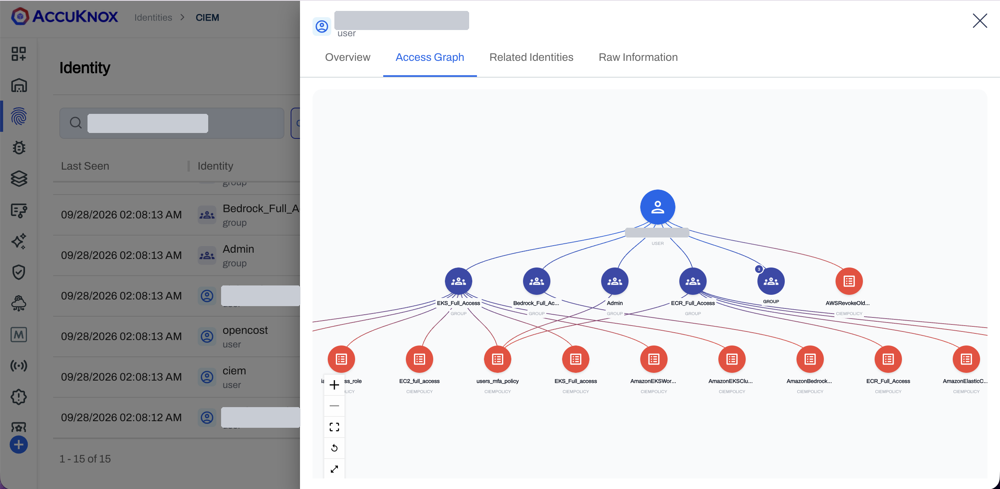
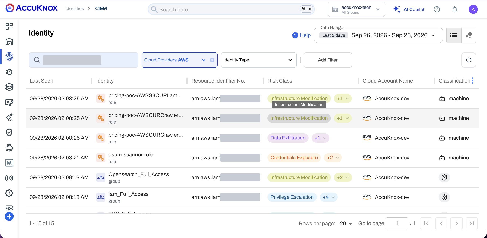
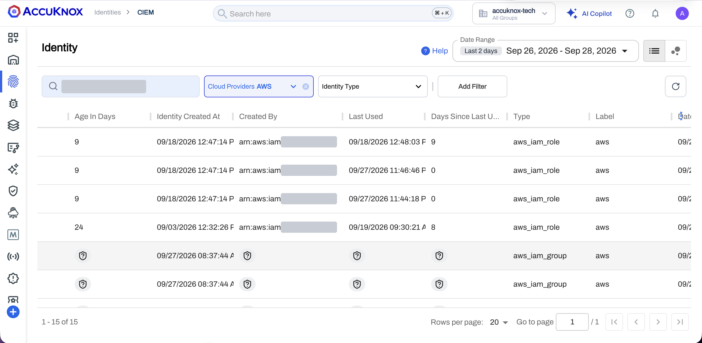
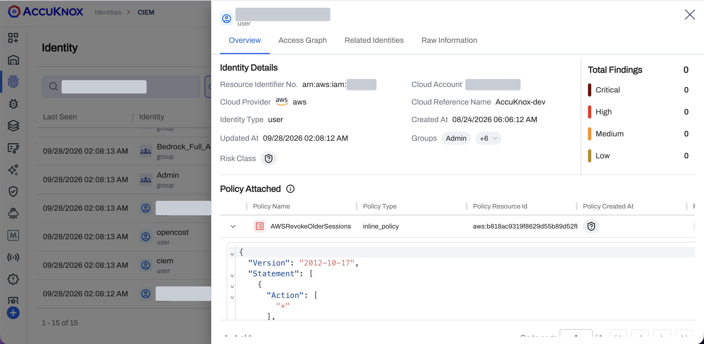
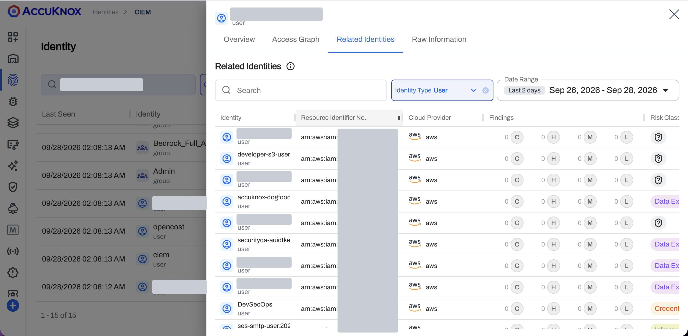
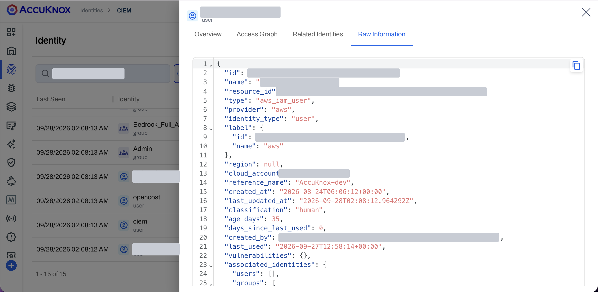

# Cloud Infrastructure Entitlement Management

!!! info "Coming soon"
    CIEM releases soon in a newer version of AccuKnox. The screens on this page come from the current build and can change before the release.

AccuKnox Cloud Infrastructure Entitlement Management (CIEM) lists the users, groups and roles in your AWS, GCP, Azure and Oracle cloud accounts. For each identity, CIEM shows the attached policies, the risk classes those policies carry, and the last time the identity was used. The access graph draws the chain from an identity through its groups to its policies. To turn on CIEM for a cloud account, see [Onboard a Cloud Account for CIEM](ciem-onboarding.md).

=== "Organization Graph"

    

    - The cloud account sits at the top. The user, group, role and policy nodes carry a count badge.
    - Select a node to expand its members. Select a member to open its access graph.

=== "Identity Graph"

    

    - The identity sits at the top, its groups in the middle, and the policies each group grants at the bottom.
    - A policy attached straight to the identity sits in the same row as the groups.

!!! warning "Standalone accounts only"
    CIEM supports standalone cloud accounts today. Organization accounts are not supported yet.

## CIEM Covers Four Clouds and Three Identity Types

| Item | What CIEM does |
|---|---|
| Clouds | AWS, GCP, Azure and Oracle Cloud Infrastructure (OCI) |
| Identity types | Users, groups and roles |
| Classification | Each identity is human or machine. A CI/CD pipeline account is a machine identity |
| Policies | CIEM reads the policies attached to each identity from the cloud account, with the policy type and the policy ID |
| Risk classes | CIEM calculates the risk classes from the attached policies. Examples are Privilege Escalation, Data Exfiltration, Credentials Exposure and Infrastructure Modification |
| Where to find it | **Identities > CIEM** in the left navigation |

## The Identity List Shows Who Holds Access

Go to **Identities > CIEM**. The list view opens by default. Use the two icons at the top right to switch between the list view and the graph view.

Filter the list with **Search by Identity Name**, **Cloud Providers**, **Identity Type**, **Add Filter** and **Date Range**. A risk class chip with **+1** or **+2** hides more risk classes. Open the chip to see them all.

| Column | What it shows |
|---|---|
| Last Seen | [confirm what Last Seen records] |
| Identity | The identity name, and its type: user, group or role |
| Resource Identifier No. | The cloud-specific ID. An ARN on AWS, the service account ID on GCP, and the OCID on OCI. [confirm the Azure identifier format] |
| Risk Class | The risk classes from the attached policies |
| Cloud Account Name | The cloud account that holds the identity |
| Classification | Human or machine |

Scroll the table to the right for the lifecycle columns.

| Column | What it shows |
|---|---|
| Age In Days | The days since the identity was created |
| Identity Created At | The creation time |
| Created By | The user or account that created the identity |
| Last Used | The last time the identity was active |
| Days Since Last Used | The days since the last use. A value of 0 means the identity was used today |
| Type | The cloud resource type, such as `aws_iam_role` or `aws_iam_group` |
| Label | The label of the cloud account |

## An Identity's Overview Lists Its Policies

Select an identity in the list. A panel opens with four tabs: **Overview**, **Access Graph**, **Related Identities** and **Raw Information**.

**Identity Details** shows the resource ID, cloud provider, identity type, cloud account, cloud reference name, creation and update times, groups and risk class. **Total Findings** counts the findings on the identity by severity: Critical, High, Medium and Low.

**Policy Attached** lists each policy with its name, type, resource ID and creation time. Expand a policy row to read the policy document as JSON. A policy has one of three types.

| Policy type | Source |
|---|---|
| Cloud managed | A policy the cloud provider maintains |
| Inline policy | A policy embedded in one identity. The console shows it as `inline_policy` |
| User managed | A policy your team created |

## The Access Graph Traces an Identity to Its Policies

Open the **Access Graph** tab. The graph reads from top to bottom: the identity, the groups it belongs to, and the policies each group grants. A policy attached straight to the identity sits beside the groups. The graph shows which permissions reach the identity and through which group.

Use the controls at the lower left of the graph to zoom in, zoom out, fit the graph to the panel, reset the layout and expand to full screen.

## Related Identities List the Rest of the Cloud Account

Open the **Related Identities** tab. The tab lists the other identities in the same cloud account. The identity you opened is not in the list.

Filter by **Identity Type** and **Date Range**. Each row shows the resource ID, the cloud provider, the finding counts for Critical, High, Medium and Low, and the risk class.

## Raw Information Holds the Full Identity Record

Open the **Raw Information** tab to read the identity record as JSON. Use the copy icon at the top right to copy the record.

The record holds the same fields as the list and the Overview tab, including `classification`, `age_days`, `days_since_last_used`, `created_by`, `last_used` and `associated_identities`.

## The Organization Graph Shows Every Identity in an Account

Select the graph icon at the top right of **Identities > CIEM**. Filter by **Cloud Providers** and **Cloud Account Name**.

The cloud account node sits at the top, with one node each for users, groups, roles and policies. The badge on each node is the count. In the sample AWS account, the badges read 77 users, 22 groups, 637 roles and 504 policies. Select a node to expand its members, then select a member to open that identity's access graph.

!!! warning "Known issue"
    On some cloud accounts, the access graph of an identity does not populate. [confirm the workaround and the fix release before publishing]
