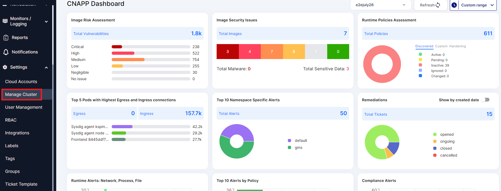
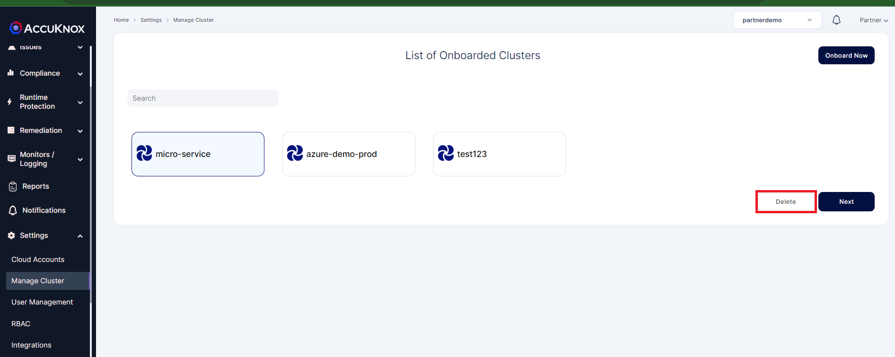

# **Cluster Offboarding**

In the below section you can find the detailed steps to be followed for Agent uninstallation from your cluster CLI and Deleting cluster from Accuknox SaaS.
The given steps are common for all  AKS, EKS, GKE and unmanaged Clusters.

**Agents Uninstallation**

Uninstall Accuknox agents using the following commands:

```sh
      helm uninstall -n accuknox-agents  accuknox-agents
      kubectl delete ns accuknox-agents
```
Sample:

```sh
      cloudshell:~ (centering-study-396808)$  helm uninstall -n accuknox-agents  accuknox-agents
      release "accuknox-agents" uninstalled
      cloudshell:~ (centering-study-396808)$ kubectl delete ns accuknox-agents
      namespace "accuknox-agents" deleted
```

**Cluster Deletion**

**Step 1:** Login to Accuknox SaaS and Go to Manage Cluster under Settings



**Step 2:** Select the cluster and click Delete to delete the cluster from SaaS.




  - - -
[SCHEDULE DEMO](https://www.accuknox.com/contact-us){ .md-button .md-button--primary }
