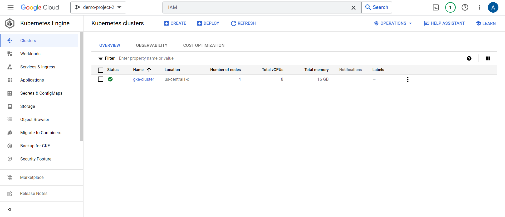
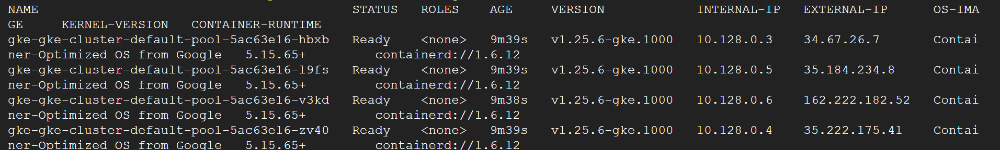
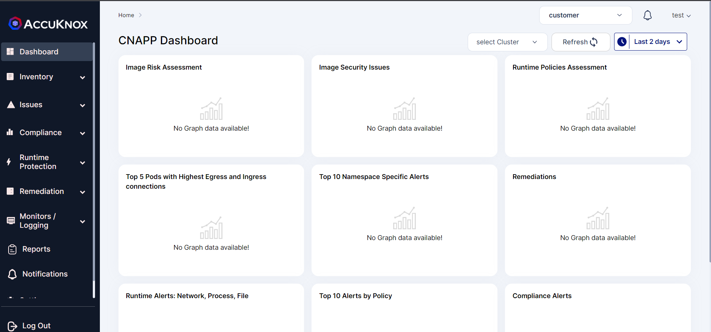
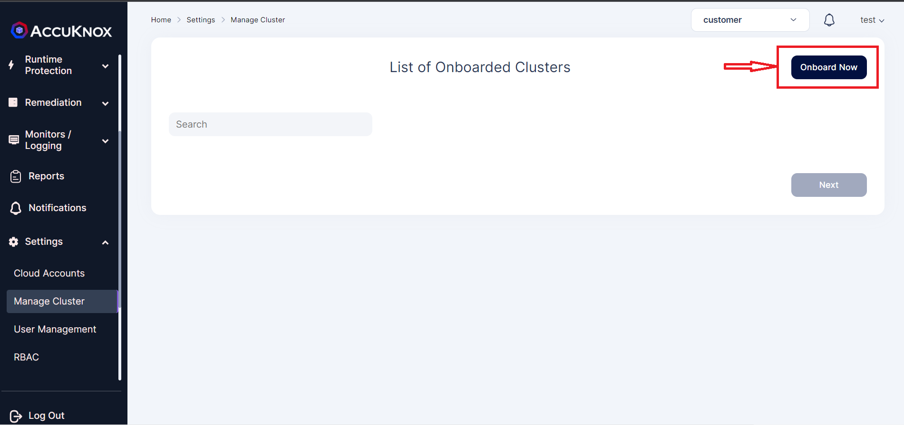
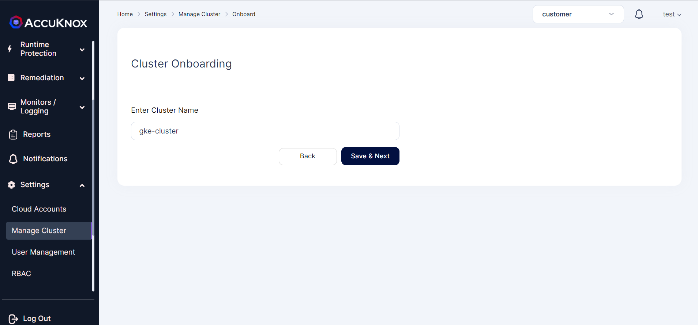
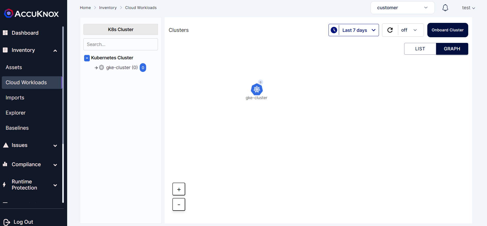
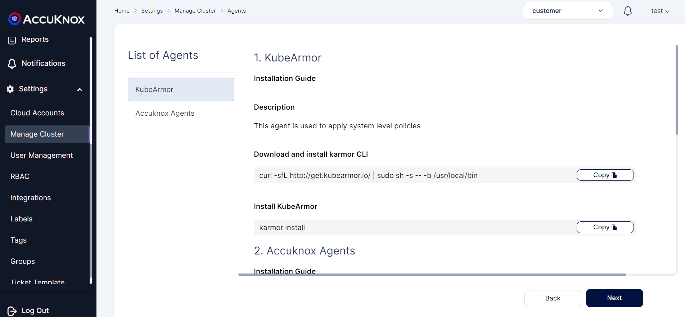
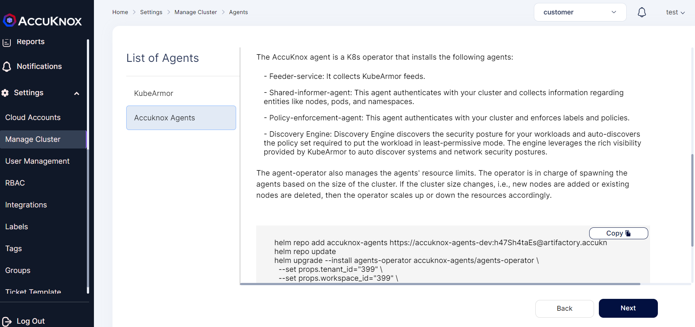
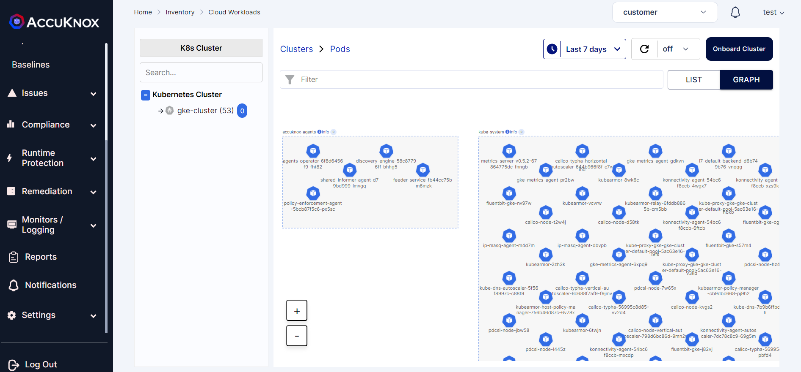

# **Managed Cluster Onboarding**

Below shown image is the GKE cluster running with Google Container optimized Operating System.







We can onboard this managed cluster by following the steps shown below:

**Step 1:** After signing up, user will be taken to CNAPP dashboard. Since there is no cluster or cloud account onboarded widgets will not have any data.




**Step 2:** Navigate to *Manage Cluster from Settings Tab*. From this page we can onboard the clusters running in various cloud platforms like GCP,AWS and Azure. We can also onboard unmanaged cluster set up locally in the on-premise environment or virtual machines. To onboard cluster select onboard now option




**Step 3:** In this screen, give any name to the cluster that you are going to onboard now.




**step 4:** Onboarded Cluster without AccuKnox agents:

The onboarded cluster’s workload details will not be visible as we have not installed AccuKnox agents. So next we will be installing AccuKnox agents.




**Step 5:** Installing KubeArmor and AccuKnox agents:

We are going to install KubeArmor and AccuKnox-agents to connect to the AccuKnox SaaS application.

**Step 5.1:** KubeArmor Installation:

**KubeArmor:**

KubeArmor is a cloud-native runtime security enforcement system that restricts the behavior (such as process execution, file access, and networking operation) of containers and nodes at the system level. With KubeArmor, a user can:

+ Restrict file system access for certain processes

+ Restrict what processes can be spawned within the pod

+ Restrict the capabilities that can be used by the processes within the pod

KubeArmor differs from seccomp-based profiles, wherein KubeArmor allows to dynamically set the restrictions on the pod. With seccomp, the restrictions must be placed during the pod startup and cannot be changed later. KubeArmor leverages Linux Security Modules (LSMs) to enforce policies at runtime.




KubeArmor is installed using the following commands:


```sh
>> curl -sfL http://get.kubearmor.io/ | sudo sh -s -- -b /usr/local/bin
>> karmor install
```

Sample Output:

```sh
***********@cloudshell:- (smooth-zenith-382113)$ curl -sfL http://get.kubearmor.io/ | sudo sh s b /usr/local/bin
kubearmor/kubearmor-client info checking GitHub for latest tag
kubearmor/kubearmor-client info found version: 0.12.4 for v0.12.4/linux/amd84
kubearmor/kubearmor-client info installed /usr/local/bin/karmor
***********@cloudshell:- (smooth-zenith-382113)$ karmor install
Auto Detected Environment : gke
CRD kubearmorpolicies.security.kubearmor.com
CRD kubearmorhostpolicies.security.kubearmor.com
Service Account
Cluster Role Bindings
KubeArmor Relay Service
KubeArmor Relay Deployment
KubeArmor DaemonSet - Init kubearmor/kubearmor-init:stable, Container kubearmor/kubearmor:stable-gRPC=22767
KubeArmor Policy Manager Service
KubeArmor Policy Manager Deployment
KubeArmorrHost Policy Manager Service
KubeArmor Host Policy Manager Deployment
KubeArmor Annotation Controller TLS certificates
KubeArmorrAnnotationgcontroller Deployment
KubeArmorrAnnotationgcontroller Service
KubeArmor Annotation Controller Mutation Admission Registration
Done Installing RubeArmor
Done Checking tALL Services are\running!
Execution Time : 43.880558117s
```

**Step 5.2:** AccuKnox-Agents installation:

After installing KubeArmor we are going to install AccuKnox Agents in the cluster.

**AccuKnox Agents:**

**1.KubeArmor:** KubeArmor is a cloud-native runtime security enforcement system that restricts the behavior (such as process execution, file access, and networking operation) of containers and nodes at the system level. KubeArmor dynamically set the restrictions on the pod. KubeArmor leverages Linux Security Modules (LSMs) to enforce policies at runtime.

**2.Feeder Service:** It collects the feeds from kubeArmor and relays to the app.

**3.Shared Informer Agent:** It collects information about the cluster like pods, nodes, namespaces etc.,

**4.Policy Discovery Engine:** It discovers the policies using the workload and cluster information that is relayed by a shared informer Agent.



AccuKnox Agents can be installed using the following command:


```sh
    helm upgrade --install accuknox-agents oci://public.ecr.aws/k9v9d5v2/accuknox-agents \
      --version "v0.2.6" \
      --set joinToken="***********-***********-***********" \
      --set spireHost="spire.demo.accuknox.com" \
      --set ppsHost="pps.demo.accuknox.com" \
      --set knoxGateway="knox-gw.demo.accuknox.com:3000" \
      -n accuknox-agents --create-namespace
```

Sample Output:

```sh
***********@cloudshell:- (smooth-zenith-382113)$     helm upgrade --install accuknox-agents oci://public.ecr.aws/k9v9d5v2/accuknox-agents \
      --version "v0.2.6" \
      --set joinToken="***********-***********-***********" \
      --set spireHost="spire.demo.accuknox.com" \
      --set ppsHost="pps.demo.accuknox.com" \
      --set knoxGateway="knox-gw.demo.accuknox.com:3000" \
      -n accuknox-agents --create-namespace
"accuknox-agents" has been added to your repositories
Hang tight while we grab the latest from your chart repositories...
...Succssfully got an update from the "accuknox-agents" chart repository
Update Complete. *Happy Helming!*
Release "agents-operator" does not exist. Installing it now.
NAME: agents-operator
LAST DEPLOYED: Wed Mar 29 14:41:20 2023
NAMESPACE: accuknox-agents
STATUS: deployed
REVISION: 1
TEST SUITE: None
```

**Note:** In the above command joinToken is specific to this example and it will vary based on the cluster

**Step 6:** After installing all the AccuKnox agents the cluster is onboarded successfully into the SaaS application. We can see the workload details of the onboarded cluster by Navigating to Inventory→cloud Workloads option




  - - -
[SCHEDULE DEMO](https://www.accuknox.com/contact-us){ .md-button .md-button--primary }
