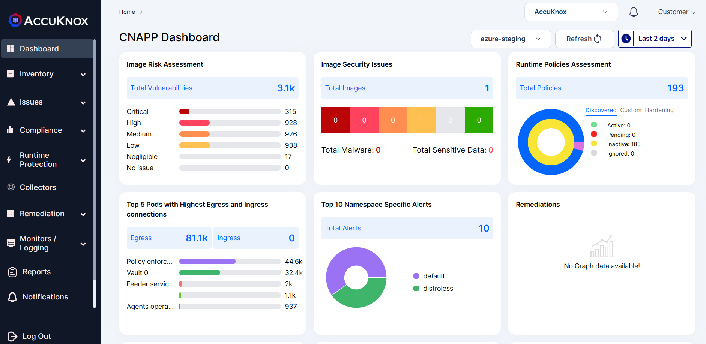
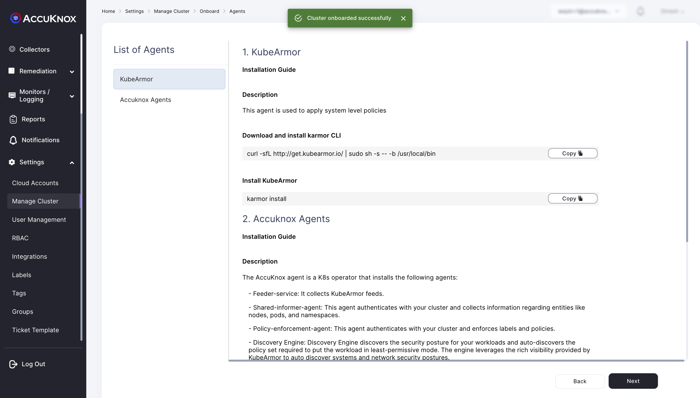

# **Unmanaged cluster Onboarding**

Below shown image is from an unmanaged k3s cluster running in local machine with Ubuntu 22.04 Operating System. We can onboard this umanaged cluster by following the steps shown below


**Step 1:** As a first time user, the management console will show up the CNAPP dashboard without any data mentioned in widgets, since the cloud account and cluster onboarding is not done.



**Step 2:** Navigate to Manage Cluster from Settings Tab:
From this page we can onboard the clusters running in various cloud platforms like GCP,AWS and Azure. We can onboard locally setup cluster using an unmanaged cloud option. To onboard cluster select *onboard now* option


**Step 3:** In this screen, give any name to the cluster that you are going to onboard now.


**Step 4:** Onboarded Cluster without AccuKnox agents:

The onboarded cluster’s workload details will not be visible as we have not installed AccuKnox agents. So next we will be installing AccuKnox agents.


**Step 5:** Installing KubeArmor and AccuKnox agents:

We are going to install KubeArmor and AccuKnox-agents to connect to the AccuKnox SaaS application.

**Step 5.1:** KubeArmor Installation:

**KubeArmor:**

KubeArmor is a cloud-native runtime security enforcement system that restricts the behavior (such as process execution, file access, and networking operation) of containers and nodes at the system level. With KubeArmor, a user can:

+ Restrict file system access for certain processes

+ Restrict what processes can be spawned within the pod

+ Restrict the capabilities that can be used by the processes within the pod

KubeArmor differs from seccomp-based profiles, wherein KubeArmor allows to dynamically set the restrictions on the pod. With seccomp, the restrictions must be placed during the pod startup and cannot be changed later. KubeArmor leverages Linux Security Modules (LSMs) to enforce policies at runtime.



KubeArmor is installed using the following commands:

```bash
>> curl -sfL http://get.kubearmor.io/ | sudo sh -s -- -b /usr/local/bin
>> karmor install
```

Sample Output:

```sh
vagrant@master-node:-$ curl -sfl http://get.kubearmor.io/ | sudo sh -s -- -b /usr/local/bin
kubearmor/kubearmor-client info checking GitHub for latest tag
kubearmor/kubearmor-client info found version: 0.11.6 for v0.11.6/1inux/amd64
kubearmor/kubearmor-client info installed /usr/local/bin/karmor
vagrant@master-node:-$ karmor install
• Auto Detected Environment : k3s
• CRD kubearmorpolicies.security.kubearmor.com
• CRD kubearmorhostpolicies.security.kubearmor.com
• Service Account
• Cluster Role Bindings
• KubeArmor Relay Service
• KubeArmor Relay Deployment
• KubeArmor DaemonSetkubearmor/kubearmor:stable-gRPC.32767 -enablekubeArmorHostPolicy
• KubeArmor Policy Manager Service
• KubeArmor Policy Manager Deployment
• KubeArmor Host Policy Manager Service
• KubeArmor Host Policy Manager Deployment
• KubeArmor Annotation Controller TLS certificates
• KubeArmor Annotation Controller Deployment
• KubeArmor Annotation Controller Service
• KubeArmor Annotation Controller Mutation Admission Registration
• Done Installing KubeArmor
• Done Checking , ALL Services are running!
• Execution Time : 17.934890329s
vagrant@master-node:-$
```

**Step 5.2:** AccuKnox-Agents installation:

After installing KubeArmor we are going to install AccuKnox Agents in the cluster.

**AccuKnox Agents:**

1. **KubeArmor:**  KubeArmor is a cloud-native runtime security enforcement system that restricts the behavior (such as process execution, file access, and networking operation) of containers and nodes at the system level. KubeArmor dynamically set the restrictions on the pod. KubeArmor leverages Linux Security Modules (LSMs) to enforce policies at runtime.

2. **Feeder Service:** It collects the feeds from kubeArmor and relays to the app.

3. **Shared Informer Agent:** It collects information about the cluster like pods, nodes, namespaces etc.,

4. **Policy Discovery Engine:** It discovers the policies using the workload and cluster information that is relayed by a shared informer Agent.


AccuKnox Agents can be installed using the following command:

```bash
    helm upgrade --install accuknox-agents oci://public.ecr.aws/k9v9d5v2/accuknox-agents \
      --version "v0.2.6" \
      --set joinToken="***********-***********-***********" \
      --set spireHost="spire.demo.accuknox.com" \
      --set ppsHost="pps.demo.accuknox.com" \
      --set knoxGateway="knox-gw.demo.accuknox.com:3000" \
      -n accuknox-agents --create-namespace
```

Sample Output:

```sh
WARNING: Kubernetes configuration file is group-readable. This is insecure. Location: /home/vagrant/.kube/config
WARNING: Kubernetes configuration file is world-readable. This is insecure. Location: /home/vagrant/.kube/config
"accuknox-agents-dev" already exists with the same configuration, skipping
WARNING: Kubernetes configuration file is group-readable. This is insecure. Location: /home/vagrant/.kube/config
WARNING: Kubernetes configuration file is world-readable. This is insecure. Location: /home/vagrant/.kube/config
Hang tight while we grab the latest from your chart repositories...
...Successfully got an update from the "accuknox-agents-dev" chart repository
Update Complete. *Happy Helming!*
WARNING: Kubernetes configuration file is group-readable. This is insecure. Location: /home/vagrant/.kube/config
WARNING: Kubernetes configuration file is world-readable. This is insecure. Location: /home/vagrant/.kube/config
Release "agents-operator" does not exist. Installing it now.
NAME: agents-operator
LAST DEPLOYED: Mon Jan 30 10:22:37 2023
NAMESPACE: accuknox-agents S
TATUS: deployed
REVISION: 1
TEST SUITE: None
vagrant@master-node:-$
```

**Note:** In the above command **joinToken**  is specific to this example and it will vary based on the cluster

**Step 6:** Onboarded Cluster:

After installing all the AccuKnox agents the cluster is onboarded successfully into the SaaS application. We can see the workload details of the onboarded cluster by Navigating to Inventory→cloud Workloads option


  - - -
[SCHEDULE DEMO](https://www.accuknox.com/contact-us){ .md-button .md-button--primary }
