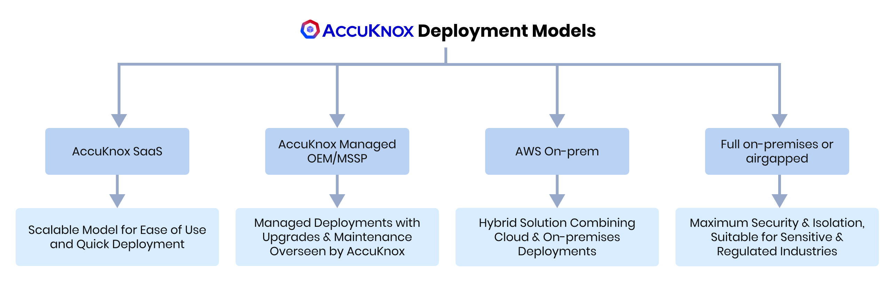

---
hide:
  - toc
---
# Deployment Models

AccuKnox has an expanded offering to cater to diverse deployment needs and preferences:

---

1. **AccuKnox SaaS** - This is our go-to mainstream offering designed for production environments. It provides seamless and scalable security solutions through a SaaS model, ensuring ease of use and quick deployment.

2. **AccuKnox Managed OEM/MSSP** - This model is tailored for managed deployments where AccuKnox oversees upgrades and maintenance while keeping the OEM/MSSP informed. This ensures that our partners, such as Xcitium, can rely on us for smooth operations and continuous improvements without losing control over the deployment.

3. **AWS On-prem** - In this deployment, we leverage managed services from AWS, including S3, RDS, and others, to provide a hybrid solution combining cloud and on-premises deployments. This setup ensures optimal performance and scalability while utilizing AWS's robust infrastructure.

4. **Full On-prem/Air-Gapped**-  For environments requiring maximum security and isolation, we offer full on-premises or air-gapped deployments. This ensures that all data and operations remain within the customer's premises, providing the highest level of control and security, suitable for sensitive and regulated industries.

By offering these diverse deployment options, you can choose the model that best fits your operational needs and security requirements.
