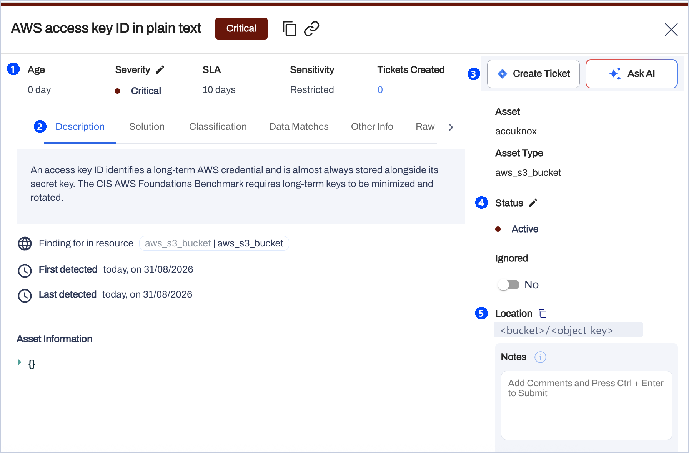
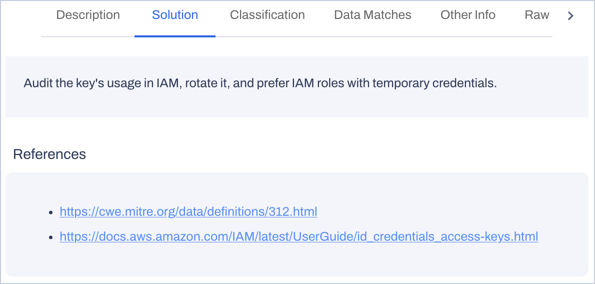

# Onboard the DSPM Scanner

You need one small VM in the region that holds the data, a read-only identity per data store, and an AccuKnox token. Most teams scan their first data store the same day the access is granted. For what the scanner covers, see the [DSPM overview](dspm-overview.md).

## Prerequisites

| Item | Requirement |
|---|---|
| Machine | 4 vCPU and 8 GB RAM scan any number of data stores one at a time. 8 vCPU and 32 GB RAM scan four in parallel. Linux with Docker or Podman, and about 20 GB of free disk for the image |
| Placement | One VM per region and network. Another AWS account or Azure subscription in the same region is another entry on the same VM |
| Inbound network | None. The VM accepts no connections |
| Outbound network | Port 443 to the AccuKnox console and the container registry. The database ports to the data subnets. An S3 gateway endpoint or storage private endpoints keep reads inside the region |
| Kubernetes instead of a VM | The deployment kit ships a CronJob manifest for EKS with IRSA or AKS with workload identity |
| AccuKnox console | The console URL, an [artifact token](../how-to/how-to-create-tokens.md), and a [label](../how-to/how-to-create-labels.md) per scanner instance |

### Grant Read-Only Access per Data Store

Every grant is read-only. The scanner has no code path that writes to a data store.

=== "AWS"

    | Data store | Identity | Grant |
    |---|---|---|
    | Amazon S3 | The VM's instance role, plus a read-only role in each data account that trusts it with an external ID | List and read objects. Decrypt through S3 for KMS-encrypted buckets. Limit the grant to the scanner's region |
    | DocumentDB | A read-only database user | Include the CA bundle for DocumentDB's mandatory TLS |

=== "Azure"

    | Data store | Identity | Grant |
    |---|---|---|
    | Blob Storage and ADLS Gen2 | The VM's managed identity, AKS workload identity, or an app registration | Storage Blob Data Reader on the storage account or resource group. Allow the scanner subnet in the storage firewall, or use a private endpoint |
    | Cosmos DB for NoSQL | The same Azure identity | Cosmos DB Built-in Data Reader, or the account's read-only key |
    | Cosmos DB for MongoDB | A read-only connection string | Read-only access |
    | Key Vault, optional | The same Azure identity | Key Vault Secrets User, when database passwords live in the vault |

=== "Databases"

    | Data store | Identity | Grant |
    |---|---|---|
    | PostgreSQL, MySQL, MariaDB, SQL Server, including RDS and Aurora | A database login for the scanner | Read on all tables, for example `pg_read_all_data` or `db_datareader` |
    | Azure Database for PostgreSQL and MySQL | A read-only login, or the scanner identity's Entra token | Read on all tables. The Entra token replaces the password |
    | Azure SQL Database and Managed Instance | A contained user | `db_datareader` |
    | MongoDB | A read-only database user | Read-only access |

=== "SaaS"

    | Data store | Identity | Grant |
    |---|---|---|
    | Google Workspace Drive | A GCP service account | Enable the Drive API. Grant domain-wide delegation with the single read-only Drive scope |
    | Salesforce | A Connected App with the client-credentials flow | An integration user with API Enabled, View All Data and Query All Files |

## Onboard in Five Steps

1. **Create a token and a label.** In the AccuKnox console, go to **Settings > Tokens** and create an artifact token for the findings upload. Create one [label](../how-to/how-to-create-labels.md) per scanner instance, so the console can tell regions and instances apart.

2. **Prepare the VM.** Create a Linux VM in the region that holds the data, in a private subnet. Allow no inbound rules, and limit outbound traffic to port 443 and the database ports. Install Docker, then pull the scanner image or mirror it into your own registry. On AWS, attach an instance role. On Azure, the deployment kit's script creates the VM with a managed identity.

3. **Grant read access.** Apply the grant for each data store from the tables in [Grant Read-Only Access per Data Store](#grant-read-only-access-per-data-store).

4. **Configure and install.** Copy the deployment kit to the VM. In the shared settings file, set the console URL, the artifact token and the country packs you operate in. Add one instance file per data store with the asset name, its account or subscription, and its credential or identity. Run the installer once. The installer creates a nightly timer for every instance.

5. **Run the first scan.** Start one instance by hand and follow its log until the upload succeeds. The asset and its findings appear in the console within minutes of the upload. After that, the timers run every night.

!!! tip "Keep a small VM small"
    On a 4 vCPU machine, stagger the timers or run the instances in sequence. Scan object stores first, then databases as the read-only logins land, then SaaS tenants.

| When | What you have |
|---|---|
| Day 1 | The scanner on one VM, the first data store scanned by hand, and its findings in the console |
| Week 1 | Every data store in the region on a nightly timer |
| Weeks 2 to 4 | Critical and Restricted findings triaged with tickets, known public values on the allow list, country packs tuned to where you operate |
| Ongoing | A nightly inventory of sensitive data. Findings disappear as the data is cleaned up |

## Review Findings Under Issues, Findings

Go to **Issues > Findings** and select the **Data Security Findings** filter. The list groups findings by name, such as "AWS access key ID in plain text: 5". Open a row to see the detail below.

| Callout | What it shows |
|---|---|
| 1 | Age, severity, SLA and sensitivity. Severity is Critical, High, Medium or Low. The SLA is the remediation window the severity sets, 10 days for this Critical finding. Sensitivity is Restricted, Confidential or Internal |
| 2 | Six detail tabs. Description says why the data class matters and which standard it falls under. Classification lists CWE, MITRE ATT&CK and compliance frameworks. Data Matches shows the values masked to their last four characters. Other Info holds the risk score and the resource ARN. Raw is the finding as uploaded |
| 3 | Create Ticket raises a ticket in your tracker. Ask AI asks the assistant about the finding |
| 4 | Status stays Active until the data is fixed. Turn on Ignored for a value you confirmed as public or test data |
| 5 | Location is the unit inside the asset: a schema and table, an object key, or a file |

The **Solution** tab gives the remediation and its references.

!!! tip "Triage order"
    Start with Critical and Restricted, then the largest match counts, then the oldest findings against their SLA. A Critical finding with thousands of matches in one column is a data store to fix. A single Low finding in a free-text field is a review item.

Every nightly run reads its sample again. **Last detected** stops advancing once the data is masked, moved or deleted, so a data store you clean today reads as clean tomorrow. When you ignore a value, also add it to the scanner's allow list so it does not return.

Every data store the scanner reads is also an asset in the console, even with no findings. Each asset shows its units scanned, clean units, errors and a findings summary. Assets group by account or subscription, by asset type such as `aws_s3_bucket`, and by scanner label.

## Frequently Asked Questions

??? question "Is it safe to point the scanner at a production database?"
    Yes, when the scanner uses a read-only login. The scanner reads at most 10,000 rows per table in batches, honours connection timeouts, and backs off when Cosmos DB throttles. For a heavily loaded system, point it at a read replica or reader endpoint.

??? question "How long does a run take?"
    A database of a few dozen tables takes minutes. Object stores scale with the number and size of files. Archives and scanned PDFs take longest, because the scanner unpacks them and reads them with OCR. Later nightly runs finish faster than the first run.

??? question "How do I keep known values out of the report?"
    Put public phone numbers, test accounts and sample data on the allow list, as exact values or patterns. Switch off detectors you do not need, and enable only the country packs you operate in. For fewer, stronger findings, raise the confidence floor to Very likely.

??? question "Can one scanner cover several accounts or subscriptions?"
    Yes, when the accounts and subscriptions sit in one region. The scanner reads other AWS accounts through a read-only role it assumes, and other Azure subscriptions through role assignments on its identity. Another region gets its own scanner.

??? question "What happens if the console is unreachable?"
    The run completes and the log records the failed upload. The findings file stays on the VM for 30 days. The next scheduled run uploads normally.

??? question "What does the scanner skip?"
    Files over 100 MB, archive-tier blobs that need rehydration, page blobs, soft-deleted blobs, system schemas and collections, and Salesforce history, share and feed objects. The run's statistics count each skip.
