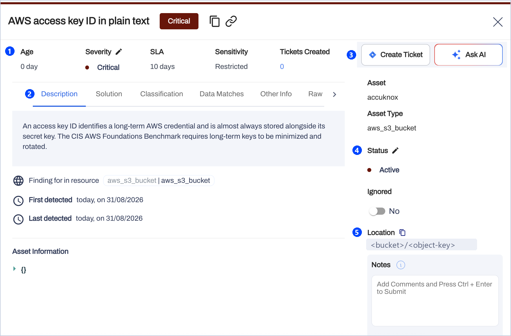
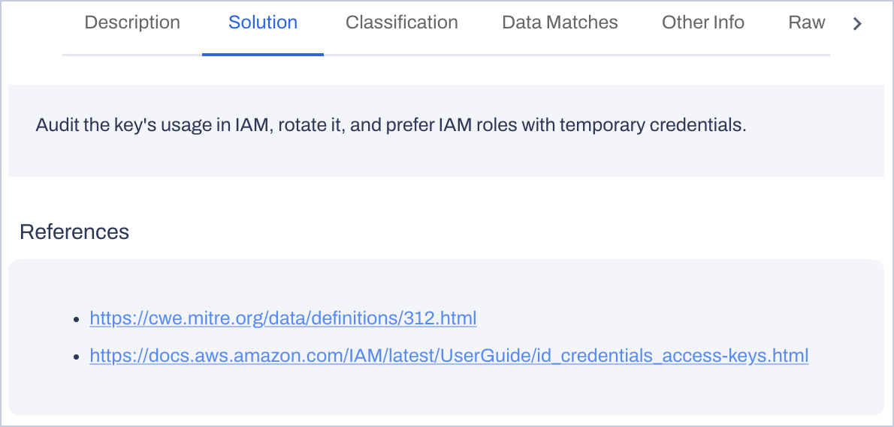

# Onboard the DSPM Scanner

Set up the scanner on one VM in the region that holds your data, then review its findings in the AccuKnox console. For what the scanner covers, see the [DSPM overview](dspm-overview.md).

## Before You Begin

| Item | Requirement |
|---|---|
| Machine | Linux with Docker or Podman, and about 20 GB of free disk. 4 vCPU and 8 GB RAM scan one data store at a time. 8 vCPU and 32 GB RAM scan four in parallel |
| Placement | One VM per region and network. Other AWS accounts or Azure subscriptions in the same region use the same VM |
| Inbound network | :material-close: No inbound connections |
| Outbound network | Port 443 to the AccuKnox console and the container registry, and the database ports to the data subnets |
| AccuKnox console | The console URL, an [artifact token](../how-to/how-to-create-tokens.md), and a [label](../how-to/how-to-create-labels.md) per scanner instance |

!!! tip "Kubernetes instead of a VM"
    The deployment kit ships a CronJob manifest for EKS with IRSA or AKS with workload identity.

## Onboard the Scanner

1. **Create a token and a label.** In the AccuKnox console, go to **Settings > Tokens** and create an artifact token. Create one [label](../how-to/how-to-create-labels.md) per scanner instance.

2. **Create the VM.** Create a Linux VM in a private subnet, in the region that holds the data. Allow no inbound rules. Install Docker, then pull the scanner image or mirror it into your own registry.

    - On AWS, attach an instance role.
    - On Azure, run the deployment kit's script. The script creates the VM with a managed identity.

3. **Grant read-only access.** Apply the grant for each data store. Every grant is read-only.

    === "AWS"

        | Data store | Identity | Grant |
        |---|---|---|
        | Amazon S3 | The VM's instance role, plus a read-only role in each data account that trusts it with an external ID | List and read objects. Decrypt through S3 for KMS-encrypted buckets. Limit the grant to the scanner's region |
        | DocumentDB | A read-only database user | Include the CA bundle for DocumentDB's mandatory TLS |

    === "Azure"

        | Data store | Identity | Grant |
        |---|---|---|
        | Blob Storage and ADLS Gen2 | The VM's managed identity, AKS workload identity, or an app registration | Storage Blob Data Reader on the storage account or resource group. Allow the scanner subnet in the storage firewall, or use a private endpoint |
        | Cosmos DB for NoSQL | The same Azure identity | Cosmos DB Built-in Data Reader, or the account's read-only key |
        | Cosmos DB for MongoDB | A read-only connection string | Read-only access |
        | Key Vault, optional | The same Azure identity | Key Vault Secrets User, when database passwords live in the vault |

    === "Databases"

        | Data store | Identity | Grant |
        |---|---|---|
        | PostgreSQL, MySQL, MariaDB, SQL Server, including RDS and Aurora | A database login for the scanner | Read on all tables, for example `pg_read_all_data` or `db_datareader` |
        | Azure Database for PostgreSQL and MySQL | A read-only login, or the scanner identity's Entra token | Read on all tables. The Entra token replaces the password |
        | Azure SQL Database and Managed Instance | A contained user | `db_datareader` |
        | MongoDB | A read-only database user | Read-only access |

    === "SaaS"

        | Data store | Identity | Grant |
        |---|---|---|
        | Google Workspace Drive | A GCP service account | Enable the Drive API. Grant domain-wide delegation with the single read-only Drive scope |
        | Salesforce | A Connected App with the client-credentials flow | An integration user with API Enabled, View All Data and Query All Files |

4. **Configure the scanner.** Copy the deployment kit to the VM.

    - In the shared settings file, set the console URL, the artifact token and your country packs.
    - Add one instance file per data store, with the asset name, its account or subscription, and its credential.

5. **Install and run the first scan.** Run the installer once. The installer creates a nightly timer for every instance. Start one instance by hand and follow its log until the upload succeeds. The asset and its findings appear in the console within minutes.

!!! tip "Small VM"
    On a 4 vCPU machine, stagger the timers or run the instances in sequence.

## Review Findings

1. Go to **Issues > Findings**.
2. Select the **Data Security Findings** filter. The list groups findings by name, such as "AWS access key ID in plain text: 5".
3. Open a row to see the finding detail.

??? info "What each callout shows"

    | Callout | What it shows |
    |---|---|
    | 1 | Age, severity, SLA and sensitivity. Severity is Critical, High, Medium or Low. The SLA is the remediation window the severity sets, 10 days for this Critical finding. Sensitivity is Restricted, Confidential or Internal |
    | 2 | Six detail tabs. Description says why the data class matters. Classification lists CWE, MITRE ATT&CK and compliance frameworks. Data Matches shows the values masked to their last four characters. Other Info holds the risk score and the resource ARN. Raw is the finding as uploaded |
    | 3 | Create Ticket raises a ticket in your tracker. Ask AI asks the assistant about the finding |
    | 4 | Status stays Active until the data is fixed. Turn on Ignored for a value you confirmed as public or test data |
    | 5 | Location is the unit inside the asset: a schema and table, an object key, or a file |

The **Solution** tab gives the remediation and its references.

!!! tip "Triage order"
    Start with Critical and Restricted findings, then the largest match counts, then the oldest findings against their SLA.

Each nightly run reads its sample again. **Last detected** stops advancing once the data is masked, moved or deleted. When you ignore a value, also add it to the scanner's allow list so it does not return.

## Frequently Asked Questions

??? question "Is it safe to point the scanner at a production database?"
    Yes, when the scanner uses a read-only login. The scanner reads at most 10,000 rows per table in batches, honours connection timeouts, and backs off when Cosmos DB throttles. For a heavily loaded system, point it at a read replica or reader endpoint.

??? question "How long does a run take?"
    A database of a few dozen tables takes minutes. Object stores scale with the number and size of files. Archives and scanned PDFs take longest, because the scanner unpacks them and reads them with OCR. Later nightly runs finish faster than the first run.

??? question "How do I keep known values out of the report?"
    Put public phone numbers, test accounts and sample data on the allow list, as exact values or patterns. Switch off detectors you do not need, and enable only the country packs you operate in. For fewer, stronger findings, raise the confidence floor to Very likely.

??? question "Can one scanner cover several accounts or subscriptions?"
    Yes, when the accounts and subscriptions sit in one region. The scanner reads other AWS accounts through a read-only role it assumes, and other Azure subscriptions through role assignments on its identity. Another region gets its own scanner.

??? question "What happens if the console is unreachable?"
    The run completes and the log records the failed upload. The findings file stays on the VM for 30 days. The next scheduled run uploads normally.

??? question "What does the scanner skip?"
    Files over 100 MB, archive-tier blobs that need rehydration, page blobs, soft-deleted blobs, system schemas and collections, and Salesforce history, share and feed objects. The run's statistics count each skip.
