# Data Security Posture Management (DSPM)

The AccuKnox DSPM scanner finds sensitive data in your buckets, databases and SaaS apps, and reports where it sits. The scanner runs on a machine you own, in the region that holds the data. It reads a sample with read-only access and classifies it in memory. Only a findings file goes to the AccuKnox console, and you can run that console on-premises or air-gapped.

!!! abstract "Rows and files never leave your account"
    The scanner discards every row and file after classification. The one file that leaves is the findings file. It holds each matched value cut at 200 characters, and the console shows that value masked to its last four characters. With the on-premises console, the findings file stays inside your boundary too.

::cards:: cols=4

- title: Onboard the Scanner
  url: dspm-onboarding.md
  description: Prerequisites, read-only grants per data store, and the five onboarding steps.

- title: Supported Data Stores
  url: "#supported-data-stores-span-aws-azure-self-managed-and-saas"
  description: Object storage, relational and document databases, Google Drive and Salesforce.

- title: Compliance Mapping
  url: "#compliance-mapping-covers-16-framework-groups"
  description: GDPR, PCI DSS, HIPAA, DPDP and 12 more framework groups, per data class.

- title: Product Highlights
  url: "#product-highlights-preview-the-next-dspm-console"
  description: Prototype screens for the DSPM dashboard, console onboarding, findings and assets.

::/cards::

## One Scanner Image Reads Every Store Read-Only

| Item | What the scanner does |
|---|---|
| Scope | S3, Azure Blob and ADLS Gen2, PostgreSQL, MySQL, MariaDB, SQL Server, MongoDB and DocumentDB, DynamoDB, Azure SQL, Cosmos DB, Google Drive, Salesforce |
| Access | Read-only. A reader role, a read-only login or a read-only API scope. The code has no write path |
| Where it runs | A VM or a Kubernetes job in your cloud account, in the region that holds the data |
| What leaves | One findings file per data store, uploaded to the AccuKnox console over HTTPS |
| Detection | 159 detectors, 62 country packs for national identifiers, and a language model for person names in free text |
| Sampling | Up to 10,000 rows or documents per table or collection. Files up to 100 MB. Archives are unpacked |
| Cadence | Nightly per data store. Runs on one machine are staggered or sequential |

## Architecture Keeps the Scanner in the Region That Holds the Data

The scanner is a scheduled container on a machine you own. Two connections cross the boundary of your account, and both are outbound HTTPS. The first connection pulls the scanner image. The second connection uploads the findings file.

<svg viewBox="0 0 940 410" xmlns="http://www.w3.org/2000/svg">
  <defs>
    <marker id="dspm-a1" viewBox="0 0 8 8" refX="7" refY="4" markerWidth="7" markerHeight="7" orient="auto">
      <path class="head" d="M0 0 L8 4 L0 8 z"/>
    </marker>
    <marker id="dspm-a1acc" viewBox="0 0 8 8" refX="7" refY="4" markerWidth="7" markerHeight="7" orient="auto">
      <path class="head-acc" d="M0 0 L8 4 L0 8 z"/>
    </marker>
  </defs>

  <rect class="hollow" x="16" y="16" width="908" height="276" rx="10" stroke-dasharray="6 5"/>
  <text class="t-s" x="32" y="38">Your cloud account and region</text>

  <rect class="acc" x="40" y="56" width="300" height="212" rx="10" stroke-width="1.5"/>
  <text class="t-h t-acc" x="190" y="86" text-anchor="middle">Scanner VM or Kubernetes CronJob</text>
  <text class="t-b" x="190" y="118" text-anchor="middle">Nightly timer per data store</text>
  <text class="t-b" x="190" y="144" text-anchor="middle">Read-only container per run</text>
  <text class="t-b" x="190" y="170" text-anchor="middle">No inbound connections</text>
  <text class="t-b" x="190" y="196" text-anchor="middle">Platform identity, no stored keys</text>
  <text class="t-b" x="190" y="222" text-anchor="middle">Findings kept 30 days on the VM</text>

  <path class="ln-acc" d="M340 86 H556" marker-end="url(#dspm-a1acc)"/>
  <path class="ln-acc" d="M340 166 H556" marker-end="url(#dspm-a1acc)"/>
  <path class="ln-acc" d="M340 246 H556" marker-end="url(#dspm-a1acc)"/>
  <text class="t-s" x="352" y="78">Read-only, in-region</text>
  <text class="t-s" x="352" y="158">Assumed read-only role</text>
  <text class="t-s" x="352" y="238">Role on the scanner identity</text>

  <rect class="p" x="560" y="56" width="340" height="60" rx="8"/>
  <text class="t-h" x="576" y="81">Data in this account</text>
  <text class="t-s" x="576" y="101">S3, RDS, DocumentDB, Blob Storage, Cosmos DB</text>

  <rect class="p" x="560" y="136" width="340" height="60" rx="8"/>
  <text class="t-h" x="576" y="161">Another AWS account</text>
  <text class="t-s" x="576" y="181">Read-only role with an external ID</text>

  <rect class="p" x="560" y="216" width="340" height="60" rx="8"/>
  <text class="t-h" x="576" y="241">Another Azure subscription</text>
  <text class="t-s" x="576" y="261">Role assignment, private endpoint</text>

  <path class="ln" d="M190 268 V336" marker-end="url(#dspm-a1)"/>
  <text class="t-s" x="202" y="326">Findings upload, HTTPS 443</text>
  <path class="ln" d="M300 268 V302 H730 V336" marker-end="url(#dspm-a1)"/>
  <text class="t-s" x="742" y="326">Image pull, HTTPS 443</text>

  <rect class="plane" x="40" y="340" width="300" height="54" rx="8"/>
  <text class="t-plane" x="190" y="372" text-anchor="middle">AccuKnox console</text>

  <rect class="p" x="560" y="340" width="340" height="54" rx="8"/>
  <text class="t-h" x="730" y="372" text-anchor="middle">Container registry or your mirror</text>
</svg>

Nothing connects inbound to the scanner. Each region gets its own scanner.

| Deployment form | Use it when | How it runs |
|---|---|---|
| VM with systemd timers | The default for most teams | One timer per data store starts one short-lived container each night. The deployment kit installs the timers, env files and retention |
| Kubernetes CronJob | You already run EKS or AKS | The same image on a schedule, with IRSA or workload identity as the credential |
| Event-driven function | You want new objects scanned as they land | An AWS Lambda handler scans one object or table per event from S3 notifications, SQS or DynamoDB streams |

Each data store gets its own instance, which is one environment file. S3 gets one instance per AWS account, Blob Storage one per storage account, and a database one per server. Each instance has its own timer, container and findings directory, so a failure in one instance never touches another.

The container runs with a read-only root filesystem, all Linux capabilities dropped and no privilege escalation. Downloaded files sit in memory-backed scratch space that disappears when the run ends.

### A Scan Classifies in Memory and Uploads Findings Only

<svg viewBox="0 0 940 420" xmlns="http://www.w3.org/2000/svg">
  <defs>
    <marker id="dspm-a2" viewBox="0 0 8 8" refX="7" refY="4" markerWidth="7" markerHeight="7" orient="auto">
      <path class="head" d="M0 0 L8 4 L0 8 z"/>
    </marker>
    <marker id="dspm-a2acc" viewBox="0 0 8 8" refX="7" refY="4" markerWidth="7" markerHeight="7" orient="auto">
      <path class="head-acc" d="M0 0 L8 4 L0 8 z"/>
    </marker>
  </defs>

  <rect class="hollow" x="16" y="16" width="908" height="304" rx="10" stroke-dasharray="6 5"/>
  <text class="t-s" x="32" y="38">Inside your cloud account, in the region that holds the data</text>

  <rect class="p" x="40" y="56" width="230" height="64" rx="8"/>
  <text class="t-h" x="56" y="82">Databases</text>
  <text class="t-s" x="56" y="102">SQL, MongoDB, Cosmos DB</text>

  <rect class="p" x="40" y="146" width="230" height="64" rx="8"/>
  <text class="t-h" x="56" y="172">Object stores</text>
  <text class="t-s" x="56" y="192">S3, Blob Storage, ADLS Gen2</text>

  <rect class="p" x="40" y="236" width="230" height="64" rx="8"/>
  <text class="t-h" x="56" y="262">SaaS apps</text>
  <text class="t-s" x="56" y="282">Google Drive, Salesforce</text>

  <rect class="p2" x="320" y="136" width="240" height="164" rx="8"/>
  <text class="t-h" x="440" y="164" text-anchor="middle">Download and parse</text>
  <text class="t-b" x="440" y="192" text-anchor="middle">CSV, Excel, Parquet</text>
  <text class="t-b" x="440" y="216" text-anchor="middle">JSON, XML, plain text</text>
  <text class="t-b" x="440" y="240" text-anchor="middle">PDF, Word, slides, OCR</text>
  <text class="t-b" x="440" y="264" text-anchor="middle">Archives unpacked</text>
  <text class="t-s" x="440" y="288" text-anchor="middle">Deleted after classification</text>

  <rect class="acc" x="620" y="56" width="280" height="170" rx="10" stroke-width="1.5"/>
  <text class="t-h t-acc" x="760" y="84" text-anchor="middle">Classify in memory</text>
  <text class="t-b" x="760" y="110" text-anchor="middle">159 detectors, 62 country packs</text>
  <text class="t-b" x="760" y="134" text-anchor="middle">Field name and checksum</text>
  <text class="t-b" x="760" y="158" text-anchor="middle">Context words nearby</text>
  <text class="t-b" x="760" y="182" text-anchor="middle">Person names in free text</text>
  <text class="t-b" x="760" y="206" text-anchor="middle">A confidence tier per finding</text>

  <path class="ln" d="M270 88 H616" marker-end="url(#dspm-a2)"/>
  <text class="t-s" x="290" y="80">Rows stream straight in</text>
  <path class="ln" d="M270 178 H316" marker-end="url(#dspm-a2)"/>
  <path class="ln" d="M270 268 H316" marker-end="url(#dspm-a2)"/>
  <path class="ln" d="M560 190 H616" marker-end="url(#dspm-a2)"/>

  <rect class="p" x="620" y="248" width="280" height="54" rx="8"/>
  <text class="t-h" x="760" y="272" text-anchor="middle">Findings file</text>
  <text class="t-s" x="760" y="291" text-anchor="middle">One per data store</text>
  <path class="ln" d="M760 226 V244" marker-end="url(#dspm-a2)"/>

  <path class="ln-acc" d="M760 302 V350" marker-end="url(#dspm-a2acc)"/>
  <text class="t-s t-acc" x="748" y="340" text-anchor="end">HTTPS upload, findings only</text>

  <rect class="plane" x="620" y="354" width="280" height="50" rx="8"/>
  <text class="t-plane" x="760" y="384" text-anchor="middle">AccuKnox console</text>
</svg>

Database rows never touch disk. Files from object stores and SaaS apps sit in memory-backed scratch space until the run ends.

## Supported Data Stores Span AWS, Azure, Self-Managed and SaaS

| Asset type | AWS | Azure | Self-managed or other cloud | SaaS |
|---|---|---|---|---|
| Object storage | S3 | Blob Storage, ADLS Gen2 | None | Google Drive files |
| Relational databases | RDS and Aurora for PostgreSQL, MySQL, MariaDB and SQL Server | Azure Database for PostgreSQL and MySQL Flexible Server, Azure SQL Database and Managed Instance | PostgreSQL, MySQL, MariaDB, SQL Server on any host | None |
| Document and key-value databases | DocumentDB, and DynamoDB in event-driven mode | Cosmos DB for NoSQL, Cosmos DB for MongoDB | MongoDB on any host | None |
| SaaS applications | None | None | None | Google Workspace Drive, Salesforce objects and files |
| Secret stores for the scanner's own database passwords | Secrets Manager | Key Vault | None | None |

??? info "What the scanner reads in each data store"

    | Data source | What is scanned |
    |---|---|
    | Amazon S3 | Every object in the bucket. Files up to 100 MB, archives unpacked |
    | Azure Blob Storage, ADLS Gen2 | Every blob in the container. Archive-tier, page and soft-deleted blobs are skipped |
    | PostgreSQL, MySQL, MariaDB, SQL Server, including RDS, Aurora and Azure | All non-system schemas, up to 10,000 rows per table |
    | MongoDB, Amazon DocumentDB | All non-system collections, up to 10,000 documents each, nested fields included |
    | Amazon DynamoDB | Tables, up to 10,000 items. Event-driven mode only |
    | Cosmos DB for NoSQL | Every container of the database, up to 10,000 items each |
    | Cosmos DB for MongoDB | Same as MongoDB. Request-rate throttling is retried |
    | Google Workspace Drive | A user's My Drive or a shared drive. Docs, Sheets and Slides are exported and read |
    | Salesforce | Every business object with records, text fields, and the files attached to records |

    **File formats.** CSV and TSV, Excel workbooks sheet by sheet, Parquet, JSON and JSON Lines, XML, PDF, Word, PowerPoint, images through OCR, and zip, tar, gz and bz2 archives unpacked recursively. The scanner reads any other format as plain text.

!!! warning "Not covered today"
    Google Cloud Storage, SMB or NFS file shares, Oracle Database, and data warehouses such as Snowflake. Ask your AccuKnox account team about the roadmap.

## 283 Data Classes Carry a Confidence Tier and a Sensitivity Label

Each data class carries a category, a sensitivity label and a risk rating. The console filters and scores findings on those three fields.

| Category | Data classes | Examples |
|---|---|---|
| Regional compliance | 117 | US SSN and ITIN, Indian Aadhaar, PAN and GST, UK National Insurance number, Spanish DNI and NIE, Canadian SIN. Each is checked with its public check-digit algorithm where one exists |
| Credentials and secrets | 114 | AWS access and secret keys, Azure storage keys and SAS tokens, GCP service account keys, tokens from GitHub, Slack, Stripe, OpenAI and more than 50 other vendors, JWTs, private key headers, password hashes |
| Healthcare data (PHI) | 21 | NHS number, US Medicare beneficiary ID, NPI and DEA numbers, claim and prescription numbers, medical record numbers, ICD-10 and NDC codes |
| PII | 19 | Email, phone numbers, person names, street addresses, dates of birth, public IP addresses, IMEI, VIN, passport machine-readable zones |
| Financial data | 10 | Payment card numbers by issuer prefix and checksum, IBAN, SWIFT/BIC, bank account and ABA routing numbers, cryptocurrency wallet addresses |
| Entropy-based secret | 1 | Random-looking tokens with supporting evidence. Off by default |
| Technical identifier | 1 | UUIDs. Shipped disabled |

The catalogue labels 226 data classes Restricted, 29 Confidential and 28 Internal. It rates 165 Critical, 63 High, 23 Medium, 29 Low and 3 Lowest.

| Confidence tier | Meaning | Example |
|---|---|---|
| Very likely | A validated shape plus corroboration | A checksum-valid national ID in a column named for it, or a vendor-prefixed token |
| Likely | One strong signal | A valid email, or a card number with a known issuer prefix and a valid checksum |
| Possible | A plausible shape only | Nine digits in SSN groups. Never reported on its own |

The console receives findings at or above the confidence floor you set. The default floor is Likely.

??? info "The 62 country packs"
    AE, AR, AT, AU, BE, BG, BR, CA, CH, CL, CN, CZ, DE, DK, EE, EG, ES, FI, FR, GB, GH, GR, HK, HR, HU, ID, IE, IL, IN, IS, IT, JP, KR, LK, LT, LU, LV, MX, MY, NG, NL, NO, NZ, PH, PK, PL, PT, RO, RS, RU, SA, SE, SG, SI, SK, TH, TR, TW, UA, US, VN and ZA.

    Enable the packs for the countries you operate in. The same list decides which national phone-number formats the scanner recognises. Generic detectors such as email, cards, IBAN, secrets and IP addresses always run.

The scanner never reports documented example keys, test card numbers, epoch timestamps, or values on your allow list. Private and loopback IP addresses stay out unless you ask for them. Token-shaped values in ID, hash and path columns stay out too.

## Compliance Mapping Covers 16 Framework Groups

282 of the 283 data classes carry the regulation clauses they fall under. Filter findings by a framework in the console to list the assets that hold data regulated by that framework. The scanner shows where regulated data sits. Assessing the controls around that data stays with your compliance programme.

| Framework | Data classes | What it covers |
|---|---|---|
| GDPR (EU) | 78 | National identifiers of EU member states, contact details, dates of birth, health and financial identifiers. Cited to Articles 4, 9 and 32 |
| UK GDPR and Data Protection Act 2018 | 12 | National Insurance number, NHS number, UK passport and driving licence, UTR, sort code |
| PCI DSS v3.2.1 and v4.0 | 107 | Card numbers under Requirements 3.4 and 3.5.1. Credential and key classes under Requirements 3.6, 3.7 and 8.3 |
| HIPAA and HITECH | 26 | Health identifiers, member, claim and prescription numbers, plus SSN, date of birth and account numbers under 45 CFR 164.514(b)(2) |
| CPRA and CCPA (California) | 21 | SSN, cards, bank accounts, contact details, health identifiers |
| GLBA, FTC Safeguards and US state breach-notification laws | 12 | SSN, ITIN, EIN, alien registration number, bank account, routing and SWIFT numbers |
| India DPDP Act 2023 and SPDI Rules 2011 | 17 | Aadhaar, PAN, GST, passport, financial information, passwords |
| South Africa POPIA | 9 | ID number, passport, driver licence, traffic register number, phone numbers |
| Korea PIPA | 4 | Resident and foreigner registration numbers, driver licence, passport |
| Canada PIPEDA | 3 | SIN, postal code, OHIP number |
| Australia and New Zealand Privacy Acts | 6 | TFN, Medicare, IHI, BSB, IRD, NHI |
| Philippines Data Privacy Act | 6 | UMID, TIN, passport, mobile numbers |
| Nigeria and Ghana Data Protection Acts | 3 | NIN, vehicle registration, Ghana Card |
| Argentina Ley 25.326 and Chile Ley 19.628 | 4 | CUIT, DNI, RUT |
| Germany SGB V | 2 | Physician and practice numbers |
| NIST SP 800 series, OWASP, CIS AWS Foundations Benchmark, SOC 2 | 110 | Every credential and secret class: cloud keys, vendor tokens, private keys, password hashes |

Each data class also cites its CWE weaknesses and MITRE ATT&CK techniques. Coverage follows the country packs you enable. A scanner for Indian data enables the IN pack and gets Aadhaar, PAN and GST. Cards, secrets, email and health codes apply everywhere and are always on.

## Only a Findings File Leaves Your Account

| Question | Answer |
|---|---|
| What access does the scanner hold? | Read-only grants only. The code has no path that writes to, deletes from or changes a data store |
| Where does classification happen? | On the VM or cluster in your account. The language model for names runs inside the container. No data goes to an external service |
| What leaves your account? | One zipped findings file per data store, uploaded over HTTPS with a bearer token. Nothing else |
| What is in a finding? | The data type, category, confidence, evidence, location, occurrence count, a hash of the value, and the matched value cut at 200 characters |
| What stays on the VM? | The findings file, in a root-owned directory, removed after 30 days. Downloaded files are gone when the run ends |
| How are credentials handled? | Platform identity where possible: instance role, managed identity, workload identity, Entra tokens. A required password sits in a root-only file, Key Vault or Secrets Manager. Logs redact SAS tokens and account keys |
| Does data cross regions? | No. The AWS role denies other regions by condition. On Azure, storage firewalls and role scopes limit the scanner to its region |
| How is the image updated? | You pin an image tag. Each run pulls that tag when the registry is reachable and runs the cached image when it is not. You can mirror the image into your own registry |

## AccuKnox Can Run the Console Inside Your Boundary Too

Cyera, Varonis, BigID and IBM Guardium DSPM can each scan inside your cloud. The difference is where the console and the findings live. AccuKnox runs scanner, findings and console together on-premises or air-gapped. Cyera, Varonis and IBM keep the console in their own SaaS. BigID is the one other vendor you can self-host.

<svg viewBox="0 0 940 300" xmlns="http://www.w3.org/2000/svg">
  <defs>
    <marker id="dspm-a3" viewBox="0 0 8 8" refX="7" refY="4" markerWidth="7" markerHeight="7" orient="auto">
      <path class="head" d="M0 0 L8 4 L0 8 z"/>
    </marker>
    <marker id="dspm-a3bad" viewBox="0 0 8 8" refX="7" refY="4" markerWidth="7" markerHeight="7" orient="auto">
      <path class="head-bad" d="M0 0 L8 4 L0 8 z"/>
    </marker>
  </defs>

  <rect class="hollow" x="16" y="40" width="664" height="244" rx="10" stroke-dasharray="6 5"/>
  <text class="t-s" x="32" y="30">Inside your boundary</text>
  <text class="t-s" x="712" y="30">Outside your boundary</text>

  <text class="t-h" x="32" y="72">Typical SaaS DSPM</text>
  <rect class="p" x="32" y="86" width="180" height="56" rx="8"/>
  <text class="t-h" x="122" y="119" text-anchor="middle">Your data stores</text>
  <path class="ln" d="M212 114 H246" marker-end="url(#dspm-a3)"/>
  <rect class="p" x="250" y="86" width="200" height="56" rx="8"/>
  <text class="t-h" x="350" y="110" text-anchor="middle">Scanner</text>
  <text class="t-s" x="350" y="128" text-anchor="middle">in your cloud account</text>
  <path class="ln-bad" d="M450 114 H708" marker-end="url(#dspm-a3bad)"/>
  <text class="t-s t-bad" x="470" y="106">Metadata, samples, findings</text>
  <rect class="bad" x="712" y="86" width="212" height="56" rx="8"/>
  <text class="t-h" x="818" y="110" text-anchor="middle">Vendor SaaS</text>
  <text class="t-s" x="818" y="128" text-anchor="middle">console and findings</text>

  <text class="t-h t-acc" x="32" y="186">AccuKnox DSPM</text>
  <rect class="p" x="32" y="200" width="180" height="56" rx="8"/>
  <text class="t-h" x="122" y="233" text-anchor="middle">Your data stores</text>
  <path class="ln" d="M212 228 H246" marker-end="url(#dspm-a3)"/>
  <rect class="p" x="250" y="200" width="200" height="56" rx="8"/>
  <text class="t-h" x="350" y="224" text-anchor="middle">Scanner</text>
  <text class="t-s" x="350" y="242" text-anchor="middle">in your cloud account</text>
  <path class="ln" d="M450 228 H484" marker-end="url(#dspm-a3)"/>
  <rect class="plane" x="488" y="200" width="176" height="56" rx="8"/>
  <text class="t-plane" x="576" y="224" text-anchor="middle">AccuKnox console</text>
  <text class="t-pill" x="576" y="242" text-anchor="middle">on-prem or air-gapped</text>
  <rect class="good" x="712" y="210" width="212" height="36" rx="18"/>
  <text class="t-h t-ok" x="818" y="233" text-anchor="middle">Nothing leaves</text>
</svg>

| | AccuKnox DSPM | Cyera | Varonis | BigID | IBM Guardium DSPM |
|---|---|---|---|---|---|
| Where scanning runs | A VM or CronJob you own, in the data's region | Cyera's cloud, or an outpost cluster in your cloud | Collectors in your environment, analysis in Varonis SaaS | Cloud scanners, or local scanners in your environment | An analyzer in your cloud account, per region |
| Where the console lives | AccuKnox SaaS, or on-premises or air-gapped | Cyera SaaS, operated by Cyera | Varonis SaaS | BigID SaaS, or self-hosted on your Kubernetes | IBM SaaS |
| What leaves your environment | Nothing with the on-premises console. One findings file per store with SaaS | Metadata and results | Metadata from the collectors | Nothing when self-hosted | Metadata |
| Air-gapped operation | Yes, console included | No | Offline collector installs only. Analysis stays in Varonis SaaS | Possible on your own Kubernetes | No |

Vendor facts come from each vendor's public documentation as of September 2026. Varonis ends its self-hosted product on 31 December 2026. IBM now lists Guardium Discover and Classify in place of a Guardium DSPM module, so the IBM column shows the last documented DSPM analyzer model.

## Product Highlights Preview the Next DSPM Console

!!! warning "Prototype screens"
    These screens come from the DSPM design prototypes. Some features are not in the product yet, and the shipped screens can differ. The coverage and onboarding sections above describe what the scanner does today. Select a screen to open it at full size.

### The Roadmap Extends Discovery Beyond AWS and Azure

The target design adds GCP, Kubernetes, SaaS platforms such as Snowflake and Microsoft 365, and on-premises file shares. It groups the work in three stages: data discovery, data classification, and data security controls. [Supported Data Stores](#supported-data-stores-span-aws-azure-self-managed-and-saas) lists what the scanner covers today.

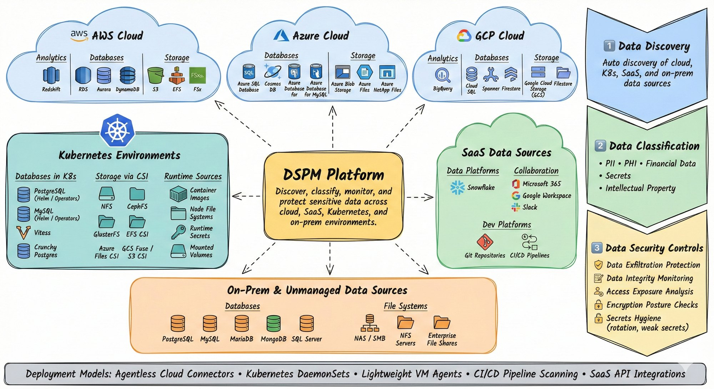{ data-gallery="dspm-preview" data-title="Target DSPM architecture" loading=lazy }

### A DSPM Dashboard Summarizes Risk, Records and Coverage

-   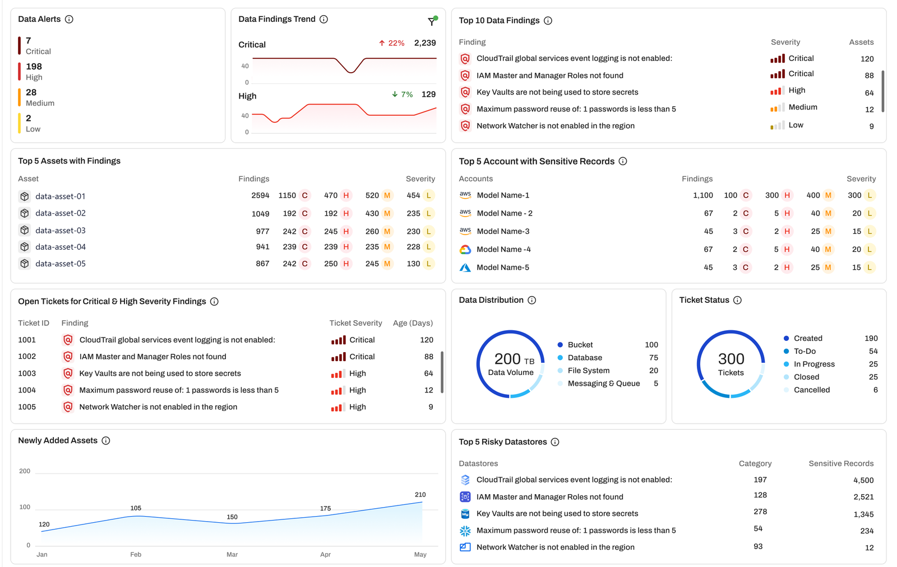{ data-gallery="dspm-preview" data-title="Risk overview" loading=lazy }

    **Risk overview**. Data alerts by severity, findings trends, the top 10 data findings, the top assets and accounts with findings, open tickets, and data distribution by store type.

-   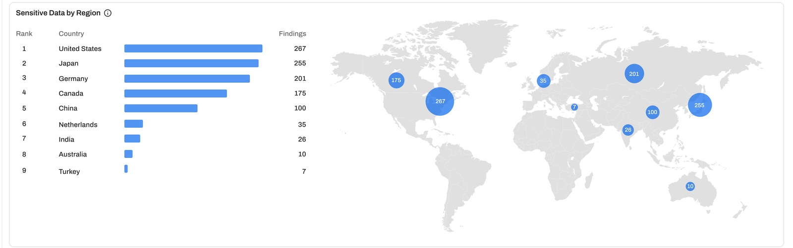{ data-gallery="dspm-preview" data-title="Sensitive data by region" loading=lazy }

    **Sensitive data by region**. Findings ranked by country, with the same counts plotted on a world map.

-   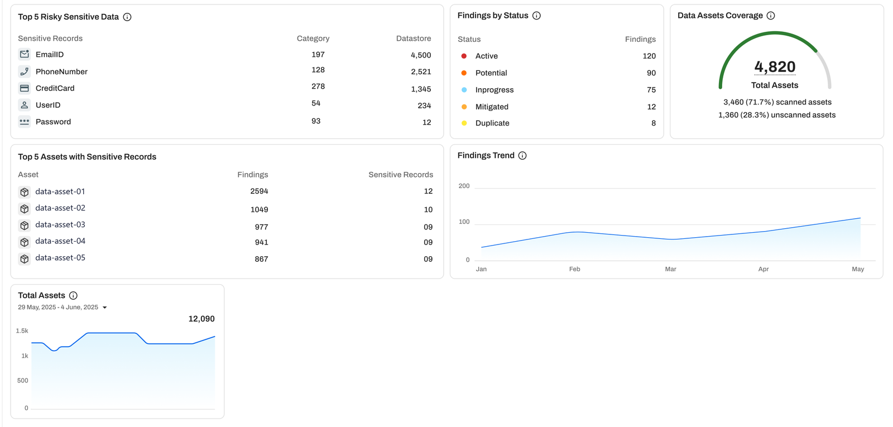{ data-gallery="dspm-preview" data-title="Coverage and status" loading=lazy }

    **Coverage and status**. Top sensitive data types, findings by status, and scanned versus unscanned assets, 3,460 of 4,820 in the example.

### Data Security Becomes a Scan Type on the Cloud Account

-   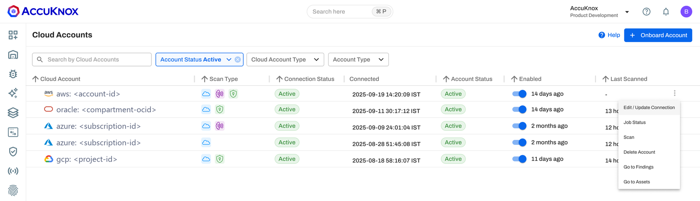{ data-gallery="dspm-preview" data-title="Cloud Accounts" loading=lazy }

    **Cloud Accounts**. Each onboarded account shows its scan types. The shield icon marks Data Security.

-   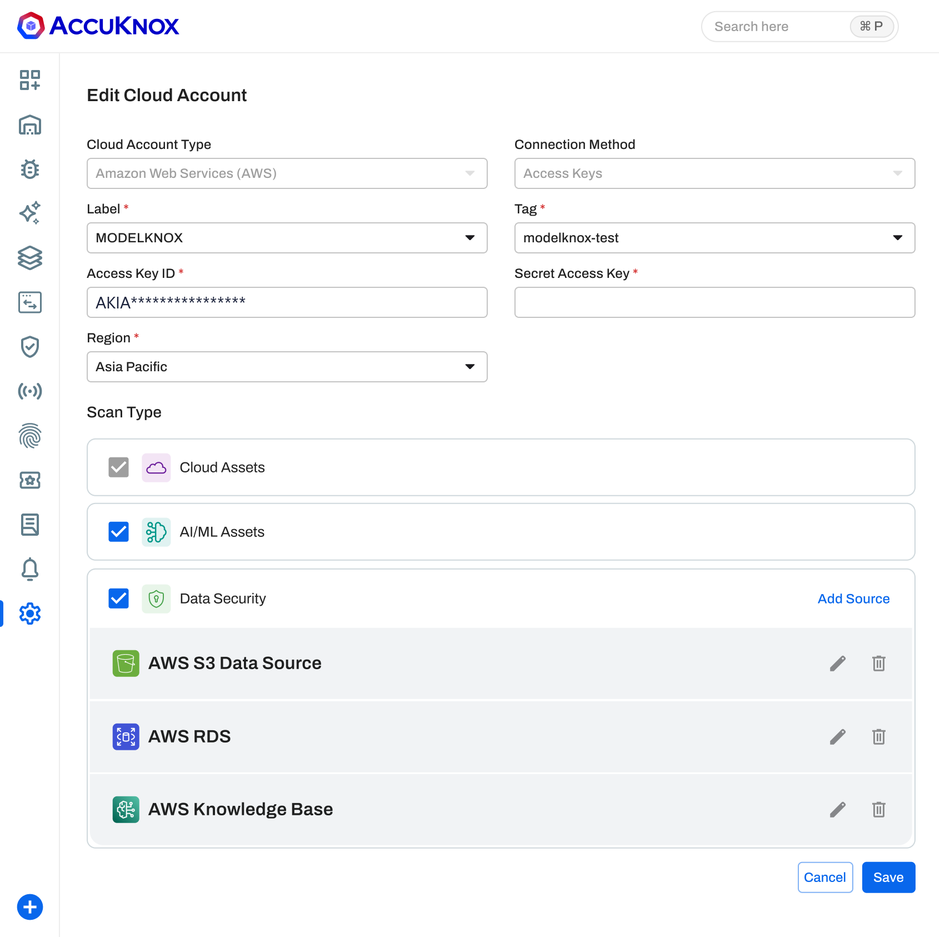{ data-gallery="dspm-preview" data-title="Data sources per account" loading=lazy }

    **Data sources per account**. Data Security sits next to Cloud Assets and AI/ML Assets. Add Source attaches S3, RDS or a Knowledge Base.

-   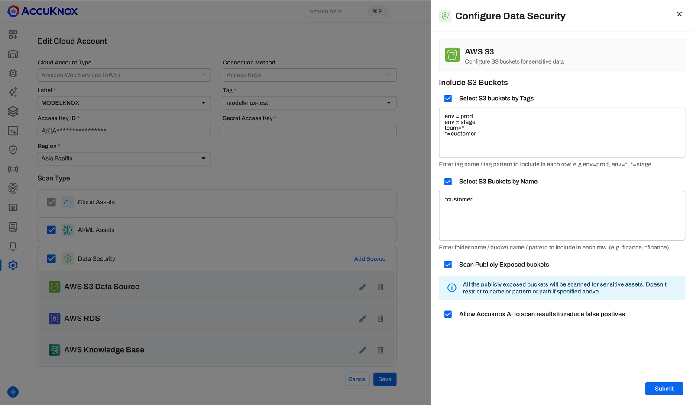{ data-gallery="dspm-preview" data-title="Scope an S3 source" loading=lazy }

    **Scope an S3 source**. Include buckets by tag or by name pattern, scan every publicly exposed bucket, and let AccuKnox AI review results for false positives.

### Findings Group by Finding Name With Evidence per File

-   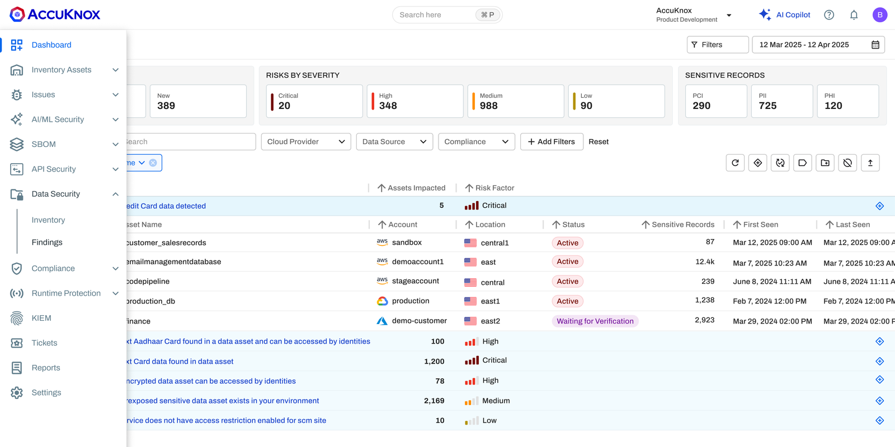{ data-gallery="dspm-preview" data-title="Findings list" loading=lazy }

    **Findings list**. Data Security gets its own Inventory and Findings menu. Findings group by name, with the impacted assets, their status and sensitive record counts.

-   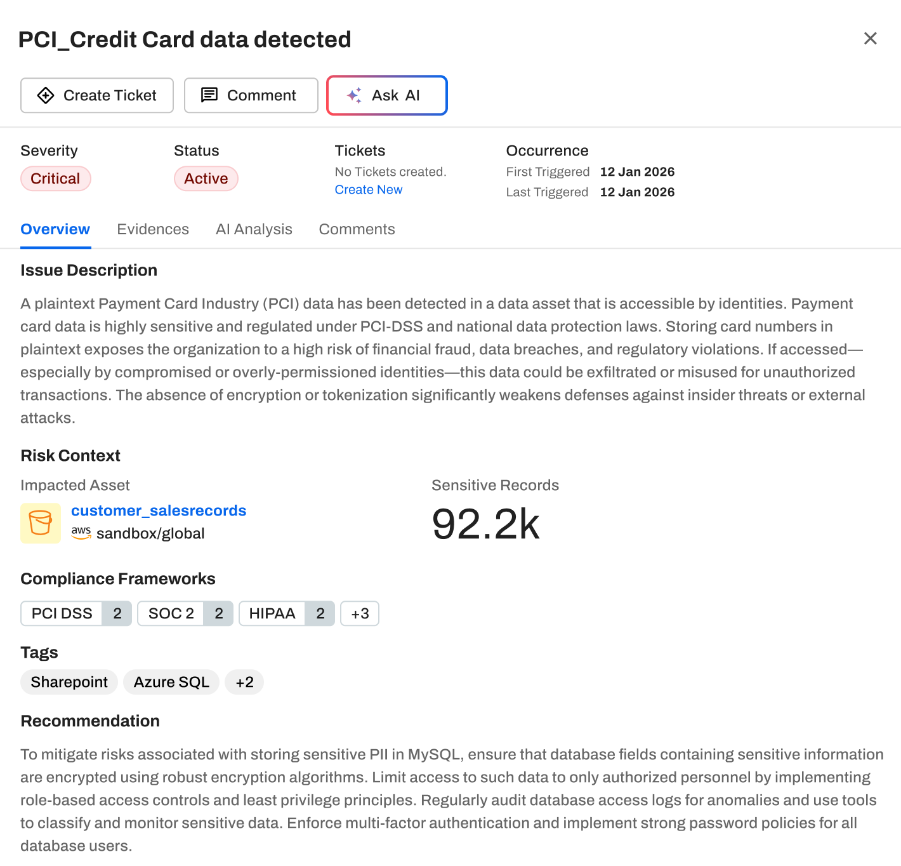{ data-gallery="dspm-preview" data-title="Finding overview" loading=lazy }

    **Finding overview**. Severity, status, tickets, the impacted asset, sensitive record count, compliance frameworks and a recommendation.

-   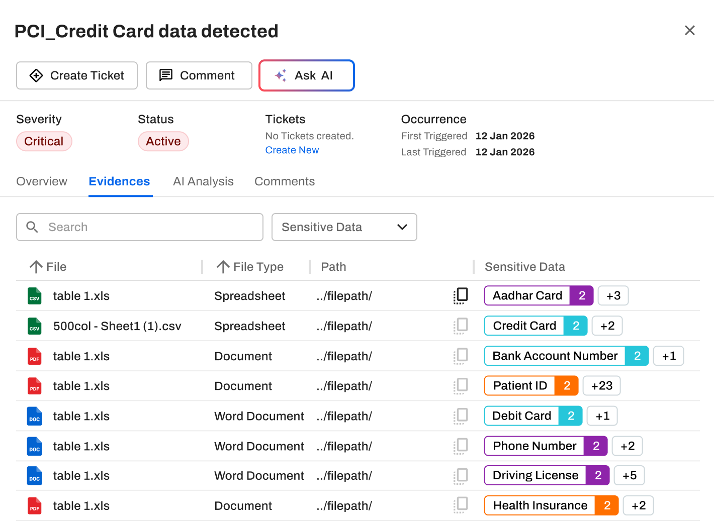{ data-gallery="dspm-preview" data-title="Finding evidence" loading=lazy }

    **Finding evidence**. Each file behind the finding, with its type, path and the sensitive data types found in it.

### Each Data Asset Shows Its Sensitive Records and Risks

-   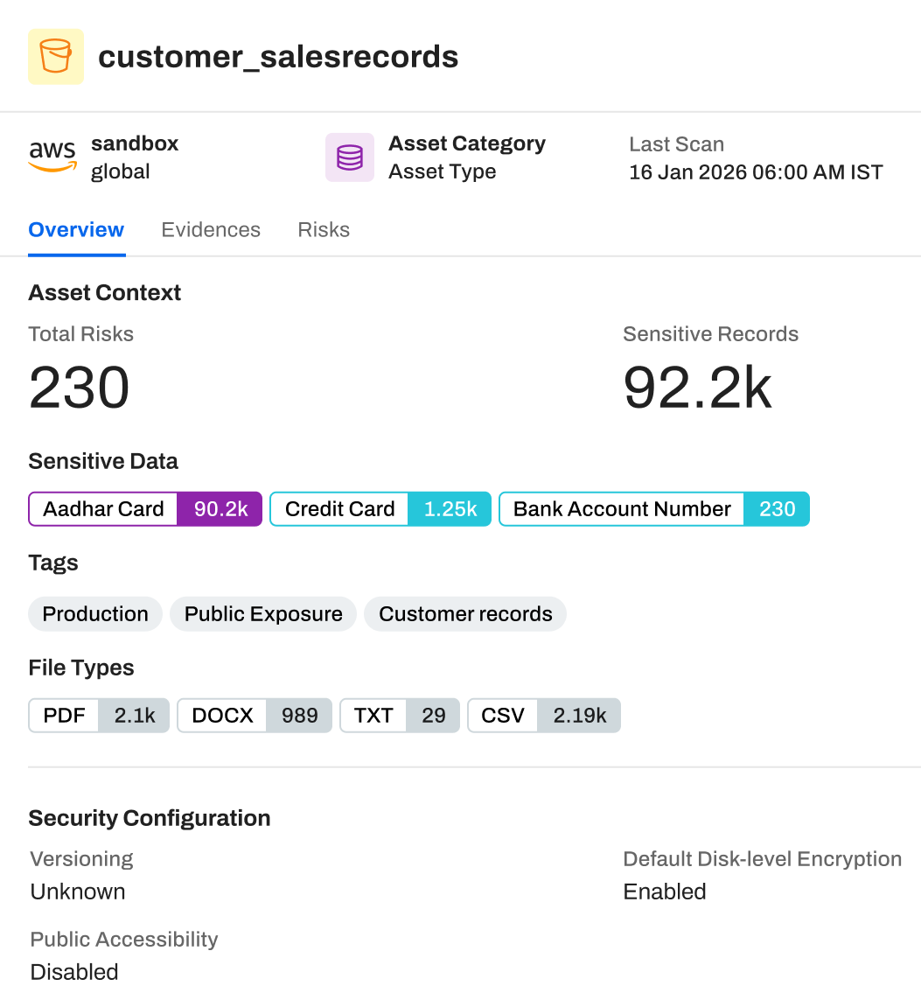{ data-gallery="dspm-preview" data-title="Asset overview" loading=lazy }

    **Asset overview**. Total risks, sensitive records by data type, tags, file types, and security configuration such as encryption and public access.

-   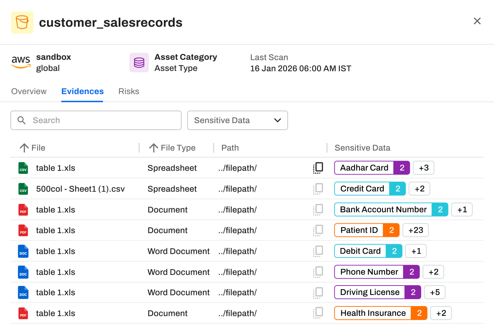{ data-gallery="dspm-preview" data-title="Asset evidence" loading=lazy }

    **Asset evidence**. The files in the asset that hold sensitive data, with the data types in each file.

-   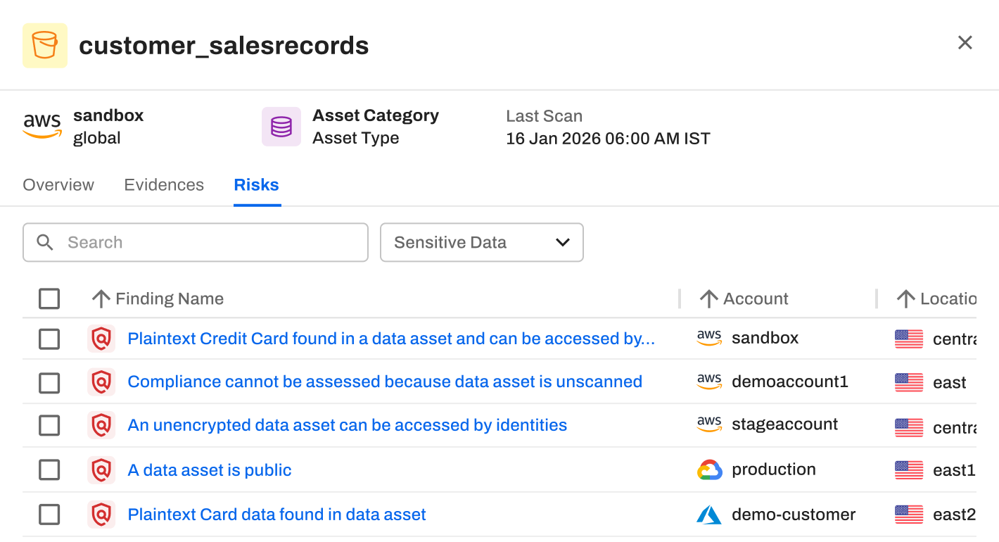{ data-gallery="dspm-preview" data-title="Asset risks" loading=lazy }

    **Asset risks**. Every finding raised on the asset, with its account and location.

