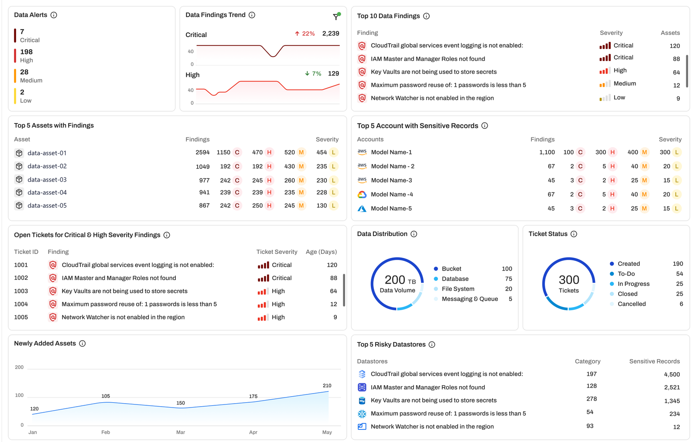
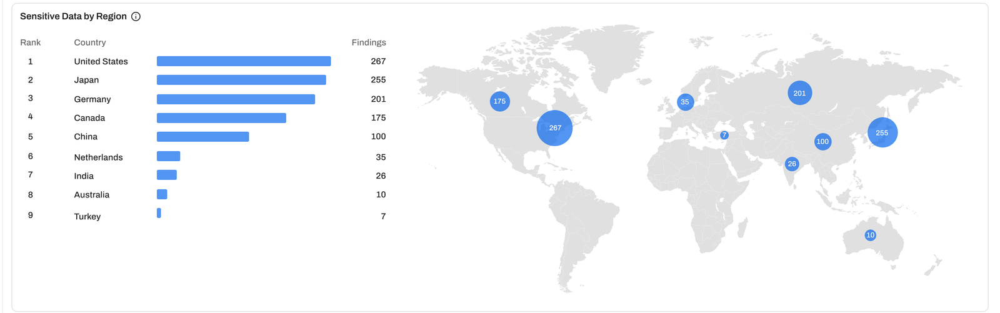
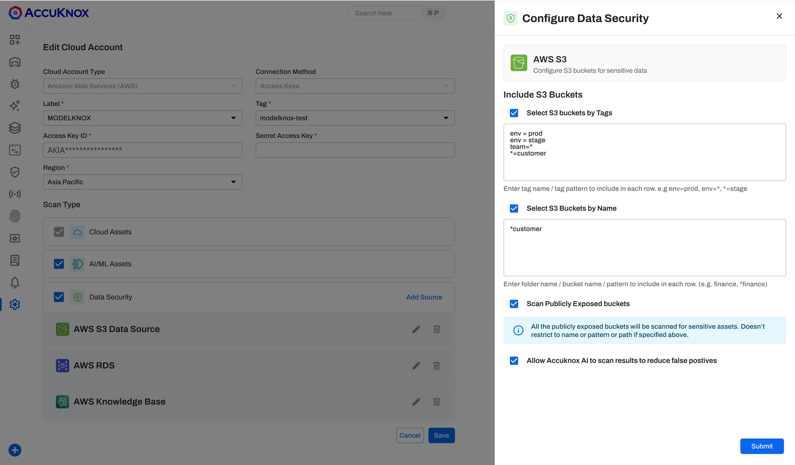
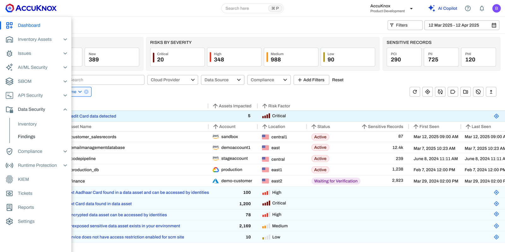
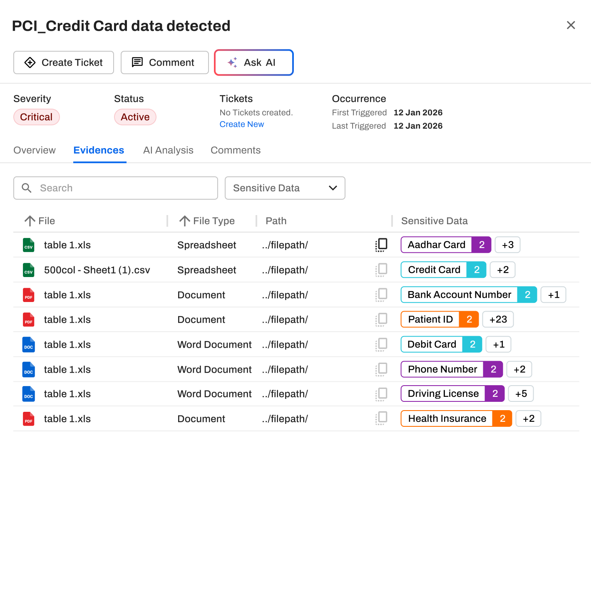
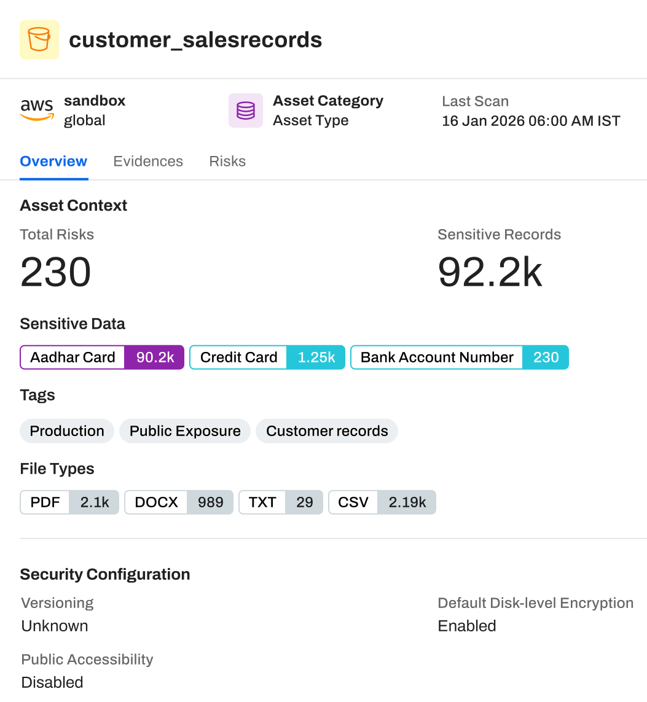
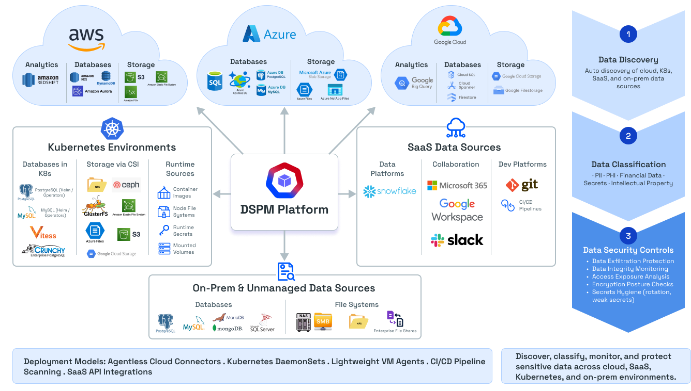

# Data Security Posture Management

AccuKnox Data Security Posture Management (DSPM) finds sensitive data in your buckets, databases and SaaS apps, and shows where it sits. The scanner runs on a machine you own, in the region that holds the data. It reads a sample with read-only access, classifies it in memory, and sends only a findings file to the AccuKnox console. To set up the scanner, see [Onboard the DSPM Scanner](dspm-onboarding.md).

## Product Tour

Watch the two-minute tour of AccuKnox DSPM.

<iframe width="560" height="315" src="https://www.youtube.com/embed/8foYZBdQtDQ" title="AccuKnox DSPM product tour" frameborder="0" referrerpolicy="strict-origin-when-cross-origin" allowfullscreen></iframe>

=== "Risk"

    { data-gallery="dspm-tour" data-title="Risk overview" }

    - Data alerts by severity, and findings trends over time.
    - The top 10 data findings, and the assets and accounts with the most findings.
    - Open tickets, and the spread of data across store types.

=== "Regions"

    { data-gallery="dspm-tour" data-title="Sensitive data by region" }

    - Findings ranked by the country that holds the data.
    - The same counts plotted on a world map.

=== "Connect S3"

    { data-gallery="dspm-tour" data-title="Scope an S3 source" }

    - Pick the buckets to scan by tag or by name pattern.
    - Scan every publicly exposed bucket.
    - Let AccuKnox AI review the results for false positives.

=== "Findings"

    { data-gallery="dspm-tour" data-title="Findings list" }

    - Findings grouped by name, such as an access key in plain text.
    - The impacted assets, their status and the sensitive record count for each finding.

=== "Evidence"

    { data-gallery="dspm-tour" data-title="Finding evidence" }

    - Each file behind the finding, with its type and path.
    - The sensitive data types found in each file.

=== "Assets"

    { data-gallery="dspm-tour" data-title="Asset overview" }

    - Total risks, and sensitive records by data type.
    - Tags and file types in the asset.
    - Security configuration, such as encryption and public access.

## Architecture

{ data-gallery="dspm-tour" data-title="DSPM architecture" }

## How the Scanner Works

| Item | Detail |
|---|---|
| Access | Read-only. The scanner code has no write path |
| Where it runs | A VM or a Kubernetes job in your cloud account, in the region that holds the data |
| What it reads | Up to 10,000 rows or documents per table or collection, and files up to 100 MB |
| What leaves | One findings file per data store, sent to the AccuKnox console over HTTPS |
| Schedule | Nightly, per data store |

<svg viewBox="0 0 720 360" xmlns="http://www.w3.org/2000/svg">
  <defs>
    <marker id="dspm-a1" viewBox="0 0 8 8" refX="7" refY="4" markerWidth="7" markerHeight="7" orient="auto">
      <path class="head" d="M0 0 L8 4 L0 8 z"/>
    </marker>
    <marker id="dspm-a1acc" viewBox="0 0 8 8" refX="7" refY="4" markerWidth="7" markerHeight="7" orient="auto">
      <path class="head-acc" d="M0 0 L8 4 L0 8 z"/>
    </marker>
  </defs>

  <rect class="hollow" x="10" y="10" width="700" height="226" rx="10" stroke-dasharray="6 5"/>
  <text class="t-s" x="26" y="32">Your cloud account, one region</text>

  <rect class="acc" x="30" y="46" width="230" height="170" rx="10" stroke-width="1.5"/>
  <text class="t-h t-acc" x="145" y="80" text-anchor="middle">DSPM scanner</text>
  <text class="t-b" x="145" y="112" text-anchor="middle">VM or Kubernetes CronJob</text>
  <text class="t-b" x="145" y="138" text-anchor="middle">Runs nightly</text>
  <text class="t-b" x="145" y="164" text-anchor="middle">Read-only access</text>
  <text class="t-b" x="145" y="190" text-anchor="middle">No inbound ports</text>

  <path class="ln-acc" d="M260 72 H426" marker-end="url(#dspm-a1acc)"/>
  <path class="ln-acc" d="M260 132 H426" marker-end="url(#dspm-a1acc)"/>
  <path class="ln-acc" d="M260 192 H426" marker-end="url(#dspm-a1acc)"/>
  <text class="t-s" x="343" y="64" text-anchor="middle">Read-only</text>
  <text class="t-s" x="343" y="124" text-anchor="middle">Read-only role</text>
  <text class="t-s" x="343" y="184" text-anchor="middle">Role assignment</text>

  <rect class="p" x="430" y="46" width="260" height="52" rx="8"/>
  <text class="t-h" x="560" y="77" text-anchor="middle">Data in this account</text>

  <rect class="p" x="430" y="106" width="260" height="52" rx="8"/>
  <text class="t-h" x="560" y="137" text-anchor="middle">Other AWS accounts</text>

  <rect class="p" x="430" y="166" width="260" height="52" rx="8"/>
  <text class="t-h" x="560" y="197" text-anchor="middle">Other Azure subscriptions</text>

  <path class="ln" d="M145 216 V292" marker-end="url(#dspm-a1)"/>
  <text class="t-s" x="157" y="272">Findings, HTTPS 443</text>
  <path class="ln" d="M230 216 V256 H560 V292" marker-end="url(#dspm-a1)"/>
  <text class="t-s" x="572" y="280">Image pull, HTTPS 443</text>

  <rect class="plane" x="30" y="296" width="230" height="50" rx="8"/>
  <text class="t-plane" x="145" y="326" text-anchor="middle">AccuKnox console</text>

  <rect class="p" x="430" y="296" width="260" height="50" rx="8"/>
  <text class="t-h" x="560" y="326" text-anchor="middle">Container registry</text>
</svg>

Nothing connects inbound to the scanner. Each region gets its own scanner.

<svg viewBox="0 0 720 370" xmlns="http://www.w3.org/2000/svg">
  <defs>
    <marker id="dspm-a2" viewBox="0 0 8 8" refX="7" refY="4" markerWidth="7" markerHeight="7" orient="auto">
      <path class="head" d="M0 0 L8 4 L0 8 z"/>
    </marker>
    <marker id="dspm-a2acc" viewBox="0 0 8 8" refX="7" refY="4" markerWidth="7" markerHeight="7" orient="auto">
      <path class="head-acc" d="M0 0 L8 4 L0 8 z"/>
    </marker>
  </defs>

  <rect class="hollow" x="10" y="10" width="700" height="256" rx="10" stroke-dasharray="6 5"/>
  <text class="t-s" x="26" y="32">Your cloud account, one region</text>

  <rect class="p" x="30" y="46" width="170" height="56" rx="8"/>
  <text class="t-h" x="115" y="80" text-anchor="middle">Databases</text>

  <rect class="p" x="30" y="122" width="170" height="56" rx="8"/>
  <text class="t-h" x="115" y="156" text-anchor="middle">Object stores</text>

  <rect class="p" x="30" y="198" width="170" height="56" rx="8"/>
  <text class="t-h" x="115" y="232" text-anchor="middle">SaaS apps</text>

  <rect class="p2" x="250" y="122" width="170" height="132" rx="8"/>
  <text class="t-h" x="335" y="152" text-anchor="middle">Parse files</text>
  <text class="t-b" x="335" y="180" text-anchor="middle">CSV, Excel, Parquet</text>
  <text class="t-b" x="335" y="204" text-anchor="middle">JSON, PDF, Office</text>
  <text class="t-b" x="335" y="228" text-anchor="middle">Archives, OCR</text>

  <rect class="acc" x="470" y="46" width="220" height="128" rx="10" stroke-width="1.5"/>
  <text class="t-h t-acc" x="580" y="78" text-anchor="middle">Classify in memory</text>
  <text class="t-b" x="580" y="106" text-anchor="middle">159 detectors</text>
  <text class="t-b" x="580" y="130" text-anchor="middle">62 country packs</text>
  <text class="t-b" x="580" y="154" text-anchor="middle">Confidence per finding</text>

  <rect class="p" x="470" y="198" width="220" height="56" rx="8"/>
  <text class="t-h" x="580" y="232" text-anchor="middle">Findings file</text>

  <path class="ln" d="M200 74 H466" marker-end="url(#dspm-a2)"/>
  <text class="t-s" x="333" y="66" text-anchor="middle">Rows stream in</text>
  <path class="ln" d="M200 150 H246" marker-end="url(#dspm-a2)"/>
  <path class="ln" d="M200 226 H246" marker-end="url(#dspm-a2)"/>
  <path class="ln" d="M420 150 H466" marker-end="url(#dspm-a2)"/>
  <path class="ln" d="M580 174 V194" marker-end="url(#dspm-a2)"/>

  <path class="ln-acc" d="M580 254 V306" marker-end="url(#dspm-a2acc)"/>
  <text class="t-s t-acc" x="568" y="290" text-anchor="end">HTTPS, findings only</text>

  <rect class="plane" x="470" y="310" width="220" height="50" rx="8"/>
  <text class="t-plane" x="580" y="340" text-anchor="middle">AccuKnox console</text>
</svg>

Database rows never touch disk. Parsed files sit in memory-backed scratch space until the run ends.

??? info "Deployment options"

    | Deployment | Use it when | How it runs |
    |---|---|---|
    | VM with systemd timers | The default for most teams | One timer per data store starts one short-lived container each night |
    | Kubernetes CronJob | You already run EKS or AKS | The same image on a schedule, with IRSA or workload identity as the credential |
    | Event-driven function | You want new objects scanned as they land | An AWS Lambda handler scans one object or table per event from S3 notifications, SQS or DynamoDB streams |

    Each data store gets its own instance, which is one environment file. S3 gets one instance per AWS account, Blob Storage one per storage account, and a database one per server. A failure in one instance never touches another.

    The container runs with a read-only root filesystem, all Linux capabilities dropped and no privilege escalation.

## Supported Data Stores

| Asset type | AWS | Azure | Self-managed | SaaS |
|---|---|---|---|---|
| Object storage | S3 | Blob Storage, ADLS Gen2 | :material-close: | Google Drive |
| Relational databases | RDS and Aurora for PostgreSQL, MySQL, MariaDB and SQL Server | Azure Database for PostgreSQL and MySQL, Azure SQL Database and Managed Instance | PostgreSQL, MySQL, MariaDB, SQL Server | :material-close: |
| Document and key-value databases | DocumentDB, DynamoDB (event-driven mode) | Cosmos DB for NoSQL and for MongoDB | MongoDB | :material-close: |
| SaaS applications | :material-close: | :material-close: | :material-close: | Google Workspace Drive, Salesforce |
| Secret stores for database passwords | Secrets Manager | Key Vault | :material-close: | :material-close: |

!!! warning "Not supported"
    Google Cloud Storage, SMB or NFS file shares, Oracle Database, and data warehouses such as Snowflake.

??? info "What the scanner reads in each data store"

    | Data store | What the scanner reads |
    |---|---|
    | Amazon S3 | Every object in the bucket. Files up to 100 MB, archives unpacked |
    | Azure Blob Storage, ADLS Gen2 | Every blob in the container. Archive-tier, page and soft-deleted blobs are skipped |
    | PostgreSQL, MySQL, MariaDB, SQL Server, including RDS, Aurora and Azure | All non-system schemas, up to 10,000 rows per table |
    | MongoDB, Amazon DocumentDB | All non-system collections, up to 10,000 documents each, nested fields included |
    | Amazon DynamoDB | Tables, up to 10,000 items. Event-driven mode only |
    | Cosmos DB for NoSQL | Every container of the database, up to 10,000 items each |
    | Cosmos DB for MongoDB | Same as MongoDB. Request-rate throttling is retried |
    | Google Workspace Drive | A user's My Drive or a shared drive. Docs, Sheets and Slides are exported and read |
    | Salesforce | Every business object with records, text fields, and the files attached to records |

    **File formats.** CSV and TSV, Excel workbooks sheet by sheet, Parquet, JSON and JSON Lines, XML, PDF, Word, PowerPoint, images through OCR, and zip, tar, gz and bz2 archives unpacked recursively. The scanner reads any other format as plain text.

## What the Scanner Detects

The scanner ships 283 data classes. Each finding carries a confidence tier, and the console receives findings at or above the confidence floor you set. The default floor is Likely.

| Confidence tier | Meaning | Example |
|---|---|---|
| Very likely | A validated shape plus corroboration | A checksum-valid national ID in a column named for it |
| Likely | One strong signal | A valid email, or a card number with a valid checksum |
| Possible | A plausible shape only | Nine digits in SSN groups. Never reported on its own |

??? info "Data classes by category"

    | Category | Data classes | Examples |
    |---|---|---|
    | Regional compliance | 117 | US SSN and ITIN, Indian Aadhaar, PAN and GST, UK National Insurance number, Spanish DNI and NIE, Canadian SIN. Each is checked with its public check-digit algorithm where one exists |
    | Credentials and secrets | 114 | AWS access and secret keys, Azure storage keys and SAS tokens, GCP service account keys, tokens from GitHub, Slack, Stripe, OpenAI and more than 50 other vendors, JWTs, private key headers, password hashes |
    | Healthcare data (PHI) | 21 | NHS number, US Medicare beneficiary ID, NPI and DEA numbers, claim and prescription numbers, medical record numbers, ICD-10 and NDC codes |
    | PII | 19 | Email, phone numbers, person names, street addresses, dates of birth, public IP addresses, IMEI, VIN, passport machine-readable zones |
    | Financial data | 10 | Payment card numbers by issuer prefix and checksum, IBAN, SWIFT/BIC, bank account and ABA routing numbers, cryptocurrency wallet addresses |
    | Entropy-based secret | 1 | Random-looking tokens with supporting evidence. Off by default |
    | Technical identifier | 1 | UUIDs. Shipped disabled |

    The catalogue labels 226 data classes Restricted, 29 Confidential and 28 Internal. It rates 165 Critical, 63 High, 23 Medium, 29 Low and 3 Lowest.

??? info "The 62 country packs"
    AE, AR, AT, AU, BE, BG, BR, CA, CH, CL, CN, CZ, DE, DK, EE, EG, ES, FI, FR, GB, GH, GR, HK, HR, HU, ID, IE, IL, IN, IS, IT, JP, KR, LK, LT, LU, LV, MX, MY, NG, NL, NO, NZ, PH, PK, PL, PT, RO, RS, RU, SA, SE, SG, SI, SK, TH, TR, TW, UA, US, VN and ZA.

    Enable the packs for the countries you operate in. The same list decides which national phone-number formats the scanner recognises. Generic detectors such as email, cards, IBAN, secrets and IP addresses always run.

The scanner never reports documented example keys, test card numbers, epoch timestamps, or values on your allow list.

## Compliance Mapping

282 of the 283 data classes carry the regulation clauses they fall under. Filter findings by a framework in the console to list the assets that hold data under that framework. The scanner shows where regulated data sits. It does not assess the controls around that data.

??? info "Frameworks and data classes"

    | Framework | Data classes | What it covers |
    |---|---|---|
    | GDPR (EU) | 78 | National identifiers of EU member states, contact details, dates of birth, health and financial identifiers. Cited to Articles 4, 9 and 32 |
    | UK GDPR and Data Protection Act 2018 | 12 | National Insurance number, NHS number, UK passport and driving licence, UTR, sort code |
    | PCI DSS v3.2.1 and v4.0 | 107 | Card numbers under Requirements 3.4 and 3.5.1. Credential and key classes under Requirements 3.6, 3.7 and 8.3 |
    | HIPAA and HITECH | 26 | Health identifiers, member, claim and prescription numbers, plus SSN, date of birth and account numbers under 45 CFR 164.514(b)(2) |
    | CPRA and CCPA (California) | 21 | SSN, cards, bank accounts, contact details, health identifiers |
    | GLBA, FTC Safeguards and US state breach-notification laws | 12 | SSN, ITIN, EIN, alien registration number, bank account, routing and SWIFT numbers |
    | India DPDP Act 2023 and SPDI Rules 2011 | 17 | Aadhaar, PAN, GST, passport, financial information, passwords |
    | South Africa POPIA | 9 | ID number, passport, driver licence, traffic register number, phone numbers |
    | Korea PIPA | 4 | Resident and foreigner registration numbers, driver licence, passport |
    | Canada PIPEDA | 3 | SIN, postal code, OHIP number |
    | Australia and New Zealand Privacy Acts | 6 | TFN, Medicare, IHI, BSB, IRD, NHI |
    | Philippines Data Privacy Act | 6 | UMID, TIN, passport, mobile numbers |
    | Nigeria and Ghana Data Protection Acts | 3 | NIN, vehicle registration, Ghana Card |
    | Argentina Ley 25.326 and Chile Ley 19.628 | 4 | CUIT, DNI, RUT |
    | Germany SGB V | 2 | Physician and practice numbers |
    | NIST SP 800 series, OWASP, CIS AWS Foundations Benchmark, SOC 2 | 110 | Every credential and secret class: cloud keys, vendor tokens, private keys, password hashes |

    Each data class also cites its CWE weaknesses and MITRE ATT&CK techniques. Coverage follows the country packs you enable.

## Data Privacy

The scanner discards every row and file after classification. The findings file holds each matched value cut at 200 characters, and the console shows that value masked to its last four characters.

??? info "Security details"

    | Question | Answer |
    |---|---|
    | What access does the scanner hold? | Read-only grants only. The code has no path that writes to, deletes from or changes a data store |
    | Where does classification happen? | On the VM or cluster in your account. The language model for names runs inside the container. No data goes to an external service |
    | What leaves your account? | One zipped findings file per data store, uploaded over HTTPS with a bearer token |
    | What is in a finding? | The data type, category, confidence, evidence, location, occurrence count, a hash of the value, and the matched value cut at 200 characters |
    | What stays on the VM? | The findings file, in a root-owned directory, removed after 30 days. Downloaded files are gone when the run ends |
    | How are credentials handled? | Platform identity where possible: instance role, managed identity, workload identity, Entra tokens. A required password sits in a root-only file, Key Vault or Secrets Manager. Logs redact SAS tokens and account keys |
    | Does data cross regions? | No. The AWS role denies other regions by condition. On Azure, storage firewalls and role scopes limit the scanner to its region |
    | How is the image updated? | You pin an image tag. Each run pulls that tag when the registry is reachable and runs the cached image when it is not. You can mirror the image into your own registry |

## Run the Console On-Premises

AccuKnox can run the scanner, the findings and the console together on-premises or air-gapped. With the on-premises console, nothing leaves your boundary.

<svg viewBox="0 0 720 250" xmlns="http://www.w3.org/2000/svg">
  <defs>
    <marker id="dspm-a3" viewBox="0 0 8 8" refX="7" refY="4" markerWidth="7" markerHeight="7" orient="auto">
      <path class="head" d="M0 0 L8 4 L0 8 z"/>
    </marker>
    <marker id="dspm-a3bad" viewBox="0 0 8 8" refX="7" refY="4" markerWidth="7" markerHeight="7" orient="auto">
      <path class="head-bad" d="M0 0 L8 4 L0 8 z"/>
    </marker>
  </defs>

  <rect class="hollow" x="10" y="34" width="500" height="206" rx="10" stroke-dasharray="6 5"/>
  <text class="t-s" x="26" y="24">Inside your boundary</text>
  <text class="t-s" x="540" y="24">Outside your boundary</text>

  <text class="t-h" x="26" y="64">Typical SaaS DSPM</text>
  <rect class="p" x="26" y="76" width="140" height="50" rx="8"/>
  <text class="t-h" x="96" y="106" text-anchor="middle">Data stores</text>
  <path class="ln" d="M166 101 H192" marker-end="url(#dspm-a3)"/>
  <rect class="p" x="196" y="76" width="140" height="50" rx="8"/>
  <text class="t-h" x="266" y="106" text-anchor="middle">Scanner</text>
  <path class="ln-bad" d="M336 101 H536" marker-end="url(#dspm-a3bad)"/>
  <text class="t-s t-bad" x="436" y="92" text-anchor="middle">Findings, metadata</text>
  <rect class="bad" x="540" y="76" width="170" height="50" rx="8"/>
  <text class="t-h" x="625" y="106" text-anchor="middle">Vendor SaaS</text>

  <text class="t-h t-acc" x="26" y="164">AccuKnox DSPM</text>
  <rect class="p" x="26" y="176" width="140" height="50" rx="8"/>
  <text class="t-h" x="96" y="206" text-anchor="middle">Data stores</text>
  <path class="ln" d="M166 201 H192" marker-end="url(#dspm-a3)"/>
  <rect class="p" x="196" y="176" width="140" height="50" rx="8"/>
  <text class="t-h" x="266" y="206" text-anchor="middle">Scanner</text>
  <path class="ln" d="M336 201 H362" marker-end="url(#dspm-a3)"/>
  <rect class="plane" x="366" y="176" width="134" height="50" rx="8"/>
  <text class="t-plane" x="433" y="206" text-anchor="middle">AccuKnox console</text>
  <rect class="good" x="540" y="183" width="170" height="36" rx="18"/>
  <text class="t-h t-ok" x="625" y="206" text-anchor="middle">Nothing leaves</text>
</svg>

??? info "How other DSPM vendors deploy"

    | | AccuKnox DSPM | Cyera | Varonis | BigID | IBM Guardium DSPM |
    |---|---|---|---|---|---|
    | Where scanning runs | A VM or CronJob you own, in the data's region | Cyera's cloud, or an outpost cluster in your cloud | Collectors in your environment, analysis in Varonis SaaS | Cloud scanners, or local scanners in your environment | An analyzer in your cloud account, per region |
    | Where the console lives | AccuKnox SaaS, or on-premises or air-gapped | Cyera SaaS | Varonis SaaS | BigID SaaS, or self-hosted on your Kubernetes | IBM SaaS |
    | What leaves your environment | Nothing with the on-premises console. One findings file per store with SaaS | Metadata and results | Metadata from the collectors | Nothing when self-hosted | Metadata |
    | Air-gapped operation | :material-check: Console included | :material-close: | Offline collector installs only | Possible on your own Kubernetes | :material-close: |

    Vendor facts come from each vendor's public documentation as of September 2026. Varonis ends its self-hosted product on 31 December 2026. IBM now lists Guardium Discover and Classify in place of a Guardium DSPM module, so the IBM column shows the last documented DSPM analyzer model.
