# Damn Vulnerable Web Applications with AccuKnox CWPP

Damn Vulnerable Web Application (DVWA) is a PHP/MySQL web application designed to be _damn vulnerable_. It serves as a resource for security professionals to test their skills and tools in a legal environment, helps web developers understand the processes of securing web applications, and aids students & teachers in learning about web application security in a controlled classroom setting.

## 1. Prerequisites & Setup

### System Requirements

To deploy and secure DVWA with AccuKnox CWPP, ensure the following:

- Kubernetes cluster running
- Access to the AccuKnox platform
- DVWA image pulled from [Docker Hub](https://hub.docker.com/r/vulnerables/web-dvwa)
- kubectl configured with appropriate permissions

### Initial DVWA Deployment Steps

1. Deploy the DVWA application in your cluster within the `dvwa` namespace.
2. Ensure both the Web and MySQL pods are running with their respective services.

### AccuKnox Platform Access Requirements

- Active AccuKnox CWPP subscription.
- Cluster and namespace added to the AccuKnox platform.

## 2. DVWA Vulnerability Testing Integration

### DVWA Attack Points

- **Command Injection**: Exploiting insecure user data transmission.
- **CSRF (Cross-Site Request Forgery)**: Forging links to steal cookies or form data.
- **SQL Injection**: Unauthorized database access.
- **CSP (Content Security Policy)**: Executing malicious scripts from allowed domains.

DVWA web application is deployed in the cluster in the `dvwa` namespace with both Web and MySQL pods running.

### How AccuKnox Protects Against Specific DVWA Attack Vectors

Once the cluster with the DVWA application is onboarded, navigate to **Runtime Security → App Behavior** in AccuKnox to observe application behavior.

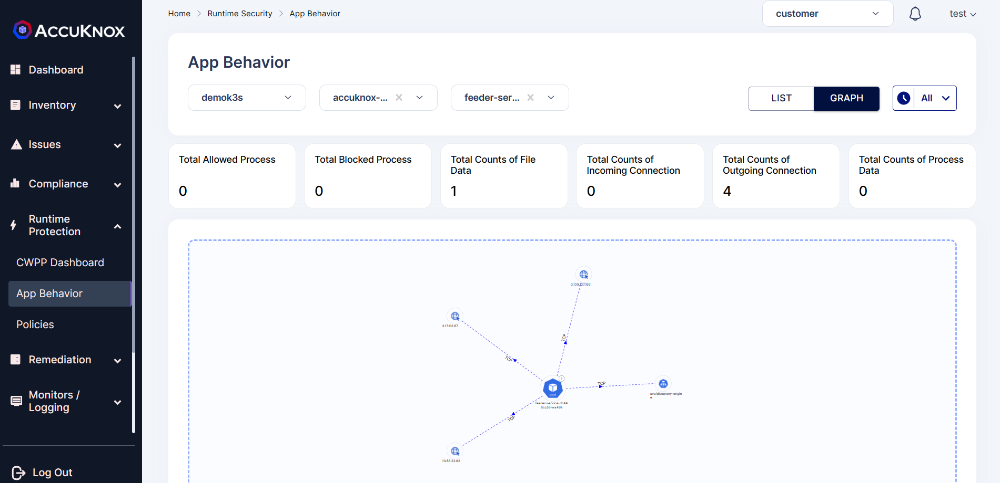

#### Real-time Attack Detection Examples

**1. Network Observability**: Data on network connections within the pod.
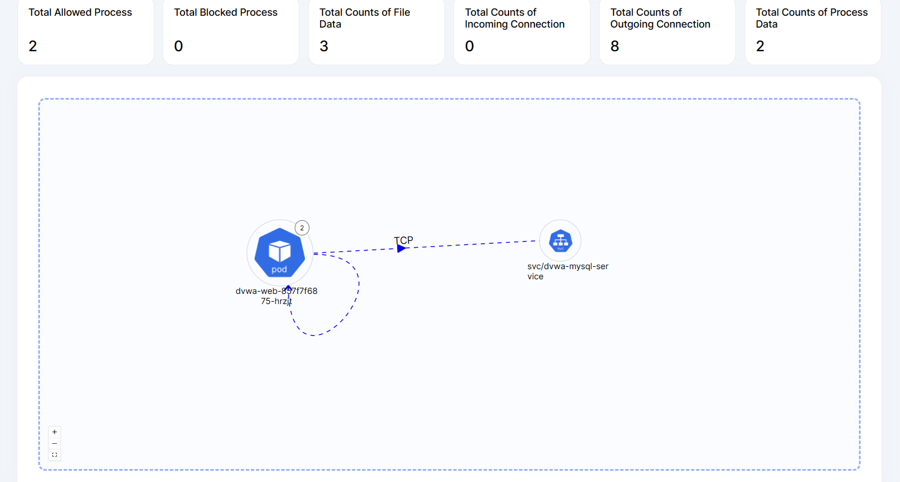

**2. File Observability**: Information on files accessed in the pod.
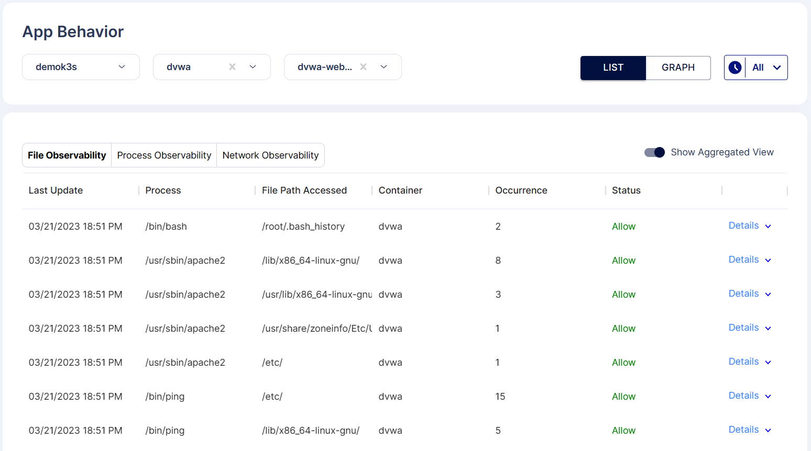

**3. Process Observability**: Insights on processes executed in the pod.
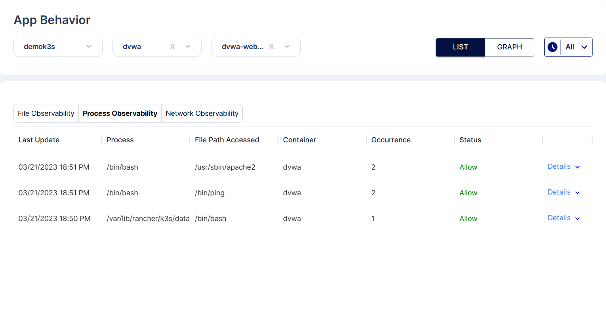

## 3. Policy Configuration Details

### Policy Customization Options

According to the application behavior, the DVWA pod uses processes like `ping` and `apache2`. These processes can be whitelisted to block any other unauthorized executions.

### Understanding Policy Severity Levels

AccuKnox CWPP policies allow you to set severity levels to prioritize blocking based on risk.

### Best Practices for Policy Creation

- Whitelist only required processes and files.
- Regularly review and approve pending policies.

## 4. Monitoring & Analysis

### Alert Investigation Workflow

Monitor alerts by navigating to **Monitors/Logs → Logs** in the AccuKnox dashboard.
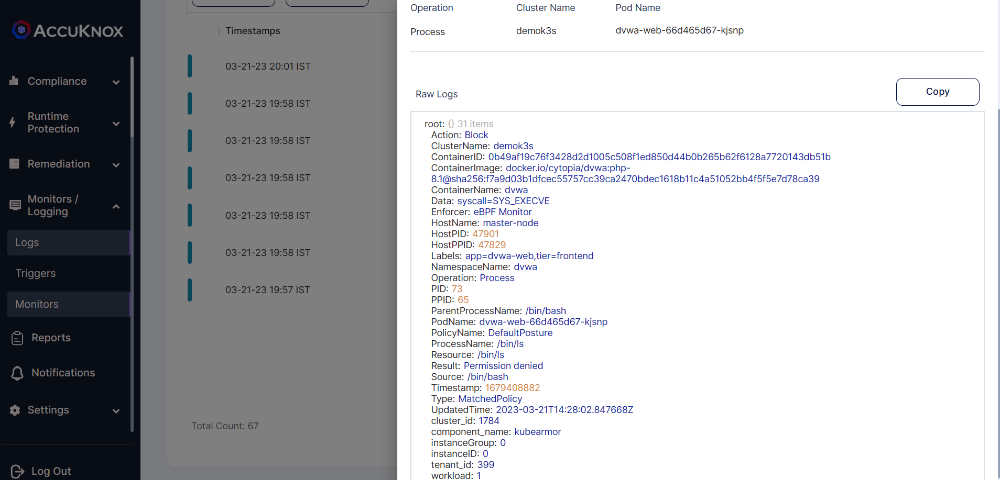

### Performance Impact Assessment

Assess DVWA pod performance post-policy enforcement to ensure there are no disruptions.

### Compliance Reporting

Use the platform’s reporting feature to validate compliance with organizational or regulatory security standards.

## 5. Protection Workflow With AccuKnox CWPP

### Before Applying Policy

Initially, all processes can be executed inside the DVWA pod.
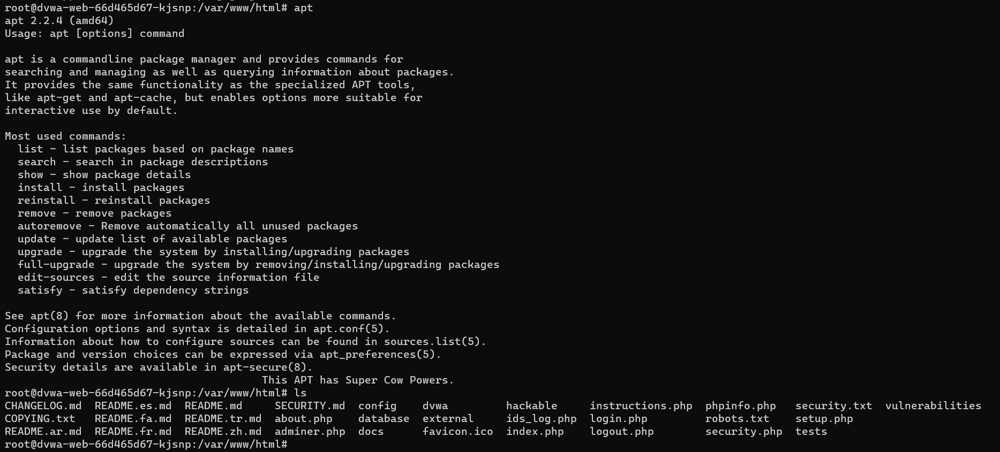

### Applying KubeArmor Policy

1. Navigate to **Runtime Protection → Policies** in the AccuKnox UI.
   

2. View auto-discovered policies for the DVWA application.
   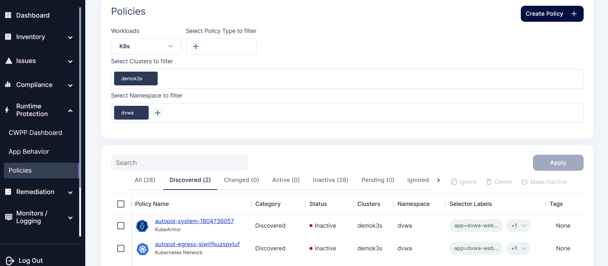

3. Select and review the system policy for the `dvwa-web` pod.
   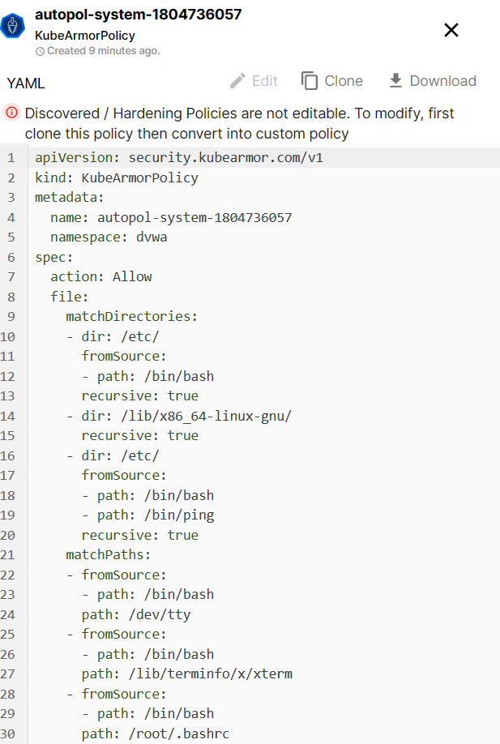

```yaml
apiVersion: security.kubearmor.com/v1
kind: KubeArmorPolicy
metadata:
  name: autopol-system-1804736057
  namespace: dvwa
spec:
  action: Allow
  file:
    matchDirectories:
      - dir: /etc/
        fromSource:
          - path: /bin/bash
        recursive: true
      - dir: /lib/x86_64-linux-gnu/
        recursive: true
      - dir: /etc/
        fromSource:
          - path: /bin/bash
          - path: /bin/ping
        recursive: true
    matchPaths:
      - fromSource:
          - path: /bin/bash
        path: /dev/tty
      - fromSource:
          - path: /bin/bash
        path: /lib/terminfo/x/xterm
      - fromSource:
          - path: /bin/bash
        path: /root/.bashrc
      - fromSource:
          - path: /bin/ping
        path: /usr/lib/x86_64-linux-gnu/gconv/gconv-modules.cache
      - fromSource:
          - path: /bin/ping
        path: /usr/lib/x86_64-linux-gnu/libidn2.so.0.3.7
      - fromSource:
          - path: /bin/ping
        path: /usr/lib/x86_64-linux-gnu/libunistring.so.2.1.0
      - fromSource:
          - path: /usr/sbin/apache2
        path: /etc/ld.so.cache
      - fromSource:
          - path: /usr/sbin/apache2
        path: /usr/lib/x86_64-linux-gnu/libapr-1.so.0.7.0
      - fromSource:
          - path: /usr/sbin/apache2
        path: /usr/lib/x86_64-linux-gnu/libaprutil-1.so.0.6.1
      - fromSource:
          - path: /usr/sbin/apache2
        path: /usr/lib/x86_64-linux-gnu/libuuid.so.1.3.0
      - fromSource:
          - path: /usr/sbin/apache2
        path: /usr/share/zoneinfo/Etc/UTC
      - fromSource:
          - path: /bin/bash
        path: /root/.bash_history
  process:
    matchPaths:
      - path: /bin/bash
      - fromSource:
          - path: /bin/bash
        path: /bin/ping
      - fromSource:
          - path: /bin/bash
        path: /usr/sbin/apache2
  selector:
    matchLabels:
      app: dvwa-web
      tier: frontend
  severity: 1
```

4. Apply the policy.
   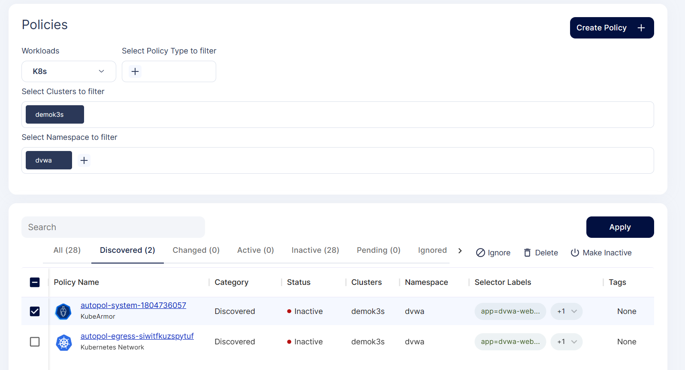

5. Policy enters pending state for approval.
   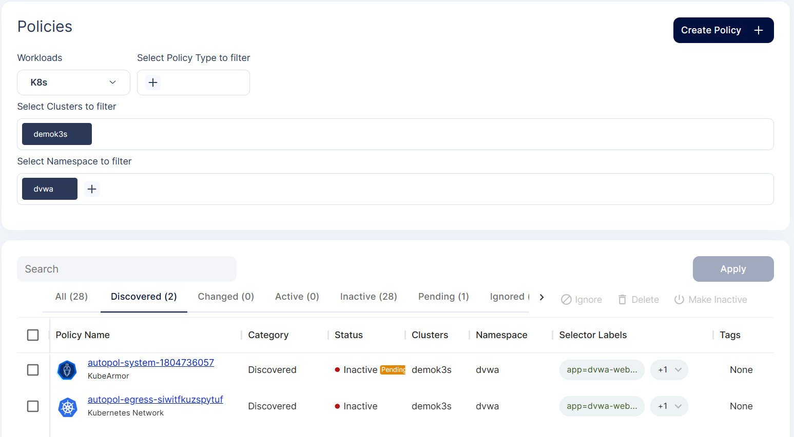

6. Review and approve the policy.
   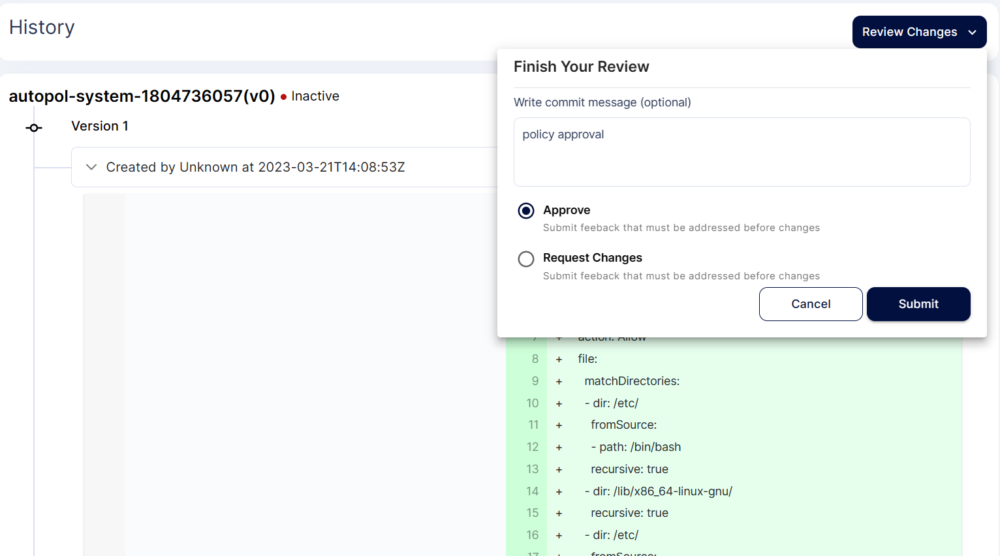

7. Once approved, the policy becomes active.
   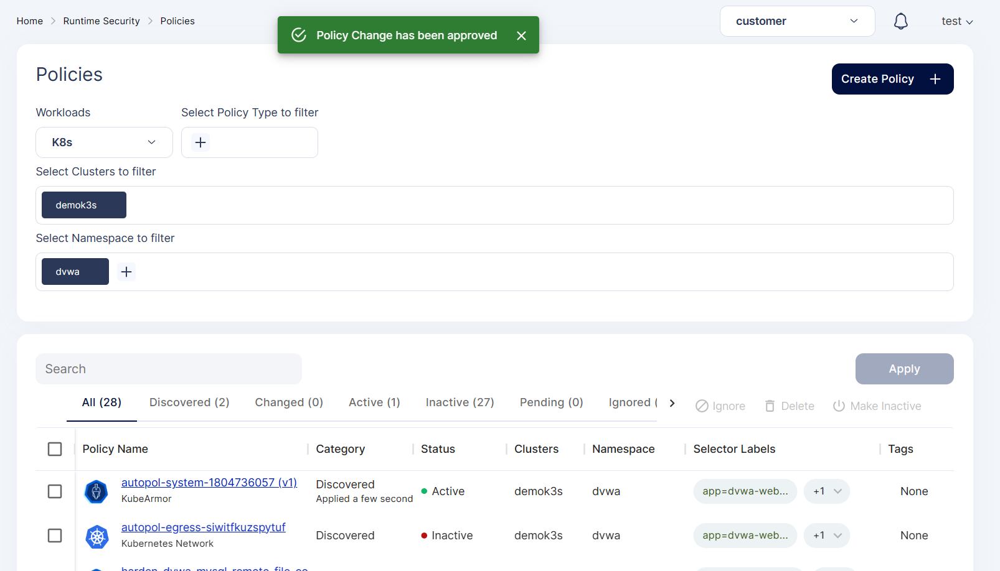

8. Any other processes executed in the DVWA pod will now be blocked.
   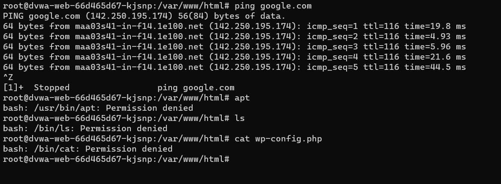

## 6. Troubleshooting

### Common Policy Application Issues

- Policies not applying due to namespace mismatch.
- Pod label selectors not configured correctly.

### Log Analysis Techniques

Use **Monitors/Logs** to investigate policy hits and blocked executions.

### Performance Optimization

Tune policy settings to balance security and application performance.

## 7. Advanced Use Cases

### Multi-Environment Deployment

Deploy DVWA with AccuKnox protection across multiple clusters and environments for testing.

### Integration with CI/CD Pipelines

Incorporate DVWA vulnerability scans and AccuKnox policy enforcement into your CI/CD workflows for DevSecOps.

Thus, the DVWA application’s web pod is protected using the **AccuKnox CWPP security solution**.

[SCHEDULE DEMO](https://www.accuknox.com/contact-us){ .md-button .md-button--primary }
