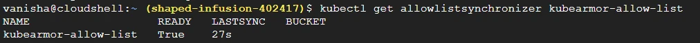
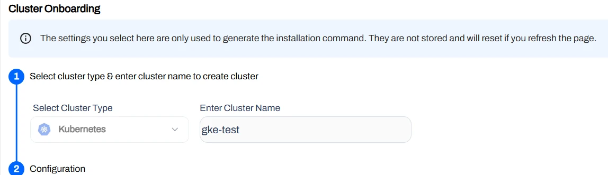
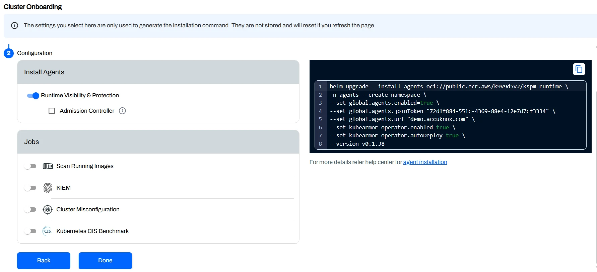
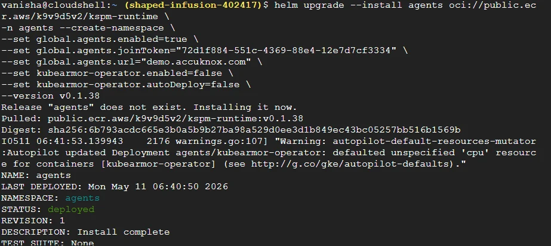
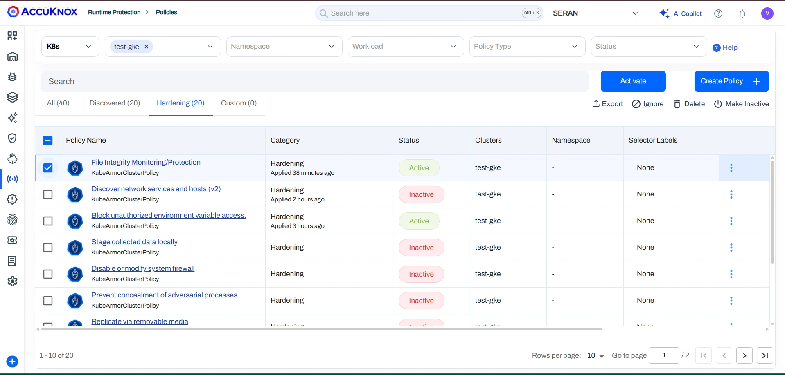
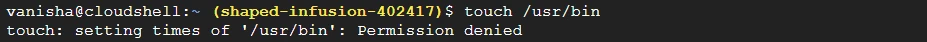
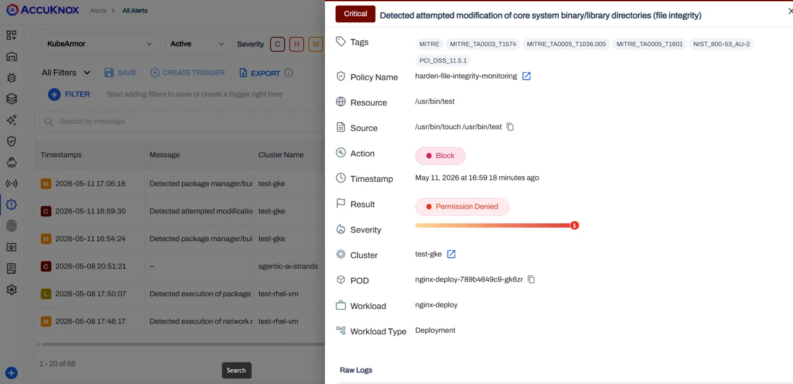
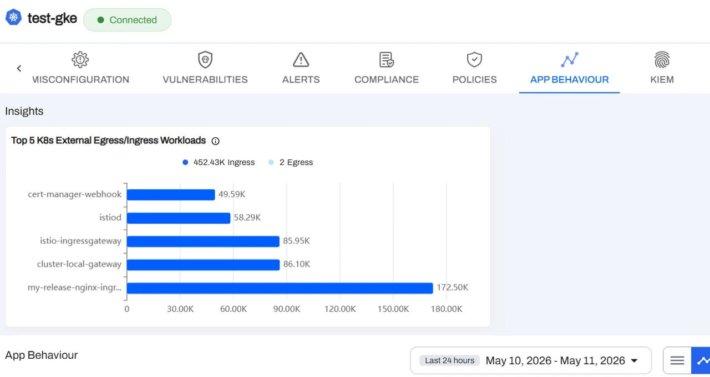
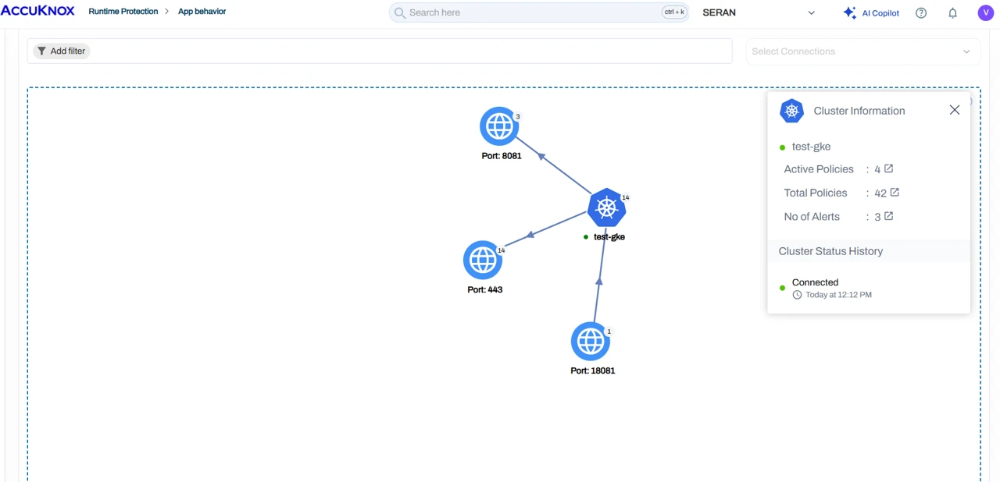

# CWPP for GKE Autopilot

!!! info "Overview"
    This guide walks you through installing KubeArmor on Google Kubernetes Engine (GKE) Autopilot, verifying the deployment, and onboarding your cluster to the AccuKnox Platform. It uses the Autopilot Workload Allowlist, Helm-based installation, and includes post-installation verification and hardening guidance.

GKE Autopilot restricts workloads that require advanced permissions or capabilities (for example, `hostPath` mounts or capabilities like `SYS_ADMIN`). Such workloads can be enabled using the Autopilot Workload Allowlist.

AccuKnox CWPP module powered with KubeArmor now maintains an allowlist for each stable release as part of [GKE partner workloads](https://cloud.google.com/kubernetes-engine/docs/how-to/run-autopilot-partner-workloads). You can use this allowlist to deploy AccuKnox CWPP runtime engine (KubeArmor) on your GKE Autopilot cluster.


## Prerequisites

- GKE Autopilot cluster with cluster-admin access (`kubectl` configured).
- Helm CLI v3.9+ installed.
- Permissions to create Autopilot Workload Allowlist resources.


## Step 1: Pull/Sync KubeArmor Allowlist

Apply the following YAML to synchronize the KubeArmor allowlist from the GKE partner repository.

```yaml
# kubearmor-allowlist.yaml
apiVersion: auto.gke.io/v1
kind: AllowlistSynchronizer
metadata:
  name: kubearmor-allowlist
spec:
  allowlistPaths:
  - AccuKnox/kubearmor/*
```

Verify that the KubeArmor allowlist is synchronized:

```sh
kubectl get allowlistsynchronizer kubearmor-allowlist
```

Expected output:



## Step 2: Install KubeArmor (Helm)

Add the Helm repo, update, and install KubeArmor in the `kubearmor` namespace:

```sh
helm repo add kubearmor https://kubearmor.github.io/charts
helm repo update kubearmor
helm upgrade --install kubearmor kubearmor/kubearmor \
  --set environment.name=autopilot \
  -n kubearmor --create-namespace
```


## Step 3: Verify Deployment

Confirm that KubeArmor pods are running:

```sh
kubectl get pods -n kubearmor
```


## Step 4: Onboard Cluster to AccuKnox Platform

Use the AccuKnox Platform UI to onboard your cluster:

1. Open **Settings > Manage Clusters > Onboard**.
2. Enter a name for your cluster and proceed.



**Configuration reference:**



!!! info "Join Token"
    The join token will be provided on the platform during cluster onboarding.

Once the cluster name is set, run the following Helm command to install AccuKnox agents. Use the join token and platform URL from the platform UI:

```sh
helm upgrade --install agents oci://public.ecr.aws/k9v9d5v2/kspm-runtime \
  -n agents --create-namespace \
  --set global.agents.enabled=true \
  --set global.agents.joinToken="<JOIN_TOKEN_FROM_PLATFORM>" \
  --set global.agents.url="<ACCUKNOX_PLATFORM_URL>" \
  --set kubearmor-operator.enabled=false \
  --set kubearmor-operator.autoDeploy=false \
  --version v0.1.38
```

Expected output:




## Post-Installation

!!! tip "Best Practices"
    - Use consistent namespaces and labels to simplify policy targeting.
    - Validate policies in **Audit** mode before enforcing in production.
    - Keep Helm releases and allowlists in source control for repeatability.

To verify agents are reporting correctly:

1. Go to **Inventory > Assets > Clusters** and select your onboarded cluster.
2. Review runtime events to confirm agents are reporting.
3. Apply recommended hardening policies to your namespaces and workloads.




## Applying and Enforcing Policies

Policies can be applied in two modes depending on the desired enforcement behaviour:

- **Block Mode** — Access or execution of the specified binary is actively denied. For example, attempts to access a restricted path such as `/usr/bin` will return a `Permission denied` error. The attempt is logged and a corresponding alert is visible in the Alerts section.

    

- **Audit Mode** — Actions are not blocked; matching attempts are recorded for visibility. Recommended during initial rollout to observe behaviour without impacting workloads.


## Alerts and Violation Monitoring

After applying and enforcing policies, any violation or unauthorized access attempt is automatically recorded and surfaced in the Alerts section. Navigate to **All Alerts** to review details such as source process, target resource, policy name, action taken, and timestamp.




## Monitoring Application Behaviour

Once policies are in place, you can observe detailed application behaviour from the platform, including:

- **Egress Connections** — Outbound connections initiated by the application, helping you identify any unexpected external communication.
- **Ingress Connections** — Inbound connections received by the application, providing visibility into which services or entities are reaching your workloads.
- **Graphical View** — A visual representation of the application's network activity and behaviour patterns, giving you an intuitive overview of how your workloads communicate and making it easy to spot anomalies at a glance.




