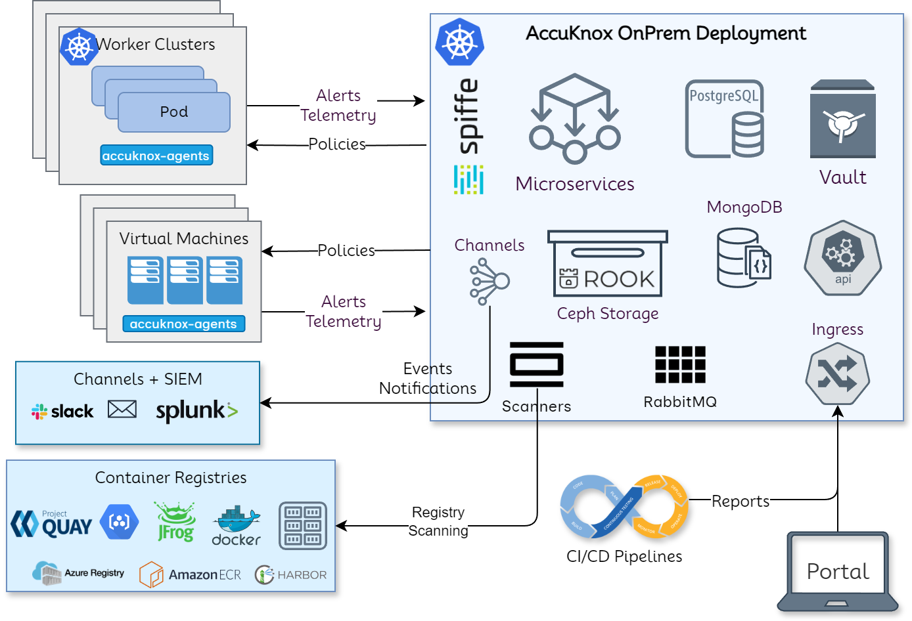
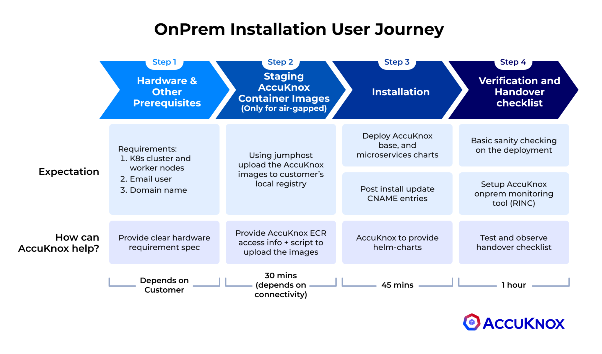

# AccuKnox OnPrem Deployment Guide

## High-Level Architecture Overview



AccuKnox onprem deployment is based on Kubernetes native architecture.

### AccuKnox OnPrem k8s components

#### Microservices

Microservices implement the API logic and provide the corresponding service endpoints. AccuKnox uses Golang-based microservices for handling streaming data (such as alerts and telemetry) and Python-based microservices for other control-plane services.

#### Databases

PostgreSQL is used as a relational database and MongoDB is used for storing JSON events such as alerts and telemetry. Ceph storage is used to keep periodic scanned reports and the Ceph storage is deployed and managed using the Rook storage operator.

#### Secrets Management

Within the on-prem setup, there are several cases where sensitive data and credentials have to be stored. Hashicorp's Vault is used to store internal (such as DB username/password) and user secrets (such as registry tokens). The authorization is managed purely using the k8s native model of service accounts. Every microservice has its service account and uses its service account token automounted by k8s to authenticate and subsequently authorize access to the secrets.

#### Scaling

K8s native horizontal and vertical pod autoscaling is enabled for most microservices with upper limits for resource requirements.

#### AccuKnox-Agents

Agents need to be deployed in target k8s clusters and virtual machines that have to be secured at runtime and to get workload forensics. Agents use Linux native technologies such as eBPF for workload telemetry and LSMs (Linux Security Modules) for preventing attacks/unknown execution in the target workloads. The security policies are orchestrated from the AccuKnox onprem control plane. AccuKnox leverages SPIFFE/SPIRE for workload/node attestation and certificate provisioning. This ensures that the credentials are not hardcoded and automatically rotated. This also ensures that if the cluster/virtual machine has to be deboarded then the control lies with the AccuKnox control plane.

## Onboarding Steps for AccuKnox

The onboarding process for AccuKnox's on-prem security solution consists of four key steps that the user must complete. Let's go through each step in a thorough, step-by-step manner:



### **Step 1: Hardware & Prerequisites**

- Verify hardware, email user, and domain configurations.
- Ensure your environment meets all requirements.
- Time estimate: **Varies**, allocate sufficient time for review and adjustments.

### **Step 2: Staging AccuKnox Container Images** _(For airgapped environments only)_

- Stage AccuKnox container images in the airgapped setup.
- Reconfirm hardware, email user, and domain requirements.
- Time estimate: **~1 hour**.

### **Step 3: Installation**

- Install the AccuKnox system within your environment.
- Ensure all prerequisites remain satisfied.
- Time estimate: **~45 minutes**.

### **Step 4: Verification/Validation**

- Confirm all previous steps were completed successfully.
- Validate hardware, email user, and domain configurations.
- Time estimate: **~1 hour**.

AccuKnox onprem deployment is based on Kubernetes native architecture.

## Pre-requisites to be prepared by the Customer Team

| **Pre-requisites**                                           | **Why is it needed?**                                                                                                                           | **Specs**                                                                                                                                                                                                                                                                                                                                                                 |
| ------------------------------------------------------------ | ----------------------------------------------------------------------------------------------------------------------------------------------- | ------------------------------------------------------------------------------------------------------------------------------------------------------------------------------------------------------------------------------------------------------------------------------------------------------------------------------------------------------------------------- |
| 3 Virtual machines or bare-metal nodes [Mandatory]           | To install the AccuKnox POC control plane in on-prem mode. Root access to the nodes would be required by the AccuKnox team during installation. | - 1 node with at least 4 CPU + 16GB <br> - 2 nodes, each with 8 CPU + 16GB <br> - Each node has at least 256 GB of disk space. <br> - Each node is installed with Debian 11 OS <br> - These 3 nodes should have full ingress + egress connectivity between themselves. <br> - Users/APIs access to ports [443, 8443, 3000, 8081, 9090] should be enabled for all these VMs. |
| Internet Connectivity [Mandatory]                            | The VMs would require Internet connectivity during the installation.                                                                            | Egress only access to Port 80 + 443.                                                                                                                                                                                                                                                                                                                                      |
| Email User + Password + email ID + Server Address [Optional] | AccuKnox Control plane allows one to invite other users to the Portal by sending an invitation via email                                        | AccuKnox Control plane configures 5 default users for whom the access will be enabled if this configuration is not provided.                                                                                                                                                                                                                                              |
| Trusted SSL Certificates [Optional]                          | SSL Certificates are used for AccuKnox Portal.                                                                                                  | If trusted certs are not provided, we can use self-signed certs.                                                                                                                                                                                                                                                                                                          |
| Domain name entries [Mandatory]                              | AccuKnox Portal and its REST APIs are accessible using these domain names.                                                                      | Domain names to configure: <br> - app.accuknox.domain.com <br> - cspm.accuknox.domain.com <br> - cwpp.accuknox.domain.com <br> - reports.accuknox.domain.com                                                                                                                                                                                                              |

## Hardware & Pre-Requisites

### VM System Requirements

All nodes are expected to make use of Debian 11 as their Operating System

| Type   | Nodes | Each node vCPUs | Each Node RAM (GB) | Each node Disk (GB) |
|--------|--------|------------------|---------------------|----------------------|
| Master | 1      | 4                | 8                   | 256                  |
| Worker | 2      | 8                | 16                  | 256                  |

## Container Registry

A Harbor container registry will be deployed on the master node if not available.
Full Access to the registry is required to push and pull the AccuKnox microservice images from this registry.

### Harbor Installation using Ansible

AccuKnox team will leverage an ansible playbook that:

- Installs Harbor
- Supports self-signed and letsencrypt-signed certificates.

This playbook is tested with Harbor version 2.6.0 on Ubuntu 24.10 & Debian 12.

#### External Roles

This playbook uses the following 3rd party collections/roles from ansible galaxy:

- [geerlingguy.certbot](https://galaxy.ansible.com/ui/standalone/roles/geerlingguy/certbot/): Installing and setting up certbot for managing letsencrypt-signed certificate.
- [geerlingguy.docker](https://galaxy.ansible.com/ui/standalone/roles/geerlingguy/docker/): Installing docker and docker-compose.
- [community.crypto](https://galaxy.ansible.com/ui/repo/published/community/crypto/): Generating self-signed certificate.
- [robertdebock.roles](https://galaxy.ansible.com/ui/repo/published/robertdebock/roles/): Collection of useful roles used to install Harbor.

#### Prerequisites

Make sure you have `ansible` and the `jmespath` python library installed.

```bash
python3 -m venv .venv
source .venv/bin/activate
pip3 install ansible jmespath netaddr
```

You can also install ansible using your distros package manager.

#### Running the Playbook

Please edit the hosts.yaml file based on your environment before running this playbook. E.g.,

```yaml
hosts:
  harbor:
    # this should point to a SSH host in your ssh config OR the VMs IP/Domain
-   # ansible_host: ""
-   # ansible_user: root
-   # ansible_ssh_private_key_file: /path/to/ssh-priv-key.pem
+   ansible_host: <your-harbor-host-ip>
+   ansible_user: root
+   ansible_ssh_private_key_file: /home/myuser/.ssh/harbor.pem

vars:
  ansible_python_interpreter: /usr/bin/python3
  harbor_installation_type: online
  # Specify the IP address or the fully qualified domain name (FQDN) of the target host on which to deploy Harbor.
- # harbor_hostname: "example.com"
+ harbor_hostname: "harbor-test.example.com"
  harbor_admin_password: "changeme"
  # Fill harbor_external_url if you want to enable external proxy.
  # Use either harbor_hostname or harbor_external_url
- # harbor_external_url: "https://example.com"
+ harbor_external_url: "https://harbor-test.example.com"
  harbor_enable_https: true

  ## certificate configuration ##
  ###############################
  cert:
-   # domain: "example.com"
+   domain: "harbor-test.example.com"
    # Both LetsEncrypt and self-signed cannot be enabled at the same time
    self_signed:
      enable: true
```

Next,

```bash
ansible-galaxy install -r requirements.yaml
ansible-playbook playbook.yaml
```

If your `ansible_user` is set to a non-root user on the system, ensure the user has permission to run commands with sudo. If running sudo commands requires a password, pass `--ask-become-pass` to the `ansible-playbook` command.

```bash
ansible-galaxy install -r requirements.yaml
ansible-playbook playbook.yaml --ask-become-pass
```

#### Add Registry CA Certificate to Worker Nodes

The harbor CA certificate should be located at /etc/nginx/certs/harbor.crt. You will have to copy it to every worker node under `/usr/local/share/ca-certificates/`

```bash
cat /etc/nginx/certs/harbor.crt
```

Worker Node:

```bash
vi /usr/local/share/ca-certificates/harbor.crt
```

You’ll also have run `update-ca-certificates` on the worker nodes and restart the container runtime (containerd / docker)

```bash
update-ca-certificates
```

**Note:** Restart the worker nodes.

## Kubernetes Cluster

Deploy K0s and initialize a cluster on the master node. Connect the worker nodes to the initialized cluster. Ensure the cluster is functional.

### Install k0s

```bash
wget https://github.com/k0sproject/k0sctl/releases/download/v0.19.4/k0sctl-linux-amd64
chmod +x k0sctl-linux-amd64
sudo mv k0sctl-linux-amd64 /usr/local/bin/k0sctl
```

Bootstrap the cluster

```bash
k0sctl apply -c k0s.yaml
```

Once the cluster bootstrapping is complete, generate the kubeconfig file:

```bash
k0sctl kubeconfig -c k0s.yaml
```

### Persistent Volume Provisioner/Controller

Used as data storage for SQL, MongoDB, scanned artifacts and other internal application components.

#### Longhorn Installation

If not already available, Longhorn will be installed on the cluster.

#### Prerequisites (Preparing Nodes)

Following commands need to be run on **all** the nodes:

```bash
#!/bin/bash
apt update -y
modprobe ceph
modprobe rbd
modprobe iscsi_tcp
apt install nfs-common -y
apt-get install open-iscsi -y
```

Please verify if the preflight check succeeds by following [this linked guide](https://longhorn.io/docs/1.9.0/deploy/install/#checking-prerequisites-using-longhorn-command-line-tool) before proceeding.

#### Installation

```bash
helm install longhorn . --namespace longhorn-system --create-namespace --set global.imageRegistry=<registry_address>
```

### Ingress Controller

For load balancing and providing access to the application.

### Attach Container Registry

If a container registry is available, we can connect to it, otherwise a Container Registry will be deployed as per the container registry prerequisites.

The container registry credentials should be configured in the cluster to access the container images.

## Jump Host


The jump host should have admin access to the deployed Kubernetes cluster to perform the installation.

The jump host should have **80 GB of storage** available. This will be required to temporarily store the container images before pushing them to the container registry.

### Tools to be Installed

| Tool      | Version              | Install Command                                |
|-----------|----------------------|-------------------------------------------------|
| `jq`      | 1.6                  | `apt install jq`                                |
| `unzip`   | x.x                  | `apt install unzip`                             |
| `yq`      | v4.40.x              | _See detailed install script below_             |
| `helm`    | v3.x.x               | `curl https://raw.githubusercontent.com/helm/helm/main/scripts/get-helm-3 \| bash` |
| `kubectl` | Supported by cluster | _Ensure compatible version is used_             |
| `aws`     | v2                   | _See detailed install script below_             |
| `docker`  | v20.xx               | `apt install docker.io`                         |

#### yq Installation (v4.40.x)

```bash
VERSION=v4.40.5
BINARY=yq_linux_amd64
wget https://github.com/mikefarah/yq/releases/download/${VERSION}/${BINARY}.tar.gz -O - | tar xz
mv ${BINARY} /usr/bin/yq
```

#### AWS CLI v2 Installation

```bash
curl "https://awscli.amazonaws.com/awscli-exe-linux-x86_64.zip" -o "awscliv2.zip"
unzip awscliv2.zip
sudo ./aws/install --bin-dir /usr/local/bin --install-dir /usr/local/aws-cli --update
```

### SMTP Server

A working SMTP server is required for:

- User sign-in
- Password change
- Scan notifications
- Sending reports

**Required credentials:**

- Email Username
- Password
- Sender Email ID
- Email Server Address

### Network Requirements

#### External Connections

Connectivity between AccuKnox components and other networks.

| Component A      | Component/Endpoint B                 | Ports               | Connection Type | Purpose                                                                 |
|------------------|--------------------------------------|---------------------|------------------|-------------------------------------------------------------------------|
| Worker Nodes     | VM/k8s clusters to be protected      | 443, 3000, 8081, 9090 | Inbound to A     | For the runtime security agents to connect to the platform              |
| Worker Nodes     | Instance used for scanning/platform access | 443           | Inbound to A     | To access the platform and for scan results to be sent                 |
| External Code Repository | Worker Nodes                | 443                 | Bidirectional    | To connect and scan the code stored in an external code repository     |
| Master Node and Worker Nodes | Internet               | *                   | Outbound from A  | Temporary connection for initial setup                                 |

### DNS Provisioning

A DNS record will need to be created for the AccuKnox endpoints after installation.

- A **domain name** must be provided for the AccuKnox installation.

### SSL Certificates

Trusted **SSL certificates** need to be provided for the AccuKnox application.

## Staging and Installation Steps

### Installation Package

- Helm charts archive <accuknox-helm-charts.tgz>

- Kubectl and Helm tools are pre-requisite tools for using these helm charts

```sh
tar xvf accuknox-helm-charts.tgz
cd Helm-charts
```

## Push to Airgapped registry

If you want to use your private/local registry as the exclusive source of images for the entire cluster, please install the accuknox-onprem-mgr component first.

| Value               | Description                                      | Provider |
| ------------------- | ------------------------------------------------ | -------- |
| `registry.username` | Registry User                                    | Customer |
| `registry.password` | Registry Password                                | Customer |
| `registry.address`  | The registry server address                      | Customer |
| `ecr.user`          | Credential to pull images from AccuKnox registry | AccuKnox |
| `ecr.password`      | Credential to pull images from AccuKnox registry | AccuKnox |

```sh
cd airgapped-reg

# configure aws cli with AccuKnox  provided secrets
aws configure

# connect to docker Accuknox docker registry
aws ecr get-login-password --region us-east-2 | docker login --username AWS --password-stdin 956994857092.dkr.ecr.us-east-2.amazonaws.com

# connect to airgapped registry
docker login <registry_address>

# upload images to private registry
./upload_images.sh <registry_address>
./upload_onboarding_images.sh <registry.address>

# upload helm charts to private registry
./upload_helm.sh <registry.address>


# create a namespace
MGR_NS="accuknox-onprem-mgr"
CERT_MGR_NS="cert-manager"
kubectl create ns $MGR_NS
kubectl create ns $CERT_MGR_NS

kubectl create secret docker-registry airgapped-reg --docker-server=<registry.address> --docker-username=<registry.username> --docker-password=<registry.password> -n $MGR_NS

kubectl create secret docker-registry airgapped-reg --docker-server=<registry.address> --docker-username=<registry.username> --docker-password=<registry.password> -n $CERT_MGR_NS

# <registry_address> can include port as well
./install-certmanager.sh <registry_address>

./install-onprem-mgr.sh <registry_address>

kubectl apply -k .
kubectl apply -f onprem-mgr.yaml

```

## Update override.values

> **Only for air-gapped/private registry environment**

Set `global.onprem.airgapped` to `true` in the `override-values.yaml` file.

### Before You Start

- Set your domain name in the override values file by replacing `<your_domain.com>` with your actual domain.
- Set your SSL preferences in the override values file by editing the `ssl` block.
- If the environment is air-gapped or using a private registry, make `ssl.certmanager.install: false`

```yaml
ssl:
  certmanager:
    install: false
```

### SSL Certificate Deployment Models

We offer **three** deployment models for SSL certificates:

#### 1. Auto-generated Self-signed Certificate

We auto generate the needed self signed certificates for the client. To enable this option, set the following in your `override-values.yaml`:

```yaml
ssl:
  selfsigned: true
  customcerts: false
```

#### 2. Certificate Signed by a Known Authority

Client provides certificate signed by a known authority:

```yaml
ssl:
  selfsigned: false
  customcerts: true
```

#### 3. Self-signed Certificates Provided by the Customer

Client provides their own self-signed certificate:

```yaml
ssl:
  selfsigned: true
  customcerts: true
```

### AccuKnox Installation Package

The `override-values.yaml` file contains installation-specific configurations:

- Override `<your_domain.com>` with your actual domain.
- Set your SSL preferences in the override values by changing the `ssl` block.

## Install AccuKnox Base Dependencies

Run the following commands:

```bash
kubectl create namespace accuknox-chart

helm upgrade --install -n accuknox-chart accuknox-base accuknox-base-chart \
  --create-namespace -f override-values.yaml
```

### ⚠️ IMPORTANT

Some resources deployed in the above step **take time to provision**. Running the next command too early may break the installation.

Run the below script to make sure that the provisioning was done successfully:

```bash
while true
do
    status=$(kubectl get cephcluster -n accuknox-ceph rook-ceph -o=jsonpath='{.status.phase}')
    [[ $(echo $status | grep -v Ready | wc -l) -eq 0 ]] && echo "You can proceed" && break
    echo "wait for initialization"
    sleep 1
done
```

## Install AccuKnox Pre Chart

| Value            | Description                               | Provider  |
|------------------|-------------------------------------------|-----------|
| `email.user`     | Email user used for signup invites, reports | Customer |
| `email.password` | Email password                            | Customer  |
| `email.host`     | Email server address                      | Customer  |
| `email.from`     | Sender email address (e.g. noreply@domain.com) | Customer |
| `ecr.user`       | Registry credential username              | AccuKnox  |
| `ecr.password`   | Registry credential password              | AccuKnox  |

```bash
helm upgrade --install -n accuknox-chart accuknox-pre pre-chart \
  --create-namespace -f override-values.yaml \
  --set global.email.from="" \
  --set global.email.user="" \
  --set global.email.password="" \
  --set global.email.host="" \
  --set ecr.user="" \
  --set ecr.password=""
```

## Install AccuKnox Microservices Chart

| Value            | Description                               | Provider  |
|------------------|-------------------------------------------|-----------|
| `email.user`     | Email user used for signup invites, reports | Customer |
| `email.password` | Email password                            | Customer  |
| `email.host`     | Email server address                      | Customer  |
| `email.from`     | Sender email address                      | Customer  |

```bash
helm upgrade --install -n accuknox-chart accuknox-microservice accuknox-microservice-chart \
  --set global.email.user="" \
  --set global.email.from="" \
  --set global.email.password="" \
  --set global.email.host="" \
  --create-namespace -f override-values.yaml
```

## Map DNS

Run the following script to generate DNS entries:

```bash
./generate_dns_entries
```
Then **create DNS records** for the generated entries.

## Install Certificates

### Certificates Signed by a Known Authority

```bash
./install_certs.sh <certificate_path> <certificate_key_path> <ca_path>
```

### Self-Signed Certificates (Provided by Customer)

## Install NGINX Ingress

Navigate to the addons directory:

```bash
cd airgapped-reg/addons
```

Install the NGINX ingress controller:

```bash
helm upgrade --install ingress-nginx ingress-nginx \
  --namespace ingress-nginx --create-namespace \
  -f ingress-nginx.yaml \
  --set controller.image.registry=<registry_address> \
  --set controller.admissionWebhooks.image.registry=<registry_address>
```

Update domains in `ingress.yaml` and apply it:

```bash
kubectl apply -f ingress.yaml
```

## Verify Installation

After successful installation, you should be able to access the following URLs:

- https://frontend.&lt;your-domain.com&gt;/ — Access the **Sign-in page**.
- https://cspm.&lt;your-domain.com&gt;/admin/ — Access the **CSPM Admin page**.
- https://cwpp.&lt;your-domain.com&gt;/cm/ — Access the **CWPP Configuration Management page**.


# References

1.  AccuKnox Deployment and Operations [FAQs](https://help.accuknox.com/faqs/troubleshooting-and-faqs/)
2.  [AccuKnox Splunk Integration Guide](https://help.accuknox.com/integrations/splunk/)
3.  [KubeArmor Splunk Integration Guide](https://help.accuknox.com/integrations/splunk_feeder_kubearmor/)
4.  [CSPM: Use-cases & Scenarios](https://help.accuknox.com/use-cases/vulnerability/)
5.  [CWPP: Use-cases & Scenarios](https://help.accuknox.com/use-cases/app-behavior/)
6.  [Detailed Support Matrix](https://help.accuknox.com/getting-started/kubearmor-support-matrix/)
