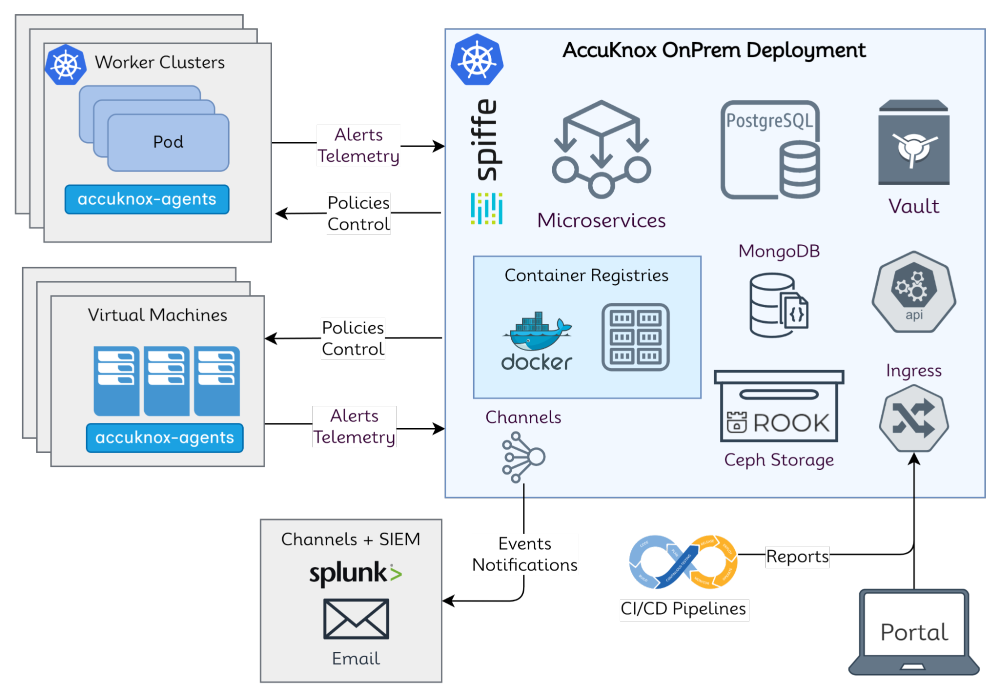

## **High-Level Architecture Overview**



AccuKnox onprem deployment is based on Kubernetes native architecture.

### AccuKnox OnPrem k8s components

#### Microservices

Microservices implement the API logic and provide the corresponding service endpoints. AccuKnox uses Golang-based microservices for handling any streaming data (such as alerts and telemetry) and Python-based microservices for any other control-plane services.

#### Databases

PostgreSQL is used as a relational database and MongoDB is used for storing JSON events such as alerts and telemetry. Ceph storage is used to keep periodic scanned reports and the Ceph storage is deployed and managed using the Rook storage operator.

#### Secrets Management

Within the onprem setup, there are several cases where sensitive data and credentials have to be stored. Hashicorp’s Vault is made use of to store internal (such as DB username/password) and user secrets (such as registry tokens). The authorization is managed purely using k8s native model of service accounts. Every microservice has its own service account and uses its own service account token automounted by k8s to authenticate and subsequently authorize accesses to the secrets.

#### Scaling

K8s native horizontal and vertical pod autoscaling is enabled for most microservices with upper limits for resource requirements.

#### AccuKnox-Agents

Agents need to be deployed in target k8s clusters and virtual machines that have to be secured at runtime and to get workload forensics. Agents use Linux native technologies such as eBPF for workload telemetry and LSMs (Linux Security Modules) for preventing attacks/unknown execution in the target workloads. The security policies are orchestrated from the AccuKnox onprem control plane. AccuKnox leverages SPIFFE/SPIRE for workload/node attestation and certificate provisioning. This ensures that the credentials are not hardcoded and automatically rotated. This also ensures that if the cluster/virtual machine has to be deboarded then the control lies with the AccuKnox control plane.

## **Installation Steps**

### Installation Package

- Onprem Deployment Installation Document (this document)
- Helm charts archive <accuknox-helm-charts.tgz\>
    - Kubectl and Helm tools are pre-requisite tools for using these helm charts

Use the following command to extract the package:

```sh
tar xvf accuknox-helm-charts.tgz
cd Helm-charts
```

### Update the override-values.yaml

AccuKnox installation package will contain override-values.yaml file that contains installation-specific options to be configured.

1. Email username, and password 
2. Base Domain name. Substitute <your-domain\> to the actual domain name.

### Install Accuknox base dependencies

Use the following commands to install the base dependencies:

```sh
kubectl create namespace accuknox-chart
helm upgrade --install -n accuknox-chart accuknox-base accuknox-base-chart  --create-namespace -f override-values.yaml
```

### Install AccuKnox pre-chart

```sh
helm upgrade --install -n accuknox-chart accuknox-pre pre-chart --create-namespace -f override-values.yaml
```

- Create CNAME records in your DNS zone to point to istio ingress load balancer. Point the following domains cwpp.<your_domain.com\> and cspm.<your_domain.com\> and redis.<your_domain.com\> and saltmaster.<your_domain.com\> to the load balancer. 
- The Load balancer address can be retreived by running the following command:

```sh
kubectl -n istio-system get service istio-ingressgateway -o jsonpath='{.status.loadBalancer.ingress[0].hostname}'
```

### Install AccuKnox microservices chart

```sh
helm upgrade --install -n accuknox-chart accuknox-microservice  accuknox-microservice-chart --create-namespace -f override-values.yaml  --set email.user=<USER> --set email.password=<PASSWORD>
```

- Create a CNAME record in your DNS to point to knox-gateway load balancer. Point knox-gw.<your_domain\>.com to the load balancer 
- Loadbalancer address can be obtained by running the following command:

```sh
kubectl -n accuknox-knox-gateway get service knox-gateway -o jsonpath='{.status.loadBalancer.ingress[0].hostname}'
```

- Create a CNAME record in your DNS to point to spire-server load balancer. Point spire.<your_domain\>.com to the load balancer 
- Loadbalancer address can be obtained by runnung the following command:

```sh
kubectl -n accuknox-spire get service spire-server -o jsonpath='{.status.loadBalancer.ingress[0].hostname}'
```

- Create a CNAME record in your DNS to point to the policy-provider-service load balancer. Point pps.<your_domain\>.com to the load balancer 
- Loadbalancer address can be obtained by running the following command:

```sh
kubectl -n accuknox-policy-provider-service get service policy-provider-service -o jsonpath='{.status.loadBalancer.ingress[0].hostname}'
```

### Install AccuKnox post-chart

```sh
helm upgrade --install -n accuknox-chart accuknox-post post-chart --create-namespace -f override-values.yaml
```

### Verification of installation

- After successful installation, you should be able to point to app.<your-domain.com\> URL and get the sign-in page.
- cspm.<your-domain.com\>/admin/ page should be available.

## References

1. AccuKnox Deployment and Operations [FAQs](https://help.accuknox.com/faqs/troubleshooting-and-faqs/)
2. [AccuKnox Splunk Integration Guide](https://help.accuknox.com/integrations/splunk/)
3. [KubeArmor Splunk Integration Guide](https://help.accuknox.com/integrations/splunk_feeder_kubearmor/)
4. [CSPM: Use-cases & Scenarios](https://help.accuknox.com/use-cases/vulnerability/)
5. [CWPP: Use-cases & Scenarios](https://help.accuknox.com/use-cases/app-behavior/)
6. [Detailed Support Matrix](https://help.accuknox.com/getting-started/kubearmor-support-matrix/)


- - - 
[SCHEDULE DEMO](https://www.accuknox.com/contact-us){ .md-button .md-button--primary }