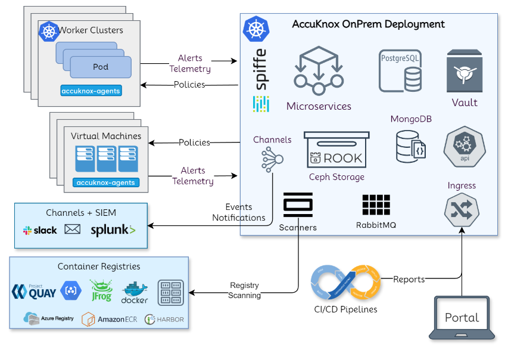

# On-Prem Installation Guide

## High-Level Architecture Overview



### Accuknox Application Protection Platform (Control-Plane) Components

#### Microservices

AccuKnox microservices implement the API logic and provide service endpoints. We use Golang for microservices handling streaming data (alerts, telemetry) and Python for other control-plane services.

#### Storage

In our project, we use PostgreSQL for structured table data and MongoDB for JSON objects. For large-scale data storage, particularly periodic scan reports, we leverage Ceph storage solutions managed by the Rook operator on Kubernetes (K8s).

**Why Ceph on Kubernetes?**

+ **Scalability:** Ceph scales horizontally, accommodating growing data needs efficiently.

+ **High Availability:** It ensures data redundancy and fault tolerance, critical in a distributed environment.

+ **Unified Management:** Rook simplifies the deployment and management of Ceph, integrating seamlessly with Kubernetes.

+ **Performance:** Ceph optimizes read and write operations, crucial for handling large-scale data.

+ **Cost Efficiency:** Ceph on commodity hardware is more cost-effective than proprietary solutions.
By combining these technologies, we achieve a robust, scalable, and efficient storage system suitable for diverse data types and large-scale requirements.

#### Secrets Management

Hashicorp's Vault is used to store internal (DB usernames/passwords) and user (registry token) secrets. The authorization process are entirely managed using the Kubernetes natives model of service accounts.

#### Scaling

The Kubernetes native horizontal and vertical pod autoscaling is enabled for most of the microservices with upper limitis for resource requirements.

#### AccuKnox-Agents

Agents are deployed in K8S clusters and virtual machines for runtime security and workload forensics, using Linux native technologies like eBPF for workload telemetry and LSMs for attack prevention. Security policies are orchestrated from the AccuKnox On-prem control plane, which uses SPIFFE/SPIRE for workload/node attestation and certificate provisioning.

Read more about [AccuKnox Agents](../getting-started/accuknox-agents.md)

---

## **On-prem Use cases**

+ **Container/VM Protection**: Secure the workloads through KubeArmor and AccuKnox agents.

+ **Registry**: Container image registries scanning for vulnerabilities and secret data.

+ **ASPM**: Code Scanning and integration with CI/CD Pipelines for automation of shift left security.

+ **CSPM**: Scan the cloud infrastructure. Not applicable in air gapped deployment without connectivity to cloud accounts.

---

## Accuknox Application Protection Platform (Accuknox Control-Plane) Installation Requirements

AccuKnox Control-Plane should use its own, separate Kubernetes cluster, with the following requirements:

1. 4 worker nodes with 8vCPUs, 32 GB RAM, and 256 GB SSD disks, and 5 worker nodes with 4vCPUs, 16 GB RAM, and 128 GB SSD disks; it is advisable for SSD disk to have at least 3000 IOPs.
2. External bare metal loadbalancer setup with a reserved pool of at least 5 IPs, eg. MetalLB.
3. Default storage class configured, eg. Longhorn (or others that you have tested; Open-Jiva, in my opinion, cannot be trusted anymore).
4. Additional helper apps installed, ie. jq (v1.6+), unzip (x.x), yq (v.4.40.x+), helm (v.3.x.x+).

In addition, for the installation to succeed, you need to make changes in your DNS, and if using custom certificates, have them available (certificate, private key, intermediate and root CA). Also, you will need to provide an email account (username, password) that will be used for sign-in onboarding and special notifications (scans, reports).

## Accuknox Application Protection Platform (Accuknox Control-Plane) Jump Host Installation


If your workloads or architecture is air gapped and/or you would like to use a private container registry please:

1. Install aws v2 CLI and docker client v.20.xx.
2. Prepare your: private registry address, username, and password, as well as AccuKnox ECR username and password.
3. Prepare your Accuknox installation folder on your Kubernetes control-plane node and copy there the AccuKnox TGZ package.

Then, follow the instructions below:

```bash
tar xvf accuknox-helm-charts.tgz
cd Helm-charts
cd airgapped-reg

# configure aws cli with AccuKnox provided secrets
aws configure

# connect to docker Accuknox docker registry
aws ecr get-login-password --region us-east-2 | docker login --username AWS --password-stdin 956994857092.dkr.ecr.us-east-2.amazonaws.com

# connect to airgapped registry
docker login <registry_address>

# upload images to private registry
./upload_images.sh <registry_address>

# create a namespace
MGR_NS="accuknox-onprem-mgr"
CERT_MGR_NS="cert-manager"
kubectl create ns $MGR_NS
kubectl create ns $CERT_MGR_NS
kubectl create secret docker-registry airgapped-reg --docker-server=<registry.address> --docker username=<registry.username> --docker-password=<registry.password> -n $MGR_NS
kubectl create secret docker-registry airgapped-reg --docker-server=<registry.address> --docker username=<registry.username> --docker-password=<registry.password> -n $CERT_MGR_NS

# <registry_address> can include port as well
./install-certmanager.sh <registry_address>
./install-onprem-mgr.sh <registry_address>

```

4. In the file Helm-charts/override-values.yaml set the variable global.onprem.airgapped to true.

## Accuknox Application Protection Platform (Accuknox Control-Plane) Installation Steps

To install Accuknox Control-Plane you need to override the <your_domain.com> value in Helm-charts/override-values.yaml and set your SSL preferences.

If you want to use the AccuKnox autogenerated certificates make sure that in the ssl section of the override-values, you read:

```yaml
ssl:
  selfsigned: true
  customcerts: false
```

If, on the other hand, you have your own certificates signed by a known certificate authority (CA), those values should look like this:

```yaml
ssl:
  selfsigned: false
  customcerts: true
```

The third option, is to provide your custom self-signed certificates; then the section should read:

```yaml
ssl:
  selfsigned: true
  customcerts: true
```

After finishing up with those preliminary configurations, you can proceed with the next installation steps:

### 1. Install AccuKnox control-plane base dependencies

!!! info "Instructions!"

    The following scripts/steps have to be run from inside the Helm-charts folder.

```bash
kubectl create namespace accuknox-chart
helm upgrade --install -n accuknox-chart accuknox-base accuknox-base-chart --create-namespace -f override-values.yaml
```

!!! info "Important!"

    Some of the resources deployed in the above step require some time to provision. Wait at least 2-3 minutes and run the following script to check if you can proceed with the next step.

```bash
./check_initialization.sh
```

```bash
while true
do
    status=$(kubectl get cephcluster -n accuknox-ceph  rook-ceph -o=jsonpath='{.status.phase}')
    [[ $(echo $status | grep -v Ready | wc -l) -eq 0 ]] && echo "You can procceed" && break
    echo "wait for initialization"
    sleep 1
done
```

### 2. Install Accuknox control-plane pre-chart

```bash
helm upgrade --install -n accuknox-chart accuknox-pre pre-chart --create-namespace -f override-values.yaml --set global.email.user="<email-username>" --set global.email.password="<email-password>" --set email.host="<email-host>" --set ecr.user="<provided by AccuKnox" --set
ecr.password="<provided by Accuknox>"
```

### 3. Install Accuknox control-plane microservices

```bash
helm upgrade --install -n accuknox-chart accuknox-microservice accuknox-microservice-chart --set global.email.user="<email-username>" --set
global.email.password="<email-password>" --set global.email.host="<email-host>" --create-namespace -f
override-values.yaml
```

### 4. Check DNS Mapping

Run the below script that will give you the names of records and their values you need to add to your DNS:

```bash
./generate_dns_entries.sh
```

### 5. Install SSL certificates

!!! info "Important!"

    This is an optional step, perform it only if you are NOT using autogenerated AccuKnox certificates.

a) If using certificates signed by a known authority:

```bash
./install_certs.sh <certificate_path <certificate_key_path> <ca_path>
```

**OR**

b) If using your own self-signed certificates:

```bash
./install_certs.sh <certificate_path> <certificate_key_path> <ca_path>
```

### 6. Verify the installation

After the successful DNS update you should be able to access the following pages:

+ <https://frontend>.<your-domain.com><https://frontend.%3cyour-domain.com> (sign-in main AccuKnox control-plane GUI page)
+ <https://cspm>.<your-domain.com>/admin/<https://cspm.%3cyour-domain.com%3e/admin/>
+ <https://cwpp>.<your-domain.com>/cm/<https://cwpp.%3cyour-domain.com%3e/cm/>


## References

1. [AccuKnox Deployment and Operations FAQs](https://help.accuknox.com/faqs/troubleshooting-and-faqs/)
2. [AccuKnox Splunk Integration Guide](https://help.accuknox.com/integrations/splunk/)
3. [KubeArmor Splunk Integration Guide](https://help.accuknox.com/integrations/splunk_feeder_kubearmor/)
4. [CSPM: Use-cases & Scenarios](https://help.accuknox.com/use-cases/vulnerability/)
5. [CWPP: Use-cases & Scenarios](https://help.accuknox.com/use-cases/app-behavior/)
6. [Detailed Support Matrix](https://help.accuknox.com/getting-started/kubearmor-support-matrix/)

## Appendix

### Sample Deployment Model


---

[SCHEDULE DEMO](https://www.accuknox.com/contact-us){ .md-button .md-button--primary }

