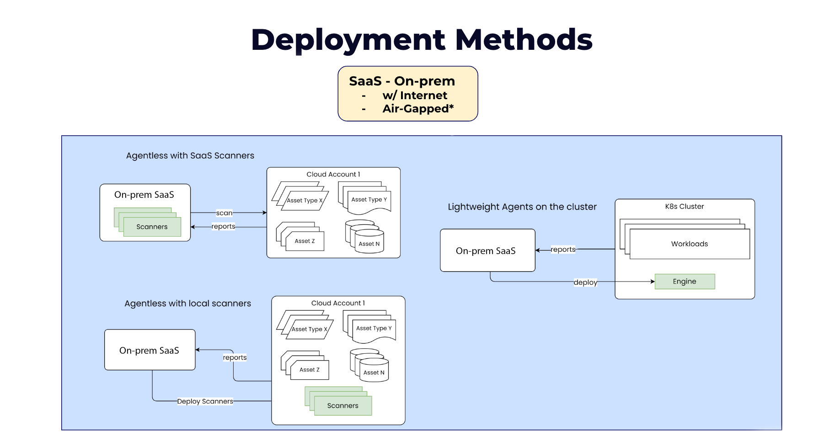

---
hide:
  - toc
---

In on-premise deployment, AccuKnox SaaS Component will be deployed on-premise. With locally deployed SaaS component the Scans will take place and reports will be shown in the dashboard.



For Air-Gapped On-prem installation, the SaaS deployment images will be provided.

# **System Requirements**

### Worker Node Requirements

| Nodes | vCPUs | RAM (GB) | Disk (GB) |
|-------|-------|----------|-----------|
| 5     | 8     | 32       | 256       |
| 4     | 4     | 16       | 128       |

### Kubernetes Requirements

- Start a k8s cluster with the above worker node requirements

- Ingress Controller (load balancers)
    - For access to the application

- Persistent Volumes (PV), provisioner/controller (block device/disks)
    - Used as data storage for SQL, MongoDB, scanned artifacts
    - Other internal app usages

- DNS CNAME provisioning
    - Needed for application access & communication
    - Certs would use this CNAME so that address changes won’t impact the cert validation.

- Email account configuration
    - Need email username, password
    - Used for user sign-in, password change, scan notification, sending reports

- Taints & Tolerations (Nodes should be tainted with below taints)
    - -8 vCPU:  ```node-size=8vcpu:NoSchedule```
    - -4 vCPU:  ```node-size=4vcpu:NoSchedule```


- - - 
[SCHEDULE DEMO](https://www.accuknox.com/contact-us){ .md-button .md-button--primary }