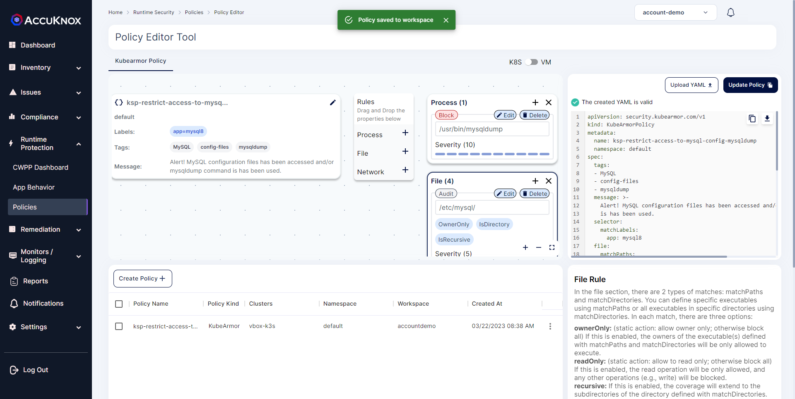

Database Management is an important part when you have a large amount of data around you. MySQL is one of the most famous open-source Relational Databases to store and handle your data. So securing the data is the main concern for any organization.

[AccuKnox](https://www.accuknox.com/)  provides runtime cloud security for your applications. In this cookbook, we will demonstrate how MySQL applications can be protected.
### **Prerequisites**

1. Kubernetes cluster deployed on any platform. (Local , Azure, Aws, GCP)
2. Cluster onboarded on AccuKnox Saas platform. Follow this [onboarding guide](/getting-started/cluster-onboarding)

### **Deploy Sample PHP/MySQL Web application in Kubernetes**

We will create two deployments; one for the webserver and the other for MySQL DB. The web server will read data from MySQL DB and show it in the browser.

Here we have used the GKE environment.

**[Step 1]** Deploy Web server

```bash
kubectl apply -f https://raw.githubusercontent.com/accuknox/samples/main/php-mysql-webapp/webserver.yaml
```

Run `kubectl get pods` in the terminal to get the response:

You should be able to see the output like this:

```bash
NAME                         READY   STATUS    RESTARTS   AGE
webserver-55f99f9ffb-f4rvk   1/1     Running   0          2d3h
```

Alright, the pod is created but we can’t access it despite having its IP, the reason is that the Pod IP is not public. So we use  _**service**_. When a user tries to access an app, for instance, a web server here, it actually makes a request to a service which itself then checks where it should forward the request. Now to access the webserver you will just access the IP and port as defined in the service configuration file.

**[Step 2]** Now let's deploy web-service

```bash
kubectl apply -f https://raw.githubusercontent.com/accuknox/samples/main/php-mysql-webapp/webserver-svc.yaml
```

**[Step 3]** Check the status of the service

```bash
kubectl get svc
```

You should be able to see the output like this

```bash
NAME             TYPE           CLUSTER-IP     EXTERNAL-IP      PORT(S)        AGE
kubernetes       ClusterIP      10.16.0.1      <none>           443/TCP        27d
web-service      LoadBalancer   10.16.9.151    35.193.121.214   80:31533/TCP   2d3h
```

**[Step 4]** Create persistent volume and persistent volume claim to keep your data intact.

Create a directory where the Volume will be stored

```bash
sudo mkdir /mnt/data
```

Create a yaml file with following Data and save it as pv.yaml

```bash
apiVersion: v1
kind: PersistentVolume
metadata:
  name: task-pv-volume
  labels:
    type: local
spec:
  storageClassName: manual
  capacity:
    storage: 10Gi
  accessModes:
    - ReadWriteOnce
  hostPath:
    path: "/mnt/data"
```
Deploy the Persistent Volume and Persistent Volume Claim

```bash
kubectl apply -f pv.yaml
kubectl apply -f https://raw.githubusercontent.com/accuknox/samples/main/php-mysql-webapp/mysql-pv-claim.yaml
```

**[Step 5]** Create deployment and service for MySQL DB.

```bash
kubectl apply -f https://raw.githubusercontent.com/accuknox/samples/main/php-mysql-webapp/mysql.yaml
kubectl apply -f https://raw.githubusercontent.com/accuknox/samples/main/php-mysql-webapp/mysql-svc.yaml
```

Check the status of the pod and service

```bash
kubectl get po,svc
```

You should be able to see the output like this

```bash
NAME                             READY   STATUS    RESTARTS   AGE
pod/mysql-796674bfb-dl495        1/1     Running   0          115s
pod/webserver-5f7dbd89d6-5ng7r   1/1     Running   0          19m
pod/webserver-5f7dbd89d6-hnrz9   1/1     Running   0          19m
pod/webserver-5f7dbd89d6-pmw4s   1/1     Running   0          19m

NAME                     TYPE           CLUSTER-IP   EXTERNAL-IP    PORT(S)        AGE
service/kubernetes       ClusterIP      10.8.0.1     <none>         443/TCP        32m
service/mysql8-service   ClusterIP      10.8.1.249   <none>         3306/TCP       27s
service/web-service      LoadBalancer   10.8.0.92    34.70.234.72   80:32209/TCP   14m
```

Now the application is deployed. You can insert data into the database in two ways. You can use a MySQL Client or directly execute to the MySQL server pod.

**Connect using a MySQL client**

```bash
kubectl run -it --rm --image=mysql:5.6 --restart=Never mysql-client -- mysql -h mysql8-service -p.sweetpwd.
```

You should be able to see the output like this

```bash
$ kubectl run -it --rm --image=mysql:5.6 --restart=Never mysql-client -- mysql -h mysql8-service -p.sweetpwd.
If you don't see a command prompt, try pressing enter.

mysql>
```

Directly executing into MySQL pod:

```bash
kubectl exec -it mysql-796674bfb-dl495 -- bash
```

> Note: Replace mysql-796674bfb-dl495 with your mysql pod name.

Now you are inside MySQL pod. Use the below command to enter the MySQL command prompt.

```bash
mysql -u root -p.sweetpwd.
```

You should be able to see the output like this

```bash
$ kubectl exec -it mysql-69559dfd5d-nzmcd -- bash
root@mysql-69559dfd5d-nzmcd:/# mysql -u root -p.sweetpwd.
mysql: [Warning] Using a password on the command line interface can be insecure.
Welcome to the MySQL monitor.  Commands end with ; or \g.
Your MySQL connection id is 10
Server version: 8.0.28 MySQL Community Server - GPL

Copyright (c) 2000, 2022, Oracle and/or its affiliates.

Oracle is a registered trademark of Oracle Corporation and/or its
affiliates. Other names may be trademarks of their respective
owners.

Type 'help;' or '\h' for help. Type '\c' to clear the current input statement.

mysql>
```

Now you are inside the MySQL terminal. First, you need to create a users table and add values to the table.

Use the below commands to do that.

```sql
SHOW DATABASES;
```

You should be able to see the output like this

```sql
USE my_db;
```

You should be able to see the output like this

```sql
CREATE TABLE users
(
name varchar(20)
);

```

You should be able to see the output like this

```sql
INSERT INTO users (name)
VALUES ('John');
```


Now check the external IP of the web service. If everything works well, you'll see this screen with the name John.


## Working with Open-Source AccuKnox tools

The [policy-templates](https://github.com/kubearmor/policy-templates) open-source repository provides policy templates based on KubeArmor and Cilium policies for known CVEs and attacks vectors, compliance frameworks such as PCI-DSS, MITRE, STIG, NIST, CIS, etc., popular workloads such as GoLang, Python, PostgreSQL, Cassandra, MySQL, WordPress, etc.

We hope that you also contribute by sending policy templates via pull requests or Github issues to grow the list.

See [Polciy Templates](https://github.com/kubearmor/policy-templates). [AccuKnox](https://www.accuknox.com/) provides a number of policy templates for your MySQL workloads.

Let's see a policy from the policy templates repo.

### **Audit your MySQL Server Sensitive Configuration files with KubeArmor**

> MySQL Server, also known as mysqld, is a single multithreaded program that does most of the work in a MySQL installation. It does not spawn additional processes. MySQL Server manages access to the MySQL data directory that contains databases and tables. The data directory is also the default location for other information such as log files and status files.

#### (i) my.cnf:

The default configuration file is called  **my.cnf**  and can be located in a number of directories. On Linux and other Unix related platforms, the locations are using  **/etc/my.cnf, /etc/mysql/my.cnf, /var/lib/mysql/my.cnf** or in the default installation directory. This file contains configuration settings that will be loaded when the server starts, including settings for the clients, server, mysqld_safe wrapper and various other MySQL client programs.

However, if they're not there, you can use mysqld to find the configuration. Run the following command inside the MySQL server pod.

```sql
mysqld --help --verbose
```

The first part of the lengthy response describes the options you can send to the server when you launch it. The second part displays the configuration settings during the server compilation.

Near the start of the output, find a couple of lines that look similar to the following example:

```sql
Starts the MySQL database server.

Usage: mysqld [OPTIONS]

Default options are read from the following files in the given order:
/etc/my.cnf /etc/mysql/my.cnf ~/.my.cnf
The following groups are read: mysqld server mysqld-8.0
```

#### (ii) my-new.cnf

This file is created when there is an existing my.cnf file and the  **mysql_install_db**  script is running. The mysql_install_db script is designed to develop the my.cnf file if it does not exist. If the file does exist, then the file is created using the name my-new.cnf to avoid overwriting an existing configuration file. It is then up to the user to compare the two, determine files and determine which options are still valid, for the new install and change the files as required to get the new my.cnf configuration file.

#### (iii) Log files

By default, MySQL stores its log files in the following directory:

```sql
/var/log/mysql
```

Check the MySQL configuration if you don't find the MySQL logs in the default directory. View the  **my.cnf**  file and look for a log_error line, as in:

```sql
log_error = /var/log/mysql/error.log
```

#### (iv) Backups

The two main options are to copy the database files or use  mysqldump as follows:

#### File copy

By default, MySQL creates a directory for each database in its data directory,  **/var/lib/mysql**.

_Note: Ensure you set the permissions on that file to restrict read access for password-security reasons._

#### mysqldump

Another approach to backing up your database is to use the mysqldump tool. Rather than copying the database files directly, mysqldump generates a text file that represents the database. By default, the text file contains a list of SQL statements to recreate the database, but you can also export the database in another format like  **.CSV**  or  **.XML**. You can read the man page for mysqldump to see all its options.

The statements generated by mysqldump go straight to standard output. You can specify a to redirect the output by running the following command in the command line:

This command tells mysqldump to recreate the  **demodb**  database in SQL statements and to write them to the file  **dbbackup.sql**. Note that the username and password options function the same as the MySQL client to include the password directly after -p in a script.

With the help of  **KubeArmor**  and Policy-templates, You can audit/restrict all these sensitive configuration files and processes that use these files easily.

### **Policy to Audit configuration files and block mysqldump**

```yaml
# KubeArmor is an open source software that enables you to protect your cloud workload at runtime.
# To learn more about KubeArmor visit:
# https://www.accuknox.com/kubearmor/

apiVersion: security.kubearmor.com/v1
kind: KubeArmorPolicy
metadata:
  name: ksp-restrict-access-mysql-server-config
  namespace: default # Change your namespace
spec:
  tags: ["MYSQL", "config-files", "mysqldump"]
  message: "Alert! mysql configuration files has been accessed and/or mysqldump command is has been used."
  selector:
    matchLabels:
      app: mysql8 # Change your labels
  file:
    severity: 5
    matchPaths:
    - path: /etc/mysql/my.cnf
      ownerOnly: true
    matchDirectories:
    - dir: /etc/mysql/
      recursive: true
      ownerOnly: true
    - dir: /var/lib/mysql/
      readOnly: true
      recursive: true
    - dir: /var/log/mysql/
      recursive: true
    action: Audit
  process:
    severity: 10
    matchPaths:
    - path: /usr/bin/mysqldump
    action: Block


```

Apply KubeArmor Security Policy (KSP) from the  [Policy templates](https://github.com/kubearmor/policy-templates)  and perform following steps:

1. Go to Runtime Protection → Policies and create a Policy

2. Upload the above yaml file or create the Policy from the user interface.



3. Save the policy to workspace and apply it.

4. After applying the policy it will go into pending state. Click on the policy and approve it to activate the policy.


5. Inside your cluster you should be able to see the policy as kubernetes object.


6. Use mysqldump command:

```bash
kubectl exec -it mysql-69559dfd5d-nzmcd -- bash
root@mysql-7d9977c67d-57mrx:/# mysqldump -u db_user -p .mypwd my_db users > dumpfilename.sql
```

> Note: Replace mysql-69559dfd5d-nzmcd with your mysql pod name.

- You should be able to see the output like this


### **View logs:**

a. Observing logs using karmor CLI

```bash
karmor log
```

You should be able to see the output like this

```bash
== Alert / 2023-03-22 06:40:00.241489 ==
ClusterName: default
HostName: master
NamespaceName: default
PodName: mysql-d5f479b99-8fqp2
Labels: app=mysql8
ContainerName: mysql
ContainerID: 5699c5be4586a4abf1bf17ebad872935738bbd498a06ffb800ea65462f7312db
ContainerImage: docker.io/library/mysql:8.0@sha256:2596158f73606ba571e1af29a9c32bec5dc021a2495e4a70d194a9b49664f4d9
Type: MatchedPolicy
PolicyName: ksp-restrict-access-mysql-server-config
Severity: 10
Source: /usr/bin/bash
Resource: /usr/bin/mysqldump -u db_user -p .mypwd my_db users
Operation: Process
Action: Block
Data: syscall=SYS_EXECVE
Enforcer: AppArmor
Result: Permission denied
ATags: [MySQL config-files mysqldump]
HostPID: 8792
HostPPID: 8595
PID: 137
PPID: 129
ParentProcessName: /usr/bin/bash
ProcessName: /usr/bin/mysqldump
Tags: MySQL,config-files,mysqldump
```

Accessing /etc/mysql/my.cnf config. file;

```bash
root@mysql-7d9977c67d-7rcmb:/# cat /etc/mysql/my.cnf
```

KubeArmor detects this event and you will receive logs like this: Check karmor log

```bash
== Alert / 2022-02-08 03:12:40.413064 ==
Cluster Name: default
Host Name: gke-cys-feb8-default-pool-4852bc33-rmcr
Namespace Name: default
Pod Name: mysql-69559dfd5d-nzmcd
Container ID: 4dd61ec15b1f8075b8ac9ebe2aeed413c01e57af7d4e9bec7cff82b65f761677
Container Name: mysql
Severity: ksp-restrict-access-mysql-server-config
Tags: 5
Message: MYSQL,config-files,mysqldump
Type: Alert! mysql configuration files has been accessed and/or mysqldump command is has been used.
Source: MatchedPolicy
Operation: /bin/cat /etc/mysql/my.cnf
Resource: File
Data: /etc/mysql/my.cnf
Action: syscall=SYS_OPENAT fd=-100 flags=/etc/mysql/my.cnf
Result: Audit
```
b. You can easily watch these alerts at AccuKnox Saas → Monitors/Logging → logs


Securing configuration files are a necessity for any application. With KubeArmor you can effectively do that and with the options like readOnly , ownerOnly , recursive, matchDirectoriesetc you can fine-tune the policy enforcement. See more [KubeArmor Policy Specification](https://github.com/kubearmor/KubeArmor/blob/main/getting-started/security_policy_specification.md)

### Protect Using Auto Discovered Policies

AccuKnox policy auto-discovery engine leverages the pod visibility provided by KubeArmor and Kubernetes CNI to auto-generate network and system policies.

CWPP Dashboard → Policies → Discovered

We deployed our sample application on the default namespace. Check default namespace for policies


Following are the auto-discovered policies generated by  [AccuKnox](https://www.accuknox.com/). Let's briefly explain the policies.

```yaml
apiVersion: networking.k8s.io/v1
kind: NetworkPolicy
metadata:
  name: autopol-ingress-dzfzevuxgslgfyt
  namespace: default
spec:
  ingress:
  - from:
    - podSelector:
        matchLabels:
          app: apache
    ports:
    - port: 3306
      protocol: TCP
  podSelector:
    matchLabels:
      app: mysql8
  policyTypes:
  - Ingress

```

This policy will be enforced at the ingress (against the inbound network flows) of the MySQL pod (pods labeled with app: mysql8 will be picked).

This enables endpoints with the label app: apache and k8s:io.kubernetes.pod.namespace: default to communicate with all endpoints with the label app: mysql8, but they must share using TCP on port 3306.

Endpoints with other labels will not communicate with the MySQL pod.

```yaml
apiVersion: networking.k8s.io/v1
kind: NetworkPolicy
metadata:
  name: autopol-egress-tqrnwwewtbyqduf
  namespace: default
spec:
  egress:
  - ports:
    - protocol: UDP
  podSelector:
    matchLabels:
      app: apache
  policyTypes:
  - Egress

```

This policy is very similar to the first policy. This will be enforced at the webserver pod's egress (against the outbound network flows) (pods labelled with the app: apache will be picked).

```yaml
apiVersion: networking.k8s.io/v1
kind: NetworkPolicy
metadata:
  name: autopol-ingress-jcicjwdjyptozzw
  namespace: default
spec:
  ingress:
  - ports:
    - port: 80
      protocol: TCP
  podSelector:
    matchLabels:
      app: apache
  policyTypes:
  - Ingress

```

All these policies are generated based on the network flow of the sample application.

It is allowing only minimum traffic that the application needed to operate. This will restrict all unwanted connections and reduce the application's attack surface.

### **Conclusion**

Auto-discovered policies are generated based on the network flow of the application.

It is allowing only minimum traffic that the application needed to operate. This will restrict all unwanted connections and provide runtime security. You can also handcraft your own security policies to secure your MySQL cluster.

Now you can protect your workloads in minutes using  [AccuKnox](https://www.accuknox.com/), it is available to protect your Kubernetes and other cloud workloads using Kernel Native Primitives such as AppArmor, SELinux, and eBPF.

[Let us know](https://www.accuknox.com/contact-us/)  if you are seeking additional guidance in planning your cloud security program.

- - -
[SCHEDULE DEMO](https://www.accuknox.com/contact-us){ .md-button .md-button--primary }