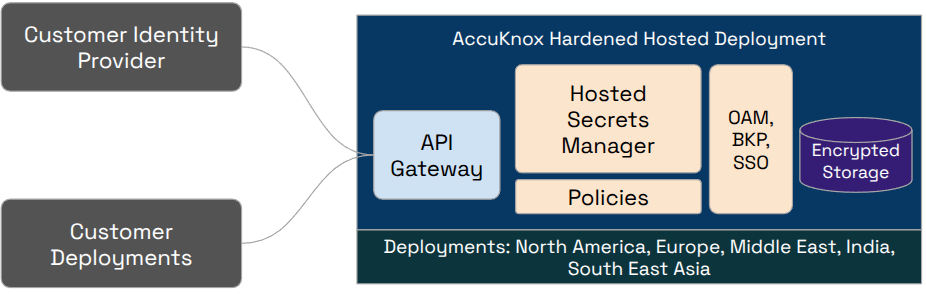

# AccuKnox Secrets Manager - Deployment Guide

AccuKnox Secrets Manager is a secure secrets management solution that stores encrypted secrets, issues short-lived dynamic secrets, and gives identity-based access control with full audit logs. It is a drop-in replacement for HashiCorp Vault. This guide covers installing it on Kubernetes using the Helm chart provided in `accuknoxsecretmanager.tar`.

## Prerequisites

### System Requirements

- 1 vCPU and 512Mi memory minimum (single node)
- 10Gi of persistent storage

### Kubernetes Requirements

- Kubernetes 1.30 or later, with a default StorageClass
- Helm 3
- kubectl configured to talk to your cluster

Check these before you start:

```sh
kubectl version
kubectl get storageclass
helm version
```

## Architecture Diagram



## Installing through Helm Chart

### 1. Extract the chart

```sh
tar xf accuknoxsecretmanager.tar
cd accuknoxsecretmanager
```

### 2. Install with Helm

```sh
helm upgrade --install vault .
```

This installs the Secrets Manager server and the Agent Injector into the default namespace, using the settings in `values.yaml`.

To install into your own namespace:

```sh
kubectl create namespace accuknox
helm upgrade --install vault . -n accuknox
```

### 3. Initialize and unseal

The server starts sealed and uninitialized. Initialize it once:

```sh
kubectl exec vault-accuknoxsecretmanager-0 -- vault operator init
```

This prints 5 unseal keys and a root token. Save these in a safe place; they are shown only once.

Unseal the server using any 3 of the 5 keys:

```sh
kubectl exec vault-accuknoxsecretmanager-0 -- vault operator unseal <unseal_key_1>
kubectl exec vault-accuknoxsecretmanager-0 -- vault operator unseal <unseal_key_2>
kubectl exec vault-accuknoxsecretmanager-0 -- vault operator unseal <unseal_key_3>
```

The pod becomes `1/1` Ready after the third key is entered.

If the pod restarts, it will be sealed again and needs to be unsealed with 3 of your saved keys.

## Other Installation Options in the Chart

The chart includes a few alternate setups, controlled through values files and flags. Use the one that matches your environment.

**OpenShift:** ships with a separate `values.openshift.yaml` (security context constraints, routes, etc.):

```sh
helm upgrade --install vault . -f values.openshift.yaml
```

**CSI Provider mode:** mounts secrets into pods as volumes using the [Secrets Store CSI Driver](https://secrets-store-csi-driver.sigs.k8s.io/getting-started/installation) (install it separately first):

```sh
helm upgrade --install vault . --set csi.enabled=true
```

**Custom configuration:** override any setting in `values.yaml` with `--set` or your own values file:

```sh
helm upgrade --install vault . -f my-values.yaml
```

## Verifying the Installation

```sh
kubectl get pods
kubectl exec vault-accuknoxsecretmanager-0 -- vault status
kubectl get pvc
```

- - -
[SCHEDULE DEMO](https://www.accuknox.com/contact-us){ .md-button .md-button--primary }
