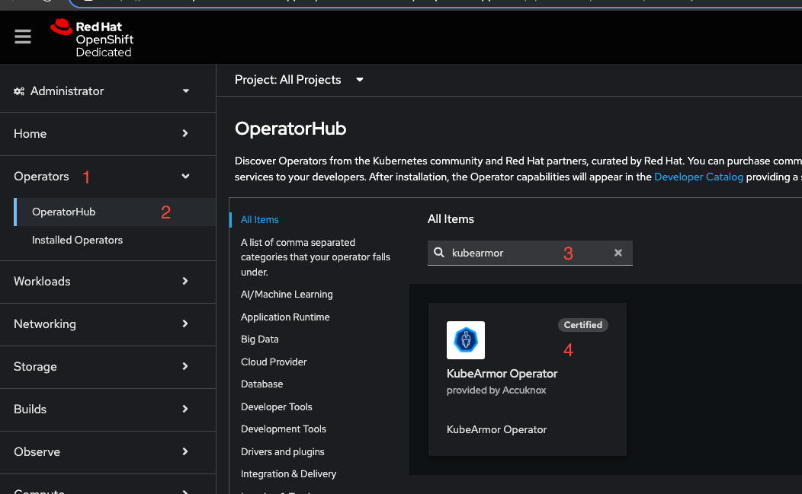
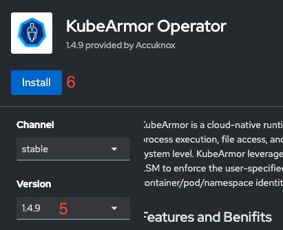
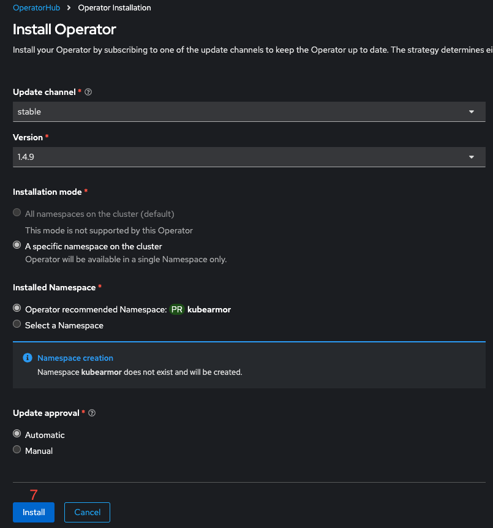
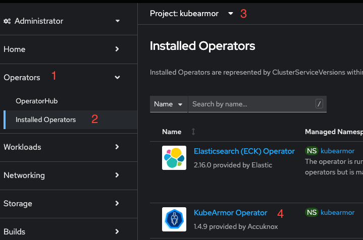
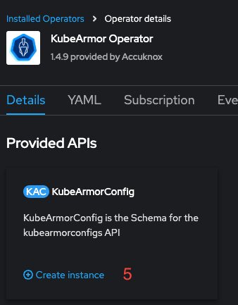
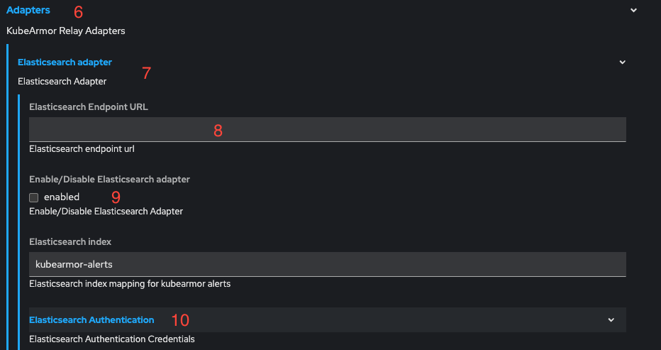
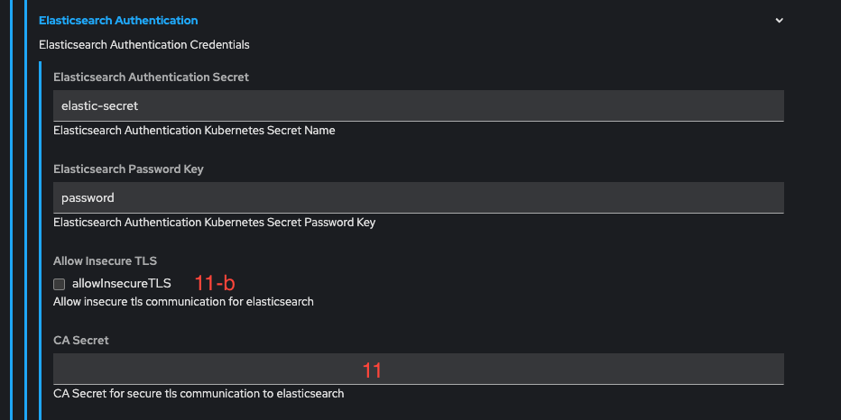
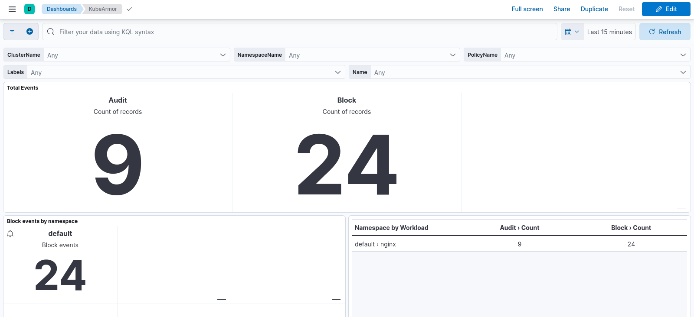
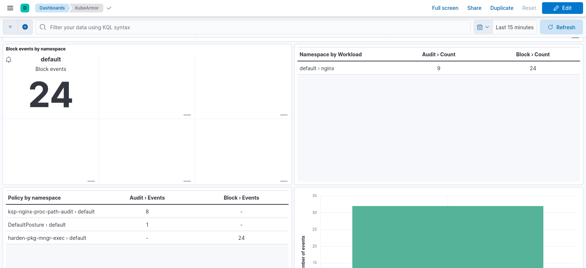
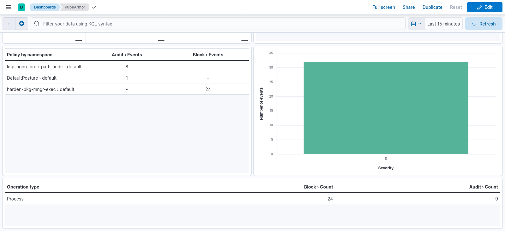

# Runtime Security Deployment for Openshift

## Operator Installation

In the OpenShift console, install KubeArmor operator by following the instructions below:

- Under operators (1) select Operator Hub (2).
- Search for the word "kubearmor" (3) and select "KubeArmor Operator" (4).
- Install KubeArmor version "1.4.9" with default configurations (5, 6, 7).

<figure markdown="span">
  
  <figcaption></figcaption>
</figure>

<figure markdown="span">
  
  <figcaption></figcaption>
</figure>

<figure markdown="span">
  
  <figcaption></figcaption>
</figure>

---

## ElasticSearch Integration

To integrate KubeArmor with Elasticsearch, the following inputs are required:

- **Username/Password**: If the Elasticsearch server requires authentication.
- **CA Certificate**: If Elasticsearch security is enabled.
- **URL of Elasticsearch**: Including protocol and port.

### Steps to Install

#### Username/Password Installation

If the server does not require authentication, you can skip this step.
To use username/password authentication with Elasticsearch, a Kubernetes secret called `elastic-secret` needs to be created in the `kubearmor` namespace.

Run the following command, replacing `<elastic-user>` and `<elastic-password>` with appropriate values:

```bash
kubectl create secret generic elastic-secret -n kubearmor --from-literal username=<elastic-user> --from-literal password=<elastic-password>
```

#### CA Certificate Installation

To use HTTPS communication between the agents and Elasticsearch, a Kubernetes secret called `elastic-ca` needs to be created in the `kubearmor` namespace.

- Acquire the CA certificate used by Elasticsearch. If acquiring the certificate is not possible, set the `allowInsecureTLS` flag to `true` in the next steps.
- Save the certificate in a file and run the following command:

```bash
kubectl create secret generic elastic-ca -n kubearmor --from-file ca.crt=<cacert file name>
```

---

## KubeArmor Instance Installation

Once the steps in the previous chapter are completed, proceed with the agent installation from the OpenShift console.

### Steps to Install

1. Install the required SCC using the following command:

   ```bash
   oc create -f https://raw.githubusercontent.com/kubearmor/KubeArmor/main/pkg/KubeArmorOperator/config/rbac/kubearmor-scc.yaml
   ```

2. In the OpenShift console:
   - Under Operators (1), go to Installed Operators (2).
   - Select `kubearmor` (3) as the project.
   - Click on the KubeArmor Operator (4).
   - Create a `KubeArmorConfig` Instance (5).

3. In the form view:
   - Select **Adapters** (6) -> **Elasticsearch Adapter** (7).
   - Perform the following steps:
     - Enter the Elasticsearch URL in the field (8).
     - Enable Elasticsearch adapter by checking the checkbox (9).
     - Click on **Elasticsearch Authentication** (10) and:
       - Set the CA secret field (11) to `elastic-ca`.
       - To enable insecure TLS communication (if no certificate is available), check the `allowInsecureTLS` checkbox (11-b) and leave the field (11) empty.

4. Create the instance. The `KubeArmorConfig` Instance controls the installation of the agents in the entire cluster, and only one instance should be created per cluster.

<figure markdown="span">
  
  <figcaption></figcaption>
</figure>
<figure markdown="span">
  
  <figcaption></figcaption>
</figure>

<figure markdown="span">
  
  <figcaption></figcaption>
</figure>

<figure markdown="span">
  
  <figcaption></figcaption>
</figure>

---

## Kibana Dashboard Setup

### Steps to Install

Along with this document, a file called `kubearmor-dashboard.ndjson` has been shared. Follow these steps to import the dashboard:

1. Under the **Management** tab, select **Stack Management**.
2. Navigate to **Saved Objects** under Kibana.
3. Click **Import** and select `kubearmor-dashboard.ndjson`.






