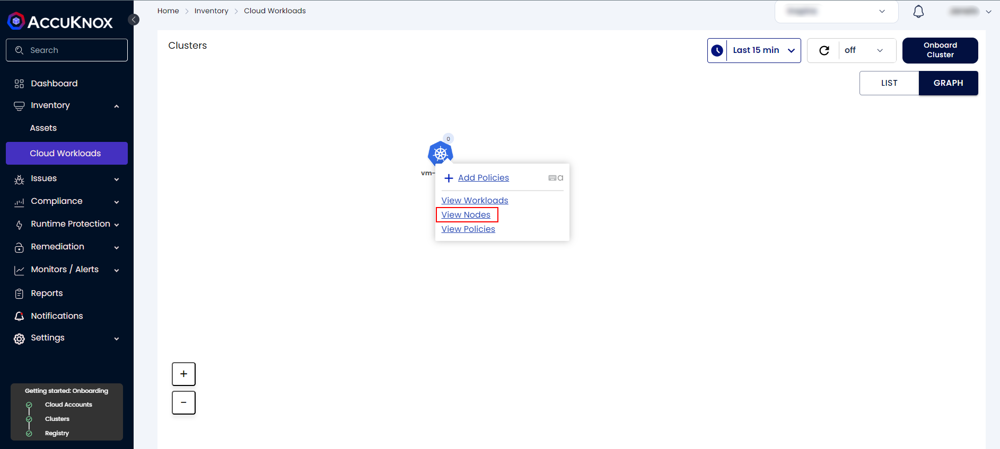
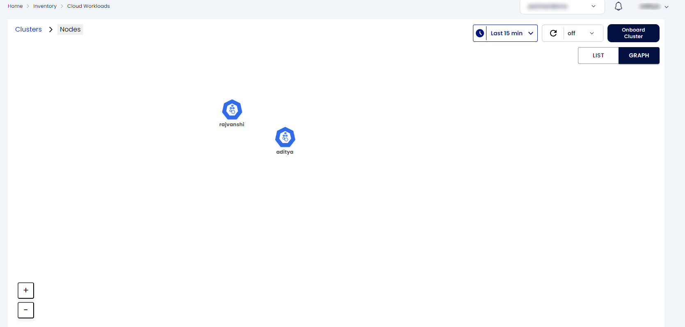
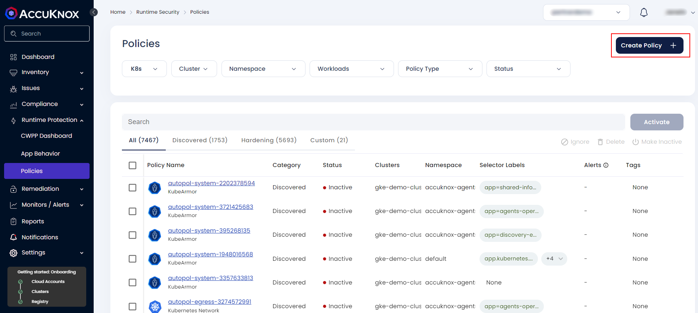
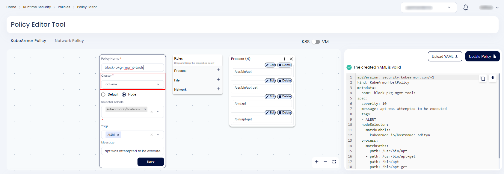
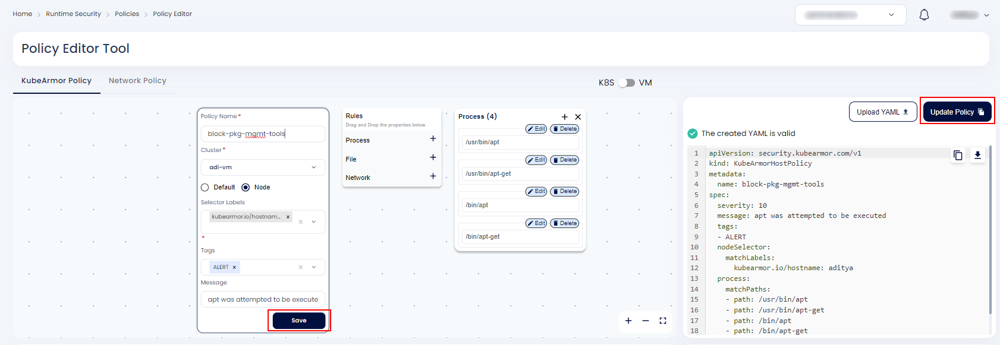
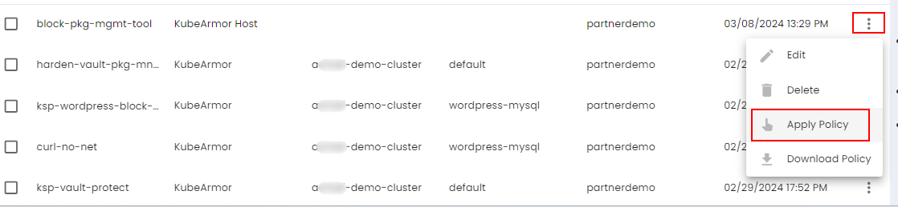
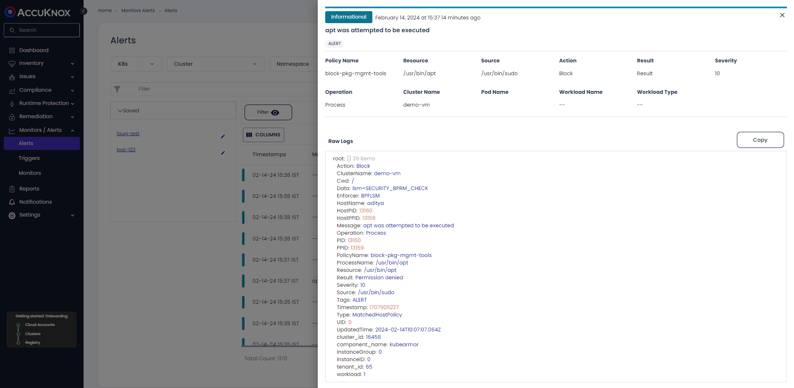
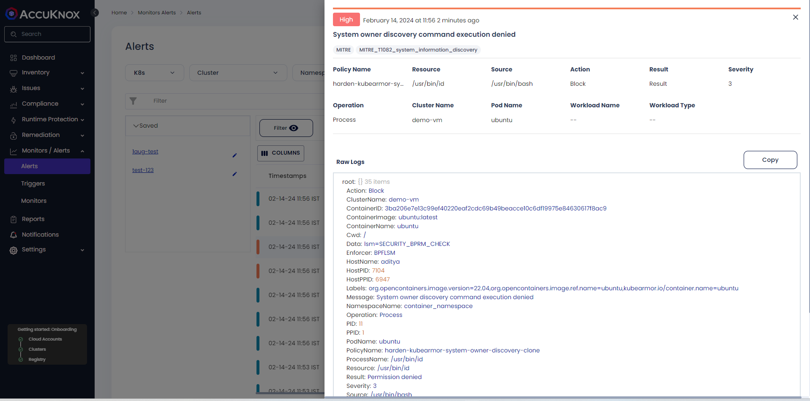

# Virtual Machine Onboarding

In VM environments, currently agents are run as docker containers or systemd services. Either docker should be present in your system or it should be using systemd.

## Control Plane Node

Each node will have one control plane which needs to be accessible by all the other worker nodes.

**Agents**

- kubearmor
- kubearmor-relay-server
- kubearmor-vm-adapter
- shared-informer-agent
- policy-enforcer-agent
- feeder-service

!!! info "NOTE"

    Each of these services begin with the** `accuknox-` **prefix in systemd mode.

!!! info "NOTE"

    Discovery-engine is not an agent in vm onboarding as of now.

## Worker Node

There can be multiple worker nodes in a cluster. All of them will connect with the control plane node.

**Agents**

- kubearmor
- kubearmor-vm-adapter

!!! success "ONBOARDING STEPS"
    **Get detailed Onboarding steps for VMs on this [page](./../getting-started/vm-onboarding-getting-started.md)**

## View Workloads

**Step 1**: Navigate to Inventory → Cloud Workloads



**Step 2**: To view the onboarded VMs, Click on the cluster name and select view Nodes



## Sample policy Demonstration

Follow the below steps to apply the KubeArmor Host policy to a VM:

**Step 1**: Use the below policy by saving it in a file and replacing the value of ```<hostname>``` with your VM hostname

```sh
apiVersion: security.kubearmor.com/v1
kind: KubeArmorHostPolicy
metadata:
  name: block-pkg-mgmt-tools
spec:
  severity: 10
  message: "apt was attempted to be executed"
  tags:
  - ALERT
  nodeSelector:
    matchLabels:
      kubearmor.io/hostname: <hostname>
  process:
    matchPaths:
    - path: /usr/bin/apt
    - path: /usr/bin/apt-get
    - path: /bin/apt
    - path: /bin/apt-get
  action:
    Block
```

**Step 2**: Navigate to Runtime Protection → Policies and click on "Create Policy" to open the policy editor tool. Then upload the above policy file



**Step 3**: Select the cluster Name



**Step 4**: Save the policy to the workspace



**Step 5**: Select the saved policy and activate it by clicking on Apply Policy → Confirm



Once confirmed, the policy will be activated

### Host Policy Violation

Goto the terminal and try executing "apt" or "apt-get" command

```sh
$ apt
-bash: /usr/bin/apt: Permission denied
$ apt update
-bash: /usr/bin/apt: Permission denied
```

Alerts:

```sh
{
  "Action": "Block",
  "ClusterName": "adi-vm",
  "Cwd": "/",
  "Data": "lsm=SECURITY_BPRM_CHECK",
  "Enforcer": "BPFLSM",
  "HostName": "aditya",
  "HostPID": 53883,
  "HostPPID": 3759,
  "Message": "apt was attempted to be executed",
  "Operation": "Process",
  "PID": 53883,
  "PPID": 3759,
  "PolicyName": "block-pkg-mgmt-tools",
  "ProcessName": "/usr/bin/apt-get",
  "Resource": "/usr/bin/apt-get",
  "Result": "Permission denied",
  "Severity": "10",
  "Source": "/usr/bin/bash",
  "Tags": "ALERT",
  "Timestamp": 1709885253,
  "Type": "MatchedHostPolicy",
  "UID": 1000,
  "UpdatedTime": "2024-03-08T08:07:33.906Z",
  "cluster_id": "22639",
  "component_name": "kubearmor",
  "instanceGroup": "0",
  "instanceID": "0",
  "tenant_id": "11",
  "workload": "1"
}
```

On the Saas UI, Navigate to Monitors/Alerts → Alerts. You will be able to see the alerts generated upon violation of the policy



## Policy Enforcement

Policies can be sent through SaaS (policy editor tool) or through `karmor` (knoxctl as well). To send policies using knoxctl, run the following on the control plane:

```sh
karmor vm policy add ~/accuknox/unorchestrated-policy.yaml --gRPC=localhost:32770
```

Where `localhost:32770` is the address of the policy enforcement agent running on the control plane.

All `KubeArmorHostPolicy` work with the exception that the `nodeSelector` is the name of the node. Below is a sample host policy:

```yaml
apiVersion: security.kubearmor.com/v1
kind: KubeArmorHostPolicy
metadata:
  name: block-pkg-mgmt-tools
spec:
  severity: 10
  message: "cat was attempted to be executed"
  tags:
  - ALERT
  nodeSelector:
    matchLabels:
      kubearmor.io/hostname: *
  process:
    matchPaths:
    - path: /usr/bin/apt
    - path: /usr/bin/apt-get
    - path: /bin/apt
    - path: /bin/apt-get
  action:
    Block
```

`KubeArmorPolicy` (ksp) or container policies work with the below exceptions:

### BPF LSM

Policy enforcement with `matchLabels` as arbitrary container labels as well as `kubearmor.io/container.name` is supported. `kubearmor.io/container.name` is regex based and is mutually exclusive with arbitrary labels. If any policy is present with both, it would be rejected by KubeArmor. `namespaceName: container_namespace` would always be present. In the future, however, the value might change to `container_namespace_hostname`.

### AppArmor

Policy enforcement only with `kubearmor.io/container.name` is supported due to the limitations of Docker and AppArmor. Policies with arbitrary labels will be rejected by KubeArmor.

Below is a sample policy:

```yaml
apiVersion: security.kubearmor.com/v1
kind: KubeArmorPolicy
metadata:
  name: block-apt-policy-karmor
spec:
  severity: 10
  message: "apt was attempted to be executed"
  tags:
  - ALERT
  selector:
    matchLabels:
      kubearmor.io/container.name: 'ubuntu'
  process:
    matchPaths:
    - path: /usr/bin/apt
    - path: /usr/bin/apt-get
  action:
    Block
```

### Container

**Step 1**: Spin up a new container and get a shell inside it

```sh
docker run --rm -it --name=ubuntu ubuntu:latest bash
```

**In Case of AppArmor**

For container policies on VMs using Apparmor, you'll have to create new containers by specifying the AppArmor profile:

```sh
docker run --rm -it --security-opt apparmor=kubearmor_ubuntu --name=ubuntu ubuntu:latest bash
```

The template AppArmor profile will be auto created when a policy is applied. Thus, it’ll be easier if the policy is applied before the container is created. The policy can also be applied after it is created, more info can be found in the [KubeArmor Wiki](https://github.com/kubearmor/KubeArmor/wiki/Support-for-non-orchestrated-containers){:target="_blank"}.

The ```--security-opt``` option has to be specified while running any container so that KubeArmor can create AppArmor profiles for containers running outside Kubernetes.

**Step 2**: Apply a Sample policy:

```sh
apiVersion: security.kubearmor.com/v1
kind: KubeArmorPolicy
metadata:
  annotations:
    app.accuknox.com/source: Discovery Engine
    app.accuknox.com/type: harden
  name: harden-feeder-service-system-owner-discovery
  namespace: container_namespace
spec:
  action: Block
  message: System owner discovery command execution denied
  process:
    matchPaths:
    - path: /usr/bin/who
    - path: /usr/bin/w
    - path: /usr/bin/id
    - path: /usr/bin/whoami
  selector:
    matchLabels:
      kubearmor.io/container.name: ubuntu
  severity: 3
  tags:
  - MITRE
  - MITRE_T1082_system_information_discovery
```

Apply the above policy following the steps similar to the host policy specified above.

### Container Policy Violation

Try to run the system discovery commands inside the container

```sh
$ docker run --rm -it --name=ubuntu ubuntu:latest bash
root@3ba206e7e13c:/# who
bash: /usr/bin/who: Permission denied
root@3ba206e7e13c:/# id
bash: /usr/bin/id: Permission denied
root@3ba206e7e13c:/# exit
```

Alerts/Telemetry:

```sh
{
  "Action": "Block",
  "ClusterName": "demo-vm",
  "ContainerID": "3ba206e7e13c99ef40220eaf2cdc69b49beacce10c6df19975e84630617f8ac9",
  "ContainerImage": "ubuntu:latest",
  "ContainerName": "ubuntu",
  "Data": "lsm=SECURITY_BPRM_CHECK",
  "Enforcer": "BPFLSM",
  "HashID": "a629658c179ee5da7cf6da888fd0c75a49eeec3164f10485cfd6af4102202ddc",
  "HostName": "aditya",
  "HostPID": 7104,
  "HostPPID": 6947,
  "Labels": "kubearmor.io/container.name=ubuntu org.opencontainers.image.ref.name=ubuntu org.opencontainers.image.version=22.04",
  "Message": "System owner discovery command execution denied",
  "NamespaceName": "container_namespace",
  "Operation": "Process",
  "Owner": {
    "Name": "",
    "Namespace": "",
    "Ref": ""
  },
  "PID": 11,
  "PPID": 1,
  "PodName": "ubuntu",
  "PolicyName": "harden-kubearmor-system-owner-discovery-clone",
  "ProcessName": "/usr/bin/id",
  "Resource": "/usr/bin/id",
  "Result": "Permission denied",
  "Severity": "3",
  "Source": "/usr/bin/bash",
  "Tags": "MITRE,MITRE_T1082_system_information_discovery",
  "Timestamp": 1707892008,
  "Type": "MatchedPolicy",
  "UID": 0,
  "UpdatedTime": "2024-02-14T06:26:48.662463Z",
  "UpdatedTimeISO": "2024-02-14T06:26:48.662Z",
  "cluster_id": "16458",
  "component_name": "kubearmor",
  "instanceGroup": "0",
  "instanceID": "0",
  "workload": "1"
}
```




## Configuration

**NOTE:** These will be automated soon as a knoxctl command is run.

For certain policies, you might need to change KubeArmor configuration. Scenarios might include:

### File Audit Policy

In the policy below, you'll need to first set `hostVisibility`. By default, it is set to `process, network`, but to receive an audit log for this file access, you'll need to set it to `process, network, file`.

```yaml
apiVersion: security.kubearmor.com/v1
kind: KubeArmorHostPolicy
metadata:
  name: audit-passwd-policy
spec:
  severity: 10
  message: "apt was attempted to be executed"
  tags:
  - ALERT
  selector:
    matchLabels:
      kubearmor.io/hostname: 'ubuntu'
  file:
    matchPaths:
    - path: /etc/passwd
  action:
    Audit
```

### Systemd Mode

To change the configuration in systemd mode, edit `/opt/kubearmor/kubearmor.yaml` and change `hostVisibility` in it. Then after saving, restart KubeArmor with the command:

```sh
sudo systemctl restart kubearmor.service
```

After this, you should be able to receive audit alerts.

### Docker Mode

Edit the `~/.accuknox-config/docker-compose.yaml` and update the command of the KubeArmor container as per your needs. For example, the below will change the visibility to `process, network, file`.

```yaml
- "-visibility=process,network,file"
- "-hostVisibility=process,network,file"
```

After this, restart KubeArmor with:

```sh
docker compose --profile kubearmor-only --file ~/.accuknox-config/docker-compose.yaml up -d
```

## Whitelisting Policy

Similarly, for whitelisting or allow policies, you'll have to set `defaultPosture` config for whatever rule you are trying to whitelist (process, network, file) to `Block`.

### Systemd Mode

To change the configuration in systemd mode, edit `/opt/kubearmor/kubearmor.yaml` and change `defaultFilePosture` for file and process to `block/audit`. Set `defaultNetworkPosture` for the network to `block/audit`.

Then after saving, restart KubeArmor with the command:

```sh
sudo systemctl restart kubearmor.service
```

### Docker Mode

Edit the `~/.accuknox-config/docker-compose.yaml` and update the command of the KubeArmor container as per your needs. For example, the below will change the file/process posture to `block`.

```yaml
- "-defaultFilePosture=block"
- "-defaultNetworkPosture=audit"
- "-defaultCapabilitiesPosture=audit"
- "-hostDefaultFilePosture=block"
- "-hostDefaultNetworkPosture=audit"
- "-hostDefaultCapabilitiesPosture=audit"
```

After this, restart KubeArmor with:

```sh
docker compose --profile kubearmor-only --file ~/.accuknox-config/docker-compose.yaml up -d
```

## Testing Tips

Get the VM name with the hostname and create containers using:

```sh
docker run --rm -it --name=ubuntu ubuntu:latest bash
```

Please make sure that the label selector for:

- Host policy: `kubearmor.io/hostname: name-of-the-host`
- Container policy: `kubearmor.io/container.name: name-of-the-container` OR any other label if present on the container.
