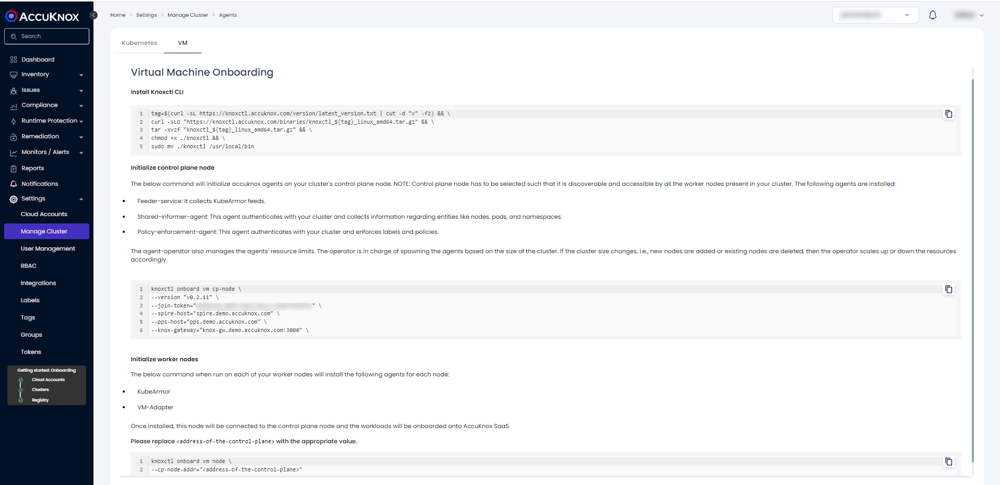

# Virtual Machine Onboarding


## Description

In VM environments, currently, agents are run as docker containers. Thus making docker one of the prerequisites.

### Control Plane Node

- Each VM will have one control plane which needs to be accessible by all the other worker nodes.

- Agents

    + kubearmor

    + kubearmor-relay-server

    + kubearmor-vm-adapter

    + shared-informer-agent

    + policy-enforcer-agent

    + feeder-service

**NOTE**: discovery-engine is not an agent in vm onboarding

### Worker Node

There can be multiple worker nodes in a VM cluster. All of them will connect with the control plane node.

- Agents

    + kubearmor

    + kubearmor-vm-adapter

## Prerequisites

- Docker v19.0.3 and Docker compose v1.27.0+. Follow the latest <a href="https://docs.docker.com/engine/install/" target="_blank">Install Docker Engine</a> for downloading. 

    + Make sure you also add your user to the docker user group - <a href="https://docs.docker.com/engine/install/linux-postinstall/" target="_blank"> Linux post-installation steps for Docker Engine</a> .

- Linux Kernel v5.8+ with BPF LSM support. <a href="https://github.com/kubearmor/KubeArmor/blob/main/getting-started/FAQ.md#checking-and-enabling-support-for-bpf-lsm" target="_blank"> Guide to enable BPF LSM</a>

    + If Linux v5.8+ or BPF LSM is not supported in the given environment. Host enforcement will still work out of the box. For protecting containers, new containers will have to be created with special options. See <a href="https://github.com/kubearmor/KubeArmor/wiki/Support-for-non-orchestrated-containers" target="_blank"> Support for non orchestrated containers</a> for the same.

### Resource requirements

+ Control plane node (minimum):

    - CPU: 2vCPU

    - Memory: 4 GB

    - Disk: 24 GB 

+ Worker node (minimum):

    - CPU: 2vCPU

    - Memory: 2 GB

    - Disk: 12 GB

### Network requirements

Connectivity between the control plane node and worker nodes is a must. They should either be:

- Part of the same private network (recommended & secure)

- The control plane should have public IP


## Steps to Onboard VM

**Step 1**: Navigate to Settings → Manage Cluster → Onboard Now

**Step 2**: Give a Name to the VM that you are Onboarding

**Step 3**: On the Next Screen → Click On VM → You will find the steps to Onboard a VM



**Step 4**: Install AccuKnox CLI

```sh
tag=$(curl -sL https://knoxctl.accuknox.com/version/latest_version.txt | cut -d "v" -f2) && \
curl -sLO "https://knoxctl.accuknox.com/binaries/knoxctl_${tag}_linux_amd64.tar.gz" && \
tar -xvzf "knoxctl_${tag}_linux_amd64.tar.gz" && \
chmod +x ./knoxctl && \
sudo mv ./knoxctl /usr/local/bin
```

Sample Output:

```sh
$ tag=$(curl -sL https://knoxctl.accuknox.com/version/latest_version.txt | cut -d "v" -f2) && \
curl -sLO "https://knoxctl.accuknox.com/binaries/knoxctl_${tag}_linux_amd64.tar.gz" && \
tar -xvzf "knoxctl_${tag}_linux_amd64.tar.gz" && \
chmod +x ./knoxctl && \
sudo mv ./knoxctl /usr/local/bin
README.md
knoxctl
```

**Step 5**: Initialize control plane node

The below command will initialize accuknox agents on your cluster's control plane node. **NOTE:** Control plane node has to be selected such that it is discoverable and accessible by all the worker nodes present in your VM cluster. 

The following agents are installed:

- Feeder-service: It collects KubeArmor feeds.

- Shared-informer-agent: This agent authenticates with your VMs and collects information regarding entities like hosts, containers, and namespaces.

- Policy-enforcement-agent: This agent authenticates with your VMs and enforces labels and policies.

```sh
knoxctl onboard vm cp-node \
--version "v0.2.11" \
--join-token="28eb827c-cc08-4244-a393-027f34daacf3" \
--spire-host="spire.demo.accuknox.com" \
--pps-host="pps.demo.accuknox.com" \
--knox-gateway="knox-gw.demo.accuknox.com:3000" 
```

Sample Output:

```sh
$ knoxctl onboard vm cp-node \
--version "v0.2.11" \
--join-token="28eb827c-cc08-4244-a393-027f34daacf3" \
--spire-host="spire.demo.accuknox.com" \
--pps-host="pps.demo.accuknox.com" \
--knox-gateway="knox-gw.demo.accuknox.com:3000"
[+] Pulling 9/9
 ✔ policy-enforcement-agent Pulled                                                                                 3.5s
 ✔ kubearmor-init Pulled                                                                                           4.6s
 ✔ wait-for-it Pulled                                                                                              3.5s
 ✔ kubearmor-relay-server Pulled                                                                                   4.7s
 ✔ spire-agent Pulled                                                                                              3.5s
 ✔ shared-informer-agent Pulled                                                                                    3.5s
 ✔ feeder-service Pulled                                                                                           3.4s
 ✔ kubearmor Pulled                                                                                                4.7s
 ✔ kubearmor-vm-adapter Pulled                                                                                     4.7s
[+] Running 9/10
 ⠼ Network accuknox-config_accuknox-net  Created                                                                  16.4s
 ✔ Container kubearmor-init              Exited                                                                    2.3s
 ✔ Container spire-agent                 Started                                                                   2.2s
 ✔ Container wait-for-it                 Exited                                                                    3.2s
 ✔ Container kubearmor                   Started                                                                   9.7s
 ✔ Container kubearmor-relay-server      Started                                                                  11.0s
 ✔ Container kubearmor-vm-adapter        Started                                                                  10.8s
 ✔ Container shared-informer-agent       Started                                                                  15.8s
 ✔ Container policy-enforcement-agent    Started                                                                  15.3s
 ✔ Container feeder-service              Started                                                                  14.9s
VM successfully onboarded!
Now onboard any worker nodes with:
knoxctl onboard vm node --cp-addr=
```

**Step 6**: Initialize worker nodes

The below command when run on each of your worker nodes will install the following agents for each node:

- KubeArmor

- VM-Adapter

Once installed, this node will be connected to the control plane node and the workloads will be onboarded onto AccuKnox SaaS.

Please replace ```<address-of-the-control-plane>``` with the appropriate value.

```sh
knoxctl onboard vm node \
--cp-node-addr="<address-of-the-control-plane>"
```

Sample Output:

```sh
$ knoxctl onboard vm node --cp-node-addr=192.168.56.106
Pulling kubearmor-init       ... done
Pulling kubearmor            ... done
Pulling kubearmor-vm-adapter ... done
Creating network "accuknox-config_accuknox-net" with the default driver
Creating kubearmor-init ... done
Creating kubearmor      ... done
Creating kubearmor-vm-adapter ... done
onboard-vm-node.go:41: VM successfully joined with control-plane!
```

If You Get any Issues while Onboarding use the below commands to debug:

```sh
docker logs spire-agent -f
docker logs shared-informer-agent -f
docker logs kubearmor-init -f
docker logs kubearmor -f
```

## View Workloads
 
**Step 1**: Navigate to Inventory → Cloud Workloads


**Step 2**: To view the onboarded VMs, Click on the cluster name and select view Nodes


## Sample policy Demonstration

Follow the below steps to apply the KubeArmor Host policy to a VM:

**Step 1**: Use the below policy by saving it in a file and replacing the value of ```<hostname>``` with your VM hostname

```sh
apiVersion: security.kubearmor.com/v1
kind: KubeArmorHostPolicy
metadata:
  name: block-pkg-mgmt-tools
spec:
  severity: 10
  message: "apt was attempted to be executed"
  tags:
  - ALERT
  nodeSelector:
    matchLabels:
      kubearmor.io/hostname: <hostname>
  process:
    matchPaths:
    - path: /usr/bin/apt
    - path: /usr/bin/apt-get
    - path: /bin/apt
    - path: /bin/apt-get
  action:
    Block
```

**Step 2**: Navigate to Runtime Protection → Policies and click on "Create Policy" to open the policy editor tool. Then upload the above policy file


**Step 3**: Select the cluster Name


 
**Step 4**: Save the policy to the workspace


 
**Step 5**: Select the saved policy and activate it by clicking on Apply Policy → Confirm


Once confirmed, the policy will be activated

### Host Policy Violation

Goto the terminal and try executing "apt" or "apt-get" command

```sh
$ apt
-bash: /usr/bin/apt: Permission denied
$ apt update
-bash: /usr/bin/apt: Permission denied
```

Alerts:

```sh
{
  "Action": "Block",
  "ClusterName": "adi-vm",
  "Cwd": "/",
  "Data": "lsm=SECURITY_BPRM_CHECK",
  "Enforcer": "BPFLSM",
  "HostName": "aditya",
  "HostPID": 53883,
  "HostPPID": 3759,
  "Message": "apt was attempted to be executed",
  "Operation": "Process",
  "PID": 53883,
  "PPID": 3759,
  "PolicyName": "block-pkg-mgmt-tools",
  "ProcessName": "/usr/bin/apt-get",
  "Resource": "/usr/bin/apt-get",
  "Result": "Permission denied",
  "Severity": "10",
  "Source": "/usr/bin/bash",
  "Tags": "ALERT",
  "Timestamp": 1709885253,
  "Type": "MatchedHostPolicy",
  "UID": 1000,
  "UpdatedTime": "2024-03-08T08:07:33.906Z",
  "cluster_id": "22639",
  "component_name": "kubearmor",
  "instanceGroup": "0",
  "instanceID": "0",
  "tenant_id": "11",
  "workload": "1"
}
```

On the Saas UI, Navigate to Monitors/Alerts → Alerts. You will be able to see the alerts generated upon violation of the policy


### Container Policy Enforcement

**Step 1**: Spin up a new container and get a shell inside it

```sh
docker run --rm -it --name=ubuntu ubuntu:latest bash
```

**In Case of AppArmor**

For container policies on VMs using Apparmor, you'll have to create new containers by specifying the AppArmor profile:

```sh
docker run --rm -it --security-opt apparmor=kubearmor_ubuntu --name=ubuntu ubuntu:latest bash
```

The template AppArmor profile will be auto created when a policy is applied. Thus, it’ll be easier if the policy is applied before the container is created. The policy can also be applied after it is created, more info can be found in the <a href="https://github.com/kubearmor/KubeArmor/wiki/Support-for-non-orchestrated-containers" target="_blank">KubeArmor Wiki</a>.

The ```--security-opt``` option has to be specified while running any container so that KubeArmor can create AppArmor profiles for containers running outside Kubernetes.

**Step 2**: Apply a Sample policy:

```sh
apiVersion: security.kubearmor.com/v1
kind: KubeArmorPolicy
metadata:
  annotations:
    app.accuknox.com/source: Discovery Engine
    app.accuknox.com/type: harden
  name: harden-feeder-service-system-owner-discovery
  namespace: container_namespace
spec:
  action: Block
  message: System owner discovery command execution denied
  process:
    matchPaths:
    - path: /usr/bin/who
    - path: /usr/bin/w
    - path: /usr/bin/id
    - path: /usr/bin/whoami
  selector:
    matchLabels:
      kubearmor.io/container.name: ubuntu
  severity: 3
  tags:
  - MITRE
  - MITRE_T1082_system_information_discovery
```
Apply the above policy following the steps similar to the host policy specified above.

### Container Policy Violation

Try to run the system discovery commands inside the container

```sh
$ docker run --rm -it --name=ubuntu ubuntu:latest bash
root@3ba206e7e13c:/# who
bash: /usr/bin/who: Permission denied
root@3ba206e7e13c:/# id
bash: /usr/bin/id: Permission denied
root@3ba206e7e13c:/# exit
```

Alerts/Telemetry:

```sh
{
  "Action": "Block",
  "ClusterName": "demo-vm",
  "ContainerID": "3ba206e7e13c99ef40220eaf2cdc69b49beacce10c6df19975e84630617f8ac9",
  "ContainerImage": "ubuntu:latest",
  "ContainerName": "ubuntu",
  "Data": "lsm=SECURITY_BPRM_CHECK",
  "Enforcer": "BPFLSM",
  "HashID": "a629658c179ee5da7cf6da888fd0c75a49eeec3164f10485cfd6af4102202ddc",
  "HostName": "aditya",
  "HostPID": 7104,
  "HostPPID": 6947,
  "Labels": "kubearmor.io/container.name=ubuntu org.opencontainers.image.ref.name=ubuntu org.opencontainers.image.version=22.04",
  "Message": "System owner discovery command execution denied",
  "NamespaceName": "container_namespace",
  "Operation": "Process",
  "Owner": {
    "Name": "",
    "Namespace": "",
    "Ref": ""
  },
  "PID": 11,
  "PPID": 1,
  "PodName": "ubuntu",
  "PolicyName": "harden-kubearmor-system-owner-discovery-clone",
  "ProcessName": "/usr/bin/id",
  "Resource": "/usr/bin/id",
  "Result": "Permission denied",
  "Severity": "3",
  "Source": "/usr/bin/bash",
  "Tags": "MITRE,MITRE_T1082_system_information_discovery",
  "Timestamp": 1707892008,
  "Type": "MatchedPolicy",
  "UID": 0,
  "UpdatedTime": "2024-02-14T06:26:48.662463Z",
  "UpdatedTimeISO": "2024-02-14T06:26:48.662Z",
  "cluster_id": "16458",
  "component_name": "kubearmor",
  "instanceGroup": "0",
  "instanceID": "0",
  "workload": "1"
}
```


## Cleanup

To deboard the worker-vm/Node:

```sh
knoxctl deboard vm node
```

To deboard the Control-Plane VM:

```sh
knoxctl deboard vm cp-node
```

Sample Output:

```sh
$ knoxctl deboard vm cp-node
[+] Running 10/10
 ✔ Container shared-informer-agent       Removed                                                                   0.6s
 ✔ Container feeder-service              Removed                                                                   0.6s
 ✔ Container policy-enforcement-agent    Removed                                                                   0.8s
 ✔ Container wait-for-it                 Removed                                                                   0.0s
 ✔ Container kubearmor-vm-adapter        Removed                                                                   5.6s
 ✔ Container kubearmor-relay-server      Removed                                                                   1.5s
 ✔ Container spire-agent                 Removed                                                                   0.5s
 ✔ Container kubearmor                   Removed                                                                  10.4s
 ✔ Container kubearmor-init              Removed                                                                   0.0s
 ✔ Network accuknox-config_accuknox-net  Removed                                                                   0.3s
Please remove any remaining resources at /home/user/.accuknox-config
Control plane node deboarded successfully.
```

Removing any remaining resources:

```sh
sudo rm -rf ~/.accuknox-config
```