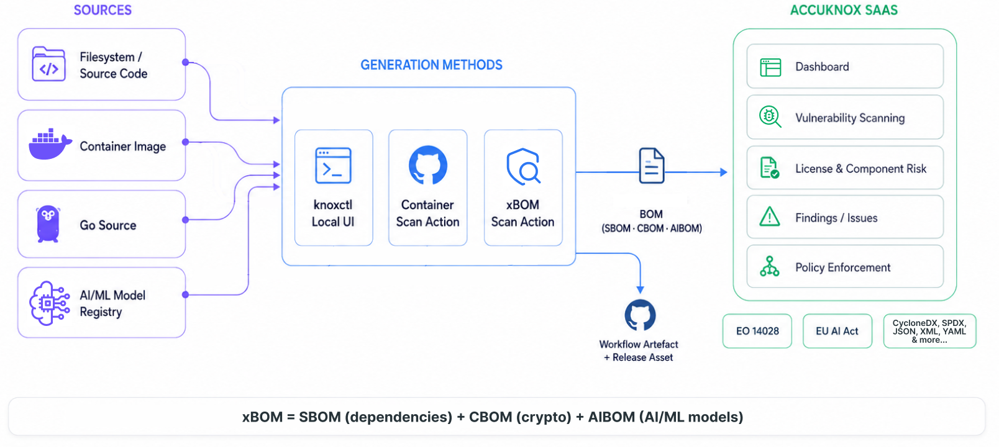

# xBOM

xBOM is an umbrella term covering **SBOM** (software dependencies), **CBOM** (cryptographic assets), and **AIBOM** (AI/ML models). Each maps a different layer of the supply chain to track risk, meet compliance requirements like EO 14028 and the EU AI Act, and respond to vulnerabilities faster.

## Choose a Generation Method

::cards:: cols=3

- title: knoxctl
  content: Use the local knoxctl UI to scan filesystems, container images, and AI/ML models interactively and push results to your AccuKnox tenant.
  image: ../how-to/icons/app-code.svg
  url: /getting-started/xbom-knoxctl/

- title: Container Image Scan Action
  content: Integrate AccuKnox's container scan GitHub Action into your CI/CD pipeline to scan images and generate SBOMs automatically on every push or pull request.
  image: ../how-to/icons/container-image-scan.svg
  url: /getting-started/xbom-container-image/

- title: xBOM Scan Action
  content: Use the AccuKnox xBOM Scan Action to generate SBOM, CBOM, and AIBOM from source code, container images, or AI/ML model sources directly in GitHub Actions.
  image: ../how-to/icons/cicd-pipeline.svg
  url: /getting-started/xbom-github-actions/

::/cards::

## Common Prerequisites

These setup steps are required regardless of which generation method you choose.

### Step 0: Install knoxctl

Install `knoxctl` before starting xBOM generation.

- Installation guide: [knoxctl documentation](https://help.accuknox.com/knoxctl/)
- Source and releases: [accuknox-cli-v2 on GitHub](https://github.com/accuknox/accuknox-cli-v2)

### Step 1: Create Project and Classifier

1. Log in to the AccuKnox UI.

2. Navigate to **SBOM** > **Projects**.

    

3. Click **Add Project**.

    

4. Fill in the following fields:

    - Project name
    - Description
    - Classifier

    

5. Click the **Create** button.

!!! note
    The **Project Name** and **Classifier** must exactly match the values you pass in your workflow or knoxctl configuration.

### Step 2: Create Labels

1. In the AccuKnox UI, navigate to **Settings**.

    

2. Go to **Labels**.

    

3. Click the **Label+** button.

    

4. Create the labels you need for organising your projects.

    

5. Save your label configuration.

**Reference:** [How to Create Labels](https://help.accuknox.com/how-to/how-to-create-labels/)

### Step 3: Generate Access Key

1. Navigate to **Settings** > **User Management**.

    

2. Click on your user profile.

3. Click the three-dot icon (⋮).

    

4. Select **Create Access Key**.

    

5. Copy the access key and save it securely.

    

!!! note
    You will need this key for API authentication in the next steps.

**Reference:** [How to Create Access Keys](https://help.accuknox.com/how-to/create-access-keys/)

---

## Post-Generation Workflow

Once generated, BOMs automatically appear in your SBOM dashboard, where AccuKnox scans them for known CVEs, license issues, and outdated components. View vulnerability details, track remediation, and export reports under **SBOM** > **Projects** > [Your Project Name].
