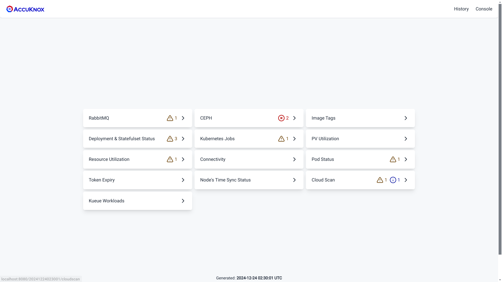
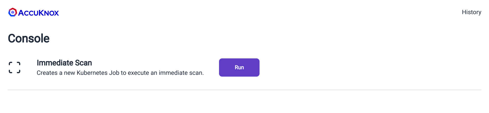
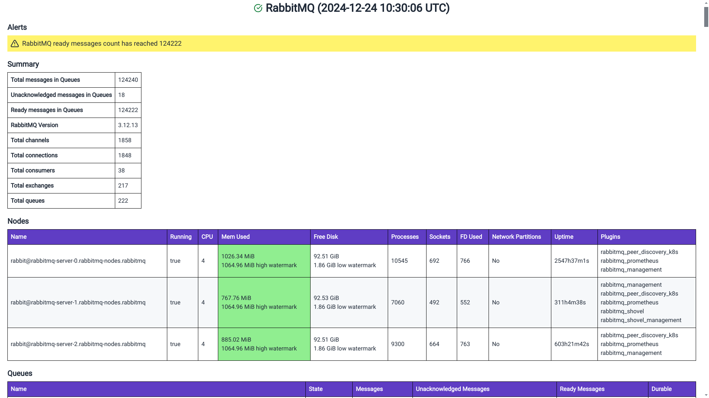
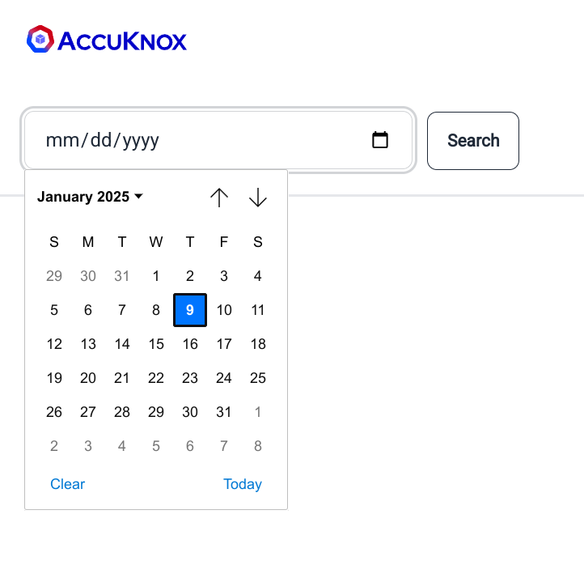
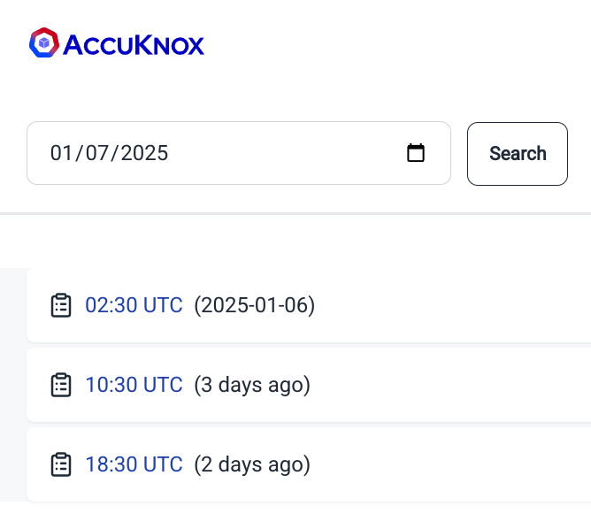

RINC (short for "Reporting IN Cluster") is a simple and lightweight reporting tool that provides insights into the status of a Kubernetes cluster, as well as other services running within it.

It includes built-in alerting capabilities, allowing users to define alerts using an expression language. RINC comes with a set of practical and sensible pre-configured alerts, which are included in the provided Helm charts. If you need to customize or extend these alerts, you can easily do so using our expression language, which is powered by the [gval](https://github.com/PaesslerAG/gval "https://github.com/PaesslerAG/gval") Go library.

RINC also supports email integration, allowing you to receive alerts via email.

## Supported reports

- Kubernetes deployment and statefulset status reports

- Long-running job reports

- Registry scan job status reports

- Supports reporting jobs where the module container has succeeded but the artifact-api container has failed.

- Kubernetes deployment and statefulset image tag reports

- RabbitMQ metrics reports

- CEPH metrics reports

- Pod status reports

- PV Utilization report

- Pod & Node resource utilization report

- Token expiry report

- Nodes' time-in-sync report

- Connectivity & Status checks for,

  1. Vault

  2. MongoDB

  3. Redis/KeyDB

  4. Neo4j

  5. Postgresql

  6. Prometheus

  7. Metabase

  8. AWS RDS

  9. Weaviate

- Onboarded registries status report

- [Kueue](https://kueue.sigs.k8s.io/ "https://kueue.sigs.k8s.io/") workload status report

- Supports reporting jobs where the module container has succeeded but the artifact-api container has failed.

## Installation

We recommend installing RINC through our provided helm charts.

_Note: RINC uses MongoDB as its data store and creates a new collection called "rinc" upon launch. It is recommended that you create a separate MongoDB user with R/W access to the "rinc" collection. See the section on_ [_Minimum Required Database Permissions_](#minimum-required-database-permissions-for-rinc-to-generate-reports)_._

```bash
VERSION=0.9.0

helm show values oci://public.ecr.aws/k9v9d5v2/accuknox-rinc --version "$VERSION" > values.yaml
```

The file `values.yaml` is well-documented and includes all configurable options for `RINC`. Please go through it and adjust the values as needed to suit your preferences. See [passing database/vault credentials](#passing-database-credentials) to RINC.

By default, all reports are disabled and can be enabled by setting `enable` to `true` in the Helm chart values. For example, to enable the RabbitMQ report, set:

```yaml
config:
  rabbitmq:
    enable: true
```

If you are using our Accuknox Helm charts, we provide an `accuknox-values.yaml` file with most of the values pre-configured.

```bash
helm pull oci://public.ecr.aws/k9v9d5v2/accuknox-rinc --version "$VERSION"
tar xvzf "accuknox-rinc-$VERSION.tgz"
less accuknox-rinc/accuknox-values.yaml
```

> RINC supports reading secrets directly from Vault. If you are using Hashicorp's Vault, please refer to the section on [vault](#vault-policy).

After customizing the values to your preferences, run the Helm install command below to deploy `RINC` in your cluster:

```bash
NAMESPACE="accuknox-rinc"

helm upgrade rinc oci://public.ecr.aws/k9v9d5v2/accuknox-rinc \
    --install \
    --namespace "$NAMESPACE" \
    --create-namespace \
    --version "$VERSION" \
    --values values.yaml
```

To check if everything is healthy, run:

```bash
watch kubectl -n "$NAMESPACE" get pod,job,cronjob,secret,configmap
```

If everything appears healthy and running, congratulations! RINC has been successfully installed on your cluster.

## Passing Database Credentials

Database credentials are used for connectivity checks. There are 3 ways to pass your database credentials to RINC,

### 1. **Using Helm**:

Set `secretConfig.create` to true in the helm values and fill the secrets below to let Helm create a Kubernetes Secret that is mounted into RINC.

```yaml
secretConfig:
  create: true
  config:
    mongodb:
      ###          ###
      ### REDACTED ###
      ###          ###
```

### 2. **Manually Creating a Secret**:
Below is a template for the Secret manifest,

```yaml
apiVersion: v1
kind: Secret
metadata:
  name: credentials
  namespace: accuknox-rinc
type: Opaque
stringData:
  secret.yaml: |-
    # Please fill in the configuration below if you have set `vault.use` to
    # true above.
    vault:
      auth:
        # vault auth type
        #
        # Possible values: "token", "kubernetes"
        type: ""
        # Token used to authenticate to vault. Required when auth type is set to
        # "token".
        token: ""
        # Role name used to authenticate to vault. Required when auth type is set
        # to "kubernetes".
        role: ""
    # Service-specify credentials.
    #
    # It is recommended to create a dedicated `rinc` user for each of the
    # services.
    mongodb:
      username: ""
      password: ""
    email:
      smtp:
        host: ""
        username: ""
        password: ""
        port: 587
    rabbitmq:
      management:
        # basic auth username for the management api.
        username: ""
        # basic auth password for the management api.
        password: ""
    ceph:
      # ceph reporter uses ceph's dashboard API to scrape ceph status and
      # metrics.
      dashboardAPI:
        # username to authenticate with ceph dashboard API.
        username: ""
        # password to authenticate with ceph dashboard API.
        password: ""
    connectivity:
      neo4j:
        # neo4j basic auth username
        username: ""
        # neo4j basic auth password
        password: ""
      postgres:
        # postgresql auth username.
        username: ""
        # postgresql auth password.
        password: ""
      rds:
        # aws access key id
        accessKeyId: ""
        # aws secret access key
        secretAccessKey: ""
    tokenExpiry:
      # list of token whose expiry need to be checked.
      #
      # It is recommended to NOT specify the token value here as it will remain
      # static. If you are using Vault, you can specify the vault `path` as
      # documented in the `config` section. If you are NOT using Vault, you can
      # use ExternalSecrets that will periodically sync the token value.
      tokens: []
        # - name: ""
        #   value: ""
    cloudScan:
      onboardedRegistries:
        postgres:
          # postgresql auth username.
          username: ""
          # postgresql auth password.
          password: ""
```

`kubectl apply -f credentials.yaml`

This secret must then be referenced in the helm chart values,

```yaml
# This section is for specifying an existing Kubernetes Secret that the Helm
# chart should reference
existingSecret:
  # name of the existing Secret in the Kubernetes cluster
  name: "credentials"
  # key within the Secret, which corresponds to the specific value to be used.
  key: "secret.yaml"
```


### 3. **Reading credentials directly from Vault**
RINC can read credentials directly from Vault. To configure RINC to connect to Vault, specify the connection details in the Helm values under `secretConfig.config.vault` and ensure that `secretConfig.create` is set to `true`. Helm will pass the Vault credentials to RINC via the created Kubernetes Secret, allowing RINC to use these credentials to connect to Vault and read the remaining credentials directly from it.

See the section on [Vault](#vault-policy) for setting up the required Vault policies.

```yaml
secretConfig:
  create: true
  config:
    # Please fill in the configuration below if you have set `vault.use` to
    # true above.
    vault:
      auth:
        # vault auth type
        #
        # Possible values: "token", "kubernetes"
        type: ""
        # Token used to authenticate to vault. Required when auth type is set to
        # "token".
        token: ""
        # Role name used to authenticate to vault. Required when auth type is set
        # to "kubernetes".
        role: ""
```

## Accessing RINC's web interface

By default, RINC is not exposed to the outside world. To access RINC's web interface, port-forward to the `rinc-web` service:

`kubectl -n "$NAMESPACE" port-forward svc/rinc-web 8080:80`

Now open `<http://localhost:8080`> in your browser.

### An overview of RINC's web interface



If you open RINC's web interface immediately after installation, the reporting cronjob might not have scheduled yet, so you may see an empty welcome screen instead of the dashboard. However, don't worry - you can go to the `Console` by clicking on the top-right section of the page and start an "on-demand scan".



This will immediately launch a Kubernetes Job to aggregate all the metrics and generate a report for you. The job will take some time depending on the size of your cluster and workloads. Once the job is completed, you will see a dashboard similar to the example above.

### An overview of the reports generated by RINC



_Above is an example RabbitMQ report._

Every report begins with an **Alerts** section, displaying any fired alerts. The alerts are color-coded based on their severity:

1. **Red** - Indicates a critical alert.

2. **Yellow** - Indicates a warning.

3. **Info** - Provides useful information.

Critical alerts typically require immediate action. Warning alerts, if not addressed in time, may impact operations. Info alerts provide useful details, such as the number of onboarded registries and nodes.

> As a cluster operator, ensure there are no critical alerts.

_Note: As described earlier, RINC supports email integration, allowing you to receive these alerts via email. Refer to the_ `email` section in the Helm chart to configure email integration.

The rest of the report varies depending on the type of report and includes insights about the cluster/service.

### Fetching Old Reports

RINC retains old reports for the duration specified in `config.maintenance.metricsRetention` in the Helm values. To retrieve old reports, click on `History` at the top-right of the web interface to access the history page.



History Page

On this page, select the desired date to fetch the reports and click `Search`.



History Search Results - _All times are in UTC._

## Advanced

### Minimum Required Database Permissions for RINC to Generate Reports

**MongoDB**:

RW access to the `rinc` collection

**Postgresql**:

SELECT access to the following within the `cwpp` schema (within the `accuknox` database) tables,

1. registry_scan_details

2. registries

3. image_scan_details

4. registry_configuration

5. workspaces

6. clusters

7. node

The query below creates a user named `rinc` with SELECT access to the listed tables under the `cwpp` schema.

```SQL
CREATE USER rinc WITH PASSWORD 'tryguessingthis';
GRANT CONNECT ON DATABASE accuknox TO rinc;
GRANT USAGE ON SCHEMA cwpp TO rinc;
GRANT SELECT ON
    cwpp.registry_scan_details,
    cwpp.registries,
    cwpp.image_scan_details,
    cwpp.registry_configuration,
    cwpp.workspaces,
    cwpp.clusters,
    cwpp.nodes
TO rinc;
```

**Neo4j**:

Neo4j requires authentication to ping the database. It is recommended you created a separate database called "rinc" and a user, also called "rinc". This database is not going to be used and is only present to allow RINC to authenticate with neo4j in order to test the connectivity.

### Vault Policy

If you are using Vault with Kubernetes auth, create a role and attach the necessary policy to allow reading your configured secrets.

Example, vault policy:

```hcl
path "/accuknox/k8s/*" {
  capabilities = ["read"]
}

path "/accuknox/aws/*" {
  capabilities = ["read"]
}

path "/accuknox/artifacts/microservices/token" {
  capabilities = ["read"]
}
```

You also need to bind the role to the service accounts and namespace. RINC helm charts creates three service accounts. You can list them using,

`kubectl -n "$NAMESPACE" get serviceaccounts`

You should associate the role with all three service account names.

Once the role is created, refer to it in the Vault section of the Helm chart.
