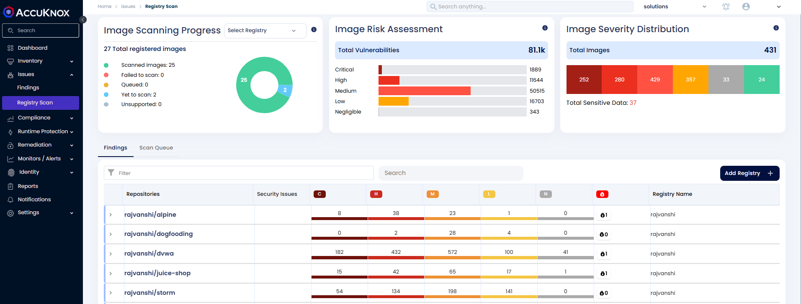
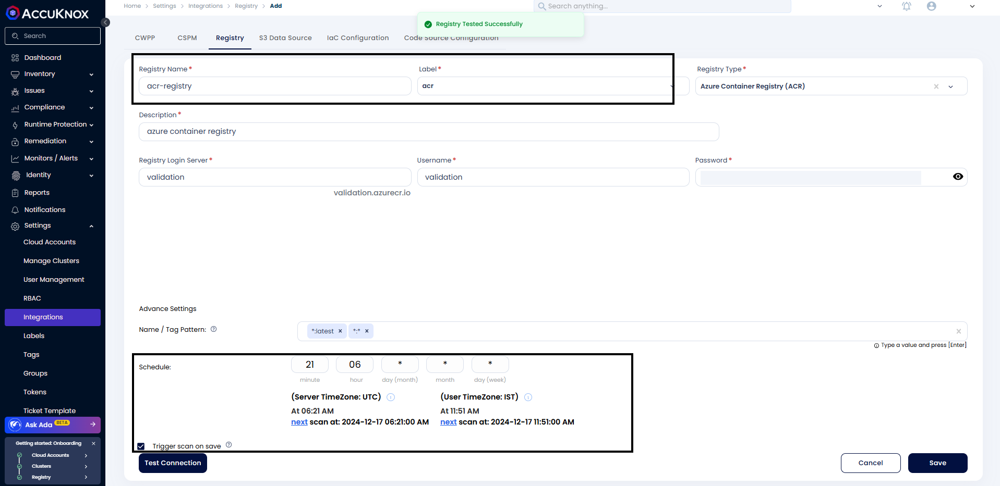
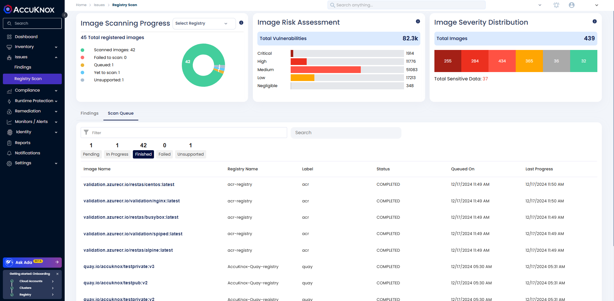

# Azure Container Registry (ACR) Onboarding

AccuKnox CSPM security tool scans images that are present in the onboarded [Azure Container Registry](https://learn.microsoft.com/en-us/azure/container-registry/ "https://learn.microsoft.com/en-us/azure/container-registry/") and can find the risks and vulnerabilities associated with these images. The risks are identified and shown in the scan results. Users will get a comprehensive view of these risks and vulnerabilities in the dashboard along with their remediation.

## **Steps to generate credentials for onboarding ACR**

**Step 1:** Open the Azure Management Console and sign in with your Azure account credentials. Search for the **Container Registry** service in the search bar.

**Step 2:** Click on the name of the registry to be onboarded. In the navigation menu for the container registry, click on **Access Keys** under the Settings section.

**Step 3:** Click on the **Admin User** checkbox to activate Admin access.

Copy the generated **Login Server**, **Username,** and **Password** for onboarding on AccuKnox SaaS.

## **Steps to Onboard ACR Registry on AccuKnox**

**Step 1:** In the **AccuKnox dashboard**, under Issues, click on "**Registry Scan**"

- Alternatively, you can go to "**Settings → Integration → Registry Scan**"

Now, click on "**Add Registry"**

**Step 2:** Enter any Registry Name and Description. Select Registry Type as ACR and paste the Login Server, Username, and Password that was copied.

Provide the **Tag pattern** and schedule a time( using the cron expression) for the scanning. If you need to trigger the scan after saving, click the **"Trigger scan on save"** checkbox.

**Step 3:** After providing all the information, click on **"Test Connection"**, it should show **"Registry Tested Successfully"**.

Now, click on **Save**.

## Configure Advanced Settings

### Image Updated Within Last

Choose one of the following options:

  - **X Days**: Scans only images updated within the last X days.

  - **All**: Scans all images, regardless of the update time.

### Image Pulled Within Last

Choose one of the following options:

  - **X Days**: Scans only images pulled within the last X days.

  - **All**: Scans all images, regardless of the pull time.

### **Name/Tag Pattern:**

Specify patterns to include or exclude images for scanning. Use the `-` symbol to explicitly exclude patterns.

By default, images are excluded unless explicitly included through patterns.

To exclude specific images, use the `-` symbol. For example: - To exclude `cwpp/ubuntu:v1`, use the pattern `-*:v1`. - To include `cwpp/ubuntu:latest`, specify a pattern like `*:latest`.

**Note**: Only images matching the pattern will be scanned. For instance, using `*:latest` ensures only images with the latest tags are scanned.

### Schedule and Certificate

Set the scan schedule using a CRON expression. For example: - **CRON Expression**: `18 minute 07 hour * day (month) * month * day (week)`.

Toggle **Trigger Scan on Save** to initiate the scan for the first time without waiting for the scheduled time.

**Step 4:** After saving the registry, the scan will start based on the scheduled time, if the Trigger scan on save is checked the scan will start right after save. After saving the scan user will be redirected to **Settings** -> **Integrations** -> **Registry**. Here, we can see the list of onboarded registries and their details.

Alternatively, you can click on "**View Registry Scan**" from the list view and this will redirect to **Issues → Registry Scan**

Once the scanning is completed, we can see the scan results

Under **"Findings"**, you can find the scanned registry.

To view the details of your registry, you can use filters such as **"registry_type"**, and then select the **"acr"** registry you can also use the filter **"registry_name"** and provide the name of your registry.

By clicking on the repositories, we can get more details about the scan results.

