# AWS Organization AI/ML Cloud Onboarding

One CloudFormation stack connects the AWS Management Account and the selected member accounts to AccuKnox AI Security. The stack creates the `CNAPPOrgSecurityAuditor` IAM role in the Management Account. A service-managed StackSet then deploys the same role to every account in the Organizational Units (OUs) that you select.

AccuKnox calls AWS STS `AssumeRole` on `CNAPPOrgSecurityAuditor` and gets temporary credentials. You do not create or store long-lived AWS access keys.

!!! info "What cloud onboarding enables"
    Onboarding turns on these AI Security features for the onboarded accounts:

    - Model and Data Security
    - [Shadow AI Discovery](../use-cases/shadow-ai-discovery.md)
    - Prompt Firewall for Cloud Assets

!!! tip "Onboarding one AWS account?"
    Use [AWS Standalone AI/ML Cloud Onboarding](aiml-aws-standalone-onboard.md) for an account that is not part of an AWS Organization.

## Prerequisites

- Sign in to the AWS Organizations Management Account.
- Make sure that the member accounts you want to scan are part of the AWS Organization.
- Keep the AWS Organization ID and the Root or OU ID ready.
- Use an AWS user that can create CloudFormation stacks, StackSets and IAM roles.
- Activate trusted access between AWS CloudFormation StackSets and AWS Organizations. The template uses a service-managed StackSet, and a service-managed StackSet needs trusted access. The steps are in [Activate trusted access for StackSets with AWS Organizations](https://docs.aws.amazon.com/AWSCloudFormation/latest/UserGuide/stacksets-orgs-activate-trusted-access.html).

## Step 1. Open Cloud Accounts

1. In the AccuKnox console, go to **Settings → Cloud Accounts**.
2. Click **Onboard Account**.

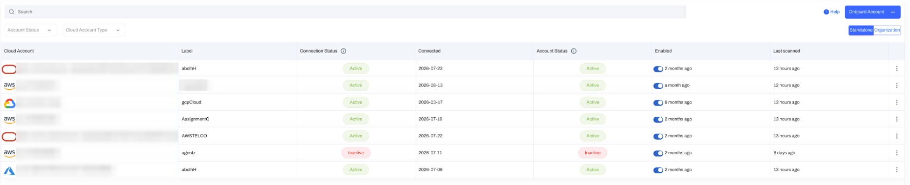

## Step 2. Select the AWS Organization Account Type

1. Select **Amazon Web Service (AWS)** as the cloud provider.
2. Select **Organization Account** as the account type. This type onboards the Management Account and the member accounts in the OU that you select.
3. Click **Next**.

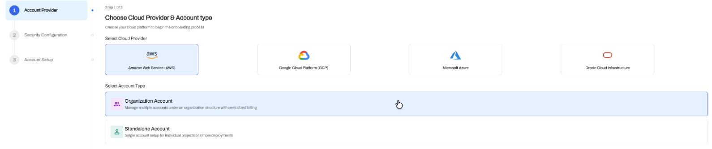

Then complete the **Security Configuration** step.

1. Turn on **AI Security**. This toggle enables AI/ML asset discovery and monitoring.
2. Click **Next**.

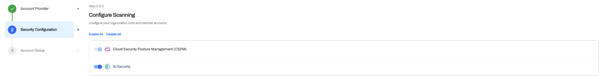

## Step 3. Enter the Organization Details

Fill in the **Account Setup** form.

| Field | Value |
|---|---|
| **Labels** | Select or create a label. The label identifies the AWS Organization and its scan results. |
| **Tags** | Optional. Add tags for extra grouping. |
| **Connection Method** | Select **IAM Role - Cloud Formation**. |
| **AWS Organization ID** | Enter the AWS Organization ID, for example `o-xxxxxxxxxx`. |
| **Root Organizational Unit ID** | Enter the Root or OU ID that holds the accounts to onboard, for example `r-xxxxxxxxxx`. |
| **Region** | Select the AWS regions to scan. |

!!! warning "Sign in to the Management Account first"
    The AWS console must be signed in to the Management Account before you launch the stack in Step 4.

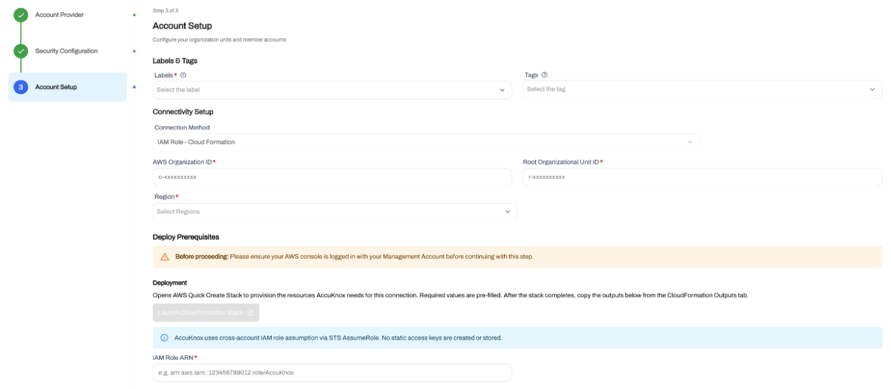

## Step 4. Launch the CloudFormation Stack

1. Under **Deploy Prerequisites**, click **Launch CloudFormation Stack**.

AccuKnox opens the AWS CloudFormation **Quick create stack** page with the onboarding parameters filled in. The stack creates the `CNAPPOrgSecurityAuditor` role in the Management Account. It also creates the `AK-SecurityAuditorRoleStackSet` StackSet. The StackSet then deploys `CNAPPOrgSecurityAuditor` to each targeted member account.

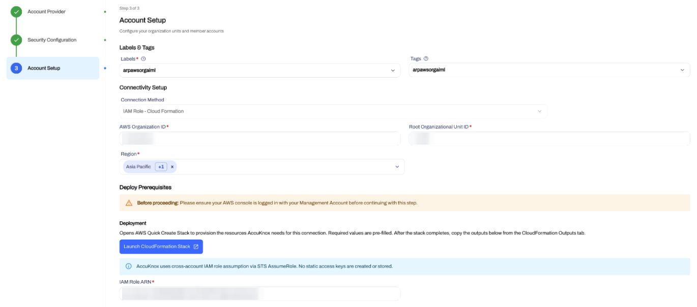

## Step 5. Review the CloudFormation Parameters

Check the parameters on the **Quick create stack** page before you create the stack. Keep the generated values unless you need a different deployment scope.

| Parameter | What it controls |
|---|---|
| `OrganizationalUnitIds` | The Root or OUs that the StackSet deploys to. |
| `Regions` | The regions for the StackSet instances. |
| `AutoDeploy` | Automatic StackSet deployment to new accounts that join the targeted OUs. |
| `ExternalId` | An extra condition that AccuKnox must meet when it assumes the IAM role. |
| `AccountFilterType` | `INCLUDE` targets only the listed `AccountIds`. `EXCLUDE` removes them. `NONE` ignores `AccountIds`. |
| `AccountIds` | The AWS account IDs that `AccountFilterType` uses with `INCLUDE` or `EXCLUDE`. |

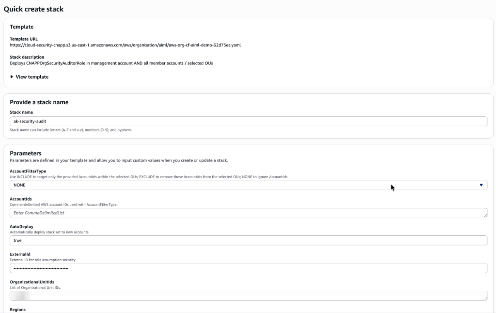

## Step 6. Review the IAM Role and Its Permissions

The template gives `CNAPPOrgSecurityAuditor` two AWS managed policies, `ReadOnlyAccess` and `SecurityAudit`. It also adds an inline policy named `AI-ML-permissions`. The Management Account role and the member account roles get the same configuration.

### STS AssumeRole With an External ID

The role trust policy lets the AccuKnox AWS principal call `sts:AssumeRole`. AWS STS returns temporary credentials that carry only the role permissions, so no long-lived access key exists.

The trust policy also checks `sts:ExternalId`. The role assumption request must carry the External ID from your onboarding session. This check adds protection for cross-account access by a third party.

### Permissions That the Role Grants

| Permission | Why AccuKnox needs it |
|---|---|
| `ReadOnlyAccess` | Read-only access to discover AWS resources and read their configuration and metadata. |
| `SecurityAudit` | Read access to security-relevant AWS configuration. |
| `bedrock:InvokeModel` | Invokes Amazon Bedrock models when a supported AI/ML workflow needs model interaction. |
| `bedrock:ListImportedModels` | Discovers imported models in Amazon Bedrock. |
| `bedrock:ListModelInvocationJobs` | Reads Bedrock model invocation job information for supported AI/ML workflows. |
| `sagemaker:InvokeEndpoint` | Invokes deployed SageMaker inference endpoints for supported AI/ML workflows. |
| `aws-marketplace:ViewSubscriptions` | Reads AWS Marketplace subscription information for supported Marketplace AI models and services. |
| `aws-marketplace:Subscribe` | Subscribes to a supported Marketplace model that needs a subscription before use. |
| `bedrock-agentcore:InvokeAgentRuntime` | Invokes a Bedrock AgentCore runtime for supported workflows. |
| `bedrock-agentcore:StopRuntimeSession` | Stops the matching AgentCore runtime session. |

To read the full template, expand **View template** on the **Quick create stack** page.

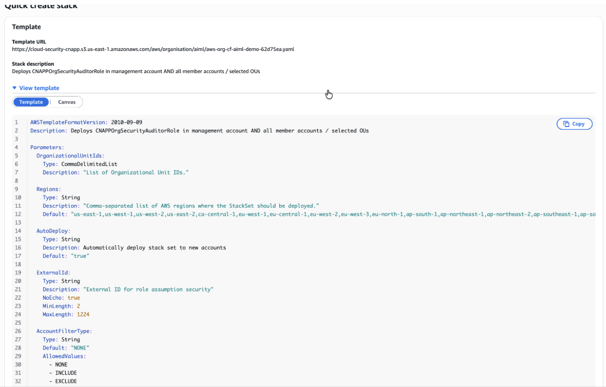

??? note "CloudFormation template"
    ```yaml
    AWSTemplateFormatVersion: 2010-09-09
    Description: Deploys CNAPPOrgSecurityAuditorRole in management account AND all member accounts / selected OUs

    Parameters:
      OrganizationalUnitIds:
        Type: CommaDelimitedList
        Description: "List of Organizational Unit IDs."

      Regions:
        Type: String
        Description: "Comma-separated list of AWS regions where the StackSet should be deployed."
        Default: "us-east-1,us-west-1,us-west-2,us-east-2,ca-central-1,eu-west-1,eu-central-1,eu-west-2,eu-west-3,eu-north-1,ap-south-1,ap-northeast-1,ap-northeast-2,ap-southeast-1,ap-southeast-2,sa-east-1,af-south-1,me-south-1,eu-south-1,ap-east-1"

      AutoDeploy:
        Type: String
        Description: Automatically deploy stack set to new accounts
        Default: "true"

      ExternalId:
        Type: String
        Description: "External ID for role assumption security"
        NoEcho: true
        MinLength: 2
        MaxLength: 1224

      AccountFilterType:
        Type: String
        Default: "NONE"
        AllowedValues:
          - NONE
          - INCLUDE
          - EXCLUDE
        Description: "Use INCLUDE to target only the provided AccountIds within the selected OUs; EXCLUDE to remove those AccountIds from the selected OUs; NONE to ignore AccountIds."

      AccountIds:
        Type: CommaDelimitedList
        Default: ""
        Description: "Comma-delimited AWS account IDs used with AccountFilterType."

    Conditions:
      HasAccountIds: !Not [!Equals [!Join [",", !Ref AccountIds], ""]]
      UseInclude: !Equals [!Ref AccountFilterType, "INCLUDE"]
      UseExclude: !Equals [!Ref AccountFilterType, "EXCLUDE"]
      AutoDeployEnabled: !Equals [!Ref AutoDeploy, "true"]

    Resources:
      ManagementAccountRole:
        Type: AWS::IAM::Role
        Properties:
          Path: "/"
          RoleName: "CNAPPOrgSecurityAuditor"
          AssumeRolePolicyDocument:
            Version: "2012-10-17"
            Statement:
              - Effect: Allow
                Principal:
                  AWS: arn:aws:iam::735362266271:user/cnapp-security-audit-ak
                Action: "sts:AssumeRole"
                Condition:
                  StringEquals:
                    "sts:ExternalId": !Ref ExternalId
          Description: "CNAPPOrgSecurityAuditor (Management Account)"
          MaxSessionDuration: 43200
          ManagedPolicyArns:
            - "arn:aws:iam::aws:policy/ReadOnlyAccess"
            - "arn:aws:iam::aws:policy/SecurityAudit"
          Policies:
            - PolicyName: "AI-ML-permissions"
              PolicyDocument:
                Version: "2012-10-17"
                Statement:
                  - Sid: "AllowAIMLServices"
                    Effect: Allow
                    Action:
                      - "bedrock:InvokeModel"
                      - "bedrock:ListImportedModels"
                      - "bedrock:ListModelInvocationJobs"
                      - "sagemaker:InvokeEndpoint"
                      - "aws-marketplace:Subscribe"
                      - "aws-marketplace:ViewSubscriptions"
                      - "bedrock-agentcore:InvokeAgentRuntime"
                      - "bedrock-agentcore:StopRuntimeSession"
                    Resource: "*"

      StackSet:
        Type: AWS::CloudFormation::StackSet
        Properties:
          AutoDeployment:
            Enabled: !Ref AutoDeploy
            # Only include RetainStacksOnAccountRemoval when AutoDeploy is true
            RetainStacksOnAccountRemoval:
              !If [AutoDeployEnabled, false, !Ref "AWS::NoValue"]
          PermissionModel: SERVICE_MANAGED
          Capabilities:
            - CAPABILITY_NAMED_IAM
          Description: Deploys CNAPPOrgSecurityAuditorRole across member accounts
          Parameters:
            - ParameterKey: ExternalId
              ParameterValue: !Ref ExternalId
          OperationPreferences:
            FailureTolerancePercentage: 99
            MaxConcurrentPercentage: 100
            RegionConcurrencyType: PARALLEL
          StackInstancesGroup:
            - DeploymentTargets:
                AccountFilterType: !If [HasAccountIds, !If [UseExclude, DIFFERENCE, !If [UseInclude, INTERSECTION, NONE]], NONE]
                OrganizationalUnitIds: !Ref OrganizationalUnitIds
                Accounts: !If [HasAccountIds, !Ref AccountIds, !Ref "AWS::NoValue"]
              Regions:
                - !Select
                  - 0
                  - !Split
                    - ","
                    - !Ref Regions
          StackSetName: "AK-SecurityAuditorRoleStackSet"
          TemplateBody: !Sub |
            {
              "AWSTemplateFormatVersion": "2010-09-09",
              "Parameters": {
                "ExternalId": {
                  "Type": "String",
                  "Description": "External ID for role assumption security",
                  "NoEcho": true,
                  "MinLength": 2,
                  "MaxLength": 1224
                }
              },
              "Resources": {
                "CNAPPOrgSecurityAuditor": {
                  "Type": "AWS::IAM::Role",
                  "Properties": {
                    "Path": "/",
                    "RoleName": "CNAPPOrgSecurityAuditor",
                    "AssumeRolePolicyDocument": {
                      "Version": "2012-10-17",
                      "Statement": [
                        {
                          "Effect": "Allow",
                          "Principal": {
                            "AWS": "arn:aws:iam::735362266271:user/cnapp-security-audit-ak"
                          },
                          "Action": "sts:AssumeRole",
                          "Condition": {
                            "StringEquals": {
                              "sts:ExternalId": {"Ref": "ExternalId"}
                            }
                          }
                        }
                      ]
                    },
                    "Description": "CNAPPOrgSecurityAuditor",
                    "MaxSessionDuration": 43200,
                    "ManagedPolicyArns": [
                      "arn:aws:iam::aws:policy/ReadOnlyAccess",
                      "arn:aws:iam::aws:policy/SecurityAudit"
                    ],
                    "Policies": [
                      {
                        "PolicyName": "AI-ML-permissions",
                        "PolicyDocument": {
                          "Version": "2012-10-17",
                          "Statement": [
                            {
                              "Sid": "AllowAIMLServices",
                              "Effect": "Allow",
                              "Action": [
                                "bedrock:InvokeModel",
                                "bedrock:ListImportedModels",
                                "bedrock:ListModelInvocationJobs",
                                "sagemaker:InvokeEndpoint",
                                "aws-marketplace:Subscribe",
                                "aws-marketplace:ViewSubscriptions",
                                "bedrock-agentcore:InvokeAgentRuntime",
                                "bedrock-agentcore:StopRuntimeSession"
                              ],
                              "Resource": "*"
                            }
                          ]
                        }
                      }
                    ]
                  }
                }
              }
            }

    Outputs:
      ManagementAccountRoleArn:
        Description: "The ARN of the CNAPPOrgSecurityAuditor role in the management account"
        Value: !GetAtt ManagementAccountRole.Arn
    ```

## Step 7. Create the CloudFormation Stack

1. Scroll to **Capabilities**.
2. Select **I acknowledge that AWS CloudFormation might create IAM resources with custom names.**
3. Click **Create stack**.
4. Wait for the deployment to finish.

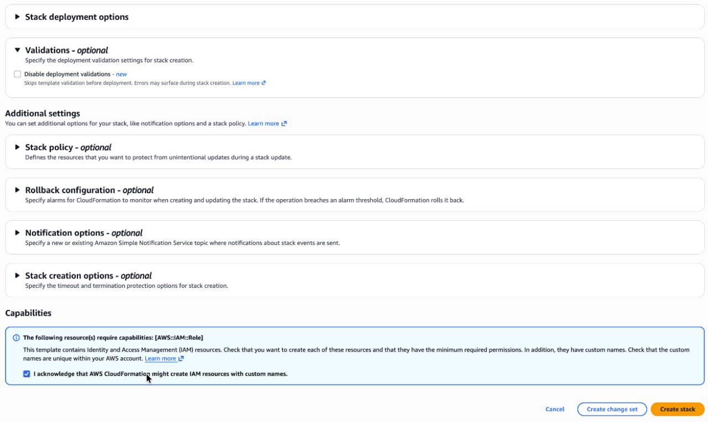

## Step 8. Verify the CloudFormation Deployment

1. Check that the stack status is `CREATE_COMPLETE`.
2. On the **Events** tab, check that `ManagementAccountRole` and `StackSet` both show `CREATE_COMPLETE`.
3. Go to **CloudFormation → StackSets → AK-SecurityAuditorRoleStackSet → Stack instances**.
4. Check that each targeted member account instance shows a successful status. This status confirms that the IAM role exists in each account in the selected scope.

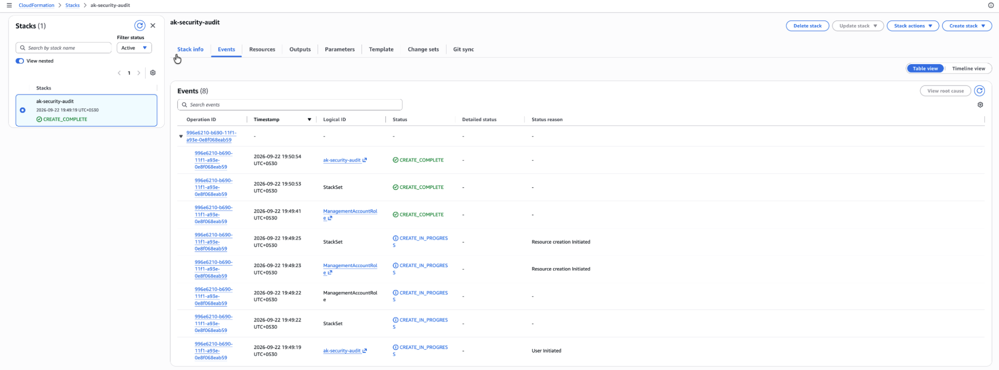

## Step 9. Complete the Onboarding in AccuKnox

1. In the CloudFormation stack, open the **Outputs** tab.
2. Copy the `ManagementAccountRoleArn` value. This value is the ARN of `CNAPPOrgSecurityAuditor` in the Management Account.
3. Return to AccuKnox and paste the value into the **IAM Role ARN** field.
4. Click **Verify & Connect**.
5. Go to **Settings → Cloud Accounts** and select the **Organization** view.
6. Find the organization by its label and expand it. The Management Account and the discovered member accounts show under the organization root.

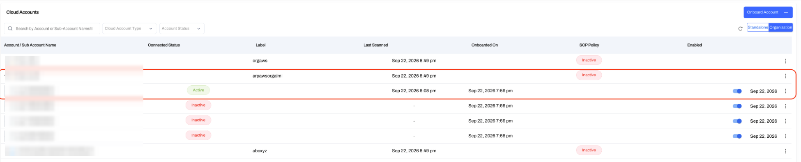

## Step 10. Review the Cloud Assets

1. After the scans complete, go to **Inventory Assets → Cloud Assets**.
2. Filter by the organization label.
3. Check that AWS resources from the onboarded accounts show in the inventory.

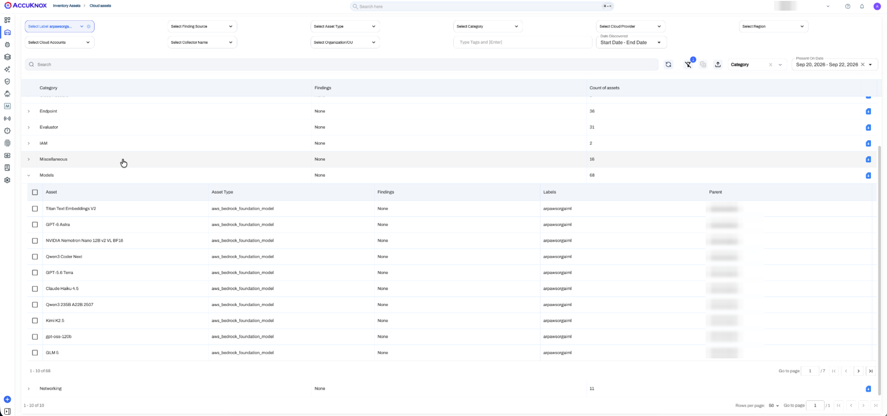

## Step 11. Validate the AI/ML Assets

1. Go to **AI/ML Security → Assets → Managed**.
2. Filter by the organization label.
3. Check that the discovered AI/ML assets show in the list.

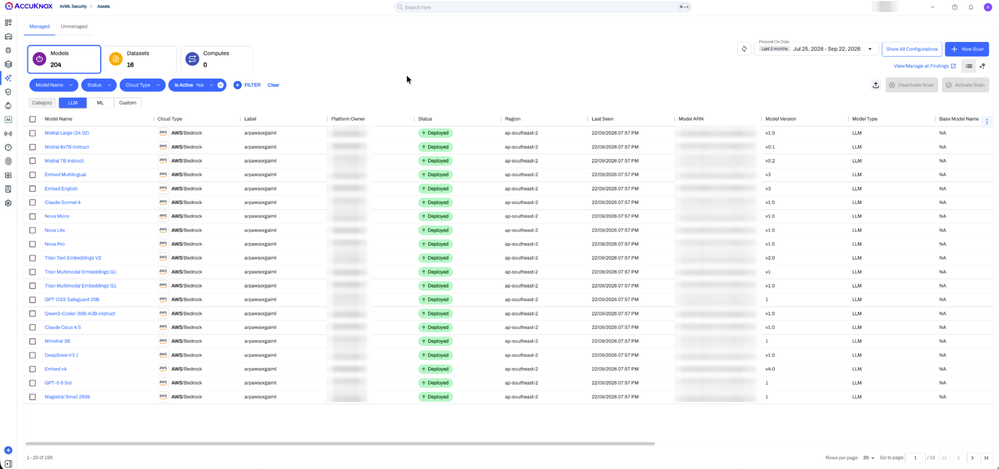

- - -
[SCHEDULE DEMO](https://www.accuknox.com/contact-us){ .md-button .md-button--primary }
