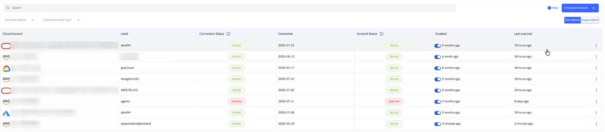
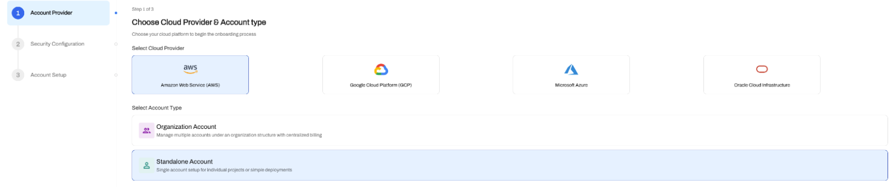
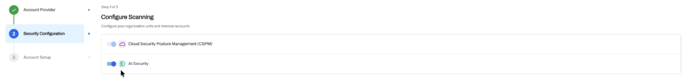
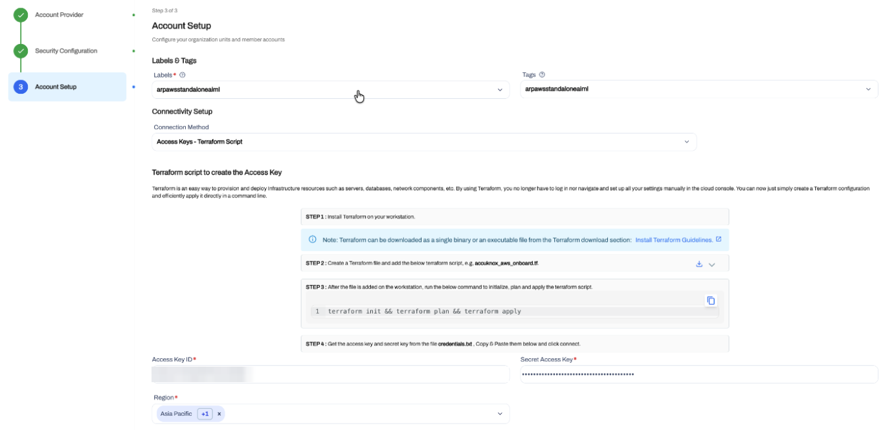
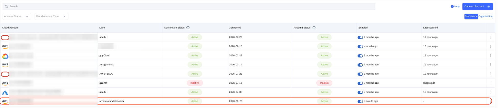
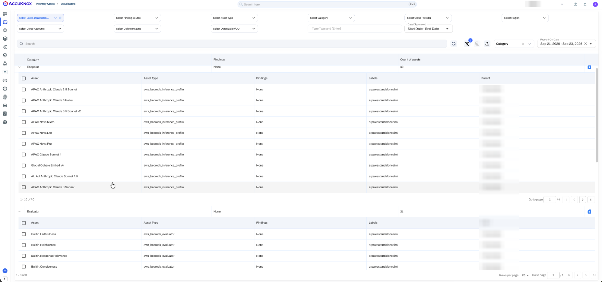
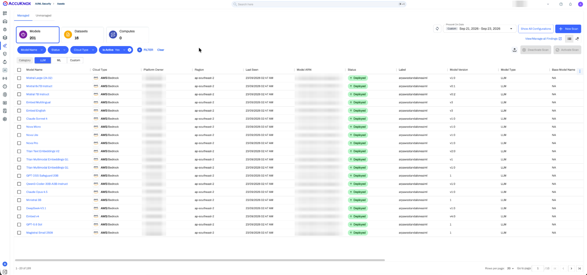

# AWS Standalone AI/ML Cloud Onboarding

Onboard a standalone AWS account to AccuKnox to discover its AI/ML assets and assess their security. A standalone account is one AWS account that you connect by itself, outside an AWS Organization.

In this flow, a Terraform script creates the access keys that AccuKnox uses. You paste the keys into the AccuKnox console, and AccuKnox then scans the account.

!!! info "What cloud onboarding enables"
    Onboarding turns on these AI Security features for the account:

    - Model and Data Security
    - [Shadow AI Discovery](../use-cases/shadow-ai-discovery.md)
    - Prompt Firewall for Cloud Assets

!!! tip "Onboarding many AWS accounts?"
    Use [AWS Organization AI/ML Cloud Onboarding](aiml-aws-onboard.md) to connect a Management Account and its member accounts with one CloudFormation stack.

## Prerequisites

- Install Terraform on your workstation. HashiCorp gives the steps in [Install Terraform](https://developer.hashicorp.com/terraform/install).
- Configure the AWS CLI with a user that can create IAM resources in the account.

The full Terraform flow for a standalone account is in [AWS Terraform Onboarding](terraform-aws-onboarding.md).

## Step 1. Open Cloud Accounts

1. In the AccuKnox console, go to **Settings → Cloud Accounts**.
2. Click **Onboard Account**.



## Step 2. Select the AWS Standalone Account Type

1. On the **Account Provider** step, select **Amazon Web Service (AWS)** as the cloud provider.
2. Select **Standalone Account**.
3. Click **Next**.



## Step 3. Enable AI Security

1. On the **Security Configuration** step, turn on **AI Security**. This toggle enables AI/ML asset onboarding.
2. Click **Next**.



## Step 4. Set the Label and Connect With Access Keys

1. In **Account Setup → Labels & Tags**, select or create a label. The label identifies the assets and findings of this AWS account in AccuKnox. You filter by the label in later steps.
2. Add tags to group the account. This step is optional.
3. In **Connection Method**, select **Access Keys - Terraform Script**.
4. Download or copy the Terraform script from **STEP 2** in the console. Save it as a Terraform file, for example `accuknox_aws_onboard.tf`.
5. In the folder that holds the file, run the command from **STEP 3** in the console:

    ```bash
    terraform init && terraform plan && terraform apply
    ```

6. Open the `credentials.txt` file that Terraform writes. Copy the access key and the secret key.
7. Paste the keys into **Access Key ID** and **Secret Access Key**.
8. Select the AWS regions to scan in **Region**.
9. Click **Verify & Connect**.



## Step 5. Review the AWS Permissions

The access keys need these permissions for AI/ML asset discovery and security assessment.

| Permission | Purpose |
|---|---|
| `ReadOnlyAccess` | Read-only access to AWS resource configuration and metadata for asset discovery. |
| `SecurityAudit` | Access to security-related configuration and metadata for security assessment. |
| `bedrock:InvokeModel` | Invokes Amazon Bedrock models when a supported workflow needs model interaction. |
| `bedrock:ListImportedModels` | Discovers imported Amazon Bedrock models. |
| `bedrock:ListModelInvocationJobs` | Reads Bedrock model invocation job information for supported AI/ML workflows. |
| `sagemaker:InvokeEndpoint` | Invokes Amazon SageMaker inference endpoints for supported workflows. |
| `aws-marketplace:Subscribe` | Subscribes to a supported AI model from AWS Marketplace that needs a subscription. |
| `aws-marketplace:ViewSubscriptions` | Reads AWS Marketplace subscription information for applicable models. |
| `bedrock-agentcore:InvokeAgentRuntime` | Invokes supported Amazon Bedrock AgentCore runtimes. |
| `bedrock-agentcore:StopRuntimeSession` | Stops the matching AgentCore runtime session. |

## Step 6. Verify the Onboarded Cloud Account

1. Go to **Settings → Cloud Accounts**.
2. Check that the AWS account shows with your label and an **Active** status. This status confirms that AccuKnox registered the account.



## Step 7. Verify the AWS Asset Discovery

1. Go to **Inventory Assets → Cloud Assets**.
2. Filter by the label that you set in Step 4.
3. Check that AWS resources from the account show in the inventory.



## Step 8. Verify the AI/ML Asset Discovery

1. Go to **AI/ML Security → Assets → Managed**.
2. Filter by the label that you set in Step 4.
3. Check that the discovered AWS AI/ML assets show in the list.
4. For a model asset, check the metadata: Cloud Type, Label, Platform Owner, Status, Region, Model ARN, Model Version and Model Type.



- - -
[SCHEDULE DEMO](https://www.accuknox.com/contact-us){ .md-button .md-button--primary }
