# Azure AI/ML Cloud Onboarding

In this section we can find the steps to onboard an Azure cloud account to the AccuKnox SaaS platform.

## **Rapid Onboarding (via Azure)**

For Azure Onboarding it is required to register an App and grant Security read access to that App from the Azure portal.

**Step 1:** Go to your Azure Portal and search for *App registrations* and open it

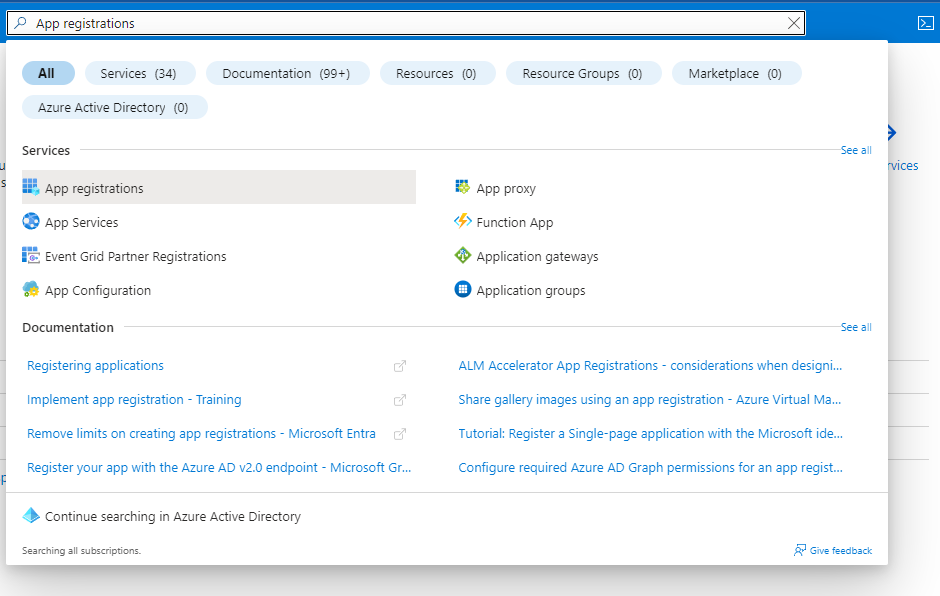

**Step 2:** Here click on *New registration*

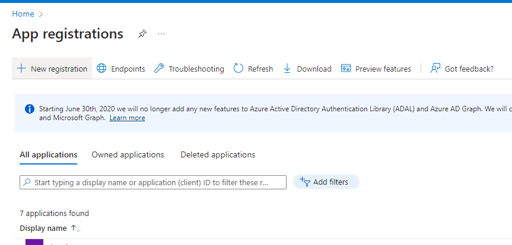

**Step 3:** Give your application a name, remember this name as it will be used again later, For the rest keep the default settings

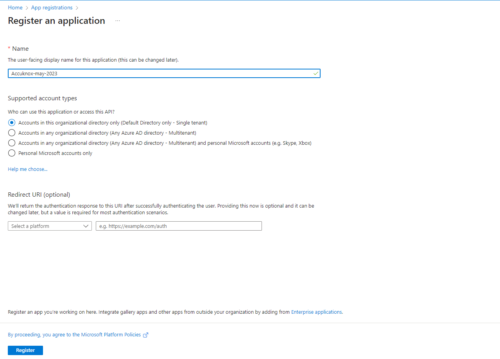

**Step 4:** Now your application is created. Save the *Application ID* and *Directory ID* as they will be needed for onboarding on AccuKnox SaaS, then click on 'Add a certificate or secret'

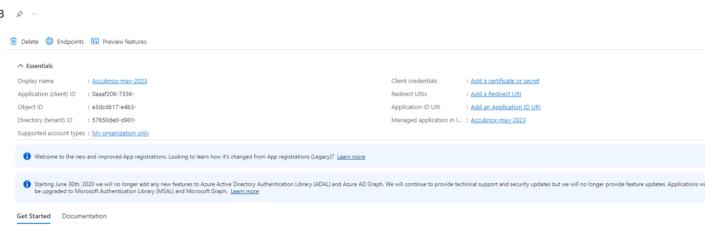

**Step 5:** Click on new client secret and enter the name and expiration date to get *secret id* and *secret value*, save this secret value as this will also be needed for onboarding.

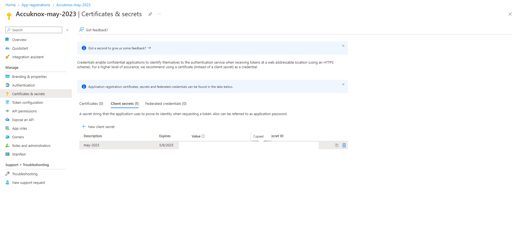

**Step 6:** Next, go to *API permissions* tab and click on 'Add permission'

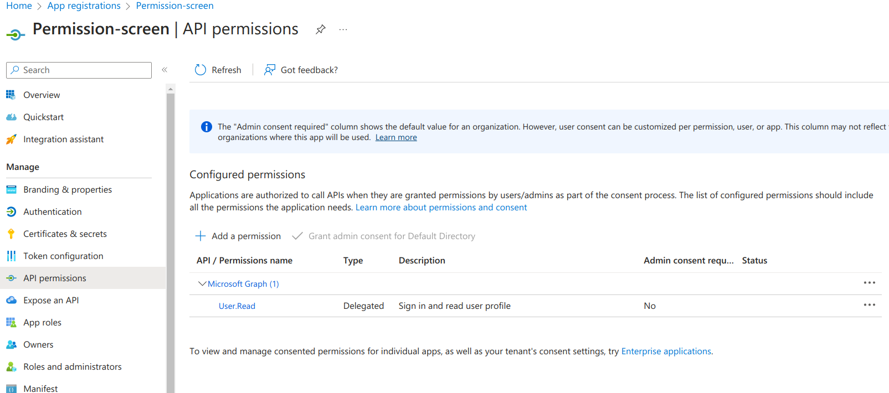

**Step 7:** On the screen that appears, click on 'Microsoft Graph'

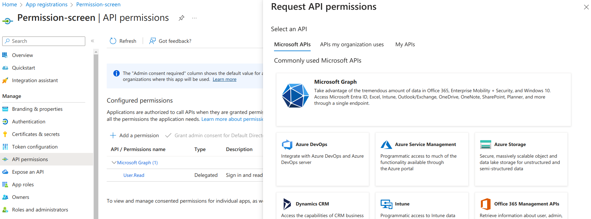

**Step 8:** Select Application Permissions and add each of the following permissions:

- `Directory.Read.All`
- `Application.Read.All`
- `AuditLog.Read.All`
- `AuditLogsQuery-CRM.Read.All`
- `AuditLogsQuery.Read.All`

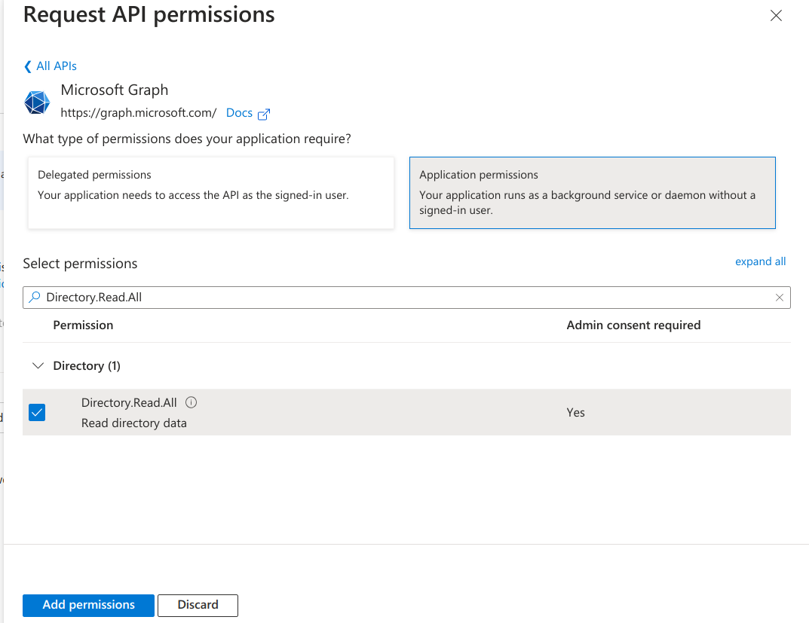

**Step 9:** Select ‘Grant Admin Consent’ for Default Directory and click on ‘Yes’. Confirm all permissions show a Granted status.

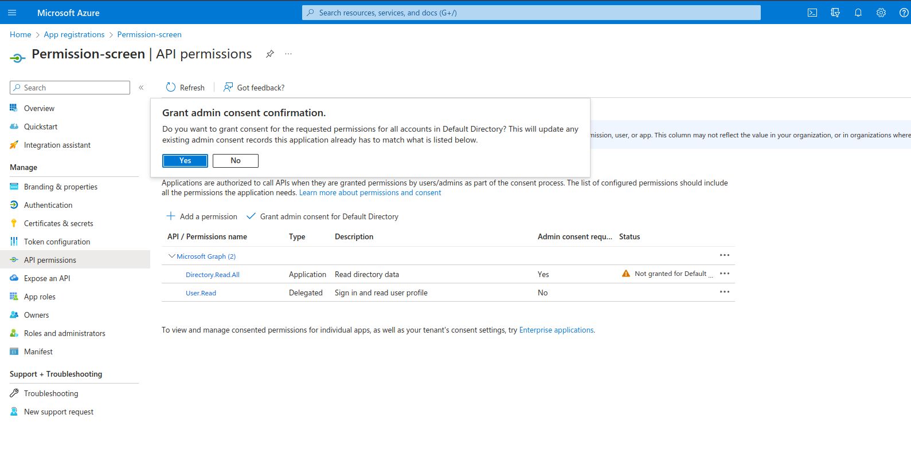

**Step 10:** Now we need to give Security read permissions to this registered Application , to do that go to subscriptions

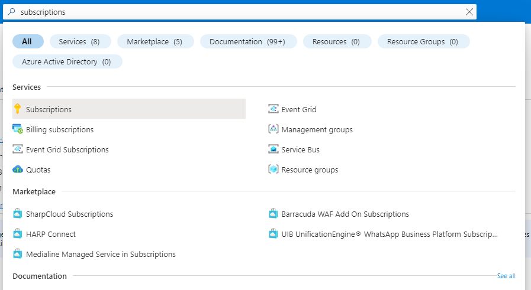

**Step 11:** First save the subscription ID and click on the subscription name , here it is “Microsoft Azure Sponsorship“

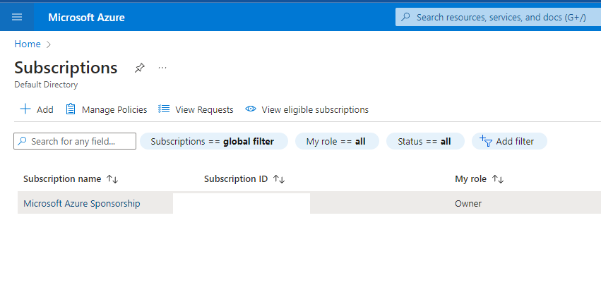

**Step 12:** Navigate to Access control(IAM) and go to Roles , here select **Add > Add Custom Role**


Create a custom role with the following actions:

```
Microsoft.MachineLearningServices/workspaces/onlineEndpoints/score/action
Microsoft.MachineLearningServices/workspaces/serverlessEndpoints/listKeys/action
Microsoft.MachineLearningServices/workspaces/datastores/listSecrets/action
Microsoft.MachineLearningServices/workspaces/listStorageAccountKeys/action
Microsoft.CognitiveServices/accounts/listKeys/action
Microsoft.CognitiveServices/accounts/deployments/read
Microsoft.Storage/storageAccounts/listKeys/action
```

It will look similar to this (use the above listed permissions):


**Step 13:** Apply the following built-in roles to the registered application: **Reader**, **Cognitive Services OpenAI User**, **Cognitive Services User**, and **Storage Blob Data Reader**.

For each role:

1. Go to **Azure Portal** → **Subscriptions** (or **Resource Groups**) → select your target scope.
2. Open **Access control (IAM)** → click **Add > Add role assignment**.
3. In the **Role** tab, search for and select the role, then click **Next**.

    *Example: selecting the Reader role*

    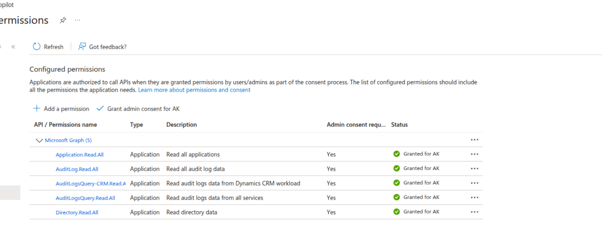

    *Example: selecting the Storage Blob Data Reader role*

    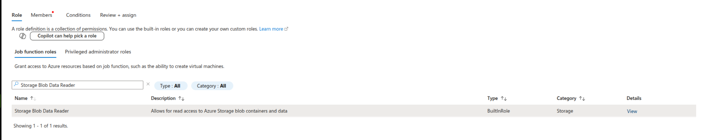

4. In the **Members** tab, click **Select members** and search for the application you registered.

    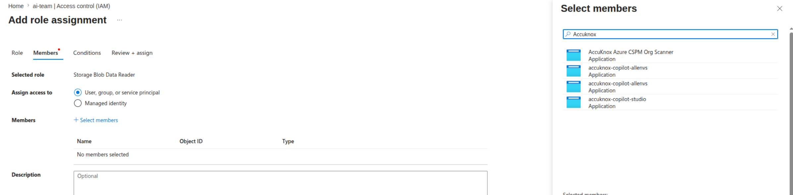

5. Select the application (e.g., AccuKnox Azure CSPM Org Scanner) and click **Review + assign**.

    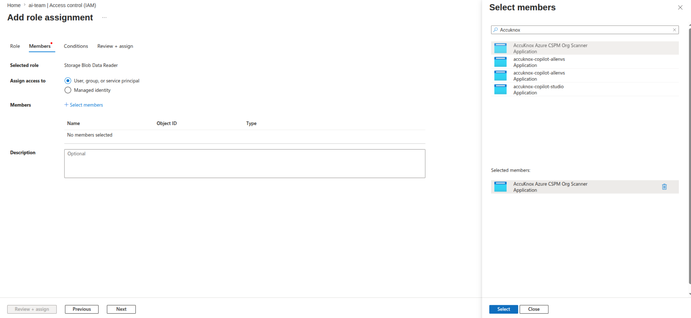

Repeat this process for all four roles.


!!! tip "Using Copilot Studio?"
    If you're integrating with Microsoft Copilot Studio (CP Studio), complete the [Copilot Studio integration steps](https://help.accuknox.com/integrations/copilot-studio/) before proceeding to the AccuKnox SaaS UI onboarding below.

## **From AccuKnox SaaS UI**

Configuring your Azure cloud account is complete. Now we need to onboard the cloud account onto the AccuKnox SaaS Platform.

**Step 1:** Go to **Settings → Cloud Accounts** and click on **Add Account**


**Step 2:** Select Microsoft Azure as Cloud Account Type

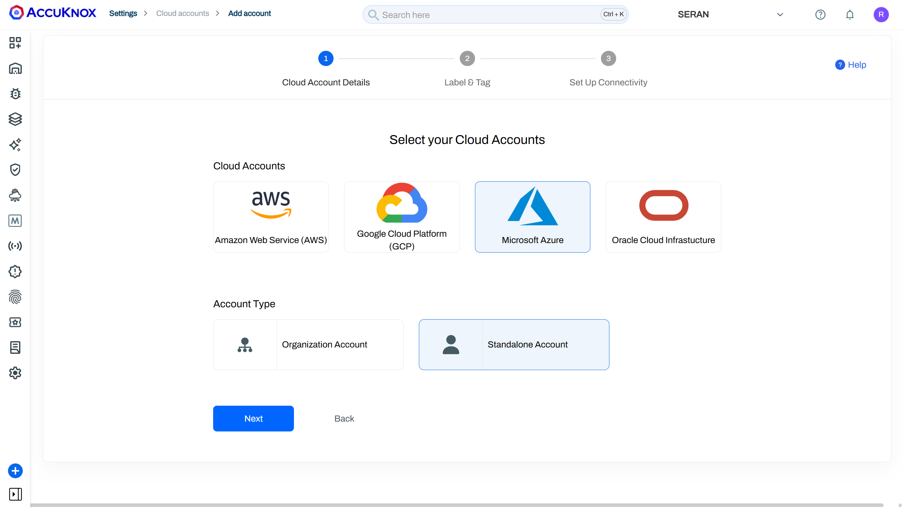

**Step 3:** Select or create label and Tags that will be associated with this Cloud Account

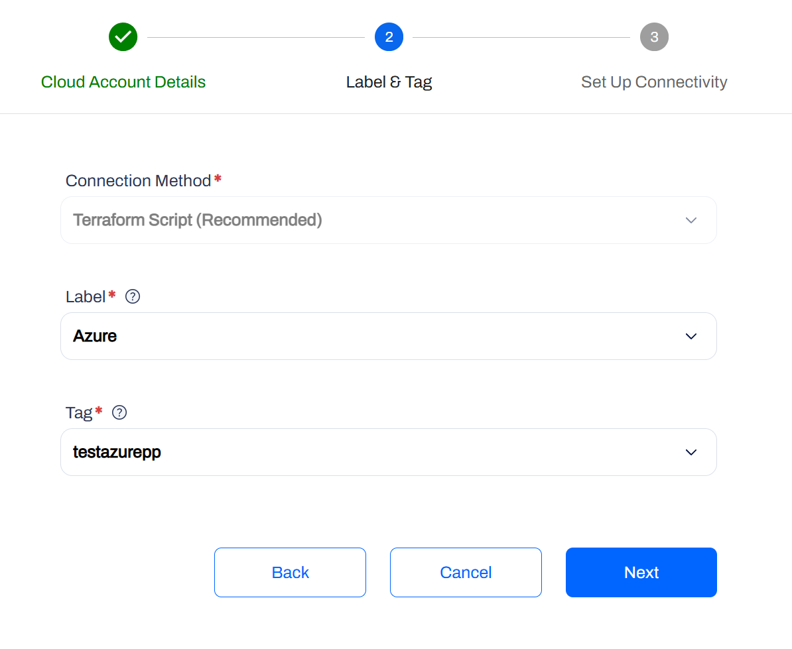

**Step 4:** Enter the details saved during app registration (Application ID, Directory ID, Secret Value) and the Subscription ID from the Azure portal. **Check the "AI/ML Assets" box** to enable AI/ML asset discovery and monitoring. Click Connect.

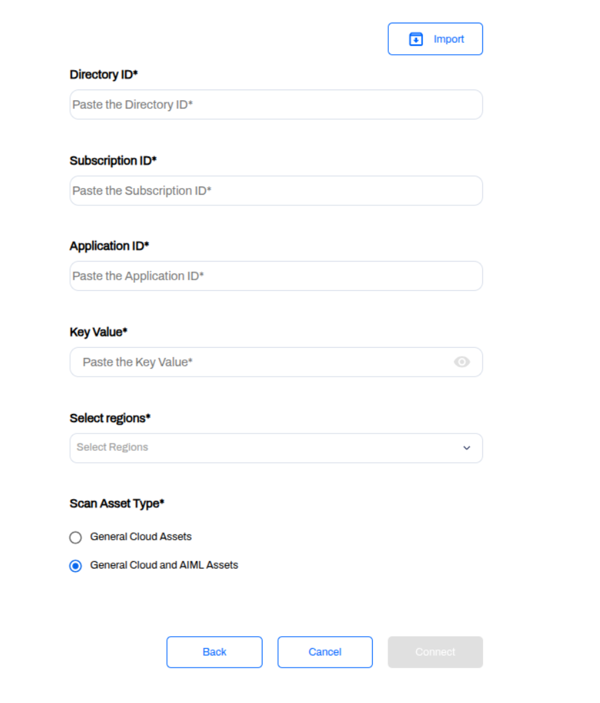

**Step 5:** After successfully connecting your cloud account will show up in the list


- - -
[SCHEDULE DEMO](https://www.accuknox.com/contact-us){ .md-button .md-button--primary }
