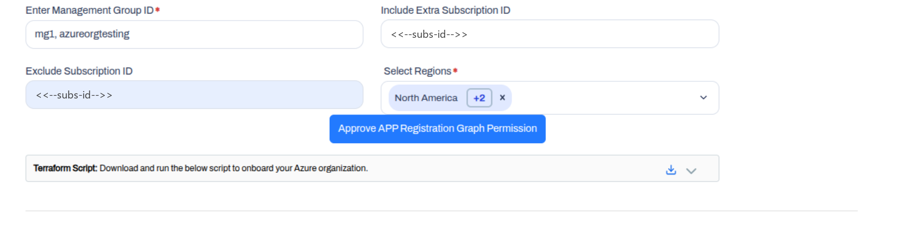
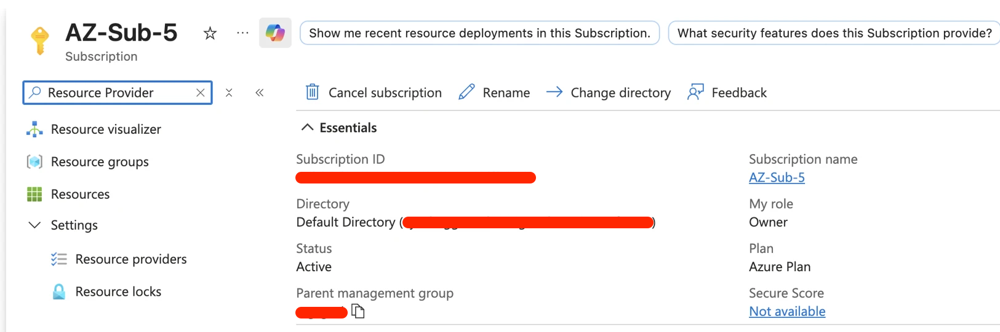
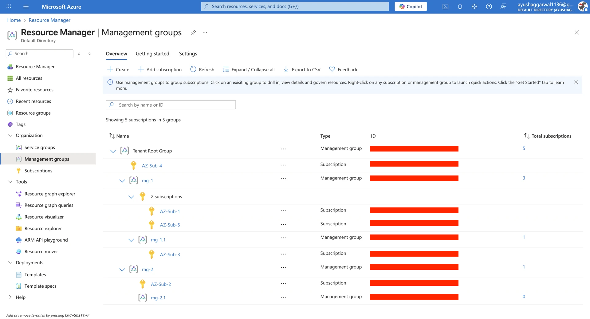

# Azure Organization AI/ML Cloud Onboarding

Onboard an **Azure Organization** to AccuKnox AI Security to cover the AI/ML assets in many subscriptions from one connection. You pick the Management Groups and Subscriptions in scope, and a Terraform script connects them to AccuKnox.

!!! info "What cloud onboarding enables"
    Onboarding turns on these AI Security features for the onboarded subscriptions:

    - Model and Data Security
    - [Shadow AI Discovery](../use-cases/shadow-ai-discovery.md)
    - Prompt Firewall for Cloud Assets

!!! tip "Onboarding one Azure subscription?"
    Use [Azure Standalone AI/ML Cloud Onboarding](aiml-azure-onboard.md) for a single subscription.

## 1. Configurations

AccuKnox provides a flexible way to selectively onboard your Azure environment. You can choose to onboard specific Management Groups and Subscriptions or onboard everything while excluding specific parts.

### 1. Onboarding Steps from AccuKnox Control Plane

**Step 1:** Select Microsoft Azure and choose Organization Account, then click Next to begin onboarding the Azure org.


**Step 2:** Set the connection method (Terraform recommended), add a label and tag for the Azure organization, then proceed.


**Step 3:** Enter Tenant ID, Management Group, and Subscription scope details to define what the Azure org connection will monitor.


Choose the mode that best fits your organizational structure:

=== "Include Mode"

    **Best for:** Onboarding specific departments, staging environments, or a subset of your organization.

    *   **Included Management Groups (`included_management_group_ids`)**: [**Mandatory**]
        Specify the list of Management Group IDs you want to onboard. All subscriptions within these groups will be included.
    *   **Include Extra Subscriptions (`include_extra_subscription_ids`)**: [**Optional**]
        Specify individual Subscription IDs that are *outside* the selected Management Groups but should still be onboarded.
    *   **Exclude Subscriptions (`excluded_subscription_ids`)**: [**Optional**]
        Specify individual Subscription IDs that are *inside* the selected Management Groups but should NOT be onboarded.

=== "Exclude Mode"

    **Best for:** Onboarding the entire organization while omitting specific sensitive or sandbox environments.

    *   **Excluded Management Groups (`excluded_management_groups`)**: [**Mandatory**]
        Specify the list of Management Group IDs you want to **skip**. All other Management Groups under the root will be onboarded.
    *   **Excluded Subscriptions (`excluded_subscription_ids`)**: [**Optional**]
        Specify individual Subscription IDs that you want to **skip**, even if their Management Group is being onboarded.

**Step 4:** Click **Approve APP Registration Graph Permission** to approve the Microsoft Graph permissions for the AccuKnox app registration.


**Step 5:** Run the provided Terraform script to establish secure connectivity and complete Azure organization onboarding in the Control Plane.


### 2. Generate & Run Terraform Script

Once you have configured the parameters above, click **Generate Terraform**.

1.  **Download** the generated Terraform script.
2.  Open your terminal and execute the following commands:

    **Log in to Azure CLI:**

    ```bash
    az login
    ```

    **Initialize Terraform:**

    ```bash
    terraform init
    ```

    **Apply Configuration:**

    ```bash
    terraform apply
    ```

After a successful run, the user will be able to authorize and view their accounts on the AccuKnox Portal.

---
## 2. AccuKnox Fetches New Subscriptions Automatically

Whenever a user creates a new subscription in their account that falls under the onboarded management group, AccuKnox automatically fetches and scans that subscription. For this to work, follow the steps below:

1.  Go to the Subscription in the Azure Portal and search for **Resource providers**.
   
2.  Make sure the following providers are enabled:
    - `Microsoft.ManagedServices`
    - `Microsoft.PolicyInsights`

After approximately **30 minutes**, the subscription will be automatically delegated to AccuKnox, and resources will be queried.


- **User's Azure Account**


---
## 3. Roles and Permissions Assigned to the AccuKnox Service Principal

Onboarding assigns the following roles and permissions to the AccuKnox Service Principal.

### Standard Permissions

| Area | Type | Role or permission |
|---|---|---|
| AI/ML | Built-in role | Storage Blob Data Reader |
| AI/ML | Built-in role | Cognitive Services Data Reader |
| Power Platform | Dataverse Application User | Registers the AccuKnox Service Principal as a Dataverse Application User |
| Power Platform | Security role | Assigns the Service Reader security role to the Dataverse Application User |

### AI/ML Red Teaming Permissions

AI/ML red teaming uses the Foundry Agent Consumer role and the AccuKnox ML Scanner custom role.

| Type | Role or permission |
|---|---|
| Built-in role | Foundry Agent Consumer |
| Custom role `AccuKnox ML Scanner`, actions | `Microsoft.MachineLearningServices/workspaces/onlineEndpoints/score/action`<br>`Microsoft.MachineLearningServices/workspaces/onlineEndpoints/token/action`<br>`Microsoft.MachineLearningServices/workspaces/serverlessEndpoints/listKeys/action`<br>`Microsoft.MachineLearningServices/workspaces/agents/action` |
| Custom role `AccuKnox ML Scanner`, data actions | `Microsoft.CognitiveServices/accounts/AIServices/agents/write`<br>`Microsoft.CognitiveServices/accounts/MaaS/*/action`<br>`Microsoft.CognitiveServices/accounts/OpenAI/assistants/threads/write`<br>`Microsoft.CognitiveServices/accounts/OpenAI/deployments/*/action`<br>`Microsoft.CognitiveServices/accounts/AIServices/applications/invoke/action`<br>`Microsoft.CognitiveServices/accounts/OpenAI/assistants/threads/runs/write`<br>`Microsoft.CognitiveServices/accounts/AIServices/evaluations/write`<br>`Microsoft.CognitiveServices/accounts/OpenAI/assistants/threads/messages/write` |
