# GCP AI/ML Cloud Onboarding

Here, we will see the steps to onboard a GCP cloud account with AI/ML asset scanning to the AccuKnox SaaS platform.

!!! note
    Make sure the following API libraries are enabled in your GCP account before proceeding:

1. Compute Engine API
2. Identity and Access Management (IAM) API
3. Cloud Resource Manager API
4. Cloud Functions API
5. KMS API
6. Kubernetes Engine API
7. Cloud SQL Admin API
8. **Agent Platform API** (required for AI/ML asset discovery)
9. **Agent Registry API** (required for AI agent)
10. **BigQuery API** (required for BigQuery data scanning)

GCP onboarding requires IAM Service Account access. You will create two custom roles and a service account with all required permissions.

## Create Custom Role: Storage Access

**Step 1:** Log into your Google Cloud console and navigate to IAM & Admin, choose "Roles" and click "Create Role".

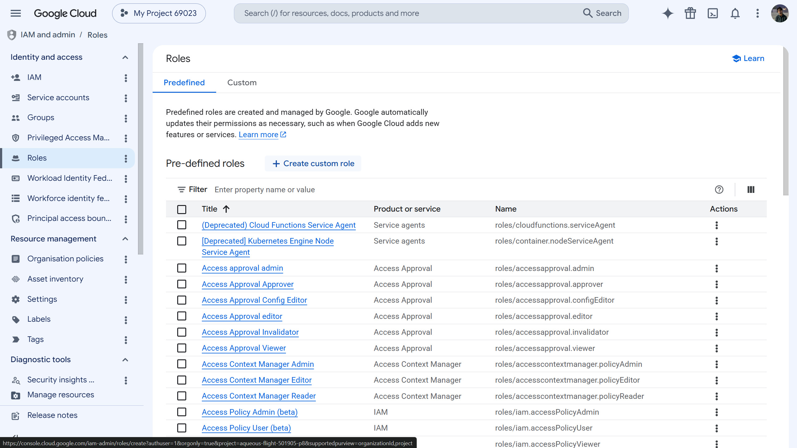

**Step 2:** Name the role and click "Add Permission".

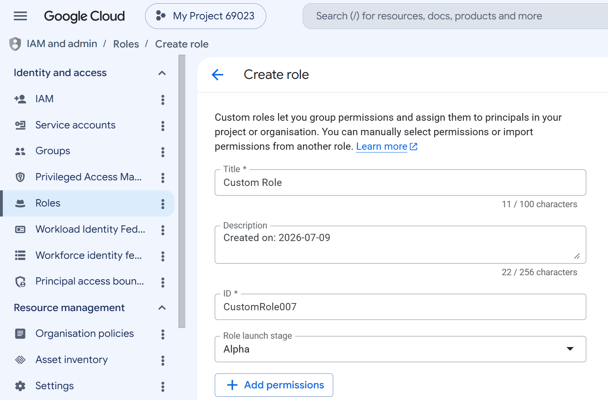

**Step 3:** Use the Service filter set to "storage" and search for "storage.buckets.getIamPolicy".

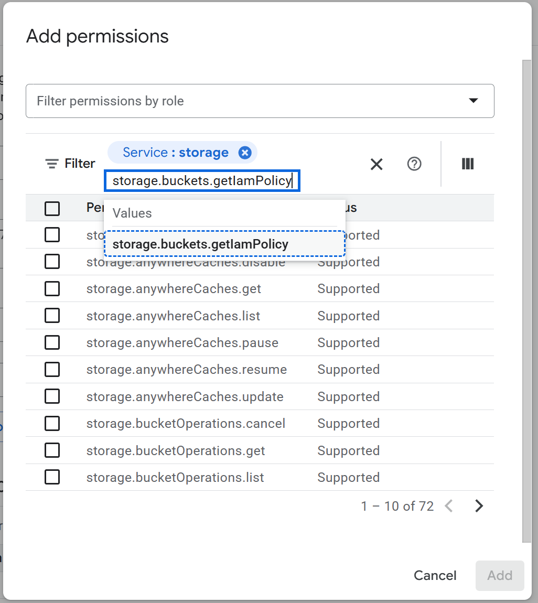

**Step 4:** Select the permission, click "Add", then click "Create".

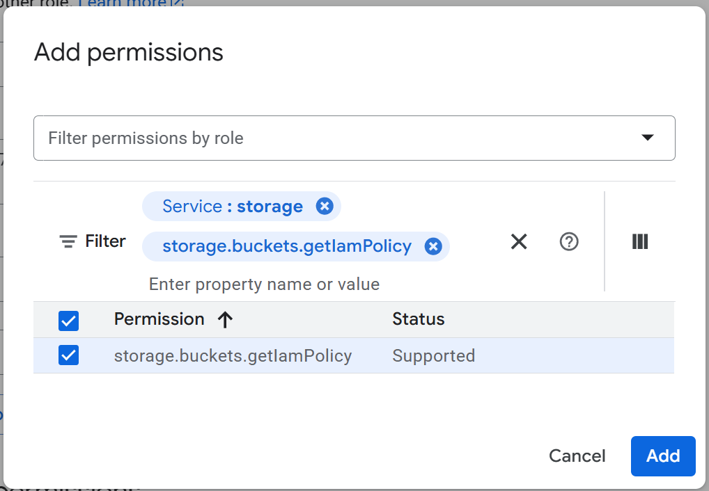

## Create Custom Role: Agent Platform Access

**Step 5:** Follow the same process (Steps 1 to 4) to create a second custom role.

- Name it something identifiable, such as "AccuKnox-AIML-Role".
- Add only the permission: `aiplatform.endpoints.predict`

This grants the ability to invoke Agent Platform endpoints without granting permissions to manage or deploy them.

## Create and Configure Service Account

**Step 6:** In the Navigation Panel, navigate to IAM Admin > Service Accounts.

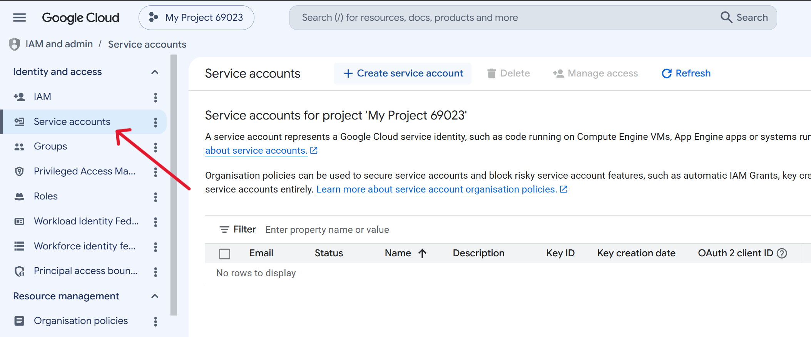

**Step 7:** Click "Create Service Account".

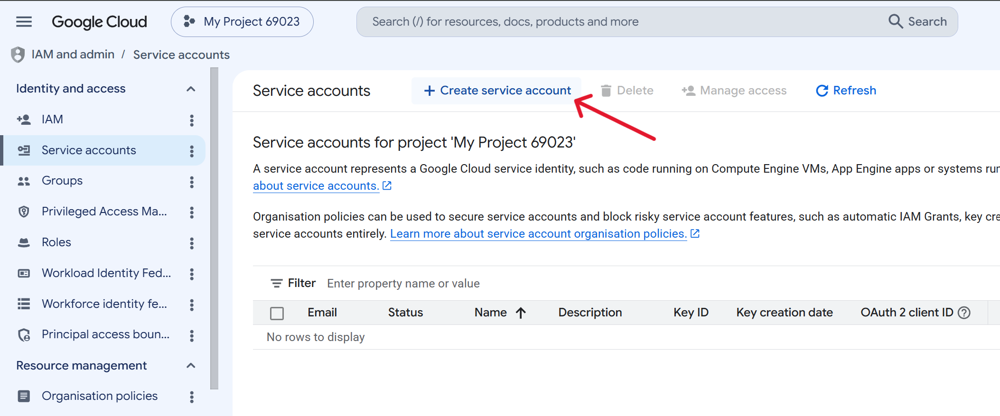

**Step 8:** Enter a name for the Service Account.

**Step 9:** Click "Continue".

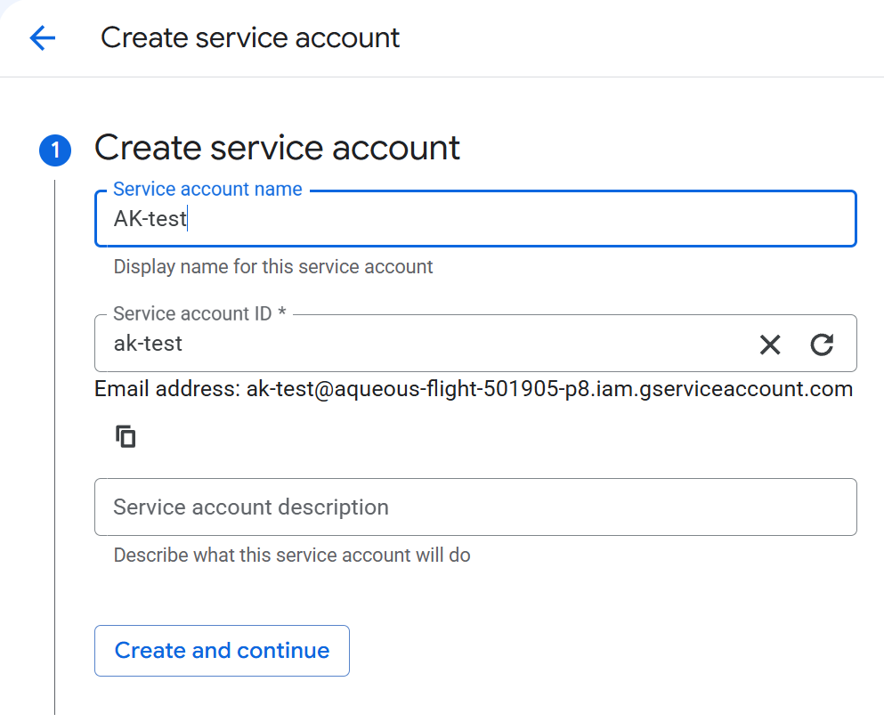

**Step 10:** Add all of the following roles. Select the first role, then use "Add Another Role" for each additional one:

- **Project > Viewer**
- **Security Reviewer**
- **Agent Platform Viewer**
- **BigQuery Data Viewer** (Reference: [BigQuery IAM Roles](https://docs.cloud.google.com/bigquery/docs/access-control#bigquery.dataViewer))
- **Storage Object Viewer**
- **Storage Bucket Viewer**
- Your custom **storage role** (created in Step 4)
- Your custom **Agent Platform role** (created in Step 5)

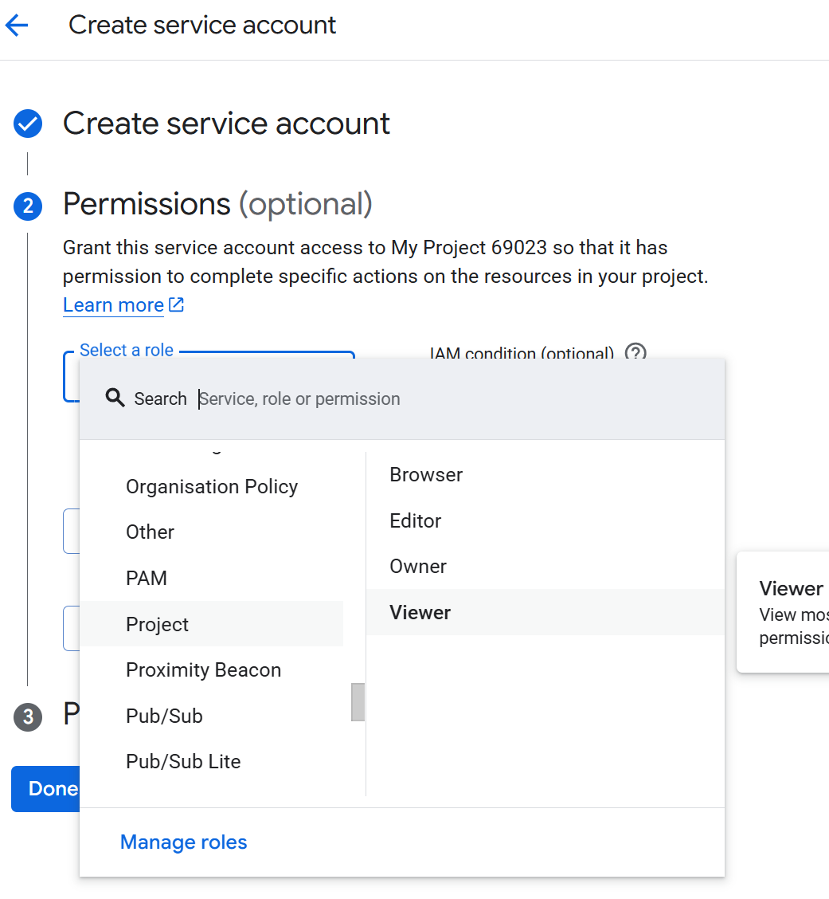

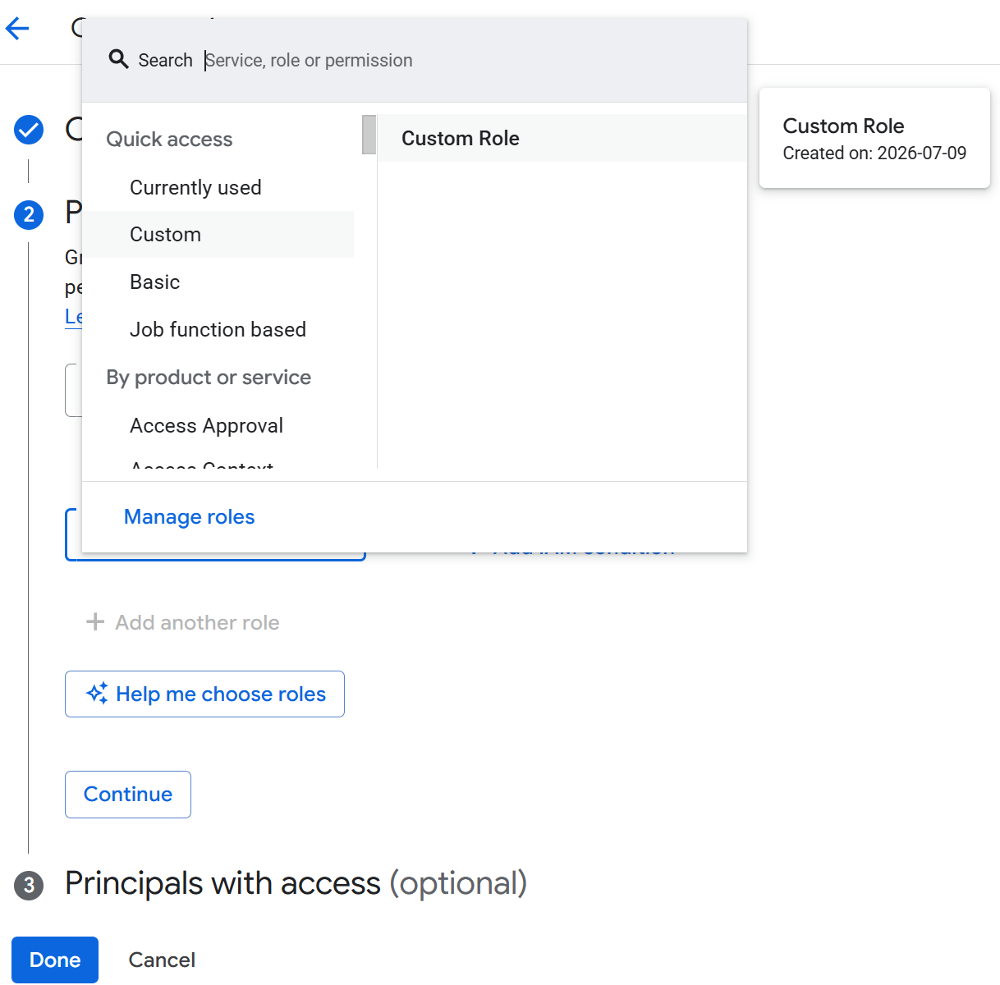

**Step 11:** Click "Continue" and "Done".

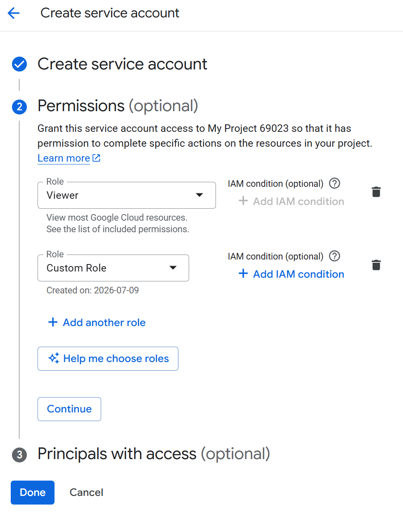

**Step 12:** Click on the newly created Service Account and navigate to the "Keys" section.

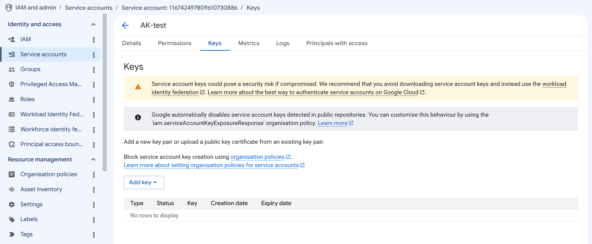

**Step 13:** Click "Add key" then "Create new key". Select JSON as the key type.

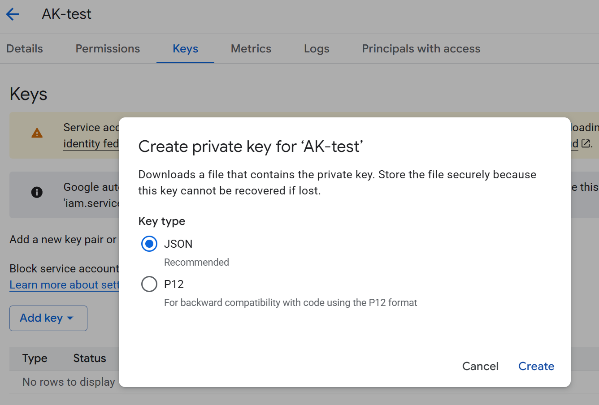

**Step 14:** Click "Create". The JSON key downloads automatically.

## From AccuKnox SaaS UI

**Step 1:** Go to AccuKnox SaaS. Navigate to "Settings" → "Cloud Accounts" and click "Add Account".

**Step 2:** Select "GCP Platform".

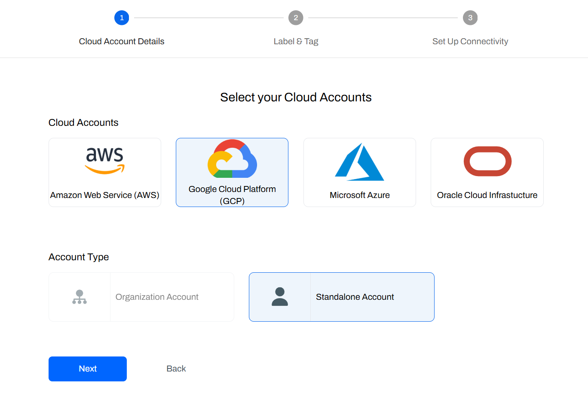

**Step 3:** Create a new label to identify assets in this account. Optionally add a tag.

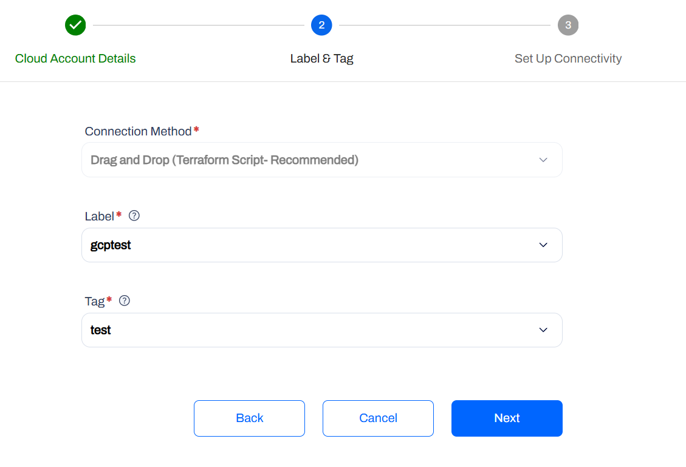

**Step 4:** Enter the "Project ID", "Client Email" (Service Account email), and "Private Key". Paste the entire contents of the downloaded JSON file into the "Private Key" field. **Check the "AI/ML Assets" box** to enable AI/ML asset discovery and monitoring. Click "Connect".

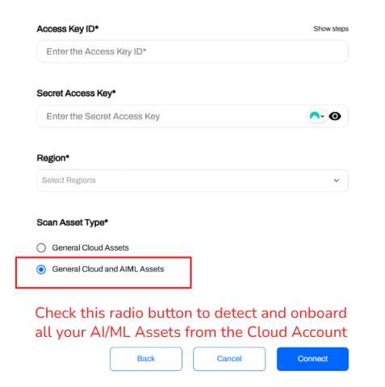

The cloud account has been onboarded successfully.

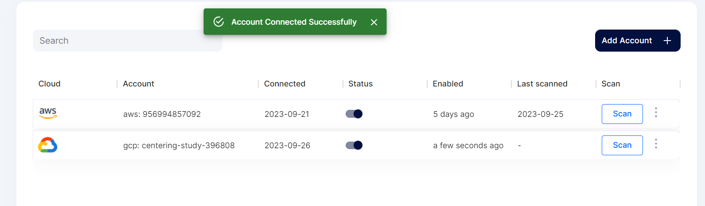

- - -
[SCHEDULE DEMO](https://www.accuknox.com/contact-us){ .md-button .md-button--primary }
