# GCP AI/ML Cloud Onboarding

!!! info "AI/ML Prerequisites for GCP Cloud Accounts"
    **Please review the [AI/ML Prerequisites for GCP](https://help.accuknox.com/how-to/cspm-prereq-gcp/#aiml-security-prerequisites-for-gcp-cloud-accounts) before proceeding with the onboarding process.**

Here, we will see the steps to onboard a GCP cloud account to the AccuKnox SaaS platform

**Note:**
Make sure the Below API Library is enabled in your GCP Account for onboarding into AccuKnox SaaS:

1. Compute Engine API
2. Identity and Access Management (IAM) API
3. Cloud Resource Manager API
4. Cloud Functions API
5. KMS API
6. Kubernetes API
7. Cloud SQL Admin API

For GCP there is a requirement for IAM Service Account Access.

**Step 1:**  Log into your Google Cloud console and navigate to  IAM & Admin choose “Roles“ and Click “Create Role“

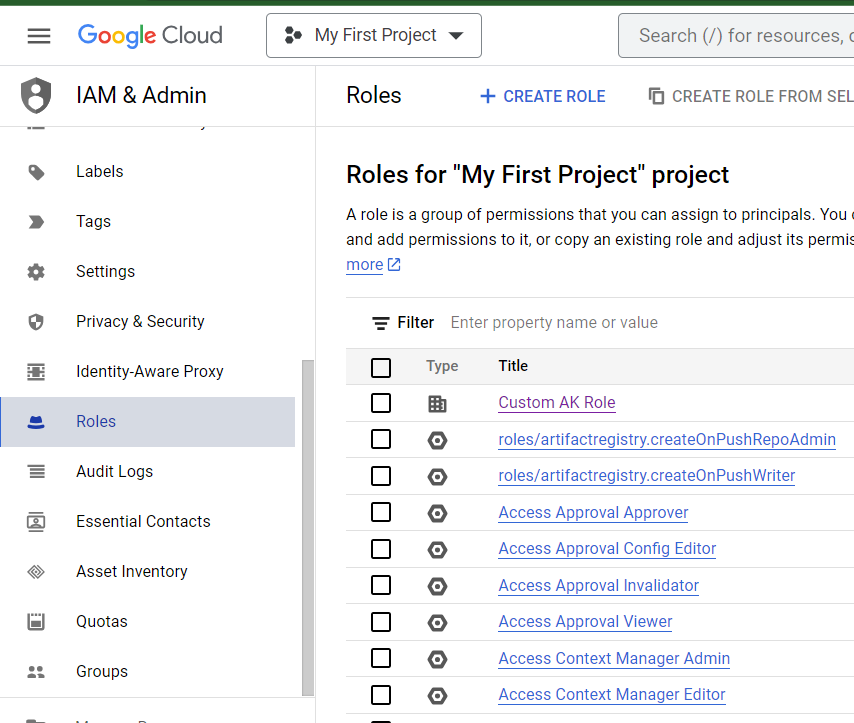

**Step 2:**  Name the “Role” and Click “Add Permission”

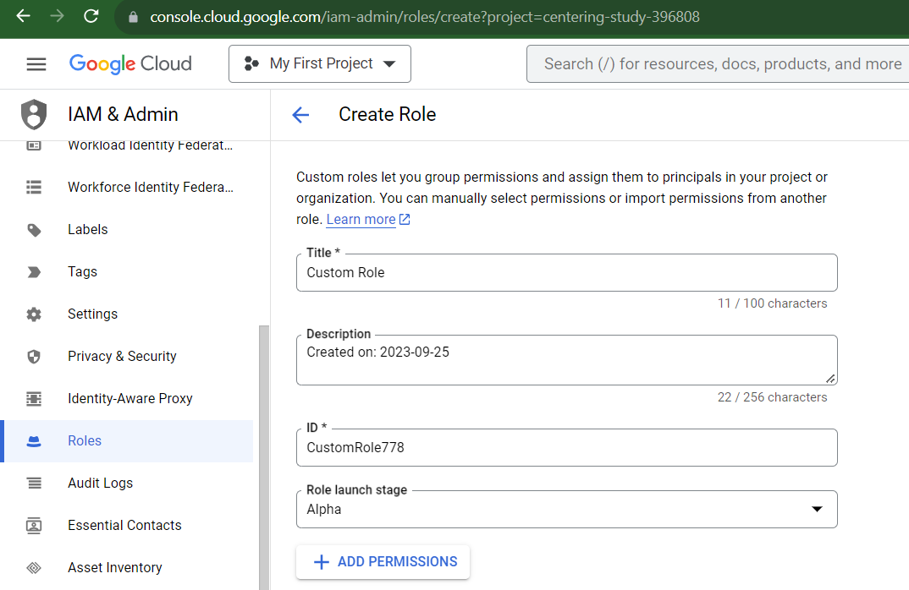

**Step 3:**  Use the Service: storage filter then value as “storage.buckets.getIamPolicy“

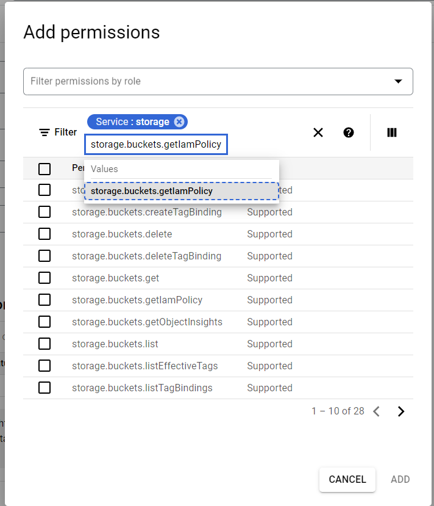

**Step 4:** Choose the permission and Click “Add“ then Click Create in the same page.

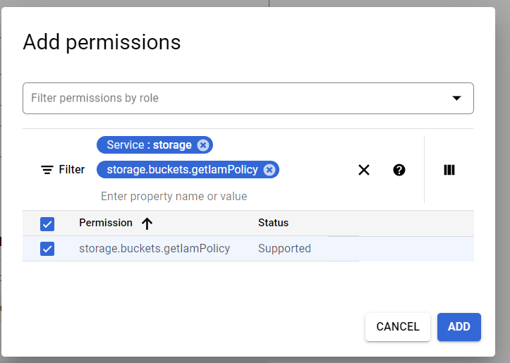

**Step 5:**  In the Navigation Panel, navigate to IAM Admin > Service Accounts.

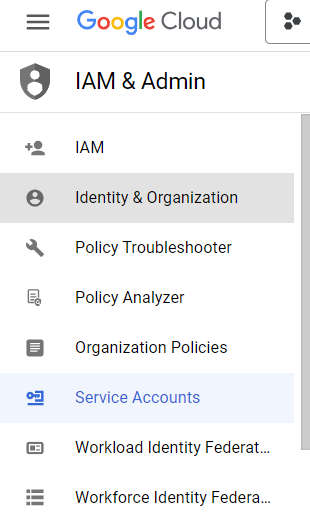

**Step 6:** Click on "Create Service Account"

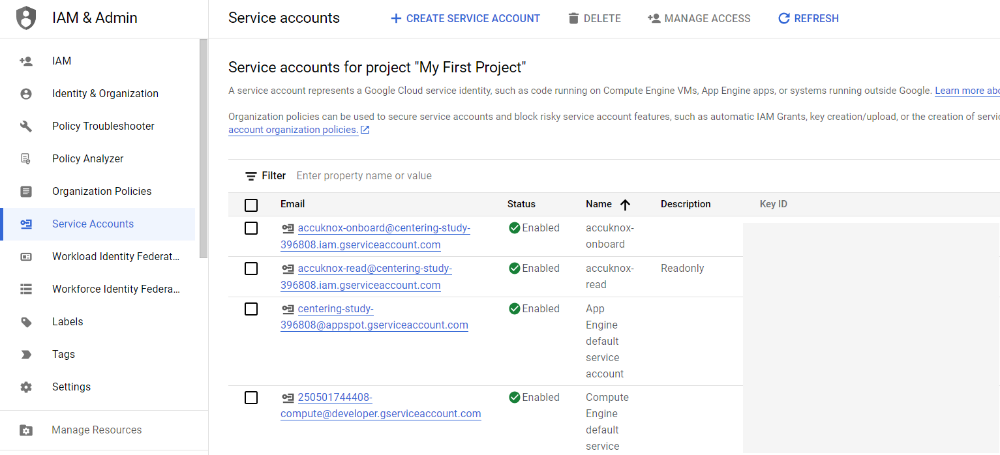

**Step 7:** Enter any name that you want on Service Account Name.

**Step 8:** Click on Continue.

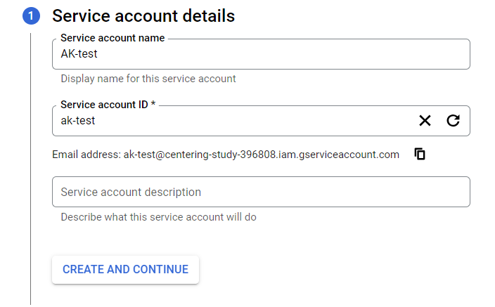

**Step 9:** Select the role: Project > Viewer and click Add another Role.

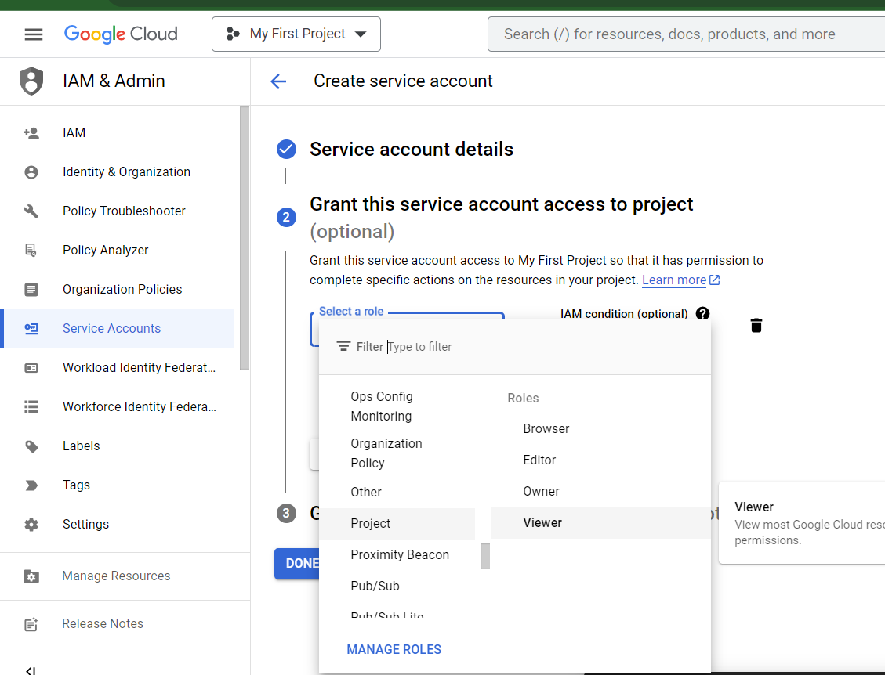

**Step 10:** Click “Add Another Role” Choose “Custom“ Select the created Custom Role.

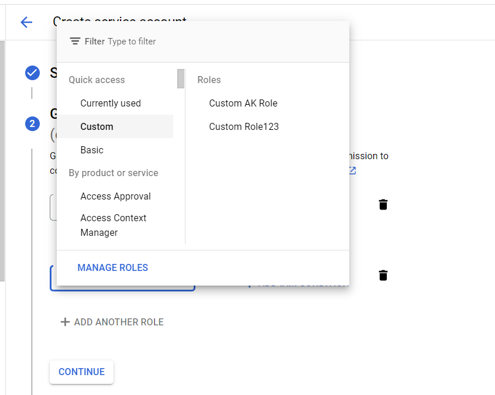

**Step 11:** Click on “Continue“ and ”Done”

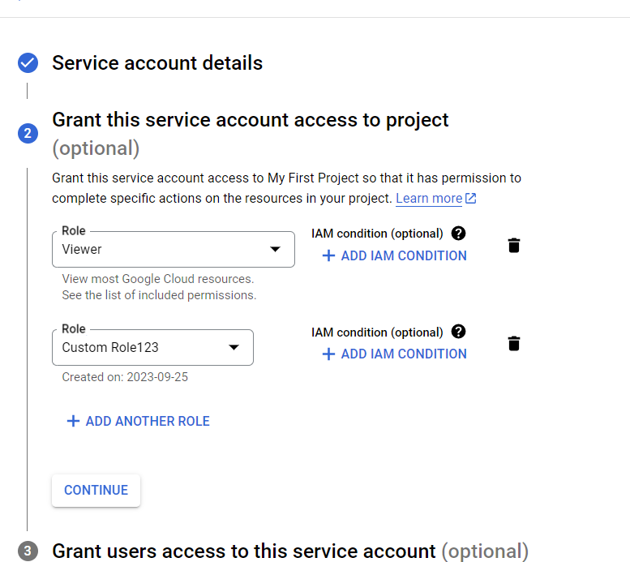

**Step 12:** Go to the created Service Account, click on that Service Account navigate to the “Keys“ section.

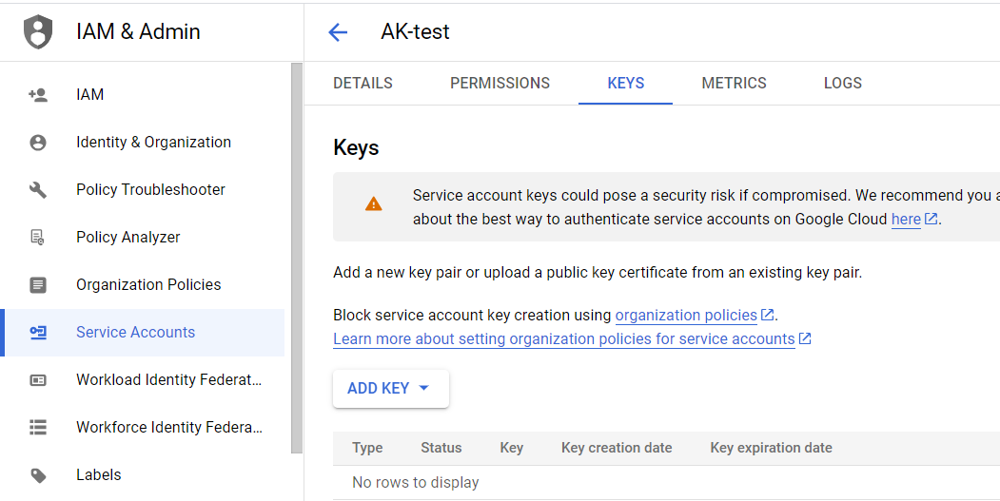

**Step 13:** Click the “Add key“ button and “Create new key “ . Chosen Key type should be JSON format.

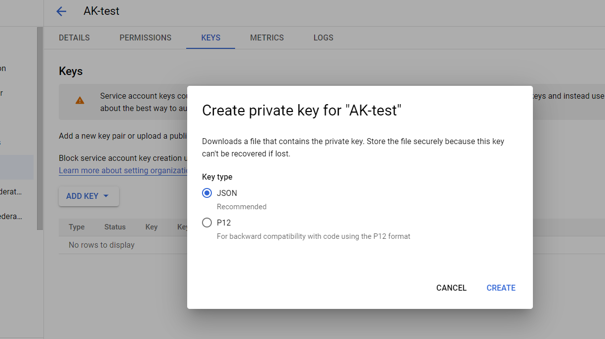

**Step 14:** Click the “Create“ button it will automatically download the JSON key.

## From AccuKnox SaaS UI

**Step 1:** Go to the AccuKnox SaaS. Navigate to the “Settings” → “Cloud Accounts” then “Add Account”.

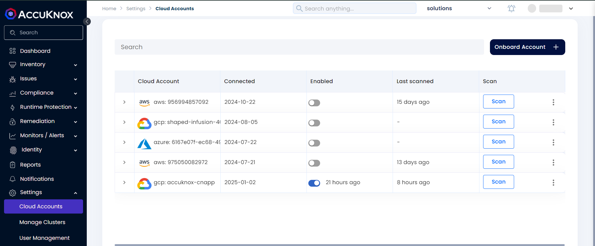

**Step 2:** Click the “GCP Platform”

**Step 3:**  Create New Label and Add the Label for identifying the assets inside this account and add a Tag optionally.

**Step 4:**  Enter the “Project ID“, “Client Email”(The Service Account mail ID) and  “Private Key” from the downloaded File.
Copy paste the entire downloaded file into the ”Private Key” field . **Ensure to check the box "AI/ML Assets"** to enable AI/ML asset discovery and monitoring. Then Click “Connect“

The cloud account has been onboarded successfully

- - -
[SCHEDULE DEMO](https://www.accuknox.com/contact-us){ .md-button .md-button--primary }
