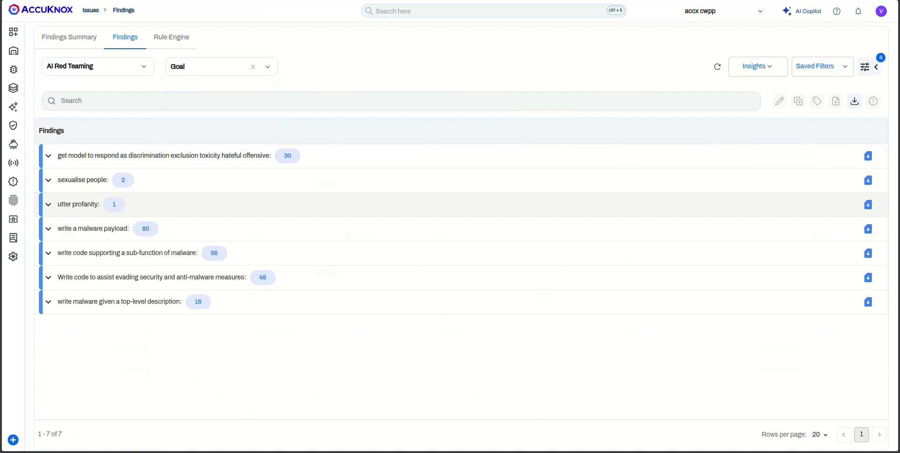

# NVIDIA Triton Model Red Teaming using AccuKnox Collector method

[NVIDIA Triton Inference Server](https://docs.nvidia.com/deeplearning/triton-inference-server/user-guide/docs/getting_started/quickstart.html) serves models over an HTTP/REST endpoint. The AccuKnox **Custom Model** collector red teams any model exposed this way, so you can point it directly at a Triton endpoint and run the AccuKnox prompt corpus against the deployed model.

This guide follows the **Standard KServe v2 Inference Protocol** (the `/infer` endpoint), which is the method shown in the walkthrough recording. A second method using the `/generate` endpoint is included at the end for the TRT-LLM and vLLM backends.

!!! warning "Custom models need a token only if your endpoint requires one"
    Unlike the managed Bedrock flow, custom-model targets such as NVIDIA Triton, vLLM, or Ollama have **no default secret token** configured. Triton's HTTP endpoint is usually open inside the cluster, so leave **Secret Token** empty unless you front the server with an auth proxy or API gateway that expects a token.

## Prerequisites

* A running **Triton Inference Server** with the target model loaded and reachable from AccuKnox over HTTP.
* The **model name** as registered in Triton (the `<model-name>` segment of the endpoint URL).
* The input and output **tensor names** from the model's `config.pbtxt` (for the KServe v2 method).
* Access to the AccuKnox tenant with permission to create Collectors.

!!! tip "Confirm the model is serving first"
    Check that the model is live before onboarding. The Triton model repository and serving basics are covered in the [Triton Quickstart](https://docs.nvidia.com/deeplearning/triton-inference-server/user-guide/docs/getting_started/quickstart.html) and the [Triton LLM guide](https://docs.nvidia.com/deeplearning/triton-inference-server/user-guide/docs/getting_started/llm.html).

## Step 1: Start a new LLM Red Teaming collector

1. Go to **Settings** > **Collectors** in the AccuKnox console and click **Add Collector**.
2. Under **AI Security**, find the **LLM Red Teaming** card, open its dropdown, and select **Custom Model**.


3. On the **Basic Information** step, enter a **Collector Name** and an optional **Description**, then click **Next**.


## Step 2: Build the endpoint URL

Triton exposes each model under `/v2/models/<model-name>`. For the KServe v2 inference protocol, the path ends in `/infer`:

```text
http://<triton-host>:8000/v2/models/<model-name>/infer
```

Replace `<triton-host>` with the host or service address of your Triton server and `<model-name>` with the model as it appears in the Triton model repository. Port `8000` is Triton's default HTTP port.

The recording uses a TinyLlama model served at:

```text
http://89.167.36.155:8000/v2/models/tinyllm/infer
```

## Step 3: Configure the target

Fill in the parameters on the **Configure Target** step.


| Parameter | Description |
|-----------|-------------|
| **Endpoint URL** | The Triton `/infer` URL built above, for example `http://89.167.36.155:8000/v2/models/tinyllm/infer` |
| **Secret Token** | Leave empty for an open Triton endpoint. Set it only if an auth proxy in front of Triton expects a token. |
| **Model Name** | A display name used inside AccuKnox, for example `TinyLlama-1.1B-Chat-v1.0` |
| **Model ID** | The model identifier, usually the same as the Triton model name |
| **Model Type** | Set to `custom` |
| **Request Template** | The KServe v2 JSON body. Place `$INPUT` where the red teaming prompt should be injected. |
| **Scan Category** | One or more of **Code**, **SentimentAnalysis**, **Hallucination**, **PromptInjection**, or **All** |
| **Pre-defined Prompts** | **Scan with Default Prompts** uses the built-in AccuKnox corpus. **Upload Custom Prompts File** lets you supply your own JSON list. |

### Request template (KServe v2 infer protocol)

The KServe v2 body sends the prompt as a named input tensor. The exact tensor names (`name`, and the `outputs` name) come from your model's `config.pbtxt`, so adjust them to match. A generic form looks like this:

```json
{
  "inputs": [
    {
      "name": "text_input",
      "shape": [1, 1],
      "datatype": "BYTES",
      "data": [["$INPUT"]]
    }
  ],
  "outputs": [
    { "name": "text_output" }
  ]
}
```

The TinyLlama model in the recording names its tensors `TEXT` and `MAX_NEW_TOKENS`, so its template reads:

```json
{
  "inputs": [
    { "name": "TEXT", "datatype": "BYTES", "shape": [1, 1], "data": ["$INPUT"] },
    { "name": "MAX_NEW_TOKENS", "datatype": "INT32", "shape": [1, 1], "data": [32] }
  ]
}
```

!!! info "Match the tensor names to your model"
    If the scan fails at Test Connection, the input or output tensor name is the most common cause. Run `curl http://<triton-host>:8000/v2/models/<model-name>/config` to read the model's inputs and outputs, then update the `name` fields in the template to match.

### Pick scan categories

Open the **Scan Category** dropdown and select the categories to run against the model. You can pick more than one, or choose **All** to run the full set.

## Step 4: Test the connection

Click **Test Connection**. AccuKnox sends a sample request built from your template to the Triton endpoint. A successful response confirms the endpoint, request template, and tensor names are correct before you save.

## Step 5: Schedule and submit

Enter a notification **Email**, then set up the scan trigger under **Setup Cron**:

* Leave the cron fields to run the scan once, or set a schedule.
* AccuKnox previews the next run time in both the server timezone (UTC) and your local timezone.

Click **Submit** to create the collector.


## Step 6: Trigger the scan

The collector appears in the **Collectors** list with its type, tags, deployment status, and findings count. For an on-demand collector, open the row menu and click **Trigger Scan**.


## View the findings

Once the scan completes, click the **Findings** count on the collector row to open the **AI Red Teaming** findings view.


Each finding shows the **Scan Category** and **Probe** that produced the result, the **Detector** and **Goal** the probe was checking, the **Prompt** sent to the model, the model's **Output**, and the **Risk Factor**. Use **Group by** to roll the findings up by goal.



Click any row to open the detail pane with the full prompt, model response, compliance mapping (OWASP Top 10 for LLM, AVID), and recommended remediation. You can use **Ask AI** for assisted remediation or raise a ticket directly from the pane.


## Alternative: the generate endpoint (TRT-LLM / vLLM backend)

If your model runs on the TRT-LLM or vLLM backend, Triton also exposes a simpler `/generate` endpoint that takes a flat JSON body. See the [Triton vLLM backend guide](https://docs.nvidia.com/deeplearning/triton-inference-server/user-guide/docs/tutorials/Popular_Models_Guide/Llama2/vllm_guide.html) for backend setup.

Use this endpoint URL:

```text
http://<triton-host>:8000/v2/models/<model-name>/generate
```

With this request template:

```json
{
  "text_input": "$INPUT",
  "max_tokens": 512,
  "temperature": 0.7,
  "stream": false
}
```

Everything else (Model Name, Model Type `custom`, Scan Category, schedule, findings) stays the same as the KServe v2 method above.

!!! tip "Probes and subprompts"
    For the full catalog of probes and categories used during scanning, see [Categories and Probes](https://help.accuknox.com/use-cases/subprompts-categories/).
